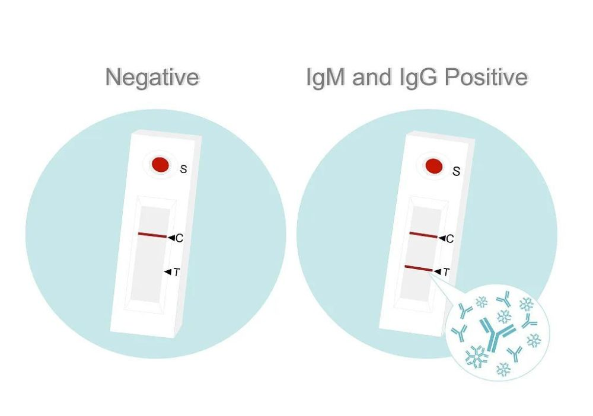

# 新冠感染情况到底如何？北京将率先开展人群血清抗体调查

近日，北京市疾控中心副主任王全意介绍，为全面评估新冠病毒感染情况，了解社区人群血清抗体水平，北京市即将开展人群血清抗体调查。“风险评估是接下来疾控部门要开展的重点工作。”王全意说，疾控部门将一方面监测病毒变异情况，另一方面监测疫情流行强度。

2022年4月，《自然》杂志的一篇文章写道，结束新冠大流行需要全球在多方面的努力。其中，各国政府需要一个以证据为基础的公共卫生计划，以在出现新变种的潜在威胁时迅速做出反应。这样的公卫计划包括通过监测来定期进行风险评估；重新引入有效且低成本的公共卫生措施的能力等。

基于血清学检测的调查称为血清阳性率调查。在美国疾病控制和预防中心（以下简称“美国CDC”）的网站上，新冠疫情的“数据与监测”一栏列出了四个方面：医院和急诊（数据）、血清抗体监测、新冠疾病负担估算以及特殊人群的数据与监测。

该机构写道，美国CDC有一个总体战略，以更多了解有多少人感染了新冠病毒，以及它如何在美国人群中传播。其中，使用血清学检测进行监测，可了解该国在不同时间点、不同地区和不同人群中发生了多少新冠病毒感染。

多位受访专家指出，尽管近期国内第一波疫情已经过去，但是，从国外的经验来看，第二波、第三波疫情还会发生。在人们不再进行大范围核酸检测和抗原检测后，摸清群体感染情况、为后续疫情防控提供决策支撑，人群血清抗体调查，将会是很有价值的手段。

_抗体(IgM和IgG)快速检测试剂盒/视觉中国_

**抗体检测如何帮助应对大流行？**

血清学检测又被称为抗体检测，用于检测某一病原体的感染者是否具有相应的免疫反应标志物。抗体又称免疫球蛋白Ig，是被免疫系统用来鉴别与中和外来病原体的Y形蛋白质，有两个亚型：IgG和IgM。IgM是病毒急性或近期感染的重要指标，多在发病3~5天后开始出现阳性；IgG抗体则在感染后10~15天产生，可在血液循环中存在较长时间。

尽管所有抗体大体上都很相似，但在Y形蛋白质分叉的两个顶端有一小部分可以发生高达百万种以上非常丰富的变化，该位置就是抗原结合位。每一种特定变化，可以使该抗体和某一个特定的外来目标——抗原相结合。当遭遇新冠病毒，无论是否出现症状，人体内会产生特异性抗体，为人体提供针对新冠病毒的免疫保护。因此，通过检测抗体，能够证明一个人是否曾接触过新冠病原体。

无论是通过自然感染还是接种疫苗的方式接触新冠病毒，人体都会产生针对新冠的抗体。那么，对于抗体阳性的结果，该如何区分检测者是否真的感染过新冠，亦或因为接种了疫苗？

在血清学检测中，用于检测新冠病毒抗体的主要病毒抗原是刺突蛋白(S蛋白)和核衣壳蛋白(N蛋白)。mRNA新冠疫苗所使用的抗原是新冠病毒的S蛋白，人在接种这种疫苗后体内只会产生抗S蛋白的抗体；而在自然感染过程中，人接触的是整个病毒，所以会产生针对多个新冠病毒成分的抗体。因此，美国CDC的指南中指出，假如一个人的抗S蛋白呈阳性而抗N蛋白阴性，就意味着对方接种过疫苗但并未感染。

对灭活疫苗来说，这一区分要更困难些。因为灭活疫苗是用整个死去的新冠病毒作抗原，其诱发的免疫蛋白种类更多。有免疫学者近日撰文指出，通过检测针对那些只有在感染时才表达的抗体（比如抗ORF8抗体），就可以区分自然感染和灭活疫苗接种。香港大学病毒学家金冬雁告诉《中国新闻周刊》，自然感染后人体产生的免疫反应水平通常明显高于灭活疫苗接种，尤其是接种灭活疫苗产生的抗N蛋白抗体要比自然感染低很多，因此也可以作为区分手段。

事实上，某地方疾控中心一位工作人员告诉《中国新闻周刊》，疾控系统常年都会开展一些小规模血清抗体检测，比如，在某个城市抽取几十个人，尤其是儿童，了解他们接种过乙肝、麻疹等疫苗后，人群的免疫基础水平如何。

在新冠大流行初期，全球各地研发人员迅速推出了抗体检测试剂。许多国家寄希望于这类检测帮助掌握大流行的强度，并知晓谁已对新冠病毒产生了免疫力。当时，新冠疫苗研发才刚开始，一种想法是，那些有抗体的人因为对新冠有免疫力，可能暂时免于再感染的风险，因此可以安全复工、回归社会生活。

如今，这种想法逐渐不再被提及。因为到目前为止，关于抗体检测的一些问题依然没有得到回答：比如，哪些特异性抗体可以防止新冠再感染？这些抗体的水平需要多高？它们会提供多长时间的可靠防御？因此，美国FDA、CDC等机构均指出，新冠抗体检测呈阳性并不意味着具有免于再次感染新冠的免疫力，抗体检测结果也不应用来评估一个人接种的新冠疫苗是否有效。

关于产生多少针对新冠的抗体，意味着有保护效果，目前国际上，包括世卫组织都没有标准。美国俄亥俄州立大学病毒学家刘善虑告诉《中国新闻周刊》，“所以在美国，我们在向参与新冠血清研究的志愿者解释时，也只能说，抗体浓度越高，保护力越强，但是无法具体给出一个数据。”

但在更大群体层面，学者们指出，血清学检测数据可以作为新冠大流行应对措施的一部分，协助疫情监测和研究。2022年年中发表在《国际转化医学杂志》上的一篇文章中，来自新加坡国立大学医院等多个机构的学者们写道，关于估计流行病学变量、帮助了解免疫接种和自然感染引发的抗体反应等，血清学检测在证据方面发挥着至关重要的作用。

2020年4月，武汉市疾控中心与中国医学科学院团队合作，对武汉市3500余个家庭、9500余名受试者进行了长期血清流行病学追踪。2021年3月19日，调查结果发表在了《柳叶刀》上，文章指出，受试者中有532人抗体检测阳性，基线抗体阳性率为6.9%，且其中437人为无症状感染；在抗体阳性的受试者中，212人具有能对抗病毒的中和抗体。这些数据对了解无症状感染者比例、实际感染规模等提供了线索。

通过血清阳性率调查，美国CDC网站2021年2月写道，该机构可以了解已被感染的总人数，包括那些可能被遗漏的感染病例，还可以帮助估计有多少人口尚未被感染，从而有助于公共卫生系统官员为未来的医疗需求制定计划。今年2月，来自美国CDC的多位学者在《柳叶刀》子刊发表的一篇论文中指出，血清阳性率变化与病例流行率变化的比率表明，在疫情流行激增期间，基于病例的监测会遗漏很大比例的感染；而血清监测在了解新冠的整体感染图景方面凸显了其价值。

在香港，金冬雁说，特区政府一直很重视对人群的血清学监测。2022年3月末，香港一些医学和流行病学专家便建议，应开展人群血清学检测。香港中文大学呼吸系统讲座教授许树昌表示，在社区进行大规模的血清学检测，可以更准确地估计已经感染过新冠病毒的人数，这一数据将有助于确定病死率。“在抽取数万人的血液进行研究之后，我们能知道到底有多少人被感染了。”许树昌说，这种调查必须在疫情暴发结束时进行，那时有足够多的跨年龄组的随机样本，这样的研究才有意义。

**如何更好利用调查结果？**

国内一位著名流行病学家近日在接受《中国新闻周刊》采访时谈及，这波疫情过去后，可以通过血清流行病学调查、数学模型估算等方式确认感染人数。这些结果在制定后续防疫政策、疫情预判，及确认病毒传播特征、重症比例等方面都有较重要的参考价值。

在北京市的人群血清抗体调查中，官方指出，该研究将为优化资源配置和新冠防控提供参考。研究方法上，采取多阶段分层随机抽样调查方法，从16个辖区和经开区中选取约5000名社区人群，进行问卷调查和血清学标本采集。调查表的内容包括调查对象基本信息、核酸和抗原检测情况、发病就诊转归情况、疫苗接种情况等信息。该调查计划于今年2月至3月完成。

“其实很早就有专家提出来应该开展新冠血清学调查。”中国疾控中心一名专业人士告诉《中国新闻周刊》。他说，目前，在实际感染规模上，官方还没有给出特别权威、准确的数据，更不用说各省数据。对于北京、深圳、上海这种人口千万级的大城市，后续药物的准备、医疗资源的配备、未来第二波第三波疫情的应对等，都需要更加切实可靠的数据来支撑决策，而血清学调查能提供更多信息。

关于北京的抽样调查，他进一步指出，不仅是抗体检测这么简单，还结合了问卷，可以从各个角度去了解人群整体的感染、疫苗接种等情况，应该能够得到很丰富和全貌性的结果。比如说，可以描绘出5000个人感染的时间线，结合之前临床数据、疫情监测数据，判断一些数据建模是否准确。

他说，对于一些过峰较早的城市，在应对疫情高峰的过程中暴露出了一些问题，比如，抗病毒药物准备得不够早，等备齐以后，也没有发挥太大的作用。北京即将开展的这项调查，如果做得好，能够辅助优化一些具体措施。比如，疫情有了预警信号时，根据免疫力水平，可以判断养老院这样的特殊场所是否需要提前接种疫苗。

在帮助优化疫苗接种策略上，前述来自新加坡国立医院的学者们指出，血清学检测可用于对疫苗进行长期前瞻性随访，以及评估特定人群疫苗诱导免疫力；有助于了解对疫苗的抗体反应与保护性免疫的关系，并确定加强剂量是否需要和接种时间等。

抗体活化的水平因人而异，在感染或接种疫苗6个月后，无论是抗S蛋白还是抗N蛋白都会大幅下降。因此，金冬雁指出，应该是长期随访、监测，比如说在社区里面抽样一部分人，每隔半年或者一年开展一次检测，就能知道社区的抗体水平怎么样。北京市疾控中心副主任王全意在介绍中也表示，“考虑到随着时间推移，抗体水平也会自然下降，未来本市或将根据需要开展动态评估。”

多位病毒学家告诉《中国新闻周刊》，在当下这个节点，很可能北京这次抽样调查的结果显示非常高比例的人已被感染过了，光是知道感染率数据意义不是很大。“在以往各个时间点上，取样进行检测，可以判断接种和感染的进展。”一位病毒学家表示，还是要对病毒突变进行追踪，对脆弱人群进行加强接种，按需储备药物。

但刘善虑指出，如果分组得当、调查方案设计得科学，那么可以依靠血清阳性率调查的数据回答一些重要的科学问题。比如，可以对比接种和未接种疫苗的两组人群中，接种组所获得的免疫力水平以及持续多久；还可以研究感染者的临床病情严重程度与抗体水平之间的关系等。

“最好是开展一些长期性检测，包括回顾性和前瞻性研究。譬如，每隔三个月搜集并保存一些血清学标本，研究人体产生的抗体随着时间的推移会发生什么变化，以及未来突破性感染的情况。”他补充说。

前述中国疾控中心的专家建议，可以把血清学检测等一些监测工作纳入到日常工作中来，变成一件常规性的事情。比如，在医院日常抽血化验中，经过患者知情同意之后，疾控部门可以搜集一些血液样本进行新冠抗体检测。

另一方面，他还特别指出，北京率先开展这次血清学情况摸底以后，不管是在方案设计、流程安排还是结果分析等方面，可能都会形成一些经验，对其他城市和开展后续调查有借鉴意义。

（实习生李金津对本文亦有贡献。）

记者：彭丹妮

