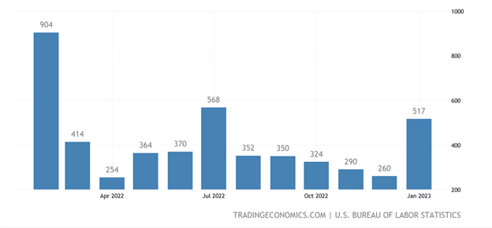
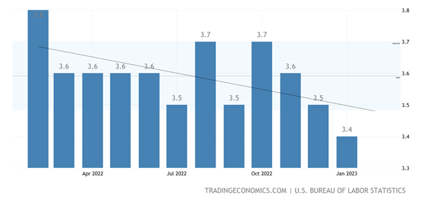
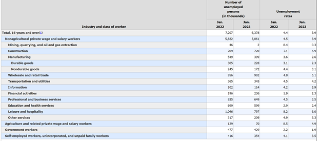
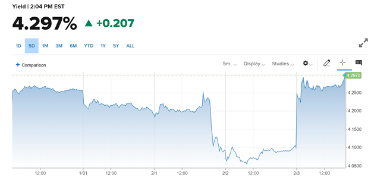

# 硅谷裁员潮下非农就业数据却大超预期 美国真实就业状况究竟如何？

**腾讯财经 纪振宇 2月3日发自硅谷**

一边是硅谷风声鹤唳，科技巨头大厂动辄宣布数万人规模的裁员，另一边却是美国非农就业节节走高，1月份新增就业51.7万，远高于预期的18.5万的水平，失业率进一步下降至3.4%，已经是美国自1969年以来最低的失业率水平。

为什么两个不同角度的观察，却呈现出截然相反的美国就业市场图景？

事实上，这两种观察都没有错。科技大厂大规模裁员是实实在在的，在美联储加息收紧流动性的大背景下，高成长性的科技行业，成为首当其冲的重灾区，未来业绩前景预期不佳令科技巨头不得不采取削减开支的措施。

但是放到全美国全行业的更大维度下来看，美国的就业市场状况却是在近一段时间内持续改善的，即便是在裁员潮的影响下，美国科技行业的失业率在1月份为3.9%，虽然高于总体的3.4%的水平，却依然低于建筑行业、休闲旅游行业超过6%的失业率水平，甚至还低于该行业自身在2022年同期4.2%的水平。

体但利好的就业市场数据，对于市场中的投资者来说，却不见得是个好消息。3日当天，美国国债收益率与美元飙升，美股在连续多日上涨后出现大幅下跌，主要是受到投资者对于美联储可能重新加码收紧货币政策担忧的影响，这份意外利好的报告，也让美联储所应对的美国经济状况变得更为复杂，进一步考验其未来对货币政策实施和把控的能力。

**硅谷裁员潮正在进行中，但整体占比较小**

新年伊始，始于2022年底的裁员潮在硅谷有愈演愈烈之势。谷歌、亚马逊、微软这三家科技巨头，成为新一轮硅谷科技公司裁员的重灾区，加上去年第四季度便宣布裁员1.1万人的社交巨头Meta，不到半年的时间内，仅这几家硅谷科技巨头裁员的总数已超过5万名。

大公司的高调裁员，容易让人产生美国就业情况恶化的直观印象，但如果放到更大的全美国全行业的维度来看，美国的整体就业市场情况，并非像在硅谷感受到的那么糟糕。

这正是最新的美国非农就业报告，以及过去几个月的这份报告所呈现出来的情况。根据美国劳动力统计局2月3日发布的数据显示，美国目前有超过1.5亿就业人口，而科技行业就业人口总数不到1500万，因此科技行业就业人口仅占美国全部就业人口约不到10%。简单对比，2022年全年科技行业裁员人数不到15万人，但仅1月份全美新增就业就超过50万。

具体来看，在裁员潮的影响下，高科技信息行业失业率在1月份为3.9%，高于3.4%的总体失业率水平，但依然低于2022年1月份的4.2%的水平。

**美国失业率创54年来最低水平**

对于就业市场的观察，还需要从一种动态而非静态的角度去进行。即便是在就业非常强劲的年份中，在美国1.5亿劳动力市场上，每个月也会有约140万人失业，同时有400万人自愿放弃工作，但同时，平均每个月也有600万人重新找到工作。

从最新发布的这份非农就业报告来看，近一年来，排除季节性因素，美国就业市场总体呈现出稳中走强的趋势，失业率也呈现总体下降趋势。

_美国非农就业按月变化趋势_

_美国非农就业失业率按月变化趋势_

放到更长的时间线来看，过去5年，除了因为疫情导致2020年4月出现单月非农就业大幅减少超过2000万以外，美国就业市场在接下来基本保持了健康稳定增长。

_2020年以来美国非农就业按月变化趋势_

2023年开年首个月份，美国新增非农就业51.7万人，这多少有些出乎意料之外，这一数据已经明显高于整个2022年月平均新增40.1万的水平。美国劳工统计局在这份报告中称，1月份的非农就业增长是在全行业都在进行，其中增长最明显的是休闲旅游行业、专业商务服务和医疗部门，此外，政府部门的就业人数也在增长。

分部门来看，1月份，休闲旅游行业新增12.8万名就业，比2022年全年平均每月8.9万增长了43.8%。但值得注意的是，目前美国休闲旅游行业就业人数依然比2020年2月份疫情前的水平少49.5万人，换句话说，如果美国休闲旅游行业完全恢复到疫情前水平，且之前损失的就业岗位并非永久性消失，那未来该部门仍有近50万的新增就业潜力。

专业和商务服务行业新增就业8.2万名，同样高于2022年月均增加6.3万名的水平。政府部门1月份新增7.4万名就业。医疗部门新增5.8万名就业，同样高于2022年月均新增4.7万的水平，其中救护车医疗服务新增3万、护理和住院服务新增1.7万。

分具体行业来看，1月份美国失业率最高的行业是建筑行业，失业率达到6.9%，最低的则是采矿、油气开采行业，失业率仅为0.3%。

另外可以看到，在1月份贡献新增就业最大的休闲旅游行业，1月份失业率仍在6%以上的高位，但相比去年同期的8.2%的水平大幅下降，这也意味着该行业未来仍有进一步贡献新增就业的潜力。

_1月份美国各行业失业情况_

另一个值得关注的数据是非农报告中所提供的关于失业人口维持失业状态时长的信息，根据美国劳工统计局数据显示，最新的1月份，失业人口保持失业状态时长的中位数为9.1周，也就是大约2个多月的时间，这意味着失业的人在2个月后就能找到工作，从这个指标来看，美国的就业市场也保持着比较良好的健康状态。

_美国失业人口维持失业时长保持健康水平_

**利好的就业报告将考验美联储未来的决策能力**

这份利好的1月份非农就业数据，一定程度上出乎许多人的意料，这也是被许多市场人士密切关注的一份非农就业报告，因为这可能直接关系到美联储接下来的货币政策决策。

在连续大幅加息抑制通胀后，美联储已经在过去的两次货币政策会议上，下调了利率的提高幅度，本周刚刚结束的联储货币政策会议上，美联储宣布将基准利率提高25个基点，较上一次会议的50个基点的水平进一步下调。

在本周美联储货币政策会议结束后的新闻发布会上，美联储主席鲍威尔尽管再度重申了美联储应对通胀的决心未动摇，但他也首次承认了通胀出现了缓解的迹象，美联储放缓加息的幅度，就是为了进一步观察整个经济未来的走向，调整货币政策以适应经济情况的变化。

可以说，在经历了短时间大幅度加息，将美国通胀从35年新高的水平拉低至目前约6%的水平之后，美联储走到了一个分水岭，接下来货币政策的取向可能需要更为精细化的操作，基于美联储双重政策目标：价格总水平稳定和最大化就业，美联储无时无刻不在寻找一个最为完美的货币政策尺度，但非农数据的意外利好，则加大了货币政策的复杂度，一方面通胀明显降温，美联储已经看到了快速提高基准利率的政策效果，因此开始放松踩刹车的脚，担心进一步的收紧货币政策可能令经济蒙受衰退风险，但另一方面，利好的就业市场，却又令美联储担心经济出现过热，通胀再度抬头，不仅让之前的胜利果实付之东流，同时会陷入更加被动的境地。

非农就业数据的利好，也令市场对于美联储可能重新加码收紧流动性的预期升温。美国2年期国债收益率及10年期国债收益率在3日非农就业数据发布后的早间均出现跳涨。美元也在经过1月份的下探后，3日出现明显上涨。

_2年期美国国债收益率大幅走高_

_10年期美国国债收益率大幅走高_

_美元在3日出现明显上涨_

对于非农就业报告，对于美联储货币政策决策的影响，Brandywine Global的基金经理Jack
McIntyre表示，尽管1月份非农就业数据意外地呈现利好，但他并不认为美联储在接下来会加码收紧利率水平。

“就业数据是非常滞后的经济指标，所以就业数据或许将会是最后一个反映经济走弱的指标，”McIntyre说，“美联储深知这一点，所以他们不会仅仅就这一次报告，就加速他们对流动性的紧缩步伐。”

他预计美联储在3月份的货币政策会议上仍会宣布一次加息决定，但这并不会对美国经济顺利进入2024年带来实质性影响。

“通常1月份的就业报告都会充满噪音，”RSM美国首席经济学家Joseph
Brusuelas表示，“这次报告夸大了潜在的趋势，所以对美联储在3月份就停止加息的呼声需要重新考虑。”

