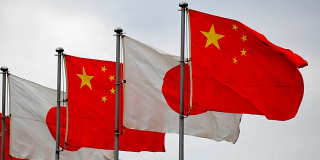

# 跟随美国打压！外媒：日本将开始限制对华出口先进半导体制造设备

【环球网报道】据路透社2月4日最新援引日本共同社报道，日本政府将在对一项外汇法修改后，于今年春季开始限制向中国出口制造先进半导体所需的设备。此前，日本、荷兰已与美国达成协议，同意限制向中国出口相关设备，对此中方已表示坚决反对。

报道声称，日本政府这一举动将不会特别提到中国，从而降低北京“报复”的风险。路透社称，该举动也佐证了美日荷此前达成的对华芯片设限协议，目前三方中只有美国承认了该协议的存在，但尚未公布将限制哪些设备的具体细节。

_资料图_

“这是一个神秘的协议。”在美国媒体放风“美已和荷兰、日本就限制向中国出口先进芯片制造设备达成协议”两天后，三国政府仍拒绝置评。1月28日，美国《纽约时报》称，因为其敏感性，三国没有公开宣布达成的对华芯片设限协议，细节也尚不清楚。美国专家认为，日本和荷兰需要时间来修改其法律法规以实施新的限制措施，相关措施“可能需要数月甚至数年才能相互呼应”。

对于美日荷上述举动，中国外交部发言人毛宁上月30日已作出回应。毛宁表示，美国为了维护自己的霸权私利，滥用出口管制，胁迫诱拉一些国家组建遏制中国的小圈子，将科技经贸问题政治化、武器化，严重破坏市场规则和国际经贸秩序，中方对此坚决反对。这种做法损人不利己，破坏全球产供链稳定，国际上不乏担忧之声。许多企业界人士都表示，滥用出口管制将造成混乱，影响效率和创新。毛宁表示，企图堵别人的路，最终只会堵死自己的路。中方将密切关注有关动向，坚决维护自身正当利益。有关方面应从自身长远利益和国际社会共同利益出发审慎行事。

