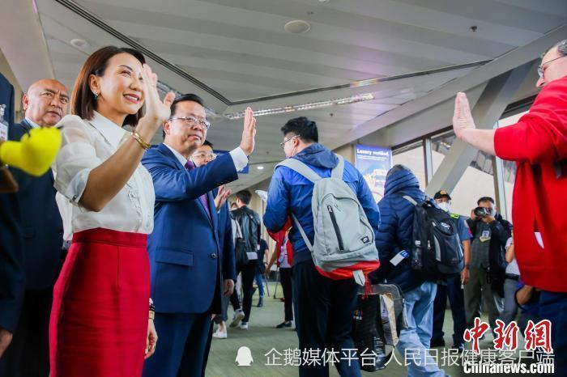

# 多国放宽中国旅客入境限制，不再强制核酸检测

**人民日报健康客户端记者王振雅**

2月4日，人民日报健康客户端梳理发现，多国放宽对中国旅客入境限制。

**意大利：从强制核酸，改为抽查**

_截图自路透社_

据观察者网消息，当地时间1月31日，意大利卫生部决定放松针对自中国出发旅客的入境限制，自2月1日起，不再对中国旅客实行强制性核酸检测，而是改为“随机检测”。

据意大利《共和国报》和路透社报道，当天，意大利卫生部长斯基拉奇签署有关中国旅客入境要求的新条例。按照新条例要求，所有来自中国的旅客仍需提前出示48小时核酸阴性证明。抵达意大利后，这些旅客不再被要求进行强制性核酸检测，而是改为“随机检测”。

**日本：将放宽入境限制**

据日本NHK当地时间2月1日报道，鉴于近期入境检查中确诊率下降，日本政府正考虑放宽对中国旅客自去年12月以来实施的入境防疫管控措施。

在讨论的选项中，包括不再要求提供新冠检测阴性报告，以及减少旅客入境后需要检测的人数。此前，日本驻华使馆于1月20日宣布恢复审发中国公民的赴日签证。

**瑞士：中国旅客无须核酸检测**

据新华社日内瓦1月11日消息，瑞士联邦公共卫生局11日发表声明说，当前在中国流行的奥密克戎毒株对瑞士人口及卫生系统构成的风险很小，无须要求来自中国的旅客接受强制新冠病毒检测。

声明表示，瑞士联邦委员会当天讨论了欧盟关于对乘飞机进入欧盟人员采取措施的最新建议。委员会决定，目前瑞士不应要求来自中国的旅客接受强制新冠病毒检测。

_1月25日，中国驻菲律宾大使黄溪连和菲律宾旅游部长弗拉斯科在马尼拉国际机场欢迎中国游客。中国驻菲使馆
图_

**东南亚多国邀请中国旅客**

据中国新闻网2月3日报道，东南亚多国在线邀请中国旅客。菲律宾总统马科斯发出邀请，希望中国游客重返菲律宾，领略这个东南亚国家的自然风光和人文风情。泰国副总理兼卫生部长阿努廷等官员专程前往机场，打出“中泰一家亲”标语。印度尼西亚旅游和创意经济部长桑迪亚加·乌诺隔空“喊话”，称印尼“已为中国游客准备好红毯”。

