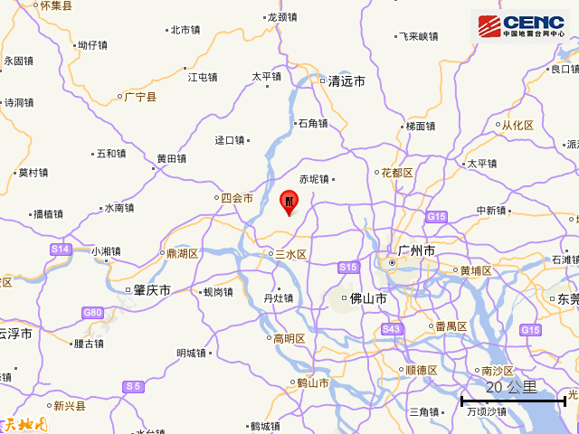
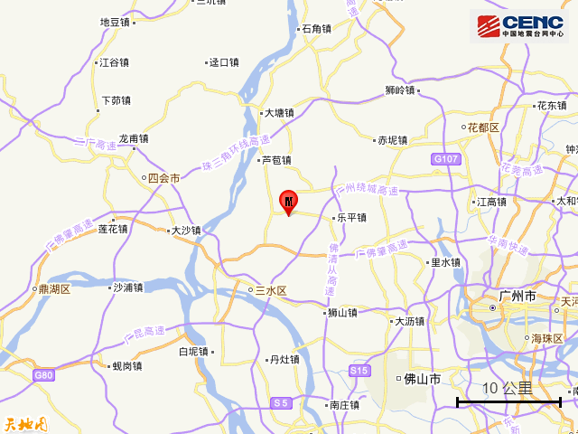
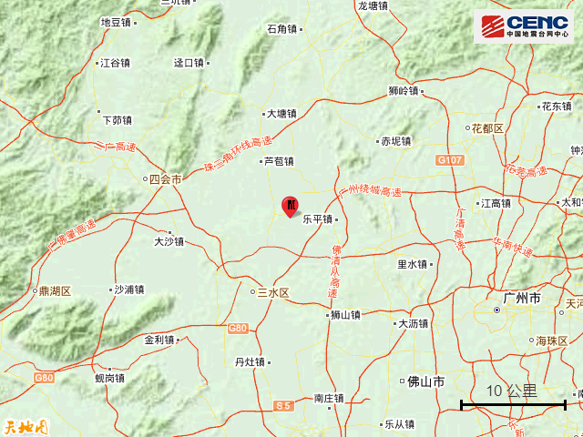
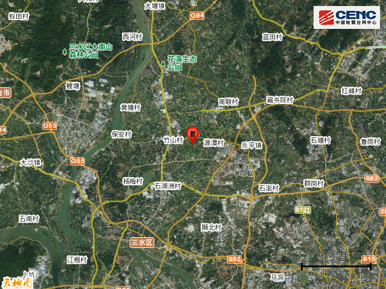
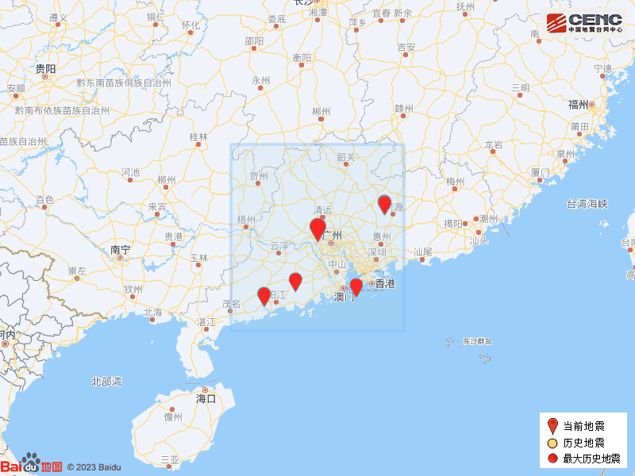

# 广东佛山市三水区发生3.2级地震，震源深度8千米

据中国地震台网正式测定，2月5日11时38分在广东佛山市三水区发生3.2级地震，震源深度8千米，震中位于北纬23.27度，东经112.95度。

震中5公里范围内平均海拔约4米。

根据中国地震台网速报目录，震中周边200公里内近5年来发生3级以上地震共9次，最大地震分别是2021年4月2日在广东河源市东源县发生的3.7级地震（距离本次震中171公里）和2018年3月20日在广东阳江市阳西县发生的3.7级地震（距离本次震中201公里），历史地震分布如图。

