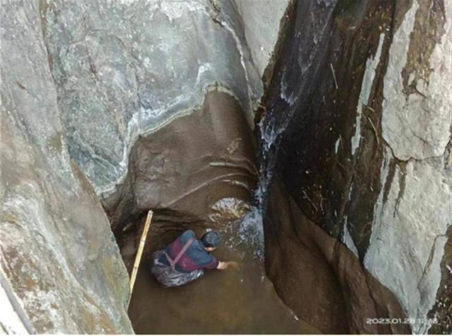
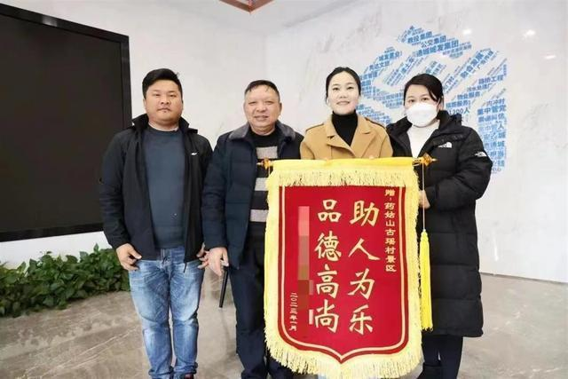
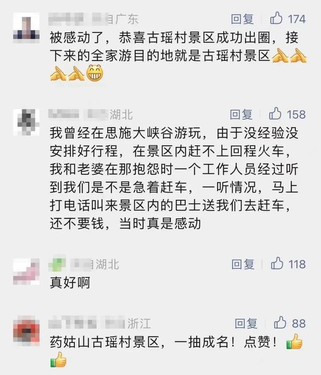
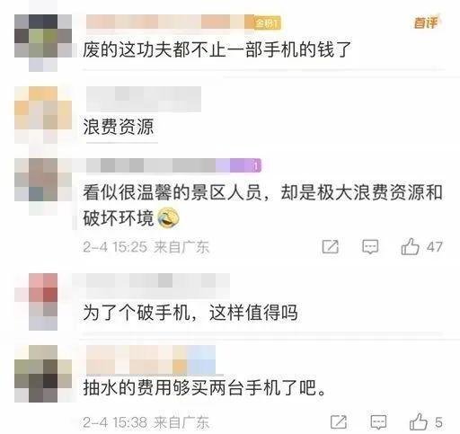

# 景区抽水8小时捞手机遭质疑，当事游客回应称没有特殊身份

近日，游客刘女士在湖北咸宁市通城县药姑山古瑶村景区游玩，不慎将手机掉进约700米深的峡谷，景区调来抽水机和发电机，打捞8个小时终于找到手机。此事经本报新媒体平台报道后，引发网络热议。游客是否身份特殊？景区劳神费力抽水8小时值不值？当事游客刘女士、景区负责人徐摇、咸宁市文旅局局长李振2月3日接受极目新闻记者采访，回应广大网友关心的问题。

刘女士说她是咸宁通城人，在浙江做生意，2023年春节回老家过年。1月28日正月初七，刘女士和家人到古瑶村景区游玩，不慎将手机滑落到峡谷里。她看到景区标识牌上有救援电话，就让表弟尝试拨打，没想到电话很快接通。景区工作人员迅速赶来处置，附近村民也主动帮忙找手机。

当时天色已暗，峡谷大约深700米，里面还有积水，刘女士不想劳烦大家，于是想放弃。没想到景区在第二天光线好的时候，调来抽水机和发电机，用时约8小时终于将手机捞了上来。所幸手机没有什么损伤，还能正常使用。

_景区工作人员全力打捞_

刘女士和表弟现场直击了打捞过程。“看到大家忙碌的场景，我非常感动。景区和村民都热心帮忙，也不要我们的报酬。”刘女士接受采访时瞬间哽咽，事后她给景区工作人员现金被拒绝，用微信发红包也被拒收，于是委托家人为景区送了一面锦旗表示感谢。

_刘女士委托父亲专程到景区送锦旗_

有网友怀疑刘女士身份特殊，所以景区才如此重视。对此，刘女士回应称自己就是普通游客，“手机里有很多重要资料，当时我只是抱着试一下的心态向景区求助，没想到景区如此尽心尽力打捞。我和景区工作人员不认识，和村民也不认识，也没有通过特殊渠道打招呼，这就是我们老家的淳朴民风。”

“景区设置了24小时求助服务热线，接到求助后，我和工作人员都到了现场，决定不管困难多大，都要帮游客把手机捞起来。”药姑山古瑶村景区负责人徐摇表示，抽水机和发电机都是景区常备的，打捞手机没产生多少费用。公司内部对员工有奖励机制，不需要游客支付任何服务费。

有网友表示，景区出钱抽水8小时值不值？“这个不能简单用钱来衡量，游客至上、服务至上，为了游客景区做什么都值得！”徐摇表示，任何游客来景区游玩，景区都会认真用心、用情做好服务。

对此，有网友认为：景区“值得点赞”

有网友则认为：“浪费公共资源”

对此，你怎么看？

来源：澎湃新闻

编辑：刘玉红

