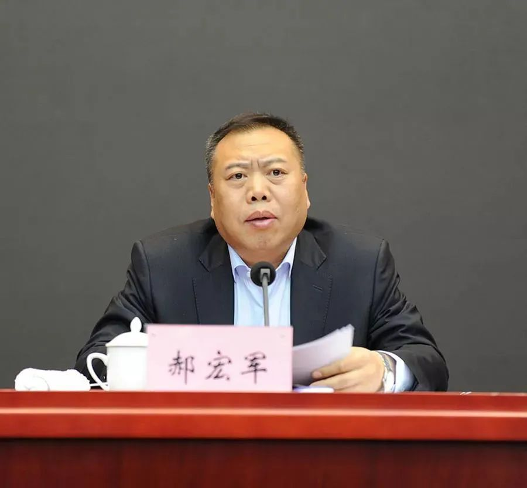

# 正月十五，中纪委连打三“虎”

2月5日（农历正月十五）中午，中央纪委国家监委网站连续发布三名中管干部落马的消息：

辽宁省大连市政协主席、党组书记郝宏军涉嫌严重违纪违法，目前正接受中央纪委国家监委纪律审查和监察调查。

湖南省政协党组成员、原副主席易鹏飞涉嫌严重违纪违法，目前正接受中央纪委国家监委纪律审查和监察调查。

新疆生产建设兵团党委常委、副司令员焦小平涉嫌严重违纪违法，目前正接受中央纪委国家监委纪律审查和监察调查。

_郝宏军 资料图_

公开资料显示，郝宏军出生于‍‍1962年12月，曾任营口市副市长、市公安局局长，抚顺市委常委、市纪委书记，大连市委常委、市纪委书记，辽宁省纪委副书记、省监委副主任等职，2022年1月任大连市政协主席。

_易鹏飞 资料图_

易鹏飞出生于1962年5月，湖南益阳人，曾任湖南省发改委副主任、怀化市市长、娄底市市长、郴州市委书记等职，2018年1月至2023年1月任湖南省政协副主席，期间兼任郴州市委书记至2021年3月卸任。

_焦小平_

焦小平出生于1966年7月，曾在财政部工作多年，2022年6月任新疆生产建设兵团党委常委、新疆生产建设兵团副司令员、中国新建集团公司副总经理。

至此，2023年已有6名中管干部接受审查调查，此前3人为山东省青岛市政协原主席汲斌昌，国家烟草专卖局原党组成员、副局长何泽华，河北省人大常委会原副主任王雪峰。

