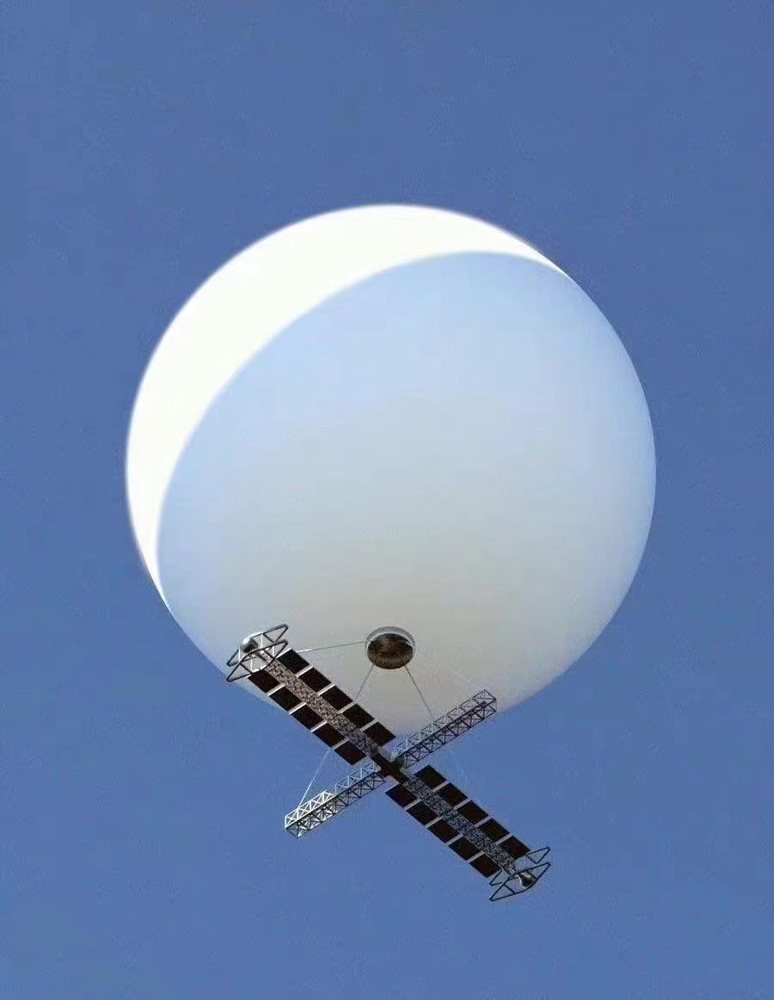
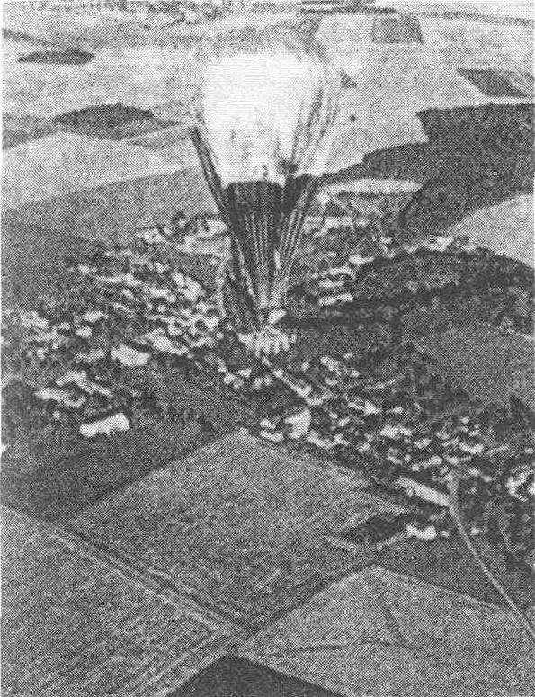
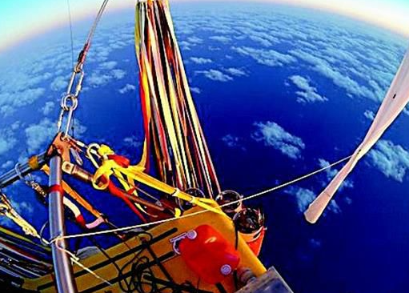
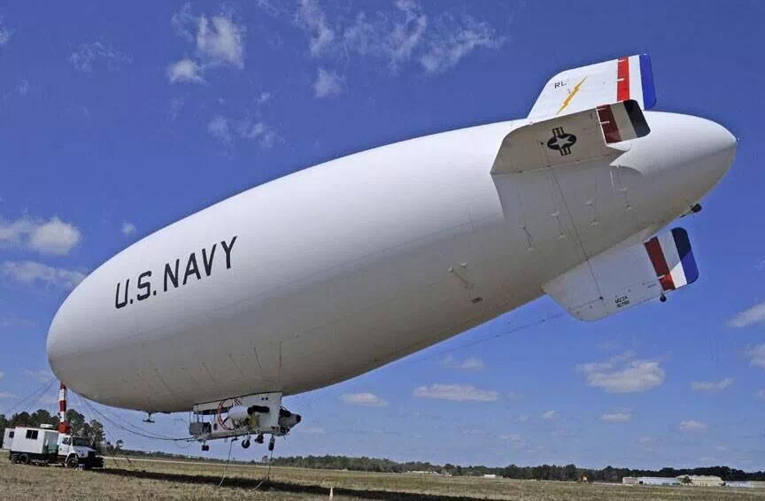
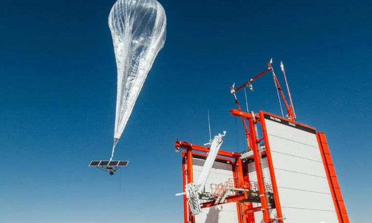
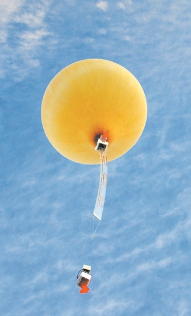
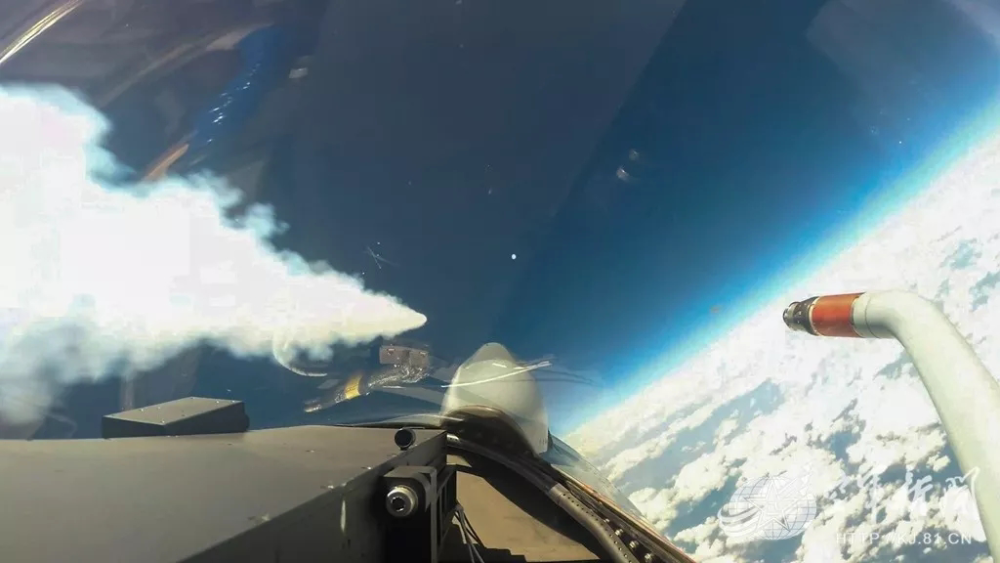

# 气球流浪简史：最高能升5万米，被低估的高科技与侦察兵

​作者丨张睿

编辑丨康晓

出品丨深网·腾讯新闻小满工作室

五代时期，随夫从军的莘七娘为方便联络，用竹篾扎成方架，用纸糊成灯笼的形状，在底盘上放置燃烧着的松脂，靠热空气飞上天空，这种装置后来被取名孔明灯。很长一段时间内，放孔明灯成为古人祈天、许愿的方式。

作为中国最早的气球，孔明灯在我们的生活中早已习以为常，谁也没料到，千年之后，一只来自中国的气球，会在万里之外的美国掀起轩然大波。

2月3日晚间，一则
“中国气球误入美国领空”的消息上了热搜。美国媒体大做文章，称这是来自中国的“间谍气球”，因为该气球不仅在美国上空飘荡，甚至还一度靠近了高度机密的美国核导弹基地。

对此，中国外交部发言人回应称：“该飞艇来自中国，属民用性质，用于气象等科研。受西风带影响，且自身控制能力有限，该飞艇严重偏离预定航线。中方对飞艇因不可抗力误入美国表示遗憾。中方将继续同美方保持沟通，妥善处理这次因不可抗力导致的意外情况。”

美国国内政坛对气球的争论却喋喋不休，共和党候选人特朗普趁机对拜登政府大加嘲讽。

据外交部网站2月5日消息，今日早间，外交部就美方宣称击落中国无人飞艇发表声明，中方对美方使用武力袭击民用无人飞艇表示强烈不满和抗议。

在普通大众的认知里，过往对于气球的了解可能仅限于飞行高度和距离都有限的热气球，现在人们突然意识到：原来一只“流浪气球”竟然能在30000米以上高空飞行数万公里，避过现代雷达等高科技侦查手段，甚至让世界最先进战机一度束手无策。

一般而言，高度越高，空气越稀薄，内外压差下，一些热气球升到一定高度后就会膨胀爆炸，如此脆弱的气球如何能升到万里高空，飘洋过海？

**漂洋过海去流浪**

1783年11月21日，两位法国人驾驶由孟格菲兄弟发明的热气球，从巴黎西部的布洛涅林园起飞，在空中持续了25分钟，最后降落在巴黎意大利广场附近。第二年，孟格菲兄弟的热气球就能飞到3000米。这是有资料记载有关热气球最早的故事。

图为1783年的气球飞行实验 绘画：Claude-Louis Desrais (1746-1816)

19世纪末，随着具有良好伸张率的膨胀性橡胶气球的制成，进一步增加了气球高空探测的范围。

20世纪60年代，大型非膨胀性的薄膜塑料气球应用广泛，世界上一些发达国家开始大规模发展高空气球技术。在大气和空间科学研究中，气球开始和火箭、人造卫星等飞行器并驾齐驱。

资料显示，高空气球的球体，大都用高压聚乙烯材料所作的球膜经热压熔焊制成，其低温性能和抗拉伸强度非常好。为提高载重能力，大型气球沿其母线还加有尼龙加强筋。球体形状多为自然形，采用所谓零压式，即在球体下部留有排气管使内外相通，压差为零，用以防止气球升空后球内压力增大把气球涨破。

气球内部一般选择氦气或氢气。氢气浮力大、成本低，但不安全易燃爆；氦气浮力小、成本昂贵，但更安全。高空氦气球的载重量越大，升限越高，体积也要求越大，载重可达上千公斤，升限在35~45km，及至超过50km。

1978年8月27日傍晚，一只巨大的银色气球缓缓降落在法国西北小镇米雷附近。气球的下方吊着一个红黄相间、色彩鲜艳的吊舱。历经6天6夜的飞行，这只名为“双鹰二号”的气球一路从美国缅因州海岸，飞越大西洋，抵达濒临英吉利海峡的诺曼底，第一次实现了飞行家们“乘气球飞渡大西洋”的梦想。

“双鹰二号”气球在法国上空飞行

“双鹰二号”气球的球体是由尼龙和轻质的人造橡胶造成的，高30米，直径20米，载重超过2000公斤，充氦气5000立方米之多。球体的上半部涂银白色，以免把氦气晒热，浮力加大，气球升得太高；下半部涂黑色，夜晚可从海洋吸收热量，以免气球遇冷，浮力减小，降得太低。

图为“双鹰”号在航行中拍摄的图片

在此后的30多年里，飞行气球发展飞速。2015年1月，一只同样命名为“双鹰”号的氦气球再次成功飞越太平洋，并创下气球航行飞行距离最长、持续时间最久两项世界纪录。

2015年1月25日，美国人特洛伊·布拉德利和俄罗斯人列昂尼德·图科特亚夫共同操控“双鹰号”，从日本佐贺县起飞，前往烟波浩渺的太平洋。6天16小时38分后，“双鹰号”降落在距离墨西哥巴哈海滩4英里的海域，完成10695公里的飞行。

飘洋过海“去流浪”，仅是热气球发展史中的一个注脚。在这段旅程中，后期逐渐被民用甚至军用的气球完成蜕变，成为大气和空间科学研究中不可或缺的一员，气象气球就是其一。

**平流层中的“科技之旅”**

气象气球是用橡胶或塑料等材料制成球皮，充以氢、氦等比空气轻的气体，携带仪器升空，进行高空气象观测的观测平台。打个比方，气象气球犹如一个“CT扫描仪”，把不同高度和经纬度的温度、气压、空气湿度、风向风速等数据通过信号发回地面，从而获得关键的气象要素值。

一般而言，气象气球大致可以分为探空气球、系留气球、定高气球、平流层气球等。

探空气球主要用于把无线电探空仪携带到高空，以便进行温度、压力、湿度和风等气象要素的探测；系留气球是使用缆绳将其拴在地面绞车上并可控制其在大气中飘浮高度的气球，升空高度2000米以下，主要应用于大气边界层探测；定高气球是一种保持在近似固定高度上随风漂流、用于大气探测的气球，是人类研究对流层的重要工具。

不同于常规的无线电探空气球和定高气球，平流层气球是升至平流层高度进行探测的大型气象气球，主要用于科学试验研究，采用现代定位跟踪遥控遥测等技术，其所携带的仪器能够在指定地区里回收。

飞艇也是浮空器的一种，根据工作原理的不同，浮空器可分为飞艇、系留气球和热气球等，其中飞艇和系留气球是军民利用价值最高的浮空器。

气球与飞艇二者最大的区别是，飞艇具有推进和控制飞行状态的装置，自带动力系统，可以自行飞行，尾面用来控制和保持航向、俯仰的稳定。飞艇分有人和无人两类，也有拴系和未拴系之别。大型民用飞艇可用于交通、运输、娱乐、赈灾、影视拍摄、科学实验等。

1957年3月，美国一艘ZPG-2型软式飞艇就在不加燃料的情况下，创造了连续飞行264.2小时的世界纪录。飞艇可以在其气囊中携带形状和尺寸几乎不受限制的大型雷达天线，军用飞艇的能耗和飞行费用比飞机少约
30% 。

在现代社会中，飞艇和气球都被应用到高能物理、天文、空间物理乃至互联网等各个领域。谷歌X实验室2011年着手研发、2013年推出的“互联网气球”项目Project
Loon就曾在全球引起轰动。这项技术旨在通过氦气球为偏远地区的人们提供上网服务，甚至在2015年时获得了《麻省理工科技评论》的年度十大突破技术之一。

据悉，谷歌所使用的高空气球是由聚乙烯材料制成，直径15米、高12米，内置太阳能电池板、GPS
定位设备，无线电收发器、环境检测器等设备，可以在距地面20公里的平流层中飞行，并且每个气球能够覆盖直径约80公里的地面区域。

谷歌气球最为经典的应用案例，是在2017年的秘鲁洪灾与袭击波多黎各的玛利亚飓风等环境灾难中，为数以千万计的用户提供了互联网接入服务。

历经9年，谷歌X实验室于2021年关闭了“互联网气球”项目Project Loon

不过谷歌这项宏伟的“互联网气球”项目最终败给了高昂的成本。除气球本身造价不菲外，网络维护成本也居高不下。2021年1月22日，谷歌X实验室关闭Loon项目。

国内也不乏研发气象气球的公司，最成功的一家生产企业曾是一家濒临倒闭的橡胶厂。

1999年，化工部乳胶工业研究所成为国内第一批转制的科技企业，更名为中国化工株洲橡胶研究设计院有限公司（简称株洲橡胶院），自此开始投建医用丁基橡胶瓶塞生产线。由于前期经营不善及市场剧变，濒临倒闭的株洲橡胶院于2003年停止该项目，转而研发探空气球。

株洲橡胶院在探空气球崭露头角始于2010年。当年，中国气象局首次承办世界气象组织（WMO）第八届国际探空仪系统比对实验，为了使用国产气球，打破以往比对实验全部采用日本生产的探空气球作为飞行载体的历史，株洲橡胶院在2009年临危受命，最终研发的探空气球，比芬兰Vaisala公司在德国斯图加特自动放球器试验中提供的探空气球还高出近20%。

据公开资料显示，目前株洲橡胶院已经掌握了浸渍法和旋转成型法两种气球生产工艺，产品品类从10克覆盖到5000克，探空高度更是达到了48000米。

48000米是什么概念？有资料显示，民用飞机短航线的飞行高度一般在6000米至9600米，长航线的飞行高度一般在8000米至12600米。

**不可忽视的军用气球**

由于飞行高度足够高，有时气象气球会被不明就里的大众当成UFO。2020年6月17日，日本仙台上空出现不明飞行物，在部分日本网友眼里，在遥远的高空中漂浮着的白色球体就像一个UFO。此后，日本自卫队的直升机紧急升空探测。

图为2020年6月17日日本网民拍到的气球

对于这个白色球体，仙台市天文台后来表示，“从形状上看，应该是观测气球。”

除用于科研探索外，气球在历史上也被用于军事。军用气球除了在侦察、监视、通信、中继、运输等方面发挥作用外，也被用于火箭发射、无人机群投送等方面的研究中。

事实上，在18世纪孟格菲兄弟研制出载人热气球后，法国就把气球派到了侦察现场。在与奥地利军队对阵中，法军侦察人员坐在军用气球“创业号”的吊篮中升上高空，轻松地完成了空中侦察任务。

在众多的研究国家中，美国对军用气球的研究驾轻就熟。很长一段时间，西方国家都将气球用于战场侦察。冷战初期，气球已经成为间谍游戏的重要组成部分。

有资料记载，美国曾经针对苏联制作出一种“间谍气球”。它体形庞大，直径近40米，吊篮内配备着先进的摄像机和定位系统，能在1.8万米的高空对苏联进行拍照侦察。但因为气球会“随风逐流”，很难掌控，最后收效甚微。

系留气球的出现大大提升了气球的“侦察”功能。2001年爆发的阿富汗战争中，英军将长10多米的气球放置在600多米的空中，下面用钢铁缆绳固定。通过缆绳中的信号传输线，地面基站就可以接收到气球上所安装摄像头和雷达所捕捉到的信息，昼夜不停地对敌方进行侦听。

美军“战斗天星”小型高空气球

至今，高空气球依然是美国研究的重点。Politico曾报道称，“美国五角大楼大幅增加了高空气球的预算，希望它们能够协助跟踪和拦截俄罗斯与中国的高超音速导弹。”而据《财富》杂志报道，“与以前的军用飞艇相比，美国高空气球的科技含量更高。”

1974年5月上旬，一具高空侦察气球进入中国，向渤海湾方向飘去。这种侦察气球装有高清摄像机，能在10000米—20000米高空清晰地拍摄地面图像，并用无线设备传回美国。当年5月15日，2架歼-6战斗机将气球打破。

2019年9月，一具超高空动力侦察气球现身中国云南上空，空军战机飞行员武辉领命，驾驶“红鹰”歼-10C战斗机紧急升空拦截。报道称，由于这一超高空气球已经位于极高的高度，超过了战斗机最高升限，同时因为高空中没有任何参照物，特别是万里无云的情况下无法判断目标相对关系，更加无法判定距离，因此武辉选择依靠肉眼识别跟随目标，依据实战训练经验建立自身战斗机的攻击航线。最终，武辉操作战机“先俯冲增速，再跃升攻击”，歼-10C左翼携带的空空导弹发射向远方的目标，将这一白色气球瞬间摧毁。

歼-10C战斗机击毁高空侦查气球画面

习惯将高空气球应用于侦察的美国，此次对偏航的中国民用飞艇如此紧张也就不令人意外了。

**腾讯新闻出品内容，未经授权，不得复制和转载，否则将追究法律责任。**

