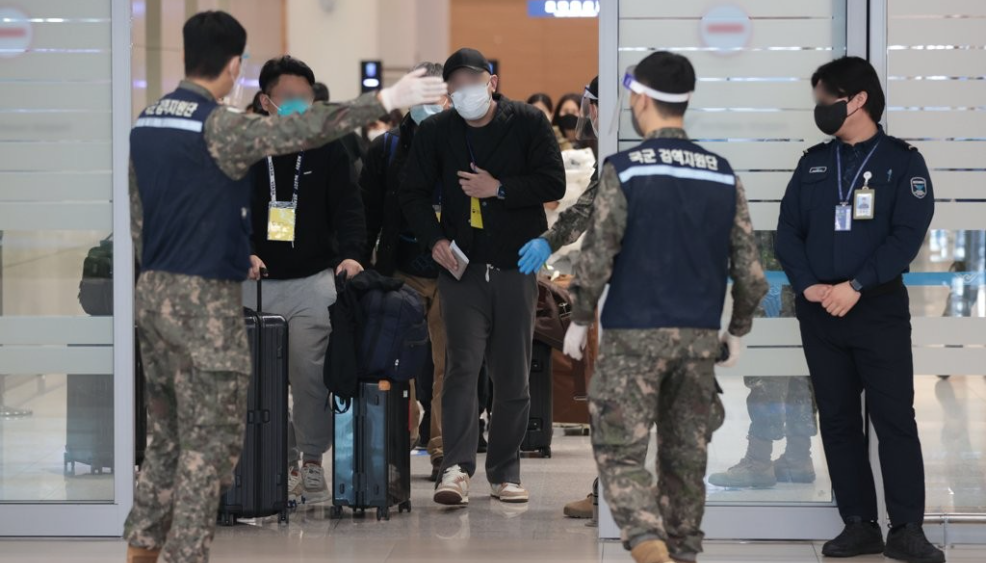

# 韩媒：自中国入韩旅客新冠落地检阳性率为零，为一个多月来首次

【环球网报道】韩联社5日消息称，据韩国中央防疫对策本部4日发布的数据，当天自华入境旅客的新冠落地检阳性率为零。报道声称，这是韩国对自华入境的短期停留人员实施新冠落地检后时隔1个多月以来的首次。

韩联社称，据统计，当天自华入境人员共有1136人，其中164人在入境后接受新冠核酸检测，没有人确诊感染新冠。

报道称，韩国政府从上月2日起对自华入境人员实施落地检。韩国防疫部门上月5日起要求所有自华入境人员须在登机前提供行前48小时内核酸检测阴性证明或行前24小时内医疗机构开具的抗原检测阴性证明，此后阳性率逐步下滑。

_资料图：2023年1月9日，在仁川国际机上第二航站楼，韩国防疫人员指引自华入境人员前往进行落地检_

报道还提到，在自华入境人员的落地检阳性率持续下滑、确诊病例持续减少的情况下，期限为本月底的落地检和暂停签发中国公民赴韩短期居留签证措施是否会提前取消备受关注。

韩联社称，韩国1月2日起自华入境的所有人员必须在抵达仁川机场后接受新冠核酸检测，检测结果呈阳性者须在临时隔离设施进行为期7天的隔离。韩国驻华外交机构限时停发赴韩短期签证。中国驻韩国大使馆1月10日发布关于暂停签发韩国公民赴华短期签证的通知，中国外交部发言人汪文斌就暂停签发韩公民赴华短期签证表示，我们再次呼吁相关国家从事实出发，科学适度制定防疫措施，不应借机搞政治操弄，不应有歧视性做法，不应影响国家间正常的人员交往和交流合作。

而据韩联社2月1日报道，中国当天起对自韩国入境旅客进行核酸检测，但只有自韩外籍旅客接受检测，中国籍旅客则免检测入境。对此，中国外交部发言人毛宁当天在外交部例行记者会上表示：“我们愿同各国一道，尽可能便利中外人员往来。但对个别国家执意采取针对中国公民的歧视性措施，我们不得不按照对等原则回应。”

