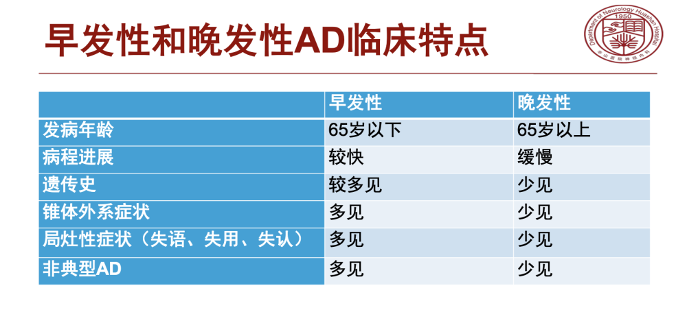
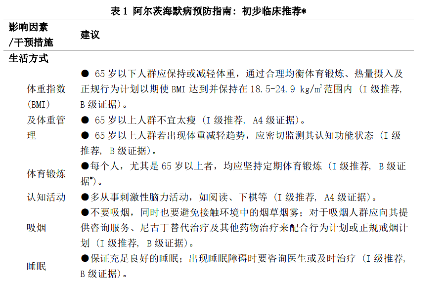
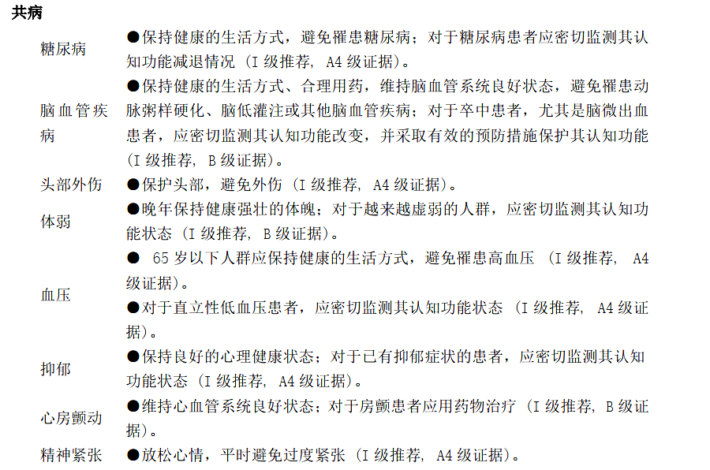

# 19岁男孩罹患阿尔茨海默症背后：这一疾病真的年轻化了吗？

阿兹海默正在“变年轻”吗？

近日，一篇由首都医科大学宣武医院贾建平团队撰写的论文，公布了一例被临床诊断为阿尔茨海默症的19岁患者，引发网友热议，登上微博热搜。

这一论文发表在国际知名阿尔茨海默症研究刊物上。文中介绍，一名19岁男孩出现进行性记忆衰退，受困于明显的短期记忆缺失，他会无法想起一天前发生的事，或忘记个人物品放在哪里。论文作者之一、宣武医院神经内科主任医师贾龙飞介绍，该病例情况极为罕见。

论文发布后，引起一部分年轻网友对于这一疾病的担忧，网友们表示：“我也记性很差，经常一转身就忘事”“上班忘记带手机打卡，下班又会忘记带钥匙回家，是不是（阿尔茨海默症）早期表现”“我经常忘记手机放哪儿了，是不是也老年痴呆了”。

当前阿尔茨海默症究竟是否有年轻化趋势？近日，澎湃新闻（www.thepaper.cn）记者专访数名神经内科专家，就这一问题进行讨论。

2月6日，复旦大学附属华山医院神经内科主任医师郁金泰教授告诉澎湃新闻记者，临床上确实存在阿尔茨海默症年轻化趋势，但这一趋势其实也在很多疾病领域发生，原因是多方面的，需要综合分析，也不能因此过度焦虑。

郁金泰分析，一是近年来阿尔茨海默症报道宣传多了，国内外发表的论文也越来越多地关注这一领域，引起了社会重视，以往大家可能意识不到这一疾病。

此外，随着环境和生活方式的改变，高血压、高血脂、高血糖、运动减少等血管危险因素的疾病高发，糖尿病、脑卒中等血管疾病年轻化，也在一定程度上促进了阿尔茨海默病年轻化。

上海交大医学院附属瑞金医院神经内科主任刘军教授告诉记者，目前从临床上来看，阿尔茨海默症患者仍以五六十岁以上的老年人为主，年轻人很少，这一例19岁的患者病例仅仅是个案，“临床上不少年轻人因记忆力不好来就诊，大部分都不是阿尔茨海默症，年轻人记忆力的减退并非都是病理性的，临床诊断阿尔茨海默症也不单单看记忆力情况，还要配合一系列的检查，如腰穿、磁共振、PET检查、脑脊液检查等，最终才可能确诊这一疾病。”

**超早期发病的年轻阿尔茨海默症患者**

专家透露，在临床上，的确遇到过年轻的阿尔茨海默症患病群体，年龄在二、三十岁，但也均为个案，症状并不具有典型性。

刘军在前两年遇到过一个28岁的年轻人，因记忆力减退前来就诊，被诊断为患阿尔茨海默症，“根据病人所述，记忆力不好外，还存在无法胜任工作的情况，对生活和工作的影响都很大，主要还是考虑到基因的因素大一些，由于基因突变或是有疾病家族史的情况。”

“目前在临床上被诊断为阿尔茨海默症的病人，有些可以找到致病的易感基因，有些找不到，能找到致病基因的比例也仅有1%左右，即使找到了，在治疗方面目前也没有很大差别。”郁金泰坦言。

郁金泰曾发表过论文，记录了临床上2例被诊断为阿尔茨海默症的年轻患者，一名是33岁男性，一名37岁女性，都因记忆力下降前来就诊。

33岁男性在27岁就已经发病，2017年来华山医院就诊时表示自己进行性反应迟钝，6年前存在认知功能减退。经检查，发现其认知功能障碍、全脑萎缩，双侧海马硬化、叶酸缺乏、高同型半胱氨酸血症。

“2013年时，他一度在医院迷路，无法完成送检化验等这些简单的任务，2017年也不能完成工作任务，老板交代工作会遗忘或颠三倒四，计算力下降，买东西不会计算零钱，夜间睡觉跑错房间，时有答非所问，傻笑，有精神行为异常的情况发生，甚至还出现了性格改变，活泼的性格渐渐地变为沉默寡言，到了无法工作的程度。到了2019年，他已经不会用手机，也不会签名，但他无明确神经系统疾病家族史，家里父母及3个姐姐都很健康。”郁金泰说。

而另一名37岁的女性阿尔茨海默症患者也同样是因记忆力减退就诊，存在空间障碍，症状并不典型，小脑功能退化，肌张力增高等。

“在临床上，我们将阿尔茨海默症分为早发性和晚发性两个阶段，以65岁为分界线，其中早发性为65岁以下发病，往往病程较快，较多见遗传史，也多见一些走路不稳等认知之外的症状，而晚发性病人往往病程缓慢，上述这些情况都相对少见。”郁金泰进一步表示，早发性痴呆临床少见，病因众多，诊断需全面，而基因检测往往可以对这一类型患者可以提供重要的诊断信息。

_阿尔茨海默症分为早发性和晚发性两个阶段，以65岁为分界线。本文图片均为
受访者 供图_

**年轻人记忆力下降，并不一定患阿尔茨海默症**

记忆力下降是否就意味着患阿尔茨海默症的可能性？对此，上述两名专家都予以否认。

刘军认为，如果不是以近时记忆为主的症状，都没必要引起过度恐慌，“近时记忆是指，这一刻做的事，下一刻马上忘了。正常人如果因为工作节奏忙碌、压力大、事务繁多，也会出现忘东忘西的情况，但这些都不是病理性的，并非因脑部病变引起的，都不能称之为阿尔茨海默症。”

郁金泰指出，在他所在门诊里，多年来就诊的年轻患者中，绝大多数因记忆力下降就诊，经诊断都并非阿尔茨海默症患者。“如果真的是阿尔茨海默症，往往是症状一年不如一年，甚至一个月不如一个月，疾病逐步进展，记忆力的下降并不一定是患了阿尔茨海默症，这个比例很低，有人只是功能性认知下降，表现为神经衰弱、注意力不集中，但仍能胜任工作，常常伴随出现焦虑、睡眠不好、情绪低落等问题，并不是阿尔茨海默症。阿尔茨海默症，往往会导致性格方面的改变，越来越孤僻的可能性更大一些。”

郁金泰透露，目前，阿尔茨海默症以散发为主，与基因、环境等因素有关，因基因问题导致的预防更为困难，而如果发病与环境因素有关，预防能起到一定作用，“譬如通过改善生活方式、饮食习惯、增强运动和人际交流等，都会可能产生一定的作用，延缓疾病进展。”

郁金泰表示，目前尚无特效疗法能阻止或逆转阿尔茨海默症病情进展，但越来越多的流行病学研究表明，阿尔茨海默症可以预防，有效控制危险因素、合理利用保护因素可以显著降低阿尔茨海默症的发病率和患病率。

如何预防？复旦大学附属华山医院神经内科郁金泰教授临床研究团队联合中国国内、美国、加拿大、英国等诸多专家制定了全球首个阿尔茨海默症循证预防国际指南，发表于本领域国际顶尖杂志《英国医学杂志》（The
British Medical Journal,
BMJ）的子刊《神经学，神经外科学与精神病学杂志》，引起了国际医学界的广泛关注。其中涉及生活方式的改善、共病以及教育等其他方面的建议，这也是全球首个阿尔茨海默症预防指南。

_阿尔茨海默症预防指南_

“已经有研究证实，主动学习可以降低阿尔茨海默症的发病，如多从事认知活动，如阅读、下棋等刺激性脑力活动，而不要一直坐在家里看电视，被动接受讯息。此外，要保持健康的生活方式，避免罹患糖尿病和高血压等，保持良好的心理健康状态，放松心情，平时避免过度紧张，65岁以上人群应警惕体重减轻，若出现体重指数BMI下降趋势，应密切监测其认知功能状态，此外年轻人应尽可能多地接受教育，还要注意保证充足良好的睡眠，不要吸烟酗酒，同时也要避免接触环境中的烟草烟雾，同时坚持定期体育锻炼，避免肥胖、抑郁、精神紧张情绪的发生。”郁金泰教授呼吁。

