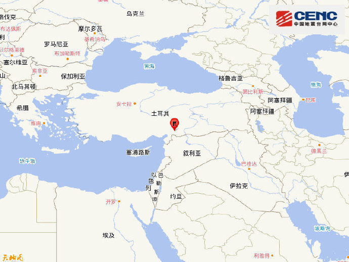
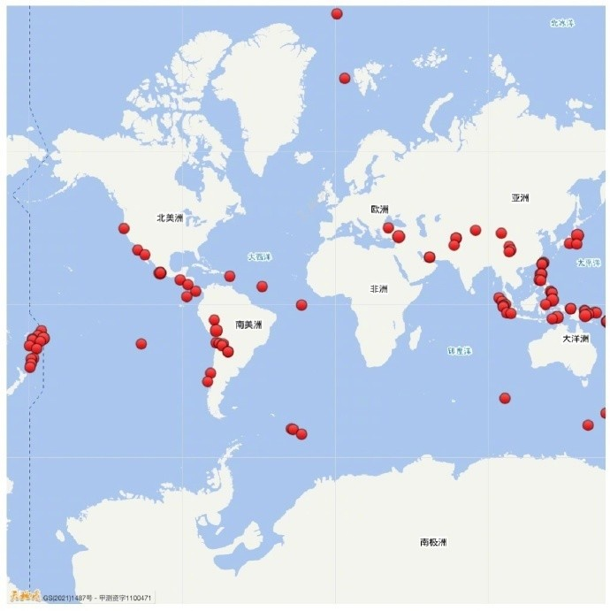

# 7.8级！土耳其发生今年以来全球最大地震，该国96％领土位于地震带

每经编辑：毕陆名

2月6日，据中国地震台网正式测定：02月06日09时17分在土耳其（北纬37.15度，东经36.95度）发生7.8级地震，震源深度20千米。今年以来，全球共发生六级以上地震13次，其中6.0级到6.9级9次，7.0级到7.9级4次，8.0级以上0次，最大地震是本次地震。

土耳其，78.36万平方公里，其中97%位于亚洲的小亚细亚半岛，3%位于欧洲的巴尔干半岛。土耳其地处安纳托利亚断层带，地震是土耳其最频繁的自然灾害之一。安纳托利亚断层位于非洲板块和欧亚板块之间，从东至西贯穿土耳其。这两个板块相对移动形成的断层是地震多发带。
**据报道，土耳其有96%的领土位于地震带上，因此地震频繁。**

北安纳托利亚断层带从土耳其东部穿过土耳其北部和黑海南部，至希腊的一条东西走向的右旋断裂带，是阿拉伯板块与欧亚板块的边界之一，长约1500千米。

每日经济新闻综合中国地震台网、公开资料

