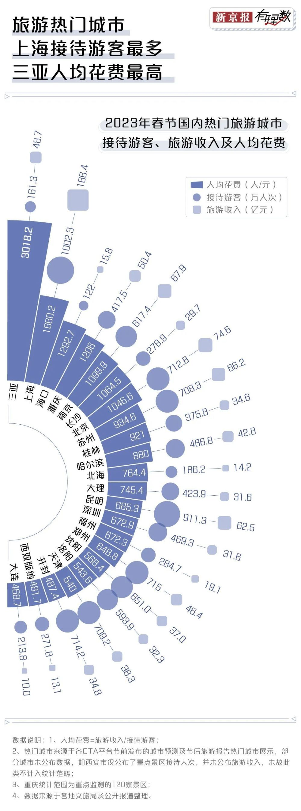

# “平均50人喂一只海鸥”，报复性旅游来临了吗？

数据新闻编辑 陈华罗 新媒体设计 苗奇卉 校对 吴兴发

人从众……这个春节，哪哪都是人，昆明海埂大坝“平均50人喂一只海鸥”，黄山万人踏雪爬山被滞留数小时，西安大唐不夜城人山人海赶人海，三亚机票、酒店预订暴增数倍，这个春节，报复性旅游来临了吗？

春节过后，各地也分别公布了春节旅游市场情况，其中四川省数据格外引人注意，以接待5387.59万人次排在目前已公布数据的各省份第一位。

今年是疫情政策放宽后的第一个春节，据文化和旅游部数据中心测算，今年春节假期全国国内旅游出游3.08亿人次，按照各地测算，其中四川省就占了1/6左右，四川省在这个春节都做了哪些准备？接待游客人次多，就意味着旅游收入高吗？

我们整理了截至目前已公布2023年春节接待游客及旅游收入的23个省份数据，以及热门旅游城市的相关数据，对比分析这个春节期间，哪个省最赚钱，哪个城市最能赚钱，探讨春节旅游市场对于各地经济发展的意义。

**接待游客最多的四川省**

**旅游收入排第五**

1月27日，四川省文化和旅游厅发布消息称，2023年四川省交出开门红成绩单，旅游市场强劲复苏。据中国旅游研究院专项监测数据，2023年春节假期旅游接待人数四川荣登全国第一。

四川省文化和旅游厅官网公布的第三方大数据监测显示，2023年春节假期，四川共接待游客5387.59万人次，旅游收入242.16亿元，同比分别增长24.73%、10.43%，分别恢复到2019年春节的89.73%、84.75%，两项指标增幅均超过全国平均水平。

截至目前，共有23个省份发布了春节相关旅游数据，通过整理后我们发现，四川省接待游客人次排在首位，且是唯一一个超过5000万人次的地区。

云南省和江苏省紧随其后，接待人次也都超过了4000万，分别以4514.6万人次和4135万人次排在第二和第三位。这三省的接待游客人次就超过了1.3亿。

为何四川省接待游客会如此之多？据四川师范大学历史文化与旅游学院教授、劳动与实践教育研究院院长，四川省导游协会会长陈乾康向介绍，“阳过了”“天气好”“憋久了”和疫情后更重视亲情友情，是四川春节旅游市场火爆的重要原因。

陈乾康表示，四川今年春节旅游活动主要有两个流向，一是返乡流，疫情政策优化，返乡限制取消，作为外出务工大省，3年疫情压抑的返乡需求释放，进而形成了以家庭出游为特征的周边游客流市场；其次是阳光游市场，主要流向南方的攀西地区、云南和海南市场。

在数据上也得到验证，云南省虽然接待游客人次低于四川，但接待游客人数和实现旅游收入分别恢复至2019年的130.3%和132.5%。而且省外入滇游客达到2058.2万人次，占市场总量的45.59%。综合旅游收入384.35亿元排在所有省份第一，比第二名浙江高出54.85亿元，比四川省多赚了142亿。

**热门旅游城市里上海最能赚**

**三亚最会赚**

春节期间，有网络段子调侃“中国14亿人，7亿人在三亚，7亿人在西安”，从数据上来看，这两个城市的接待游客未必是最多的，但，火是肯定的。

古都夜未央，长安灯如昼。在关于寻找年味这件事上，古城西安自带优势，告别“就地过年”后的西安在这个春节旅游市场迎来爆发，数据显示，春节期间西安仅监测的15家重点景区接待游客就达到227.79万人次，同比增长160%，已经恢复至2019年同期水平。

作为我国第一大节日，在传统里寻年味成为许多人外出旅游首选，据头部OTA平台发布的春节旅游总结报告，这个春节，除了西安，苏州、扬州、洛阳、开封等文旅资源富集的古城也人潮如织，凭借超高票量位列景区人气前十城市。

但放眼整个春节期间，上海不管是接待游客还是旅游收入，都稳居热门城市第一位。这个春节上海将自身优势无限放大，不论是科技与传统交相辉映出圈的豫园灯会，还是142场文博艺术美展及602场演出，“都市型、综合性、国际化”的上海在这个春节期间表现的吸金力十足，以旅游收入166.4亿元排在所有热门城市第一位。

三亚气候温暖，本就是冬季热门目的地，年底“阳康”们也更倾向于找个地方静静修养，叠加国内休闲度假类旅游产品本身就供给不足，三亚在春节期间机票、酒店量价齐飞。

三亚旅游业起步较早，基础设施较为完善，且有着得天独厚的海洋文化资源，所以酒店、旅行社相较其他城市而言，价格水平较高，春节期间大量游客涌入加剧住宿涨价。如果仅按照已公布接待游客与旅游收入大致测算的话，三亚在热门城市里人均花费最高。

而相比之下，同样温暖的云南地区，成为越来越多人的首选，西双版纳在这个春节期间也迎来了大批游客，被网友称为三亚平替的北海，也凭借着海洋资源吸引了近200万游客。

**人均花费并未上涨**

**理性消费是春节旅游的主基调**

文化和旅游部数据，今年春节全国约有3.08亿人次出游，同比增长23.1%，恢复至2019年同期的88.6%。比起出游人群，消费力恢复的就稍微弱一些，春节期间国内旅游收入3758.43亿元，恢复到2019年的73.1%。

相比起清明、“五一”、国庆跟传统黄金旅游旺季，春节期间客流主要以返乡和旅游两部分组成，所以家庭式周边游是今年春节旅游的一个特色。在已公布游客结构信息的几个省份中，省内游客占比远高于外地游客。譬如浙江省今年春节共接待游客2531.1万人次，其中省内游客占80.6%，省外游客仅占19.4%。

通过梳理从2017年至2023年几个假期旅游数据对比看，今年春节虽然出行人次高于前两年疫情期间，但不管是对比2019年还是之前的2017年、2018年，出行人次和旅游收入都远不及。

2023年是旅游业的新开端，疫情政策放宽之后第一个旅游小高峰应该是元旦，但元旦假期国内旅游收入为265.17亿元，仅恢复至2019年元旦节假日同期的35.1%，增长并不明显，这可能与当时大部分地区才刚开始感染有关。

出行人次恢复的程度高，但旅游收入增长却不明显，直接表现就是人均消费水平下降了，人们的消费更加理性了，这在一些高消费热门城市表现的尤为明显。

以三亚为例，今年春节接待游客161.29万人次，旅游收入48.7亿元；同比2019年春节三亚接待游客99.65万人次，旅游收入达到103.85亿元。客流量已完全恢复，但收入只恢复不到一半。

如果统计口径没有发生变化的话，用已公布的接待游客数量和整体旅游收入大致测算，2019年春节人均花费大约1万多元，今年三亚旅游春节人均花费大约3018元，不到2019年1/3。

热搜里三亚18万的天价酒店一房难求，似乎只是极少数人的旅游状态，大部分人群还是晒晒太阳逛逛沙滩，理性、平价消费。

如此看来，客流量增长的确意味着出游和消费信心的恢复，但期待中的“报复性”消费热潮似乎并没有到来。陈乾康教授也表示，整个旅游市场的全面复苏还是寄希望于“五一节”以后。

参考资料：李秀中，第一财经，《不是云南也不是海南，这个省凭什么春节游客量全国第一？》

**值班编辑 康嘻嘻**

