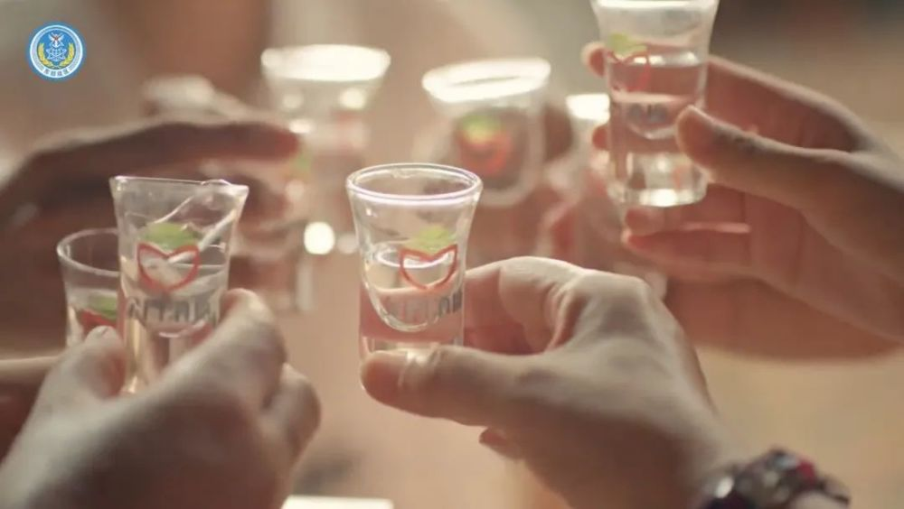

# 东部战区MV打温情牌？相关人士：解放军对“台独”从不温和，更不温情

【环球时报-环球网报道
记者郭媛丹】作为距离台湾最近的守卫者—解放军东部战区的一举一动都颇受外界关注，元宵节前东部战区发布的一条MV引起岛内媒体的特别关注，台媒称这条MV“刻意制造出温情路线”。相关人士对《环球时报》记者表示，在维护祖国统一大业的问题上，解放军既没有“温情路线”也没有“军武路线”，解放军对敌人用钢枪，视同胞为亲人，对祖国献忠诚，这则MV更重要的是在元宵节前向两岸同胞致以美好的祝福，希望两岸人民早日团聚，以温情的方式表明解放军更加坚定的维护国家统一的立场。

台媒关注到，在这则时长1分24秒的MV中，有一幕是众人举杯，而酒杯上印着“金门酒厂”字样，象征着杯中的白酒是台湾特产金门高粱酒，这段旁白提到：“国有两岸暂隔，军人的守护，用钢枪驱敌，美酒认亲”。

_解放军东部战区发布的最新MV画面中出现印有“金门酒厂”字样酒杯。_

此前，东部战区在1月份曾发布一则《1月9日，东部战区
发布战训MV《我的战鹰绕着宝岛飞》，“我的战鹰绕着宝岛飞，捎来故乡的思念，轻声唤你归”》的短视频，其中出现大量战机、船舰、军舰等画面。台媒敏感地关注到此次最新的MV没有大量出现军事装备，而是出现家人对白，一名军人拿着望远镜在船舰上遥望台海，视频穿插两岸景色与大陆高铁，包括北京天安门与台北101跨年烟火等景观。旁白中还配文说：“今天，跨海相望，你在那头，我在这头；明天，坐着高铁，你来这头，我去那头。让一湾浅浅的海峡，不再盛满深深的乡愁。”一些台媒将这种转变描述为解放军改打“温情牌”，“刻意制造出温情路线”。

但相关人士接受《环球时报》记者采访时则表示，东部战区在元宵佳节前发布的这条MV，从内容上看可以看出是对包括台湾同胞在内的中华儿女致以节日的祝福，“两岸人民一家亲，MV用一种温和温情的方式展现人民子弟兵和人民之间的鱼水情深，以及军人对祖国统一和人民幸福生活的守护，表明解放军更加坚定更加深情地维护国家统一的立场。这一点在MV中也有所展示——用钢枪驱敌，正所谓客人来了有美酒，敌人来了有猎枪。”

这名人士表示，两岸民众本是一家，是受到域外势力挑拨和“台独”分子的煽动才会让两岸关系越走越远，对于域外势力和“台独”分子，解放军从来不会温和，更不会温情。MV中出现天安门华表、金门高粱酒、101大楼、日月潭、高铁等，这些都是中华民族的元素，表明在未来两岸必会统一，中国元素一个也不能少。

军事专家宋忠平对《环球时报》记者表示，从岛内媒体关注到金门高粱酒这个细节也可以看出，两岸本是一家，酒文化是中华文化的一个重要组成部分，在春节及喜庆节日喝点白酒是中国的传统，因此这充分说明两岸在文化上是相通的，“所谓把酒言欢，两岸人民本是一家人，体现出合家欢的意境。”

对于台湾媒体对这则MV的解读，宋忠平认为，无论是岛内媒体还是岛内老百姓都希望从大陆官方渠道中获取“两岸一家亲”的信号，希望通过和平的方式来解决两岸问题，避免家园成为战场，“一家人相聚有好酒，但对于扰乱和平的域外势力和‘台独’分子则只有猎枪。”

