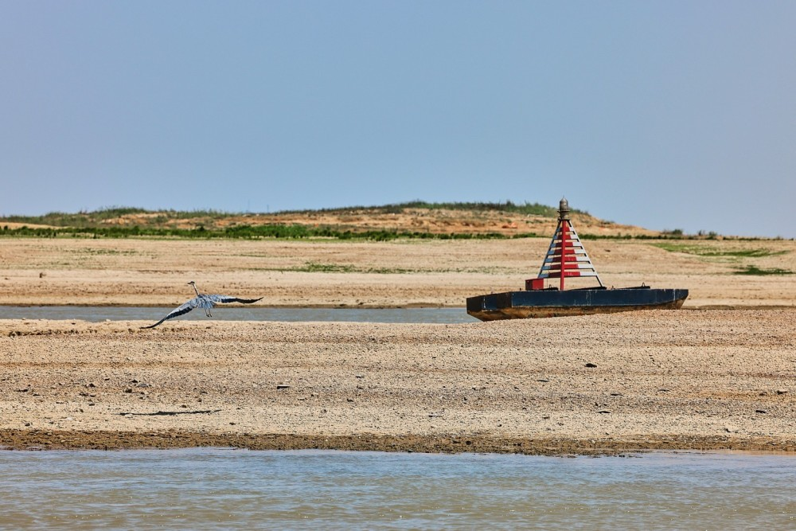
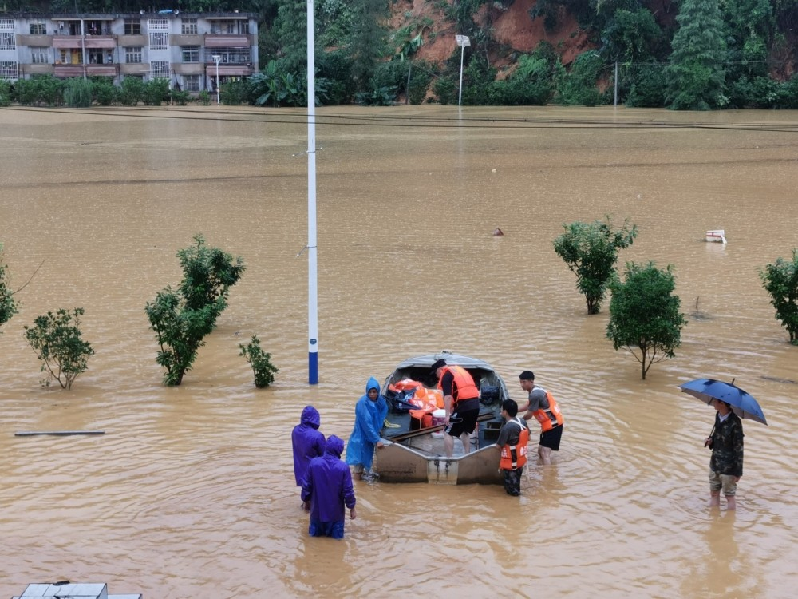

# 中国气候公报：去年我国旱涝灾害突出，降水量为2012年以来最少

新京报讯（记者王景曦）今天，中国气象局发布了《中国气候公报（2022）》。据介绍，2022年，我国气候状况总体偏差，暖干气候特征明显，旱涝灾害突出。

**2022年登陆台风异常偏少**

这份由中国气象局国家气候中心完成的年度气候报告，分析了2022年中国基本气候概况、气候系统监测状况以及主要气象灾害和极端天气气候事件，综合评估了气候对行业、环境、人体健康等方面的影响。

2022年，我国气候状况总体偏差，具体有什么体现？从天气过程来看，去年我国区域性和阶段性干旱明显，南方夏秋连旱影响重；暴雨过程频繁，华南、东北雨涝灾害重，珠江流域和松辽流域出现汛情；登陆台风异常偏少，首个登陆台风“暹芭”强度强，台风“梅花”四次登陆，强度大、影响范围广；夏季我国中东部出现1961年以来的最强高温过程，南方“秋老虎”天气明显。

_2022年9月7日，江西都昌，由于干旱，鄱阳湖上的航道船标已经搁浅。
新京报记者 郭延冰 摄_

去年的寒潮过程明显偏多,
2月南方出现持续低温阴雨雪和寡照天气，11月末至12月初强寒潮导致多地出现剧烈降温；强对流天气过程偏少，但局地致灾重；北方沙尘天气少，出现晚。

与近五年平均值相比，去年气象灾害造成的农作物受灾面积、死亡失踪人口和直接经济损失均偏少。

**2022年我国气候整体呈现暖干特征**

据介绍，2022年全国平均气温为历史次高，降水量为2012年以来最少。

从气温方面看，2022年全国平均气温10.51℃，较常年偏高0.62℃，除冬季气温略偏低外, 春夏秋三季气温均为历史同期最高。

在降水方面，去年全国平均降水量606.1毫米，较常年偏少5%，冬春季降水偏多、夏秋季偏少，夏季平均降水量为1961年以来历史同期第二少。

_2022年6月21日，广东韶关，受持续强降雨影响，当地出现洪涝灾害，派出所民警正在解救被困群众。韶关防汛工作组供图_

六大区域中，东北、华南、华北降水量偏多，长江中下游、西南、西北降水量偏少；七大江河流域中，除长江流域和淮河流域降水量偏少外，其他流域降水量均偏多，辽河流域降水量为1961年以来第二多。

2022年汛期，雨季进程总体较常年偏早，但雨量强弱差异大。华南前汛期开始早、结束早，雨量偏多；华北雨季开始早、结束晚，雨量偏多;
东北雨季开始早、结束早，雨量偏多；华西秋雨开始早、结束早，雨量偏少；长江中下游入梅早、出梅早，梅雨量偏少；西南雨季开始早、结束早，雨量偏少。

编辑 陈静

校对 李立军

