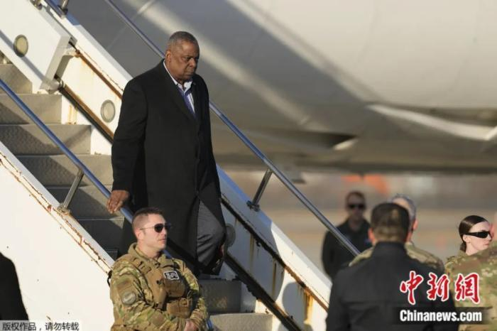
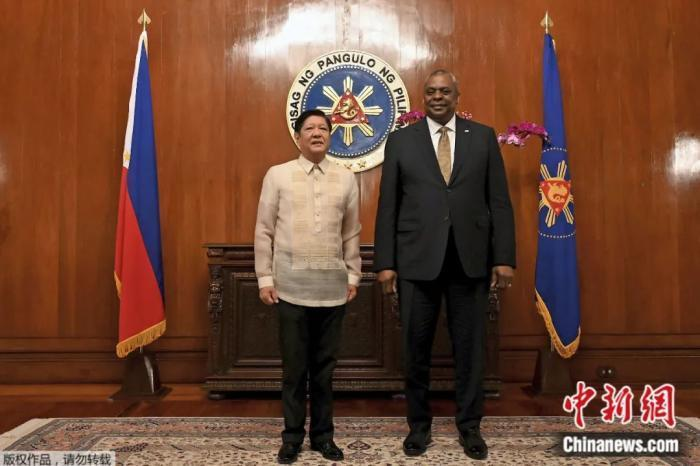
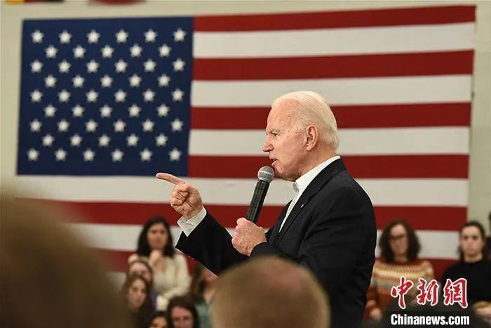
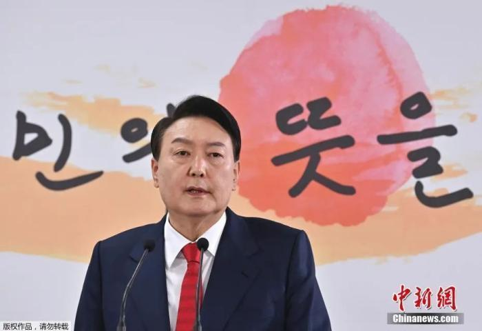
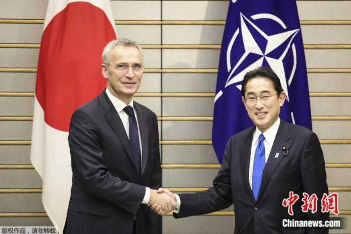
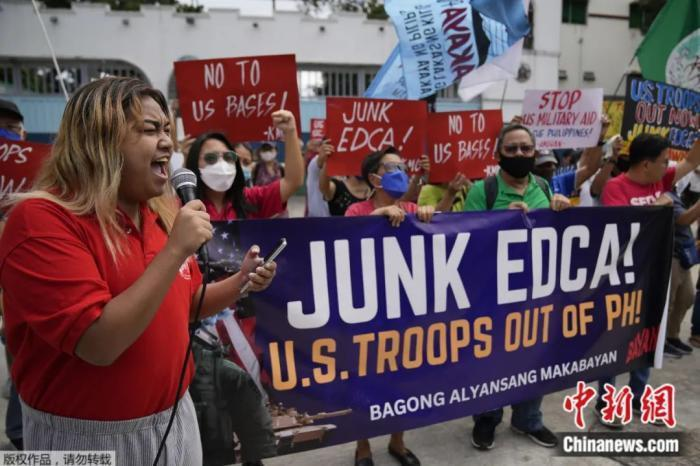

# 他们扎堆访亚太，视线锁定中国，暴露四大意图

中新网北京2月6日电(张乃月)这几天，美国和北约官员扎堆到访亚太地区。先是北约秘书长斯托尔滕贝格访问韩日，接着是美国国防部长奥斯汀飞抵韩国和菲律宾。

他们为何会选在此时机访问亚太？将给周边地区带来何种影响？

中新网邀请 **中国国际问题研究院美国所所长滕建群、中国社科院美国研究所研究员刘卫东、吉林大学匡亚明学者英才教授王生**
，对美国和北约官员亚洲行及亚太地区安全局势，展开深入解读。

**乘“末日飞机” 美防长亚洲行凸显四大意图**

当地时间1月30日下午，一架号称“末日飞机”的“E-4B”空中指挥机，抵达韩国京畿道平泽市的乌山空军基地。驻韩美军司令保罗·拉卡梅拉等人，已在现场等候接机。

来人正是美国国防部长劳埃德·奥斯汀。

_当地时间2023年1月30日，美国国防部长奥斯汀抵达韩国平泽乌山空军基地后，走下飞机楼梯。_

奥斯汀此次访韩，先后会见韩国国防部长官李钟燮和韩国总统尹锡悦，讨论了一连串“重要事项”：

·扩大2023年美韩联合军事演习

·加强美韩同盟

·争取尽早举行美日韩安全会议，加强三边合作

·强调美对韩“延伸威慑”承诺

·宣称“加强遏制朝鲜核导威胁的力量”

_当地时间2023年2月2日，美国国防部长奥斯汀(右)在菲律宾马尼拉马拉坎南宫与菲律宾总统马科斯。_

离开韩国后，他马不停蹄赶往菲律宾，会见该国总统马科斯，并宣布美菲达成多项协议：

·扩大两国2014年签署的《加强防务合作协议》范围

·美国军队获准进入菲律宾另外四个军事基地

·重申美菲同盟的坚固与重要性

·保证美国会提供军事支持

不难发现，“同盟”“延伸威慑”“核”几个关键词不仅是奥斯汀对韩频提的，也是对菲强调的。

专家认为，奥斯汀此次亚洲之行凸显以下几层意图：

**其一，美国欲在亚太地区制造事端。**

中国国际问题研究院美国所所长滕建群对中新网记者表示，“末日飞机”是指挥控制美国三位一体核打击力量的指挥飞机，奥斯汀乘坐“末日飞机”而来，本身就蕴含美国在亚太展示核威慑的企图。

“由于自身地缘政治需要，美国想维护在西太平洋地区的霸权地位，必须要不断制造一些噱头、事端。”滕建群说。

此外，在欧洲挑起事端，让美国在安全和经济层面加强了对欧洲的控制。屡试不爽的美国现在又将矛头转向亚洲。

**其二，美国执迷于大国战略竞争体系。**

滕建群表示，美国本届政府上台以后，强调在中国周边拉帮结派，朝鲜半岛和台海局势是其关注重点。

_资料图：美国总统拜登。中新社记者
陈孟统 摄_

除了韩国，菲律宾也是美国要重点争取的国家，美国希望强化与这两国的合作，从而在西太平洋地区形成“围堵中国”的战线。

尤其是，滕建群认为，美国想要强化对菲律宾的军事控制。美国使菲方向美军开放多达四个军事基地，就是为了获取军事支撑，这对美国在南海、台海方向的布局非常重要。

**其三，祭出“延伸威慑”诱饵建立同盟。**

奥斯汀在韩联社发表的署名文章《同盟已做好准备》中特意强调，美国对韩国提供延伸威慑的承诺，“如铁甲一般”。

滕建群认为，延伸威慑的承诺是美国建立同盟的最好诱饵，是美国惯用的套路，美国对北约成员国也是如此。

吉林大学匡亚明学者英才教授王生也指出，虽然美韩不断提到所谓朝鲜“核导威胁”，但却是“项庄舞剑，意在沛公”。加强落实美国延伸威慑执行能力，商讨美方适时向韩调遣战略武器，督促“萨德”系统的重新正常运转等，才是此行(重头)议程。

**其四，搭建防线强化“第一岛链”围堵。**

2023年伊始，韩国总统尹锡悦曾就核问题发表与美国立场背道而驰的言论。中国社科院美国研究所研究员刘卫东分析称，韩国在朝核问题上与美国的立场一向有微妙差异，韩国与朝鲜是邻国，态度不可能像美国一样强硬。奥斯汀此行正是为让韩国放心。

_资料图：韩国总统尹锡悦。_

美韩防长在会面后发表的联合声明中称，将扩大2023年的联合军事演习，加强美韩同盟及韩美日三边合作。这表明，美国试图在地区搭建防线强化所谓“第一岛链”，削弱中国突破岛链的能力。

刘卫东认为，美国今后在安全方面，敌视中国、与中国对抗的色彩会更加明显。

**北约“亚太化” 进入实质部署阶段？**

值得注意的是，奥斯汀亚洲行的时间与北约秘书长斯托尔滕贝格1月29日至2月1日对韩日两国访问时间重合。

与美国“放下暗棋”不同，在韩国，斯托尔滕贝格大谈“中国挑战”，称虽然中国不是北约的“对手”，但中国在北约议程上变得越来越重要。他指出，“我们应该在军控、气变和其他议题上与中国接触”，但“中国对我们的价值观、利益和安全构成了挑战”。

_当地时间2023年1月31日，北约秘书长斯托尔滕贝格(左)在东京与日本首相岸田文雄握手。_

王生指出，北约秘书长访问亚洲是“推进北约亚太化的一个步骤”。韩国与日本是绝佳的“桥头堡”，若能彻底将其纳入麾下，美军在亚太地区的行动将拥有足够的支撑。

2022年6月，北约首次邀请韩日参加其峰会，并先后把两国列为北约网络防御中心的正式成员，北约想要“亚太化”的目标十分明确。

刘卫东认为，北约秘书长访问亚洲，本身是在说明北约的亚太化开始进入实质性的部署阶段。

他表示，以前主要是美日韩，但现在美国的北约盟友英国、法国、德国，以及一些像波兰这样的中等国家，也开始越来越多地关注亚太地区的安全问题，“这一方面是由于美国的引导，一方面由于(这些国家)对中国的一些误解。”

刘卫东指出，亚太地区本身的安全局势包括南海地区局势比较复杂，中韩与日本之间也存在历史和领土问题争议。在这样的环境下，如果其他域外力量介入，会使局势更加复杂，对亚太地区安全以及经济发展的和平环境都会带来负面影响。

**“毒药而非良方” 多国发声拒绝美国北约**

面对美国与北约的举动，韩国民间团体在首尔举行抗议集会，呼吁废除“核保护伞”等美国的“延伸威慑”政策。

_当地时间2023年1月31日，韩国首尔，抗议者在国防部外的集会上举着“停止美韩联合军事演习”的标语。_

《韩民族日报》在评论中指出，所谓“核共享”，共享的绝不是核武器所有或使用权，而是“核武器带来的政治负担和作战危险”。北约带来的“核诱饵”对追求外部环境安全稳定的韩国而言，绝对“是毒药而非良方”。

在菲律宾，不少民众走上首都马尼拉街头，抗议美国防长奥斯汀访问该国，反对美国的军事存在，呼吁将美军逐出菲律宾。他们强调，菲不需要额外部署美军和设施。

_当地时间2023年2月2日，菲律宾马尼拉，示威者高喊口号，抗议美国国防部长奥斯汀的访问。_

朝中社也发表评论文章，质疑斯托尔滕贝格此行是否意在“煽动成立‘亚洲版北约’”。文章称，北约把乌克兰变为“代理战场”后，斯托尔滕贝格从相隔数万里的欧洲来到不属于北约作战区域的亚太地区，“这本身就令人担忧”。

面对北约追随美国渲染“中国威胁”，加快亚太转型步伐的做法，中国外交部指出，北约一方面声称自己是区域性、防御性联盟的定位没变化，一方面不断突破传统的防区和领域，不断加强同亚太国家的军事安全联系，渲染“中国威胁”，有关动向应当引起地区国家的高度警惕。

中国外交部同时强调，亚太不是地缘争夺的战场，不欢迎冷战思维、阵营对抗。（完）

