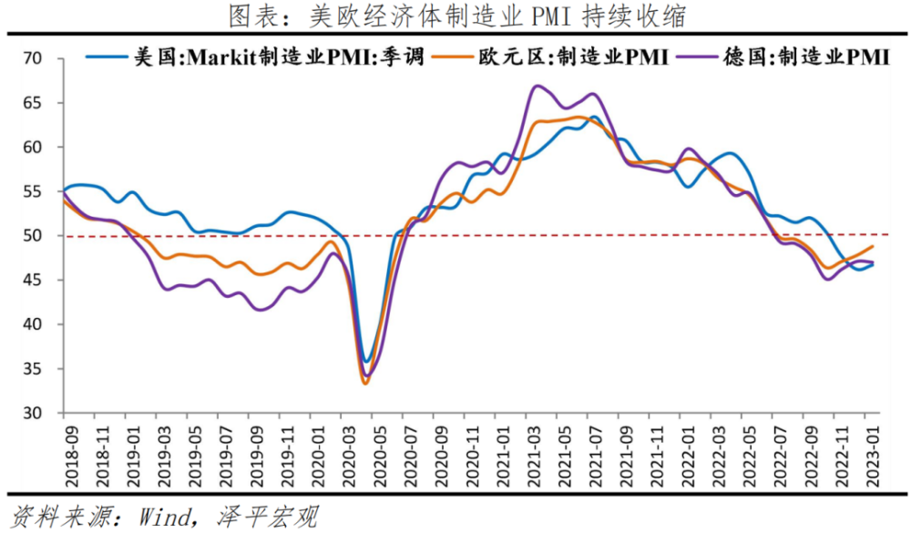

# 任泽平：否极泰来，“全力拼经济”成为各界共识

文：任泽平团队

1月制造业PMI为50.1%，前值47.0%；非制造业PMI为54.4%，前值41.6%。

**一、否极泰来，“全力拼经济”成为各界共识**

**宏观经济和各行业否极泰来，困境反转，市场主体对上半年经济形势可以适当乐观些，同时机遇与挑战并存，不可盲目乐观，当务之急是把发展放在首要任务，全力拼经济。**

**政策全力拼经济，各省市奋战开门红。1月28日国常会强调，“推动经济运行在年初稳步回升”、“乘势推动消费加快恢复成为经济主拉动力”、“坚定不移扩大对外开放、促进外贸外资保稳提质”。近期，上海召开2023年全市优化营商环境建设大会、广东省召开全省高质量发展大会，江苏、山东、浙江、重庆、江西等多省份部署新一年经济工作重点，确保一季度经济加快回升。**

**六大否极泰来、困境反转信号显现：**

**一是经济活动困境反转，** 消费温和复苏，服务消费反弹快于商品消费，必需品、家居类商品、旅游娱乐消费成为亮点；但也受制于居民收入和就业。

**二是房地产困境反转，** 政策拐点出现，重回支柱行业地位，保交楼、救三好生、放松限购，但大开发时代落幕，区域分化明显，不可能重回普涨大涨时代。

**三是平台经济困境反转，** 完成整改再出发、开绿灯，在创新和就业中大显身手，但信心有待提振。

**四是民营经济困境反转，** 中央要求坚持“两个毫不动摇”，提振市场主体信心，但实质性措施有待落地，深层次认识问题有待解决。

**五是人民币升值困境反转，**
美国通胀和经济放缓，美联储加息放缓，美元走弱，人民币走强，资金回流A股和港股，这是重大方向性利好，但汇率长期取决于经济增长率和宏观稳定性预期，背后是市场化和法治。

**六是政策友好困境反转，** 明确2023年全力拼经济，财政货币房地产政策整体取向放松，审慎出台收紧政策，政策力度决定经济复苏的高度。

**同时，当前经济形势也面临六大挑战：**

**一是警惕地缘政治的风险。**

**二是世界经济正陷入新一轮深度衰退，将明显拖累我国出口。**

**三是提振民营经济和企业家信心需要看到实际政策落地。**

**四是房地产销售仍疲软叠加长周期拐点已至，**
1月前29日，30大中城市商品房成交套数和面积月均同比分别为-42.7%和-43.3%，环比为-34.7%和-36.8%，反映短期居民购房信心和能力还未明显恢复。

**五是消费恢复仍受到就业和居民收入下降的抑制，**
1月制造业和非制造业从业人员指数分别为47.7%和46.7%，仍低于临界点。大、中、小型企业PMI分别为52.3%、48.6%和47.2%，中小型企业仍景气收缩。

**六是地方财政吃紧，在没有较大政策弹药补充的情况下，不宜对2023年的地方投资恢复预期过高。**

**可考虑出台一揽子以新基建、新能源领衔的大规模扩大内需的经济复苏计划：**
上调赤字率、降准降息、发放消费券、发力新基建新能源等；出台实质性措施大力提振民营经济信心，对民营经济实施“法无禁止即可为”的产权保护和法治；尽快取消全国范围内的限购限贷等收紧政策；对内释放以经济建设为中心、对外释放加大市场化开放的重大信号，等等。

**如果把发展放在首要任务，全力拼经济，预计2023年中国经济有望重新引领全球。**

**2022年10月以来看多中国经济和资本市场，提出的“全力拼经济”成为各界共识，先后发布文章《事情正在起变化》《否极泰来》《当务之急是把发展放在首要任务，是该全力拼经济了》《关于放开经济活动的建议》。**

以科学家的精神，建设性的态度，推动社会进步，做有温度、有情怀、有专业的研究，以不负几千年来读书人的士大夫精神。

**二、1月PMI和高频数据显示经济快速恢复，但出口、房地产和市场信心仍需政策持续支持**

**总的来看，1月PMI和高频数据显示经济快速恢复，走出低谷，景气扩张。生产和内需订单回升，线下服务业快速恢复。**

**但对当前形势仍然不宜盲目乐观，需要政策持续发力：出口低迷，外需收缩；房地产销售疲软，居民购房信心和能力尚未恢复；市场主体信心虽有所好转，但观望情绪仍然浓厚。**

具体来看：

**1、生产和内需回升。1月生产指数和新订单指数分别为49.8%和50.9%，较上年12月明显回升5.2和7.0个百分点，重回景气扩张** 。

**2、出口仍然低迷，外需疲软。1月新出口订单指数为46.1%，仍在显著收缩区间。**
1月美国、欧元区制造业PMI分别为46.7%和48.8%。全球贸易下滑，1月韩国前20日出口同比-2.7%，越南出口同比-13.5%。

**3、线下活动加快恢复，消费温和复苏，服务消费反弹快于商品消费，必需品、家居类商品、旅游娱乐消费成为亮点。1月服务业商务活动指数为54.0%，比12月大幅上升14.6个百分点，重回景气扩张。**
其中，零售、住宿、餐饮等行业商务活动指数均高于上月24.0个百分点以上，重返扩张区间。

**1）** 国家税务总局数据显示， **春节假期（1月21日至27日），消费相关行业销售收入同比增长12.2%；**
商品消费和服务消费同比分别增长10%和13.5%。其中，粮油食品等生活必需品、家具、文体用品销售收入同比分别增长31.5%、15.2%和20.9%。

**2）旅游恢复至疫情前八成左右，跨境游、跨省游热度增加。**
文旅部数据显示，春节假期，全国国内旅游出游3.08亿人次，同比增长23.1%，恢复至2019年的88.6%；跨境游方面，携程数据显示，春节期间，境外酒店预定订单同比增长超4倍，跨境机票订单增长4倍以上。

**3）电影票房基本恢复至疫情前。**
猫眼专业版数据显示，春节档票房为67.58亿元，同比增长11.91%，恢复至2019年的114.5%；春节期间观影人次为1.29亿，同比增长13.2%，恢复至2019年的97.7%。

**4）自驾出行恢复加快。**
交通运输部数据显示，春节期间，全国铁路、公路、水路、民航累计发送旅客2.26亿人次，同比增长71.2%，恢复至2019年的53.6%；其中，高速公路小客车流量3.06亿辆次，同比增长33%，恢复至2019年的115.6%。

**3、建筑业维持景气扩张，1月建筑业商务活动指数为56.4%，业务预期为68.2%，主要靠基建，房地产相关投资仍然低迷。**

**三、生产和内需回升，出口仍然低迷**

**1月制造业PMI为50.1%，比上年12月回升3.1个百分点，重回景气扩张。**

**第一，生产和内需回升。生产指数和新订单指数分别为49.8%和50.9%，比上年12月明显回升5.2和7.0个百分点，反映生产活动和需求加快恢复。**
企业库存去化、采购量上升，采购量指数50.4%，比12月上升5.5个百分点；产成品库存指数为47.6%，比12月小幅回升0.6个百分点；上年12月工业企业产成品存货同比9.9%，比11月下滑1.5个百分点。

从行业情况看，农副食品加工、医药、通用设备、铁路船舶航空航天设备等9个行业的生产指数和新订单指数均位于扩张区间，其中医药制造业产需均升至65.0%以上。

**第二，出口仍然低迷，外需疲软。1月新出口订单指数为46.1%，较上月上升1.9个百分点。**
1月美国Markit制造业PMI为46.8%，比上月回升0.6个百分点；欧元区制造业PMI为48.8%，德国制造业PMI为47.0%，连续七个月位于收缩区间。受此影响，全球贸易下滑，1月韩国前20出口同比-2.7%，越南出口同比-13.5%。截至1月27日，中国出口集装箱运价指数、上海出口集装箱运价指数月均环比-11.2%和-7.9%。

**第三，经营预期明显回升，但就业形势仍需政策关注。**
1月生产经营活动指数为55.6%，升至较高景气区间。1月从业人员指数为47.7%，比12月回升2.9个百分点；供应商配送时间指数为47.6%，较上月扩张7.5个百分点。

**第四，高技术制造业、装备制造业、消费品行业和高耗能行业PMI分别为52.5%、50.7%、50.9%和48.6%，较上月提高5.1、4.7、4.0和1.2个百分点。**
其中，高技术制造业、装备制造业、消费品行业新订单指数重回荣枯线上。

**四、原材料价格略回升，出厂价格略下滑**

**1月主要原材料购进价格指数和出厂价格指数分别为52.2%和48.7%，比12月变动0.6和-0.3个百分点。**
出厂价格和原材料价格指数差值升至3.5%，出厂价格仍位于临界点以下，改善下游企业经营状况更多应从刺激需求着手。

**大宗商品价格整体环比略有上升。**
截至1月30日，CRB商品价格指数环比为1.1%；油价环比上升，英国布伦特Dtd、OPEC一揽子原油价格环比分别为2.0%，1.5%；铜、铝价格环比上升，LME铜、LME铝环比分别为7.5%、3.8%；钢价环比上升，HRB400
20mm螺纹钢市场价、Myspic综合钢价指数环比分别为4.6%和3.1%。

**五、企业景气度均有所回升，中小微企业仍需政策支持**

**1月大、中、小型企业PMI分别为52.3%、48.6%和47.2%，比12月回升4.0、2.2和2.5个百分点，且主要经营指标均大幅回升。但中小型企业经营尚处于景气收缩区间，仍需政策支持。**

第一，大型企业生产指数53.1%，较上月变动6.5个百分点，新订单指数55.1%，大幅上升8.7个百分点。新出口订单48.3%，较上月上升1.8个百分点。

第二，中型企业生产指数47.2%，较上月回升3.1个百分点，新订单指数上升5.3个百分点至48.2%。新出口订单指数变动1.1个百分点至42.8%。

第三，小型企业生产指数、新订单指数回暖，为46.2%、45.5%，分别较上月大幅回升5.4和5.7个百分点，继续位于收缩期间。新出口订单指数反弹4.7个百分点至43.3%，但恢复基础不稳固，仍需政策支持。

**调查结果显示，大、中、小型企业中反映劳动力供应不足的比重均低于11.0%，较上月明显下降，就业形势有所缓解但仍然低迷。**

**六、服务业底部回升，建筑业维持高景气**

**1月非制造业商务活动指数为54.4%，触底反弹12.8个百分点。其中，非制造业新订单指数为52.5%，为2022年6月以来首次重回荣枯线上；从业人员为46.7%，收缩明显放缓。从经营预期看，业务活动预期升至64.9%的高景气区间**

**服务业商务活动指数为54.0%，较上月反弹14.6个百分点，创2022年6月以来新高，居民消费活动恢复有所加快。**
具体来看，新订单、业务活动预期分别51.6%、64.3%，分别较上月反弹14.2和12.0个百分点。在调查的21个行业中，铁路运输、航空运输、邮政、货币金融服务、保险等行业商务活动指数位于60.0%以上高位景气区间；同时前期受疫情影响较大的零售、住宿、餐饮等行业商务活动指数均高于上月24.0个百分点以上，重返扩张区间。

**建筑业商务活动指数为56.4%，较上月上升2.0个百分点。**
分行业看，业务预期指数为68.2%，高于上月6.7个百分点，仍在高景气区间。从市场需求和劳动力需求看，建筑业新订单指数和从业人员指数分别为57.4%和53.1%，较上月变动8.6和7.4个百分点，加速扩张。从价格看，建筑业投入品价格指数、销售价格指数分别为55.3%和52.8%。

