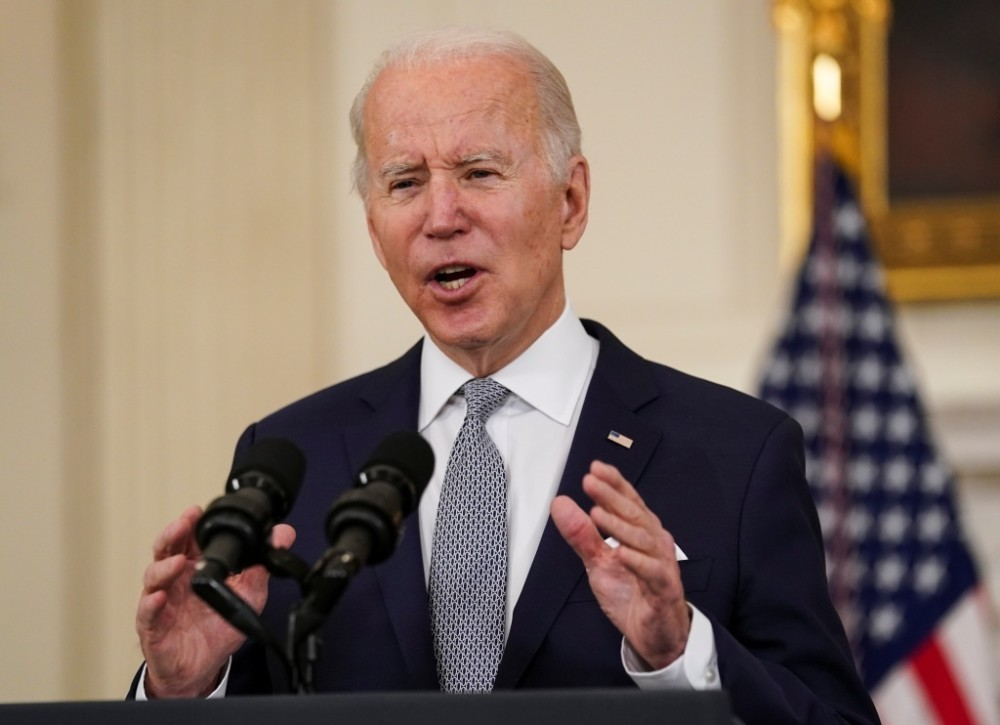

# 又要自夸？拜登国情咨文还未公布就引争议，美媒：恐难获民众认可

【环球时报驻美国特约记者 杨征 环球时报特约记者
王逸】美国总统拜登任内的第二次国情咨文还未公布，就已经引发舆论热议。《华盛顿邮报》4日报道称，拜登的助手强调，他2月7日在国会发布的国情咨文将主要关注政府在过去两年取得的成就，向美国人民解释立法议程将如何改善他们的生活等。有美国媒体认为，此次的国情咨文不过是拜登的“再次自夸”，恐难获得民众认可。

据报道，拜登此次的国情咨文将特别关注经济增长和加强国际同盟的工作。此外，拜登还计划在国情咨文中呼吁对硅谷进行更严格的监管。据知情人士透露，拜登的演讲将涉及反垄断执法和对科技行业的规制，以及加强隐私保护的必要性。

“拜登看到的是经济繁荣，而共和党看到的是阴霾。”美联社4日文章以此为题称，在下周的国情咨文演讲中，拜登看到的是一个未来充满光芒的国家。但共和党人的观点要悲观得多——美国正被沉重的债务所困扰，而拜登在很大程度上要为通货膨胀负责。美国《国会山报》5日称，在过去的一年里，拜登一直在吹嘘“他的经济政策正在奏效”，美国人可能会在国情咨文中听到更多有关这方面的信息。报道讽刺称，拜登要么有严重的记忆问题，要么就是在过去几年的经济趋势上撒谎。拜登最大的谎言是通胀在他上任时“已经到来”。事实是，拜登上任时，通货膨胀率处于1.4%的低位。到2021年底，这一比例增长近4倍，达到7%，几个月后达到9%。与此同时，拜登在国情咨文中不会提及的是：过度的政府救济导致数百万人不工作，推高了工资和通货膨胀，导致美联储将美国推向衰退；在他的领导下，美国中低收入阶层的实际收入大幅下降；拜登政府持续的支出正在推动联邦债务以及这些债务产生的利息，将达到不可持续和危险的水平。

美媒报道，在拜登发表国情咨文演讲之前，国会大厦周围5日竖起了围栏。据悉，设置围栏是国会警察部门和特勤局推荐的。美国有线电视新闻网5日称，国会警察部门的情报官员警告说，在拜登下周二晚上发表年度讲话之前，暴力威胁级别很高。

