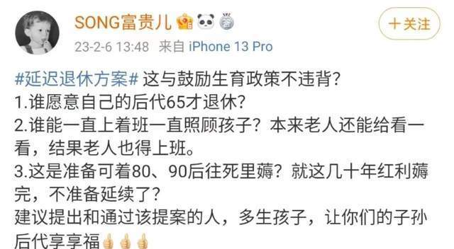
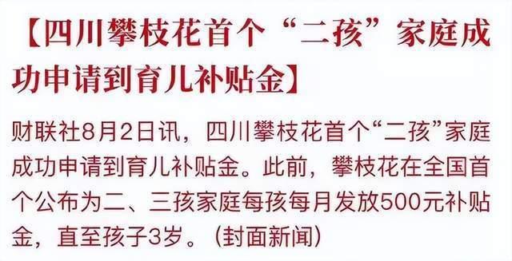
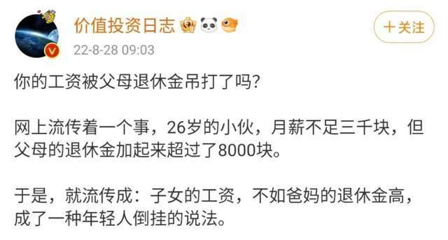

# 延迟退休来了，凭什么只让年轻人“做牺牲”

****

**冰川思想库研究员丨张明扬**

最近，中信证券一份关于“延迟退休”的研报令举国沸反盈天。

研报声称，渐进式延迟退休方案或于2023年公布，并于2025年正式实施，到2055年前后实现65岁男女同龄退休。

这份研报唯一的信息增量在于“2023年”。延迟退休被作为“狼来了”传了好几年，按说公众和市场应该早已有了心理准备，但一旦“终于来了”，哪怕说法未必靠谱，还是一夕举国震惊。

01

延迟退休精准打击的是中年人和年轻人。尤其是二三十岁的年轻人，他们注定是“65岁男女同龄退休”的第一批实践者。

这几天，你只要打开社交媒体，都可以看到年轻人的各种抱怨与口诛笔伐：“80后90后到底得罪谁啊，要被这么整？”“35岁就找不到工作了，要喝30年西北风么？”……

_图/微博用户@SONG富贵儿_

说得都很有道理，所以呢？

在延迟退休这个问题上，尽管“代际”“性别”“地域”，尤其是“编制”这些方面都存在着这样那样的不公，但一个最核心的问题是：养老金正面临着见底的危机。
**有一种存在争议的说法是，中国养老金结余在2035年将耗尽。**

“养老金即将耗尽”是一个硬约束，讨论延迟退休，必须在这个前提下进行才有实际意义。

如何对养老金开源节流，无非就如下五个主要选项：

a、全面降低养老金现行发放水平，多拿多降，少拿少降

b、鼓励生育，增多未来养老金的缴纳人口

c、公共财政和国企利润加大向养老金输血

d、大幅通胀

e、延迟退休

选项a，你觉得有现实操作性么，多拿多降只有理论探讨价值，多拿的人是规则制定者，而少拿的人也都盼着每年那几个点的增幅。

选项b，你愿意生么，都愿意生那还讨论个啥？

选项c，财政也不富裕啊，谁救谁啊，而国企那点利润我看你还是别当真了。

选项d，没办法的时候当然也只有这么干，但这个可比延迟退休引发的民怨就更大了。

**看起来，也就是“延迟退休”最有可操作性了。**

不然呢？年轻就是你的软肋啊。

02

延迟退休势所难免，但也会引发很多事与愿违的“次生损害”。

延迟退休的一大背景是：没人生娃了。

从某种冰冷的经济理性逻辑出发：既然年轻人不愿意生娃，那就延迟退休呗。年轻人的自由选择在于： **你可以在两杯“毒药”中，自由地选择一杯。**

但对于社会和政府而言，同样存在一个冰冷的逻辑：延迟退休很可能进一步下压生育率。甚至逐渐形成某种负面循环：生育率越低，退休越晚；退休越晚，生育率更低……

就中国现实语境而言，这一点都没有夸张。

_图/微博用户@有限次重复博弈_

举个例子。按照现行政策，女性是55岁退休，在中国普遍双职工的状况下，55岁退休的奶奶和外婆实际上是年轻人生娃的最强有力保障，当然，60岁的退休的爷爷和外公虽然大多“废柴”，但多少也能帮点忙。

如果男女65岁同龄退休，特别是潜在的奶奶和外婆迟退休了整整十年，那谁给想生娃的年轻人带娃？就说65岁退休了，这多上十年班带来的体力衰减，还带得动娃么；当然，她们仍然可以提前退休，但在尚拿不到退休金的情况下，在经济上如何帮助儿女分担育儿压力？

**这对已经走低的生育率而言，是某种意义上的毁灭性打击吧？**

当然，有人会说，反正年轻人无论如何也不想生娃了，何必操心这事？

但总有些人还想生娃，延迟退休对这批“响应国家鼓励生育政策”的人而言，不是一种真正的劝退么？给人家一月500元的生育补助金，然后让本可以带娃的爹妈继续上班，这种鼓励生育你觉得可笑么？

_图/网络_

对国外而言，因为老人参与带娃的比率远没有中国高，所以没有成为一个社会问题，
**但在中国的语境下，这件事对生育率有多大冲击力，不需要专家帮你想也可以想明白吧。**

除此之外，延迟退休，还有可能进一步降低年轻人的“未来经济展望”，这对生育率而言同样是负面的。

更不公平的是那些已经生娃或刚刚生娃的年轻人。人家也生了，该尽的“所谓社会责任”也尽了，最后，不也还是要延迟退休。

03

延迟退休是一个难以逆转的大趋势，但为了减轻民怨，为了社会公平，一些配套的措施也应该跟上。

比如刚才说的“老人带娃”，不能假装这个问题不存在。只要正视了，自然就可以有办法。

是否要对有第三辈的老人进行一些诸如提前退休的特别“优待”，这在中国当下整体“反感生育”的社会舆论中，可能比较敏感，可能会引发“不公平”的争议，但该正视的该讨论的总不能回避。

不过， **就延迟退休而言，我觉得更重要的问题是“全民共担”。**

所谓“全民共担”，第一当然是代际。延迟退休的代价不能仅仅由年轻人承担，而应该由各个年龄层的共担。

前一段，社交媒体上曾有一个热搜：年轻人工资不如退休金高。这种说法固然有偏颇之处，我等会还会谈到，但这背后的社会现实是，在延迟退休对年轻人造成极大心理压力的同时，中国的养老金却还在持续上涨。

_图/微博用户@价值投资日志_

既然养老金不够用了，中年人年轻人必须以延迟退休来填补缺口，那么，至少作为一个姿态，国内的养老金上涨也应当进入“冻结”状态。等延迟退休尘埃落定了，再经过广泛的社会讨论，看养老金何时恢复上涨。

毕竟，如果养老金停止上涨，也可以缓解“延迟退休”的经济压力， **至少让延迟退休的增长曲线更平缓点。**

所谓“全民共担”，第二是“编制”。“年轻人工资不如退休金高”的讨论，更真切的对象其实是“体制内退休金”，也就是充满争议的养老金双轨制。

从某种程度上，我们应当尊重既成事实。相比所谓的降低，更妥善的办法是，长期冻结体制内养老金的上涨：一方面降低双轨制的民怨，为延迟退休争取舆论空间；一方面也可以降低养老金的支付压力，这也是全国的大局。

**事实上，体制内的同志们也无需过多担心。**
从长远而言，养老金还是应该“多缴多拿”，体制内的收入相对高，缴纳的养老保险也相对多，那么未来拿到的养老金当然也应该更高。

问题的核心是，这种以“多缴少缴”而不是“体制内外”的养老金发放标准，更符合市场化，更公平，更能激发养老金参保的热情。

所谓“全民共担”，第三是“政府—社会”。

长久以来，中国的公共财政高度倾斜于“养人”和“基建”，忽视了福利支出。

前不久，殷剑峰先生在《居民消费率为何这么低？》一文中指出：

在国民收入的部门分配中，政府部门占有了过高比重的收入。

在2012～2020年间，中国福利支出占财政支出的比重只有32%，在15个国家中排名倒数第一……低于发展水平相近的金砖国家、尤其是发展水平比中国差很多的印度，就实在是不好意思了。

也就是说，对于养老金不足的危机，在中年人和年轻人以“延迟退休”作出牺牲的同时，拿退休金的老人、体制内退休人员和政府这三大主体也应该站出来“共赴危机”“共襄盛举”。

这不仅会在公平层面上缓解年轻人的怨言，也会在事实层面上更大力度的减轻养老金的压力。

