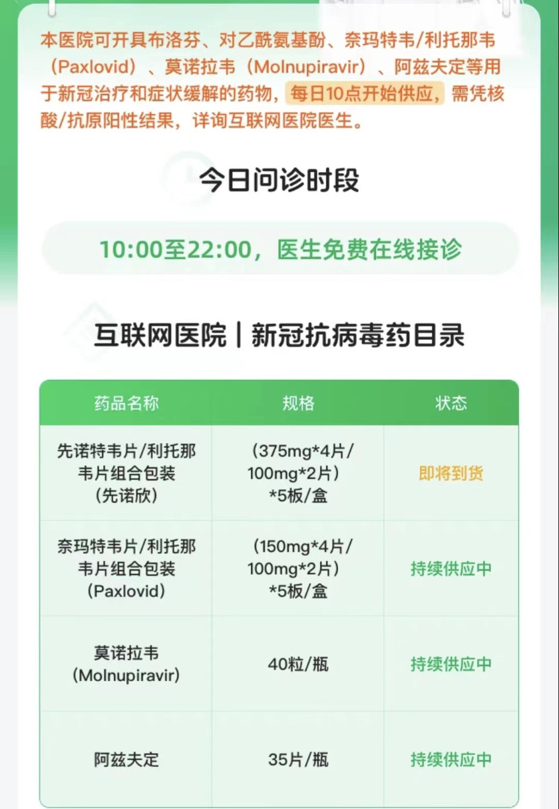

# 新冠药价格“炒作”结束：线上不再难买，医院备货待下一波疫情

记者 | 陈杨

编辑 | 谢欣

2月3日，四川省医保局发布公示，君实生物的新冠口服药氢溴酸氘瑞米德韦片（商品名：民得维）的首发定价为795元/盒。

至此，已在国内获批的5款新冠口服药价格已全部确定。除民得维外，辉瑞的Paxlovid、默沙东的莫诺拉韦胶囊、先声药业的先诺特韦片/利托那韦片组合包装（商品名称：先诺欣）挂网价分别为1890元/盒、1500元/瓶、750元/盒。真实生物的阿兹夫定片艾滋病适应证通过年初医保谈判进入国家医保目录，该药用于新冠治疗的价格也由此前的270元/瓶降至175元/瓶。目前，这5款药物均被临时纳入医保支付范围，时间至2023年3月31日。

实际上，去年年末至今，国内新冠口服药审批、上市销售的过程明显提速，此前抗新冠病毒药物供应紧张的情况不断缓解。界面新闻记者多方了解到，目前各大电商平台上的新冠口服药处方已经不再紧张，可以相对容易买到药品。此外，此前“黄牛”曾炒作过辉瑞Paxlovid，也在黑市上出现降价、甩卖的情况，对于新冠口服药的价格炒作基本结束。

不过，对于一些新冠感染者还存在着未满足的临床需求。多位专家也表示，获批药物也仍需更多临床研究，优化应对疫情的“武器库”。

新冠口服药不再难买

一方面，莫诺拉韦、民得维、先诺欣相继一个月先后获批，随后迅速挂网销售。供应方面，春节前，莫诺拉韦已完成两批进口，数量共计100多万盒。民得维和先诺欣获批后也立即投产。君实生物表示，公司争取在1个月内实现发货及落地销售。

此外，1月9日，辉瑞首席执行官Albert
Bourla指出，最近几周，辉瑞向中国供应Paxlovid的数量增至数百万个疗程。国家工信部则在1月18号表示，截至1月17日，阿兹夫定日产量较元旦前提高148%，达到了74.4万瓶。

另一方面，2022年12月国家防疫政策密集调整以来，首轮疫情高峰已经逐渐过去。今年1月25日，中国疾病预防控制中心指出，本轮疫情在2022年12月下旬达到高峰，其后不断下降。至1月下旬，全国整体疫情已降低至较低水平。春节假期，疫情未出现明显反弹，在整个流行过程中，未发现新的变异株，本轮疫情已近尾声。

供应不断增加，需求逐渐减少，这给终端医疗机构和患者最大的感受便是“药好开、好买了”。

此前，Paxlovid等药在北京、上海、广州多地下沉至社区医院等一线医疗机构。2月3日，界面新闻记者以家属身份致电北京、上海两地的多家社区医院。其均表示，目前开Paxlovid的患者非常少，“几乎没有人（用）”。上海市外滩街道社区卫生服务中心工作人员告诉记者：“现在阳的人很少了，一个礼拜5盒都开不出去。”

各家社区医院均表示新冠口服药备货充足，不用担心断货或买不到。不过，购药条件并未放开，仍需要满足65岁以上等要求，这实际高于Paxlovid药品说明书的要求。也有工作人员向记者表示，年龄不是绝对限制，但优先向本街道的签约病人和居民供药。

除了作为前哨的社区医院，大三甲等上级医院的情况也是类似。2月3日，上海交通大学医学院附属瑞金医院感染科主任谢青向界面新闻表示，此前，院内抗新冠病毒药物供应紧张，瑞金医院分配到的药物也比较有限。抗新冠病毒药物优先满足新冠门诊、急诊和抢救室内的需求，因为它们是患者进入医院的第一道关口。

谢青表示：“不过后面明显感觉药物供应跟上了、够用了，病房中也可以开到药。”以默沙东的莫诺拉韦为例，其1月13日第一批发货后，药品很快在瑞金医院到位，春节前已开出处方。目前，院内抗新冠病毒药物储备比较充足。

同日，安徽省第二人民医院药学部主任、副主任药师蒋磊告诉也界面新闻，去年12月中旬至今年春节前，新冠口服药在其医院的用量不少，高峰时期一天能达到60盒。春节后用量明显降低，一天在8至10盒左右。目前，院内Paxlovid、莫诺拉韦和阿兹夫定的库存充足，门诊和住院患者均可开到，并按照3个月的用量备货。

谢青也表示，对于医院而言，重要的是理顺救治流程、药物储备策略和临床医生对新冠的认识，以此随时应对未来可能到来的新一轮疫情。

此外，Paxlovid、阿兹夫定、莫诺拉韦也可以在京东、美团、淘宝等线上平台凭处方开出。2月6日，记者查询发现，淘宝、支付宝端由阿里健康互联网医院提供服务，问诊时间延长至早10点至晚10点。京东则为全天候诊，开方购药，不再需要如此前晚8点蹲点抢购。阿里健康互联网医院平台还显示，先诺欣也即将到货。不少网友在社交平台上分享自己买到药的经历。

新冠治疗“武器库”仍有优化空间

当下，多款抗新冠病毒口服药获批实则不断丰富着应对新冠疫情的武器库。不过，已经获批的五款药物各自有什么特点，当下的“武器库”又还有哪些优化空间？

已经获批的5款药物中，莫诺拉韦、阿兹夫定和民得维属于RNA依赖的RNA聚合酶（RdRp）抑制剂。Paxlovid和先诺欣则属于3CL蛋白酶抑制剂。后两者均为组合药物，核心成分分别为奈玛特韦片、先诺特韦片，并均配以利托那韦片组合成药。

谢青介绍，奈玛特韦容易被肝脏中的肝药酶（CYP3A）代谢。而利托那韦是一种肝药酶的抑制剂，可抑制奈玛特韦的代谢，从而使其在体内持续保持一定的浓度，发挥药效。但对于降压药等同样通过肝药酶代谢的药物，同时服用利托那韦则会影响前者的药效，即产生药物相互作用
(DDI)。因此，尤其对于老年人等多有基础疾病、正在用药的群体，处方前需要仔细询问病史，关注患者的用药情况、避开禁忌症。

相比之下，莫诺拉韦、阿兹夫定和民得维等小分子单药可以避免DDI的问题。不过，清华大学医院管理研究院发布的《新冠小分子口服药研究进展》报告指出，针对RdRp这一靶点的药物设计优点在于，其中多个药物是由开发其他药物转换而来，安全性相对有保障；缺点则为诱导突变的设计路线，无法完全排除对人基因组的影响。

2月5日，清华大学药学院首任院长、全球健康药物研发中心（GHDDI）主任丁胜教授向界面新闻表示，莫诺拉韦和Paxlovid最早分别在2021年11月、12月获批，已使用患者的数量，临床数据和真实世界数据很多。相比之下，三款国产新冠口服药的临床试验、公开的数据都比较少，一些可能潜在的风险和问题还没有暴露出来。

他提到，药物的标准不是绝对的，而是获益和风险平衡的结果。当非常急缺时，药物的标准确实可以相应放松一些。未来，上述新冠口服药也需要做一些更严谨、更有说服价值的临床试验，进一步确定它们的情况和应用场景。例如目前，民得维（VV116）仍有几个三期临床试验正在进行，包括对于高危人群的预防性治疗研究。

此外，丁胜和谢青都指出，当下的新冠口服药对于一些感染者还存在着未满足的临床需求。

谢青表示，目前，除非危及生命且患者同意，否则新冠口服药不会用于孕妇和儿童。这是因为，新冠药物的三期临床试验大多有临床研究开展中研究人群的局限性，入组的患者通常比较大众，没有全面覆盖到一些特殊人群，除了孕妇、儿童，还包括免疫功能低下、有肿瘤、正在透析的群体。未来可以针对这些群体再展开上市后研究以及扩展性研究，积累更多的循证医学证据，看是否影响孕妇的生育安全、对特殊患者是否需要调整剂量等，优化药物的适用人群。

