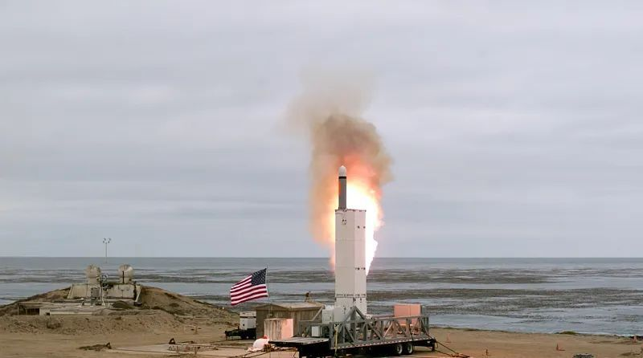

# 日媒披露：美国欲在“第一岛链”部署中导

据日本产经新闻4日报道，日美关系相关人士透露，美国政府已与日方接触，讨论在日本部署中程导弹，强化所谓“第一岛链”的军事力量。

报道指出，部署的导弹可能是美军正在开发的“远程高超音速武器”（LRHW）或“战斧”巡航导弹。再加上日本为增强“反击能力”计划部署的导弹，美日或可联手打造一个“中程导弹网络”。

报道称，部署的地点尚未决定，但有日方官员透露，日本南部的九州岛被列为考虑对象。

_2022年11月17日，日本自卫队和美军在鹿儿岛和九州岛近海举行了“利剑23”联合演习_

长安街知事注意到，白宫1月底还曾宣称“没有在日本部署（中程导弹）的计划”，但日媒此番披露，日美早在数年前就密谋部署中导。

报道称，美方在3到4年前即日本前首相安倍晋三执政末期，就曾与日本自卫队接触，商讨在日本部署中导事宜。

尽管在今年1月的日美首脑会谈中，部署中导的问题没有被列入议程，但日方打算“朝着接受美国部署中导的方向”，认真与美方开启谈判。

据《环球时报》去年7月消息，自2021年以来，日美军方多次密谋勾连，企图诱导、施压岸田政府配合美遏华计划，协助美在日本西南诸岛部署中导（中程弹道导弹）部队，通过加强“第一岛链”建设实现对华“一体化威慑”。

从公开报道和各种动向情况看，美已启动多域特遣部队（MDTF）的陆基中导装配工作，将MDTF优先部署在“第一岛链”，对亚太地区安全造成重大隐患。

军事专家分析认为，日美密谋勾连不利于印太地区的和平与稳定，其本质反映出日本企图联合美国共同对抗中国的险恶用心。日本必将首当其冲，自食恶果。

虽然日美一直未敲定部署中导事宜，但私下里，日本自卫队已实质性推动中导部署的前期准备工作。

2022年1月，日美召开“2+2”会议，并发表联合声明称，美军与日本自卫队将逐步加强对西南诸岛军事设施的共享使用。与美在韩部署“萨德”反导系统不同，部署陆基中导无须就地开展大型基础设施建设，可由MDTF异地装配后，机动、迅速进驻美日军事基地。

以“俄罗斯违约”“中国不受条约约束”为借口，美国于2019年8月正式退出《中导条约》，此后一边加快中程导弹开发和装备美军的速度，一边谋求在亚太地区推动中导部署。

_2019年8月，美国试射一枚常规陆基巡航导弹_

美日若执意在“第一岛链”部署中导，可谓是在中国“家门口”挑衅。

去年7月，国防部新闻发言人吴谦大校曾强调，美国推动在日本部署中导是一个危险的动向，将严重威胁地区国家的安全，严重破坏地区和平稳定。如付诸实施，中方必将予以坚决反制，美日对此不应抱有任何幻想。

2023年开年以来，美高官密集到访亚太，强势推进“印太战略”，并着力加速北约亚太化，推动盟友形成遏制中国的区域乃至全球安全架构。

1月30日，美防长奥斯汀搭乘有“末日飞机”之称的“E-4B”空中指挥机抵达韩国，双方同意扩大联合军演规模，进一步加强美国“延伸威慑能力”。

_1月30日，美防长奥斯汀抵达韩国乌山空军基地_

同一天，北约秘书长斯托尔滕贝格离开韩国抵达日本，大肆渲染“中国挑战”，强化北约与亚洲国家的防务合作。

2月2日，美菲宣布扩大防务协议，增加菲国内4个军事基地供美军使用，并推进现有防务合作协议中5个基地的建设与应用。其意图仍是利用菲律宾战略位置加大“遏华”力度。

历史反复证明，对抗只会带来灾难性后果。美方反复在亚太挑动阵营对抗，最终只会损人害己，而一些地区国家试图引入域外军事力量，为虎作伥，则要警惕沦为美地缘政治图谋的牺牲品。

图源：视觉中国

