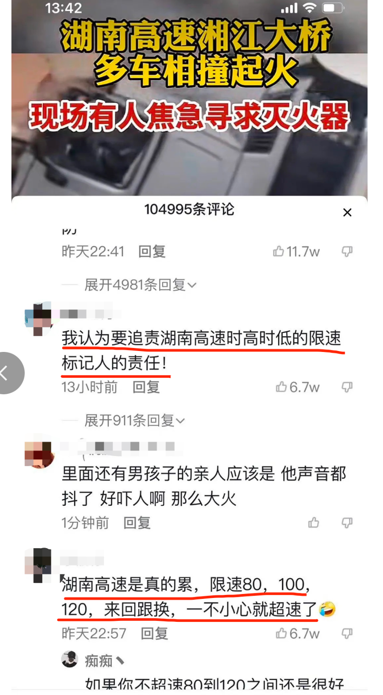
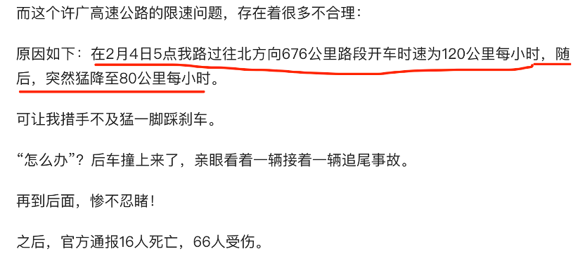

# 湖南许广高速16死事故，真怪高速限速不合理？

2月4日17时许，许广高速南往北方向676公里路段，先后发生多起交通事故，目前已致16死66伤。

事故发生后，有许多网友，将原因指向了“不合理限速”。比如其中两个高赞评论是，“我认为要追责湖南高速时高时低的限速标记人的责任”“湖南高速是真的累，限速80，100，120，来回换，一不小心就超速了”。

一些自媒体还出现了“目击者谈湖南高速16死66伤事故原因：许广高速限速设置非常不合理”这样的标题，暗示事故附近就存在不合理限速。

甚至还有号称事故的“亲历者”，把限速与事故的关系说得绘声绘色——“在2月4日5点我路过往北方向676公里路段开车时速为120公里每小时，随后，突然猛降至80公里每小时。可让我措手不及猛一脚踩刹车。‘怎么办’？后车撞上来了，亲眼看着一辆接着一辆追尾事故。”

目前为止，官方尚未公布事故原因，称正在进行调查。不过，将本次事故的原因直接归咎于“不合理限速”，目前缺乏证据。

较真鉴定局使用了市面两款主流的导航APP，将起点设置在出事地点（许广高速南往北方向676公里路段，望城出口附近）前约47公里处，终点设置在出事地点后3公里处。将这前后50公里约半小时的车程进行了“模拟导航”。两款APP的结果都显示，全程只有两段穿越隧道前后是限速100公里，到出事地点前的20多公里路程，限速都是标准的120公里。因此，称本次事故原因归咎于“许广高速限速时高时低”是没有依据的。

那有没有可能是导航APP，没有采集到路边的限速牌呢？如果有临时修路等措施，软件的确有可能采集不到这种限速牌，但是，目前为止，没有正规媒体报道有人看到这样的限速牌，也没有任何图像证据。说有“限速80”的，都是自媒体，有“博眼球引流量”的可能性，可靠性有很大疑问。

按正规媒体的报道，本次事故的直接原因可能包括：一是有目击者称有个司机错过望城出口，快车道急刹车，后边车和他碰到了，两个人也不挪车，后边几十辆大小车连续追尾（正观新闻）；一个是事故中有追尾了的司机表示，事故前，车辆前方突现“白雾”（海报新闻），有记者事后查询，事故路段曾被公布为“团雾易发路段”。

但事故详细的原因究竟是什么，还需要等待官方的最终调查结论。

那么，“湖南高速限速时高时低”乃至“许广高速限速设置非常不合理”这种说法，是否就没有依据呢？

并非如此。较真鉴定局模拟导航了网络上不少人诟病的许广高速郴州段，发现一段不到20公里的路程先后经历了“限速120——80——100——80——100——120”的过程。或许正是这样的经历印象过于深刻，才让不少人一看到事故，就把原因归咎于湖南高速的不合理限速的问题上，以至于产生了“宁走云贵川，不走湖南高速鬼门关”这样的“江湖传说”。

不过，高速公路存在“不合理限速”的现象，绝非只有湖南才有。2020年，新华社曾做了《限速标准忽高忽低，高速公路难“高速”——山东高速部分路段限速乱象》的报道，随后山东全省高速公路限速管理排查整治工作，排查出3750个问题
。2020年还有广东、河南、湖北、甘肃、山西等地展开了解决“高速忽高忽低”问题的行动。交通运输部也在2020年发布了《公路限速标志设计规范》，详细规定了公路限速路段划分、限速值论证、限速方式选取等内容，该规范于2020年11月1日起施行，力图解决
“断崖式”“隐蔽式”等不合理的限速问题。

需要指出的是，具体到特定路段，究竟是“不合理限速”还是交通安全的必要，还需要具体问题具体分析，不可一概而论。

