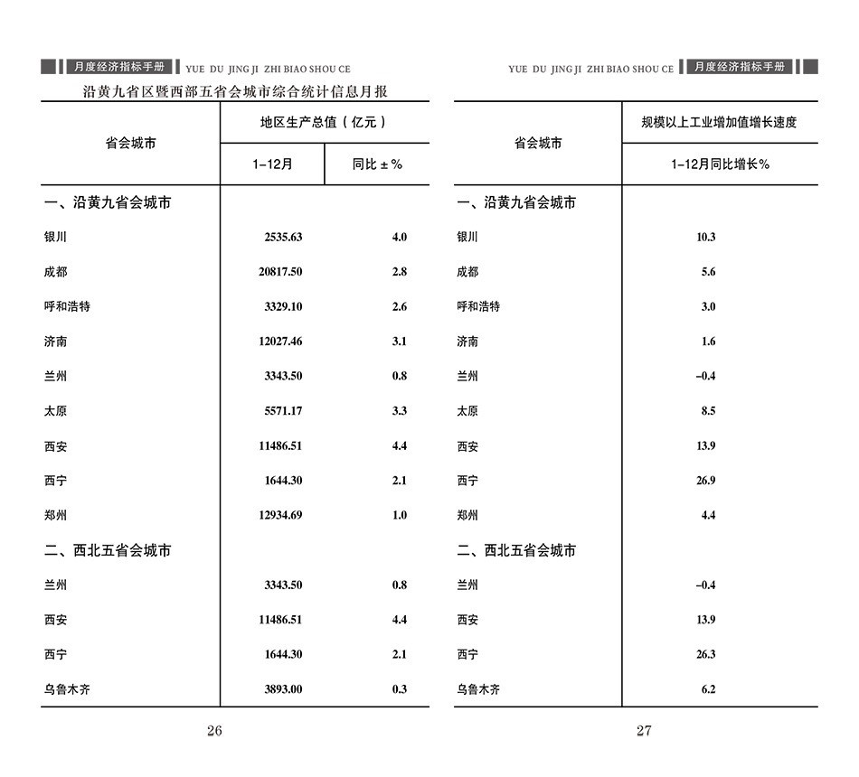
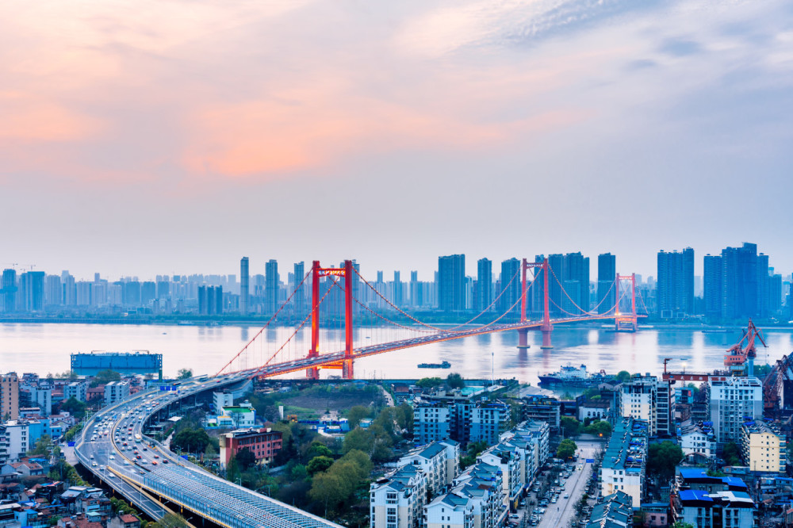
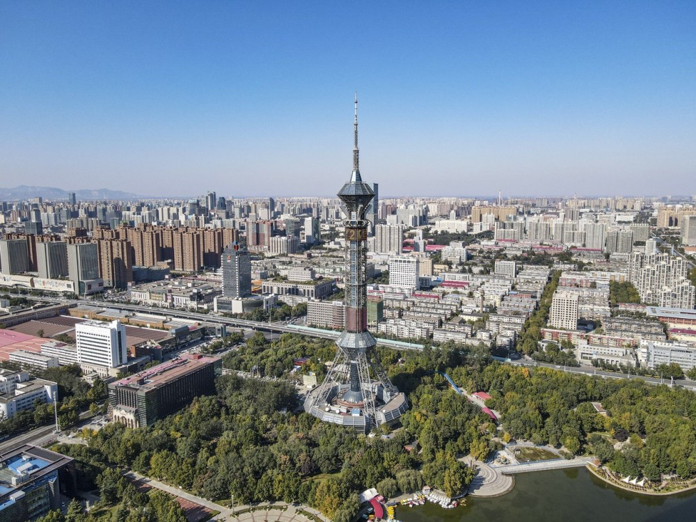
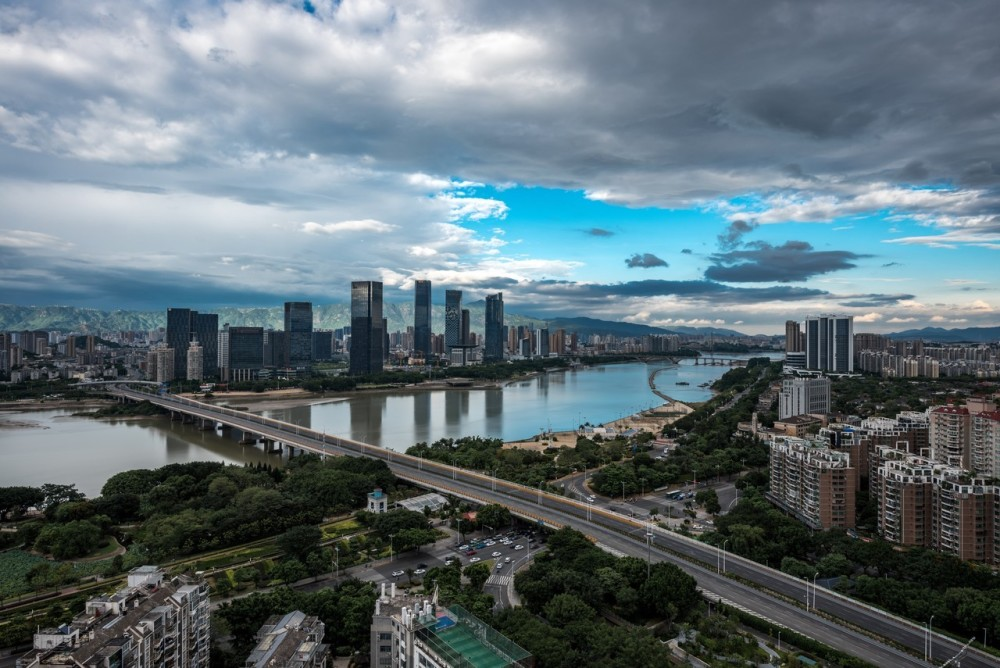

# 省会城市GDP十强出炉：武汉反超杭州挤进三甲，福州跃上第八

本文来源：时代周报 作者：丁远泓

省会城市的经济“成绩单”正陆续交出。

截至2月6日发稿时，27个省会城市中，已有21个公布了2022年地区生产总值（下称“GDP”）。

除此之外，据澎湃新闻报道，银川市统计局曾透露郑州、乌鲁木齐、兰州和西宁的经济数据。

_图源：澎湃新闻截图_

若是算上这些数据，目前已公开去年全年GDP数据的省会城市就达到了25个。如无意外，这意味着省会城市GDP十强已出炉。

这25个城市的GDP均实现正增长，其中12个城市的实际增速跑赢或持平全国3.0%平均增速，石家庄更是以6.4的增速成为各省会城市中唯一增速超5%的城市。

这些省会城市在实现GDP增长的同时，GDP排名与2021年相比，也出现了较多变化。

目前而言，武汉GDP超过杭州，排进省会城市的前三名，与杭州一起冲刺“2万亿”目标；福州以4.4%的增速超过济南和合肥，成为省会城市中唯一实现排名晋升2位的城市；太原则将2021年低于哈尔滨超230亿元的GDP追回，并领先哈尔滨81.07亿元，实现反超。

2022年的这场“考试”，各市究竟交出了怎样的“答卷”？

_2022年省会城市GDP排名（图表来源：时代周报记者
丁远泓 制）_

**武汉与杭州冲刺“2万亿”**

纵观已经出炉的省会城市GDP数值，“万亿俱乐部”成员并无变化，“2万亿俱乐部”成员则多了一个成都。

而排在成都之后的，是GDP数值相差不大的武汉和杭州。

2022年，武汉市GDP为18866.43亿元，杭州市GDP为18753亿元。两个城市的GDP数值均接近于1.9万亿元，是“2万亿俱乐部”的预备役。

事实上，2022年武汉市的经济增速达到4.0%，是省会城市GDP排名的前5中增速最高的城市，并凭借近乎杭州两倍的GDP增量（1149.67亿元）实现年度反超。

根据武汉市统计局的数据，武汉市2022年第二产业增加值虽然不如第三产业，但第二产业的增长达到7.3%，高于第一产业和第三产业。

而武汉市的工业在生产和投资方面都有强劲增长。具体来看，武汉市的规上工业增加值比上年增长5.0%，其中，规上高技术制造业增加值增长16.3%，对全市规上工业增长的贡献率为55.7%。

工业投资增长也达到19.3%，比上年加快9.3个百分点。其中，制造业投资增长19.1%，电气机械和器材制造业、医药制造业、铁路船舶航空航天和其他运输设备制造业等先进制造业投资高速增长，分别增长177.4%、17.3%、38.1%。

_武汉（图源：图虫创意）_

武汉持续发力先进制造业的同时，也计划在2023年继续加大项目投资，并着力于扩大内需。

据武汉市发改委消息，2023年，武汉市列出1154个10亿元以上重大项目清单，总投资达4.5万亿元，年度投资4600亿元以上。同时，2023年武汉市《政府工作报告》指出，武汉将建设22个“一刻钟便民生活圈”，提升6个大型商圈，升级11个特色街区，社会消费品零售总额增长10%。

今年年初，武汉定下6.5%以上的预期增速目标。若能如期实现目标，2023年武汉市的经济总量将迈入“2万亿俱乐部”。

武汉之外，杭州在2022年的GDP同样接近于1.9万亿元。虽然杭州还未定下2023年的预期经济目标，但是如果其能够在今年实现6.7%或以上的增速，杭州市同样会在2023年步入“2万亿俱乐部”。

不过，究竟谁先迈入“2万亿门槛”还很难说。

从2013年至2022年这10年的GDP情况来看，2020年之前，武汉市的经济总量均领先杭州市。2020年杭州市GDP超过武汉市，并在2021年稳住了超越的趋势。2022年，武汉市GDP虽然实现反超，但与杭州市的差距并不大，仅相差110.43亿元。

整体而言，杭州市2022年的GDP增速虽然不及武汉，只有1.5%，但其经济增长较为稳定，战略性新兴产业增加值、高技术产业增加值、数字经济核心制造业增加值分别增长4.2%、6.6%和4.4%，有效推进工业结构优化。

近日，《杭州市落实省扩大有效投资“千项万亿”工程2023年重大项目实施计划》公布，根据计划，2023年杭州计划新开工项目195个、续建430个、建成108个，年度计划投资2000亿元以上。

2023年的最终结果如何，仍留有悬念。

**石家庄增速达6.4%**

在省会城市中，石家庄刷了一波“存在感”。

这座位于河北省的城市，虽然并未排进2022年省会城市GDP前十，但在所有城市中，石家庄是唯一实际增速超过5.0%的城市。

石家庄统计局数据显示，2022年，石家庄市实现生产总值7100.6亿元，按不变价格计算，比上年增长6.4%，远高出全国平均水平的3%。

_石家庄（图源：图虫创意）_

事实上，在2022年每个季度的“考试”中，石家庄一直是各省会城市GDP增速排名中的第一名，三大产业均有高幅度增长。

其中第二产业“成绩”亮眼，全年全市规模以上工业增加值同比增长10.6%。从行业看，石化工业、医药工业、食品工业、钢铁工业和装备制造业分别同比增长11.2%、12.6%、12.3%、5.6%和4.9%。

比第二产业增长更为亮眼的是第三产业。2022年，石家庄市服务业增加值同比增长7.0%，高于GDP增速0.6个百分点。其中，金融业同比增长9.0%，信息传输软件和信息技术服务业增长10.9%，科学研究和技术服务业增长12.6%。

事实上，近年来石家庄的第三产业增加值的比重正稳步提高。2015年，石家庄第三产业超过第二产业，达到45.8%；2022年，石家庄的三次产业增加值比重达到7.9∶32.9∶59.3，“三二一”产业格局持续巩固。

这种增长变化和石家庄所进行的产业结构调整相关。

“一五计划”期间，石家庄建起华北制药、国营棉纺厂等，迅速成长为一座新兴工业城市。随着生产力发展和社会进步，第三产业逐步成为衡量现代经济发展程度的重要标志之一，石家庄也开始大力进行产业结构调整。

目前，石家庄着重发展“4+4”现代产业和“四种类型经济”。而“4+4”现代产业中，就包含新一代信息技术、现代商贸物流、旅游业、金融业、科技服务与文化创意、节能环保6个第三产业。

虽然石家庄在2022年里表现不凡，但目前而言，石家庄在省会城市中的排名并不算高，整体经济体量刚刚超过7000亿元，与同省的唐山相比也有不小差距。

不过，石家庄市市长马宇骏在今年年初表示，2023年，石家庄要进一步延伸产业链条、壮大产业规模、提升产业韧性，为经济总量过万亿提供坚实支撑；要持续工具经济稳步快速增长的良好势头，力争综合经济实力进入全国城市前30名。

**福州名次上升2名**

2022年省会城市GDP排名中，变化最大的，是福州。

根据福州市统计局数据，2022年福州GDP为12308.23亿元，同比增长4.4%。一举超过济南和合肥，在省会城市中排名第8，同时继续坐稳福建省经济总量排名第一的“宝座”。

事实上，近5年的经济数据显示，除了2018年和2022年福州市GDP超过济南和合肥，这三个城市的排名通常为济南、合肥与福州。

其实福州和济南、合肥的GDP数据一直相差不大，“7000亿”、“9000亿”、“万亿”等门槛也是一齐迈过的。3个城市间的最大差额，通常在100亿元左右。

此次福州之所以能够和排名第9的济南拉开近300亿元的差距，城市规划专家孙不熟告诉时代周报记者，产业升级是福州表现突出的主要原因之一。

_福州（图源：图虫创意）_

2021年8月，福州市出台《关于实施产业链链长制的工作方案》，聚焦纺织功能新材料、新型显示、高端精细化工等16条重点产业链，实施“一条产业链、一位市领导、一个工作专班、一套工作方案”的链长制工作机制，在不断优化传统优势产业的同时，还重点发展了一批新兴产业。

事实上，“龙头—链条—集群”的产业发展模式，是福州近年来发展经济的主要模式之一。

具体来说，就是通过扶引万华化学集团、恒申集团等龙头企业，进而推动化工新材料、电子信息、钢铁等16条重点产业链加快成长，有利于形成一批千亿级的产业集群。

根据福州市的经济运行情况，福州龙头产业带动效应明显。目前，福州共有16家百亿级工业企业、92家上市企业，形成了纺织化纤、轻工食品、机械制造、冶金建材、电子信息等五大千亿产业集群，工业生产总值突破万亿元。

2022年，福州的三次产业中，第二产业也成为福州市增长最快的产业，总增加值为4656.90亿元，增长5.2%，是拉动福州市经济增长的主要动力。

2022年表现良好，福州对于2023年也有诸多布局。

福州市市长在主持2023年工作思路座谈会时就提出，2023年，福州要大力实施“项目攻坚增效年”专项行动，深入实施产业链“链长制”，着力突破集成电路、储能、冷轧不锈钢等重点产业，做大做强做优数字经济、海洋经济、绿色经济、文旅经济。

新的一年，各地都在火力全开地拼经济，大部分地方政府也定下了各自的经济增速目标，准备交出一份更为的“经济答卷”。

