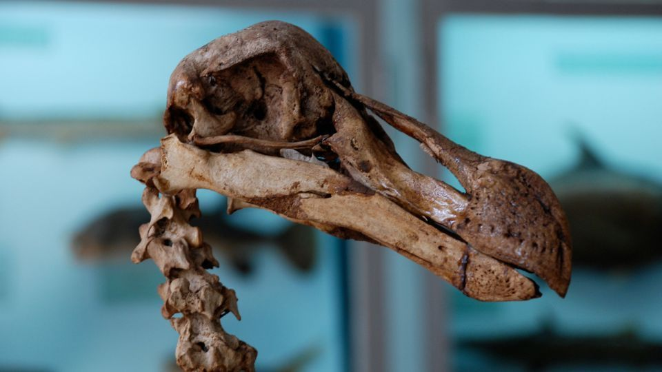

# 美企拟复活灭绝300余年的渡渡鸟，专家质疑：是复活还是制造新物种

1月31日，美国生物技术公司Colossal Biosciences表示，打算复活渡渡鸟。这是Colossal
Biosciences公司计划复活的灭绝物种名单中的第三种，另外两种是长毛猛犸象和塔斯马尼亚虎。

_贝丝·夏皮罗（Beth
Shapiro）、本·拉姆（Ben Lamm）和渡渡鸟。图片来源：Colossal Biosciences_

Colossal Biosciences的联合创始人为基因编辑技术先驱、美国哈佛大学遗传学教授乔治•丘奇（George
Church）和科技企业家本·拉姆（Ben
Lamm）。这是一家致力于“去灭绝”的公司，其最终目标是通过重新引入一些在生态系统中发挥积极作用的关键动植物物种来扭转生态损害。

渡渡鸟是人类活动导致物种灭绝的一个典型例子。渡渡鸟曾经的栖息地是印度洋岛国——毛里求斯共和国（The Republic of
Mauritius），在被人类发现后的150-200年间，它们被大肆捕杀，在17世纪60年代灭绝（一说1662 年左右，一说 1693
年左右）。这是人类历史上第一个被记录下来、因人类活动而绝种的生物，也是除恐龙之外最著名的已灭绝动物之一。

Colossal Biosciences的首席古遗传学家、美国加州大学圣克鲁斯分校（UCSC）的古DNA专家贝丝·夏皮罗（Beth
Shapiro）表示，复活渡渡鸟在理论上是可行的，她和同事能够从保存在一家丹麦博物馆的500岁的渡渡鸟遗骸中恢复其详细的DNA信息。他们计划尝试修改渡渡鸟最近的近亲——绿蓑鸠的基因，把它一步一步地变成渡渡鸟，可能还会在其原生栖息地将它“重新野生化”。

2月2日，复旦大学科技考古研究院青年副教授文少卿在接受澎湃科技采访时表示，“环境变化、物种多样性降低，人类有责任和义务去保护地球上每一个物种。但这件事情的意义不局限于复活一个灭绝的物种，背后更重要的是，这是现在生物学技术发展的一种集中展示。特别是国外的科研机构和公司敢于挑战前沿‘无人区’的行为，我是非常赞赏的。”

**“复活”之路困难重重**

夏皮罗团队计划研究绿蓑鸠和渡渡鸟之间的DNA差异，以了解真正使渡渡鸟成为渡渡鸟的基因是什么。随后，他们可能会尝试编辑绿蓑鸠的细胞，使它们类似于渡渡鸟细胞。夏皮罗表示，有可能将经过调整的细胞放入其他鸟类（如鸽子或鸡）正在发育的卵中，以培育出自然产生渡渡鸟卵的后代。但对于渡渡鸟而言，这个概念还处于早期的理论阶段。“复活渡渡鸟的计划很吸引人，但极具挑战。”文少卿评价道。

_渡渡鸟骨骸。图片来源：Colossal
Biosciences_

据文少卿介绍，复活灭绝动物的想法很早就出现了，其中最著名的是猛犸象的复活计划。2011年，日本近畿大学入谷明教授等人组成的科研团队宣布启动猛犸象复活计划，借助克隆技术，用冷冻细胞培育出已灭绝的猛犸象。后来美国哈佛大学（Harvard
University）医学院的乔治•丘奇（George Church）教授率领的一群遗传学家和中国华大基因研究院也都开展了独立研究。

研究人员复活猛犸象的思路分成三步：第一步是在永久冻土层找到猛犸象的毛发或有完整细胞结构的组织，复活猛犸象的细胞。第二步是恢复细胞的全功能性，形成胚胎细胞。第三步是找一个代孕的母体，孕育出猛犸象。“前两步都已经实现了，但到现在，猛犸象还没有复活。”文少卿说，“主要卡在第三步，代孕母体有免疫排斥反应，母体把胚胎当成外来物体‘杀死’了。”

在技术层面，复活渡渡鸟更难。文少卿说，“从目前披露的信息来看，Colossal Biosciences复活渡渡鸟的思路也分为三步，每一步都困难重重。”

从获取渡渡鸟基因组开始，难题就出现了。“和保留在永久冻土层、可以获得完整细胞结构的猛犸象不同，渡渡鸟分布在印度洋的毛里求斯，地理位置决定它的样本基本都是保存在博物馆的骨头，DNA基本完全降解了。”文少卿说，从博物馆获取渡渡鸟基因组，用的是古基因组技术，但能够获取的其实只是部分基因组，很难得到完整的基因组。“但值得注意的一点是，博物馆组学将是未来的一个非常重要的应用场景。”

第二步是找到一个近缘生物。“和渡渡鸟关系最近的动物是孤鸠，也已经灭绝了。因此，Colossal
Biosciences使用了绿蓑鸠，但这个动物在遗传进化上距离渡渡鸟有点远，二者基因差异较大，因此改造难度也较大。”文少卿介绍。在此情况下，Colossal
Biosciences“复活”渡渡鸟的路径是使用低通量的基因编辑技术，即在一些关键的进化位点上进行基因编辑。而真正的“复活”所需要的是高通量的基因编辑技术，即同时对成千上万个遗传位点进行基因编辑，“但这是非常难的。”

第三步是找到一个代孕母体。猛犸象是前车之鉴，“猛犸象和它最近的近亲亚洲象，基因组差异只有4.7%，但代孕也没有成功。”文少卿分析，“所以可能需要‘人造子宫’技术来加持，即通过仿生材料制造一个类似的子宫，提取营养物质，让它去代孕生产。但这项技术目前也处在非常早期的阶段。”值得一提的是，“人造子宫”也是Colossal
Biosciences的研究项目之一。

“目前来看，这更像是一个改造绿蓑鸠的计划，而不是真正复活渡渡鸟的计划。”文少卿说，“之后他们需要不停地改造，看制造出的新物种和渡渡鸟是否相像，这样一步一步筛选出来。”

Colossal Biosciences的外聘顾问、英国爱丁堡罗斯林研究所（The Roslin Institute，The University of
Edinburgh）的鸟类生物学家迈克·麦克格鲁（Mike
McGrew）表示，“怎么样才算完成了基因编辑？是编辑100个基因，还是1000个？这是一个大问题。”

**比“复活”更大的价值**

夏皮罗在接受媒体采访时表示，复活渡渡鸟实际上类似于一个噱头，“我们需要开发一些工具和其他方法，来保护今天的物种免于灭绝。如果我们能让人们兴奋起来，我们就得吸引注意力。渡渡鸟就很合适，每个人都听说过。”

Colossal Biosciences并没有提供一个“复活”渡渡鸟的确定时间表。Colossal
Biosciences创始人兼首席执行官拉姆预测，猛犸象可能在2029年之前出现，而渡渡鸟可能更早，也可能更晚，这取决于科学因素。

“如果这件事情成功了，技术手段和分析手段都将会迈出很大的跨越。所以更多的人看重的是‘复活’渡渡鸟背后，人类在基因计划、生物技术，以及医学等方面的更大的想象空间。”文少卿告诉澎湃科技。

拉姆表示，复活渡渡鸟这项计划并不会直接盈利，但公司为此开发的基因工具和设备可能还有其它用途，例如用于人类保健等。

近日，Colossal
Biosciences宣布完成了1.5亿美元的B轮融资，其总融资额已达到2.25亿美元。公司表示，本轮获得的其中一些资金将用于围绕鸟类基因组学开展新工作。此次融资也是在Colossal
Biosciences的第一个技术分拆公司Form Bio完成3000万美元A轮融资后进行的，Form Bio专注于开发计算生命科学平台。目前，Form
Bio正在销售其管理实验室结果的软件。

Colossal Biosciences的投资者包括亿万富翁托马斯·图尔（Thomas
Tull），美国中央情报局的风险投资部门，以及著名的生物技术风险投资家罗伯特·尼尔森（Robert Nelsen）。

对于Colossal
Biosciences的“复活”渡渡鸟的计划，文少卿表示感慨，“这件事情的挑战不容忽视，但尝试是值得支持的。现在国内使用的大量的技术都是别人成熟的技术，我们其实没有做太多真正创新的探索。我们对于科研的态度似乎过于理智了，不能老是脚踏实地，有时候也要仰望星空。要允许一部分人去探索，即便失败，摸索总归是好的，因为真正的创新总是根植于实践的。”

**背后的伦理难题**

技术发展避不开伦理思考。美国斯坦福大学（Stanford University）的基因测序专家詹妮弗·李·普克·坦（Jennifer Li Pook
Than）说，“它不会是一只真正的渡渡鸟，它会是一个新物种。”即使Colossal
Biosciences能够造出“渡渡鸟”，供它繁衍生息的地点也是一个问题。“它需要一个野外环境，如果没有一个合适的场所，这在道德上意味着什么？”坦质疑道。

2020年，一项发表于《自然保护学报》（Journal for Nature
Conservation）的研究提出，现代生态系统中的动物可能对突然与它们从未遇到过的历史物种一起生活反应不佳，从而导致不可预见的生态后果。

拉姆表示，Colossal
Biosciences将在重新引入物种时保持谨慎，可能首先在大型围栏内研究它们，同时解决当地生态系统的缺陷。“创造一个渡渡鸟可以茁壮成长的环境将需要环境恢复，特别关注清除导致渡渡鸟灭绝的入侵物种。这种环境恢复将对其他特有植物和动物产生连锁效益。”

文少卿表示，还会出现非常多的伦理问题，“比如，拿到样本的过程就存在伦理问题，具有营利性质的公司去博物馆拿样本，博物馆凭什么授权？”

假设Colossal
Biosciences“复活”渡渡鸟成功，出现的将是一个“半成品”。“因为不清楚基因编辑的具体路径，需要靠尝试的方式来一步一步地进行编辑，可能会迭代很多代。这些迭代过程中的‘半成品’，一生可能会饱受疾病困扰，承受很大的痛苦。”文少卿对澎湃科技记者说。

如果复活灭绝动物的想法成真，将面临的共同冲击是，带来的影响可能与保护濒危物种的初衷背道而驰。“当人们发现灭绝的动物可以被复活，会不会反而减少了人类关注和保护现存动物的想法？因为可以利用技术来复活灭绝的动物，有的人可能就觉得没有必要再保护现存的物种了。”文少卿说。

