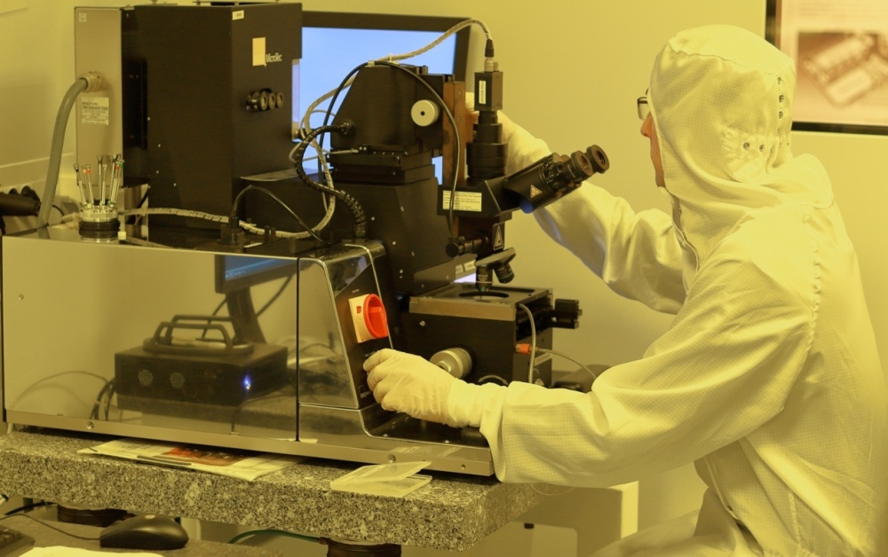
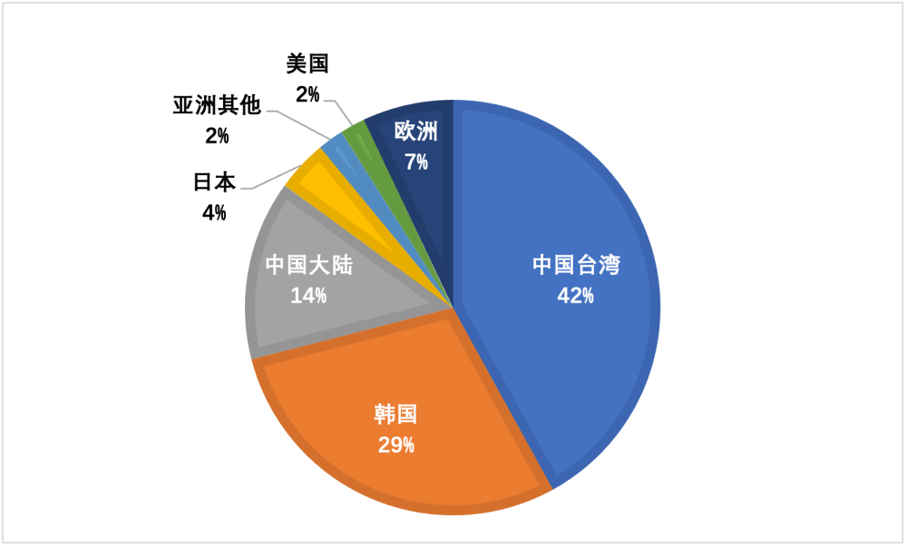
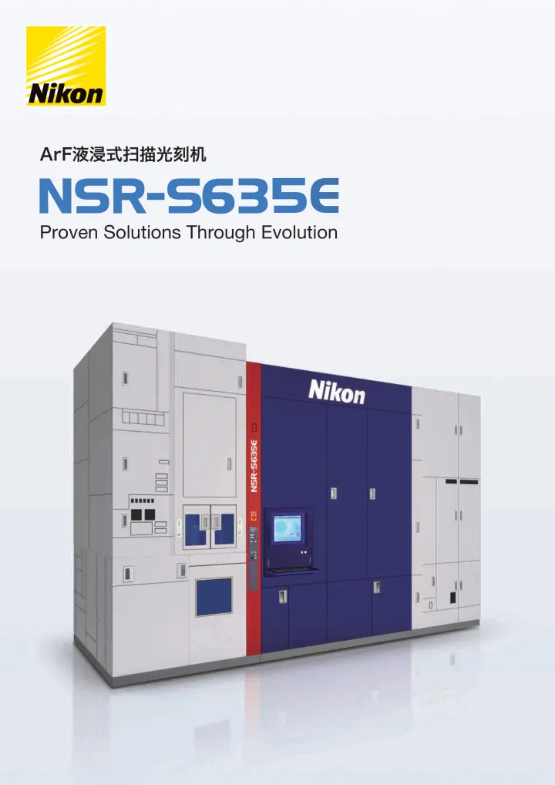
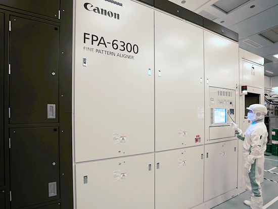

# 美日荷联合“限芯”，中国光刻机路在何方？

_“芯事重重”策划是腾讯科技《新产研》栏目重点研究的方向之一，本期聚焦美日荷三方达成出口限制协议以及国产光刻机现状分析解读。_

划重点：

  * _1_ 与过去「拖累」本国半导体厂商业绩不同，美国这一次将战火蔓延至更广、更深的地带，一边在半导体产业链上游给中国造芯设障，一边在关键的半导体设备光刻机发难。
  * _2_ 美日荷会谈及其协议的落实，一方面断了中国厂商通过成熟芯片制程的DUV光刻机自主供芯的「去A化」道路，又可以在不损害本国厂商的前提下拉日荷两国入群，把参与中国限芯的队伍从单边扩大到多边。
  * _3_ 虽然政府达成协议，但商业公司仍然要挣钱。中国大陆作为ASML的第三大客户来源，这个光刻机巨头或许也很「头疼」如何弥补出口禁令导致的损失。
  * _4_ 光刻机之外，芯片制造产业链还有很多「硬骨头」，包括薄膜沉积、刻蚀、量测、离子注入等。从实验室原型到晶圆厂量产，仍然我们需要做出日积月累的努力。

流水的半导体大佬，铁打的美国「限芯」行动。

近两周，美媒爆出美国政府考虑让本国所有供应商断供华为。美国甚至将「友商」推向刀尖上。

1月27日，美日荷三国高层在华盛顿进行闭门会谈并达成协议，日荷两国将启动对华出口半导体设备的管制。最引人关注的是，美国将半导体设备顶流——荷兰阿斯麦(ASML)以及日本东京电子、尼康等公司抬上“出口管制措施”名单，限制对华出口光刻机。

事实上，美国对华半导体的限芯行动早已司空见惯。

然而与过去“拖累”本国半导体厂商业绩不同，美国这一次将危机蔓延至更广、更深的地带，一边在半导体产业链上游给中国造芯设障，一边在发难关键的半导体设备——光刻机，将荷兰和日本捆绑在自己的出口管制策略上。

从单边制裁扩大到多边制裁，美国的限芯不断升级。

美国联手日荷出招，意欲何为？

工欲善其事，必先利其器。到了半导体领域，要造「芯」，光刻机是必不可少的关键环节。

盘点全球半导体产业链，美国手握顶尖芯片设计大厂（英伟达、英特尔、高通、苹果等）和设备大厂（应用材料、拉姆研究、KLA科磊等），亚洲集中了多家一流芯片代工厂和材料公司（台积电、三星、东京电子等）。而作为半导体产业链「皇冠上的明珠」，光刻机则主要来自荷兰和日本，其中荷兰的ASML、日本尼康和佳能，是全球光刻机行业的三巨头。

_光刻机三巨头_

从技术上来看，当前主流光刻机技术主要分为两大阵营——EUV与DUV。

光学成像领域里有一个著名的瑞利判据，它表明成像分辨率和光的波长成正比。简单来说，如果想在纳米尺度雕刻芯片，就需要非常小波长的光。为了把晶体管做的越来越小，光刻机里光源的波长就要越小。

从光谱上看，紫色光的波长是可见光里最短的，比它更短的就是各种紫外光，比如深紫外光DUV（Deep Ultraviolet
Lithography），再到现在最先进的极紫外光EUV（Extreme Ultraviolet
Lithography），光的波长从300多纳米、到深紫外光的193纳米、再到极紫外光的13.5纳米。

其中，EUV光刻机可以用于生产制造7nm以下的高端芯片，堪称光刻机的天花板。正因为这一制霸产品，ASML在二十世纪初一举超越了日本老牌电子品牌尼康，从此坐上了全球光刻机龙头的宝座。

时至今日，ASML仍然是世界上唯一一家能够生产EUV的厂商。物以稀为贵，每一年，ASML的EUV一出，台积电、三星、英特尔等晶圆制造厂都排队购买。按照ASML2022
年Q4的财报，ASML 季度净预订量为 63
亿欧元，其中EUV的订单超过一半，高达34亿欧元。2022年全年财报则显示，ASML过去一年实现净销售额212亿欧元，毛利率达50.5%，净利润为56亿欧元。从收入结构来看，光刻机占比70%，达148亿欧元，其中EUV出货54台，预计2023年的净销售额将同比增长25%以上，EUV增至60台左右。

但是这54台EUV光刻机里，没有一台卖给中国大陆。并不是因为每台至少一亿美元的“天价”，而是从2019年开始，美国就禁止ASML将EUV光刻机出口至中国。究其原因，主要在于EUV光刻机包含美国等各国尖端的技术，仅美国零部件占比就高达55%以上。

EUV是高端芯片工艺的刚需，但从全球市场来看，28纳米及以上的成熟工艺仍然是主流。根据TrendForce数据显示，2021年成熟工艺仍然占据全球76%的市场份额，成熟工艺占三大晶圆代工厂（台积电、格罗方德、联电）总产能的76%。去年全球遭遇「缺芯潮」，缺的也大部分是成熟工艺的芯片。特别是新能源汽车、智能家电、物联网设备等电子产品里，采用了大量成熟工艺的芯片。

而成熟工艺这块大蛋糕，都可以使用DUV光刻机进行制造，主要由荷兰的ASML、日本的尼康和佳能承接。

作为光刻机技术的老大，ASML生产的DUV光刻机覆盖生产28纳米以上制程的成熟工艺芯片，所占的DUV市场最大。从它的2022年度财报来看，虽然去年全球半导体遭受供求不均+美国出口管制的双重打击，ASML持续强劲增长，全年净销售额为212亿欧元，毛利率高达50.5%。而且，ASML去年底未交付订单创下纪录，高达404亿欧元。按照ASML公布的数据，中国大陆市场为其2022年营收贡献了14%，成为ASML第三大的市场，仅次于中国台湾（42%）、韩国（29%）。

_ASML区域营收比例_

尼康和佳能也在积极抢占光刻机的市场。不过，受限于产能和技术等因素，这两家日本厂商的产品主要集中在DUV领域。事实上，尼康凭借相机时代在光学设备上的积累，曾经是光刻机霸主，一度门庭若市，各大芯片厂商排队等待尼康光刻机出货。但尼康在先进技术的研发上选择了保守路线，坚持干式微影157nm的技术路线，被ASML的浸润式DUV技术弯道超车；EUV更是被ASML远远甩在身后。

不过，尼康虽然错失了开发EUV的良机，却有自主的先进封测光刻技术，这一点连ASML也自叹不如。因此，即使尼康无法掌握EUV的尖端技术以及EUV所需要的美国零部件，但是同样可以通过挖掘新材料和新技术的潜力来打造自己DUV的特色。

当前，尼康的核心竞争力主要来源于最低端的UV（i-line）光刻机以及次高端的DUV光刻机，比如，尼康宣布今年推出全新的NSR-S635E
ArF液浸式扫描光刻机。重点是，这款光刻机不含美国技术，堪称EUV的「丐版平替」，使用DUV光源就能加工7nm以下芯片，每小时制造275片晶圆，在一定程度上能满足中国制造高端芯片的需求，无疑是对中芯国际、华虹半导体等中国芯片制造商伸出了橄榄枝。

_尼康光刻机_

现如今，就连DUV也成了美国的目标。这次美日荷会谈及其协议的落实，一方面断了中国厂商通过成熟芯片制程的DUV光刻机自主供芯的「去A化」道路，又可以在不损害本国厂商的前提下拉日荷两国入群，把参与中国限芯的队伍从单边扩大到多边。

这招一石二鸟，美国玩的挺溜。

ASML、尼康“躺枪”， 「特供」中国或成最大选项？

虽然政府达成协议，但商业公司仍然要挣钱。中国大陆作为ASML的第三大客户来源，这个光刻机巨头或许也很「头疼」如何弥补出口禁令导致的损失。

在这个敏感时刻，ASML也时不时出来安抚市场，咬定2023年营收增加25%的目标不放，以需要数月时间确定谈判细节的理由淡化美日荷协议的影响。

_图片来自Bloomberg_

话虽如此，ASML一直以来非常清醒。早在去年底，ASML首席执行官彼得·温宁克(Peter
Wennink)便表达出对美国限芯嗤之以鼻，甚至暗讽美国双标，不指名道姓地点出美国芯片设计大佬收割25%~30%的中国市场份额。

如果ASML不可避免地无法将现有的高端DUV光刻机卖给中国，温宁克也许还得效仿背后那个精明绕开封锁政策的“绿厂”英伟达。一年前，英伟达A100、H100两款数据中心加速GPU收到限芯禁令之后，巧妙地做出符合美国出口管制规定的新款GPU
A800，作为「特供」产品继续在中国市场销售。

相比之下，日媒对尼康未来的业绩感到更加沮丧。

作为中国人家喻户晓的日本品牌，尼康一直有着顶流照相机IP的光芒，十几年前就已经在长三角洲建厂，然而到了智能手机时代，真正给尼康带来可观现金流的还是DUV光刻机。早在2020年，尼康就准备了要在中国合资开发光刻机的计划。去年，当中芯国际公布500亿人民币的产能扩充计划之后，尼康也展示出了自己在光刻机的布局，计划在2026年将光刻机主力机型的年销量，增至过去三年平均销量的2倍以上。

只可惜，还没有等到零美国技术的浸入式扫描光刻机上线，尼康就被美国架上了出口管制的队伍，有点「有苦说不出」的感觉了。

除了尼康，另外一个人们耳熟能详的日本相机大厂佳能，其实也有自己的光刻机技术。从去年8月份开始，佳能就在扩产DUV光刻机产能，目标清晰 -
直指中国市场。此外，同样为了撇清美国化，佳能正在研制纳米压印光刻（NIL）升级版的光刻机。NIL采用一种最前沿的光刻技术，通过照射新的感光材料来完成一次性转印，理论上同样可以制造7nm以下制程工艺。更重要的是，相比EUV，NIL要便宜很多，而所采用的零部件以及材料都来源于日本厂商（佳能、铠侠以及大日本印刷株式会社）。

_佳能光刻机_

光刻机技术自主：路在何方

面对源源不断的限芯动作，中国半导体已经在做「打硬仗」的准备。

2015年，美国对中国禁售超算芯片，国内半导体就已经嗅到危机。那一年，国家推出了《中国制造2025》规划。根据规划，2020年半导体核心基础零部件、关键基础材料实现40%的自主保障，2025年则要达到70％的目标。据国家统计局的数据显示，2021年我国累计芯片生产量达到了3594.3亿颗，创下了我国产能最高的纪录。平均下来，一天可以生产10亿颗芯片，自给率相当于36%，不断靠近2025年芯片自给率达到70%的目标。

这一次随着美日荷协议传来，国家势必也会加大对半导体设备的投入。据路透社报道，中国拟定拿出1万亿元投入到半导体行业五年的支持计划，通过补贴和税收抵免来支持国内的半导体生产、研究，而且该计划有可能已在今年Q1实施。其中在购买半导体设备方面，中国计划拿出20%的补贴给予半导体制造商。

除了买买买，自主研发或许更加重要。一旦美日荷封锁了中高端DUV的出口，如何根据现有的B、C级光刻机设备制造A级制程工艺芯片也成为国内半导体制造商需要攻克的大关。清华大学魏少军教授去年底表示：能够用14nm、28nm（光刻机）做出7nm的性能，才是真正的高手。国内也有一些顶尖研究机构，在合作研究芯片设计与制造工艺的跨层优化技术。

作为EUV的把持者，ASML肯定不愿意看到这一场景。ASML首席执行官温宁克已经洞悉中国在半导体的力量。“你给中国施加的压力越大，他们就越可能加倍努力打造可以媲美ASML的光刻机。这需要时间，但最终他们会获得成功”。

华尔街日报曾经报道过，当美国在2022年10月升级限芯禁令之时，中国企业只进口了24亿美元价值的半导体设备，创下美国推出禁令2年多以来的最低数据。这意味着，中国半导体设备正在努力摆脱进口的依赖，自主化进程已在提速。

但值得注意的是，除了光刻机之外，芯片制造产业链还有很多「硬骨头」，包括薄膜沉积、刻蚀、量测、离子注入，这些都是我国和国外差距较大的领域。就算实现技术突破，从实验室原型到晶圆厂量产，仍然是个日积月累且艰巨无比的过程。

革命尚未成功，同志仍需努力。

