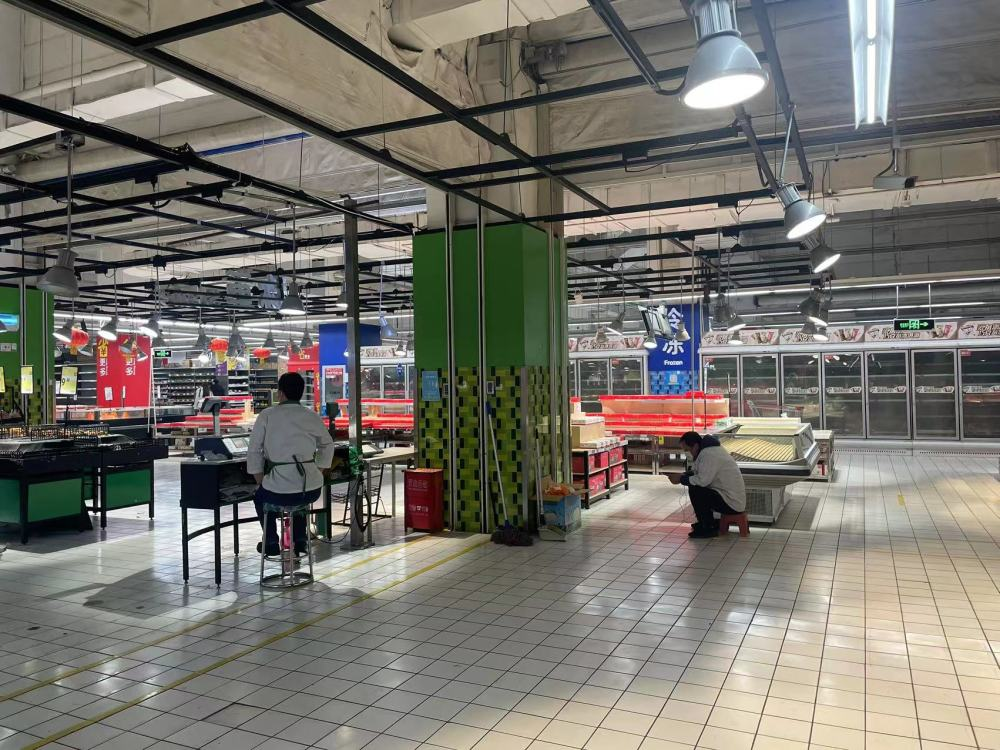

# 门店大面积缺货顾客纷纷退卡 家乐福表示不会退出北京市场

持续一个多月的家乐福购物卡消费受限、缺货等问题并没有缓解。2月5日，新京报记者探访家乐福北京双井店、丰台马家堡店、马连道店、富贵园店发现，门店内大面积商品缺货，多位消费者聚集在服务台咨询退卡问题，同时有黄牛低价收购购物卡。在家乐福丰台马家堡店内，一位正在5折收购购物卡的黄牛告诉新京报记者，店内大部分消费者是为销卡而来，2月5日收了约5万元的购物卡。

新京报记者联系了家乐福丰台马家堡店店长，店长回复称，家乐福正在积极转型和升级，集团和各方面的资源在做协调。此前1月30日家乐福相关负责人曾对新京报记者表示，家乐福将对大卖场进行相关升级，由于此前家乐福对中国市场的反应较慢，错过了大卖场的发展节点。

据了解，1月上旬北京多家家乐福超市出现购物卡消费受限问题，一度引发消费者集中购物并要求退卡问题。除北京之外，上海、大连、合肥等多地的家乐福超市也出现购物卡消费受限等问题，涉及日化、零食、乳品、生鲜等品类。

**多家门店出现大面积缺货**

2月5日，新京报记者走访家乐福朝阳双井店、丰台马家堡店、西城马连道店发现，超市内商品货架出现大面积缺货。三家门店工作人员对“是否还会补货”“超市是否继续经营”等问题均表示“不知道”“不清楚”。

“这个区域曾是二层卖场人气最旺的地方，各种蔬菜、水果等经常因为质优价廉而引得很多顾客早上一开门就来排队。”2月5日下午，在家乐福双井店二层卖场西侧的生鲜区域，有消费者告诉新京报记者。新京报记者在现场看到，该区域鲜肉、干货区几乎没有商品，水族缸空置，仅有少量蔬菜、水果货架被挪到通道附近，货架上的商品稀稀落落，大部分照明设施也已经关闭。卖场内紧邻生鲜区域的冷冻冷藏区，很多冷柜都已经关闭电源不再制冷，仅有少量冷柜内还有一些冷冻水饺、面食，冷藏货架也已经清空并关闭。糖果、巧克力的货架上已完全空置。而且货架上为数不多的商品多数也显示“不能用购物卡”。二层卖场东侧的红酒区域贴出明显标志“红酒可用购物卡”，但该区域也有将近一半的货架空置。

_家乐福双井店内大面积货架空置。新京报记者
王萍 摄_

卖场三层西侧的苏宁易购区域，有不少前来询问家乐福卡是否可以使用的消费者。一位工作人员表示，这里的部分品牌的部分型号可以使用家乐福购物卡，但是“仅限新卡840开头的”。

一位家住家乐福双井店附近的消费者告诉新京报记者，家乐福双井店开业将近20年，曾是这个区域规模最大的超市。“这附近六七个小区的人都会来这儿购物，以前一到过年过节，门口的停车场经常没有车位，路口都会堵车。”

_家乐福马家堡店生鲜区已无商品。新京报记者
于桂桂 摄_

新京报记者走访发现，大面积货架空置的情况同样出现在家乐福丰台马家堡店、马连道店、富贵园店等多家门店。涉及生鲜、饮料、酒水、日化、家纺、家电等多个品类的货架。

**黄牛日收5万元卡，部分商品涨价**

在家乐福丰台马家堡店内，有收购再转卖家乐福购物卡的“黄牛”询问来往的消费者是否卖卡，新京报记者咨询了解到，该黄牛以卡内余额5折的价格收购购物卡，再加价售卖给“上家”。至于“上家”是谁，“黄牛”表示并不知情，也从未见过，“我们在一个群里把卡卖给‘上家’，‘上家’收到卡后绑定手机，卡内余额就消除了。今天有很多来店的消费者已经售卡给我，目前我已经收了约5万元的购物卡。”

在家乐福马连道店服务台，有多名消费者向新京报记者反映，家乐福的购物卡仍旧无法退卡，购物卡消费受限问题也未解决，甚至有商品出现涨价问题。

新京报记者在马连道店内发现，蓝月亮运动型洗衣液一袋（500克）售价为68.9元，而在蓝月亮天猫官方旗舰店，同样款型和规格的洗衣液两瓶售价仅59.8元。

**家乐福：将精选商品缩小商超运营面积**

针对商品缺货等问题，家乐福丰台马家堡店店长回应新京报记者称，公司正在积极地转型和升级，集团和各方面的资源在做协调，预计一个月以内北京市场的供货情况会将基本恢复正常。

家乐福总部相关负责人在1月30日对新京报记者表示，北京地区购物卡使用量较大，像北京、上海等一线城市商品保障不会出现问题。该负责人还就此前家乐福退出湖南市场做出回应，称家乐福退出湖南市场属于公司总部的战略调整，并表示家乐福不会退出北京市场。

上述负责人表示，家乐福对于中国市场的反应偏慢，导致家乐福大卖场错过发展节点，接下来家乐福将进行一系列的升级调整。“2019年苏宁易购收购家乐福后做了一系列的改变，包括拓展渠道、增加线上业务，比如零售云业务，家乐福会给青岛、石家庄等当地中小超市做供应链，另外家乐福还曾在上海尝试会员店业态。”

上述负责人认为，家乐福是北京大卖场的典型代表，在北京总计有19家门店，每家门店的运营面积也很大，在市场现有零售渠道、消费者购物习惯转变下，门店面积大增加了企业运营压力，接下来家乐福将会对卖场内超市的运营面积进行缩小，精选商品。

新京报记者 于桂桂 王萍

编辑 郑明珠

校对 贾宁

