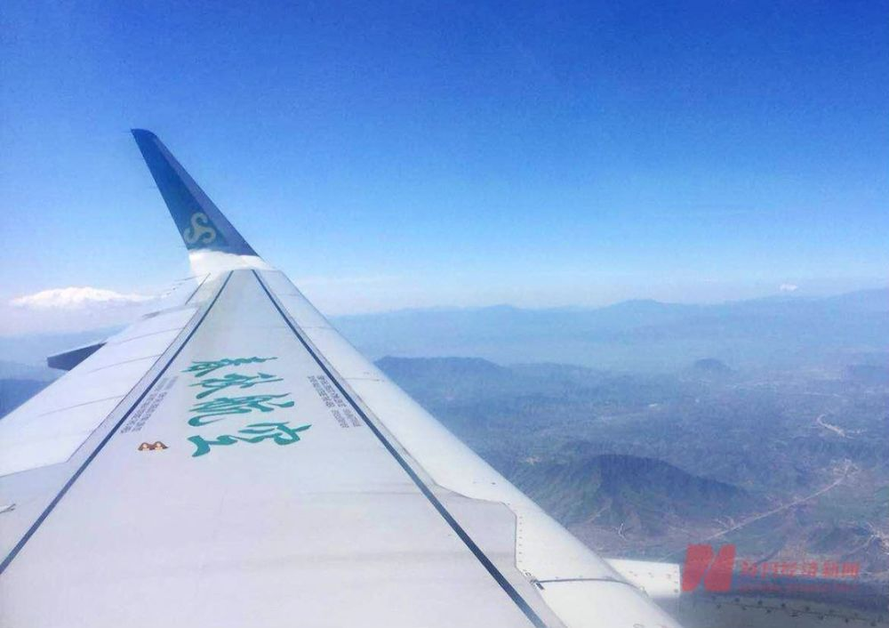

# 2.6万元出境游首发团上架1分钟售罄 从业者：目的地接待能力待恢复

每经记者：杨卉 每经编辑：董兴生

2月6日起，全国旅行社及在线旅游企业经营中国公民赴有关国家出境团队旅游和“机票+酒店”业务正式试点恢复。一时之间，憋闷了三年的各色旅游产品蜂拥而至。旅游热榜上，团费2.6万元/人左右的“新西兰南北岛10天”首团上架1分钟就售罄的消息冲击着从业者的神经。

多家OTA平台数据显示，1月20日（出境团队游恢复试点消息公布时间）至2月5日期间，出境跟团游产品咨询量环比上涨358%，签证咨询量环比上涨172%，游客出游热情不断攀升，从业者也在加码供给产品，部分平台还上线了新商家首月减免对应比例年费等活动，来吸引商家入驻，争夺存量资源。

一派热闹的景象中，也有些旅行社即便签单也不愿放团，甚至尝试劝说旅客延期出游。在这些从业者看来，受航班排期影响，目前机酒价格仍在高位，成团成本较高。另外，不少专门接待中国游客的酒店等基础设施3年未开张，已不具备接待游客的能力。若不详细考察就放团，一旦被投诉，将会对品牌和口碑造成不可挽回的伤害。

首发团刚上架就被抢光 出境游真热还是虚火？

2月6日的最热新闻之一，莫过于出境团队游的试点恢复。

在诸多消息中，广之旅旅行社上线的“新西兰南北岛10天”首团，团费大约2.6万元/人，因40个名额上架1分钟内就迅速售罄而火爆全网。

其余旅游团也大抵如此。携程平台3月18日由上海出发、人均价格27999元的首班新西兰出境团，开售后立即卖空；2月6日，同程旅行首个出境游团队从上海出发前往泰国，预计在泰国曼谷、芭堤雅、普吉岛等旅游目的地完成6晚7日的旅行，之后返回上海。该行程在出发前一周就快速售罄。

_图片来源：每经资料图_

出境跟团游已经火热到如此程度了吗？

一切早有预兆。

同程旅行2月6日提供的数据显示，1月20日至2月5日期间，出境跟团游产品咨询量环比上涨358%，签证咨询量环比上涨172%。预计今年出境游将迎来一轮爆发式增长，五一至暑期有望恢复至疫情前水平。神舟国旅工作人员也表示，春节期间，不少旅客问线路、问签证，门市业务人员几乎每天都在回复并筹备相关产品。

上市公司方面，出境游龙头众信旅游（SZ002707，股价9.63元，市值94.64亿元）2月5日晚间提供的数据显示，从众信旅游呼叫中心电话呼入量和众信旅游官网浏览量来看，目的地产品咨询度增长800%，其中“哪些国家签证简化”“有哪些目的地产品可以报名”“最快什么时候有产品可以出发”等成为游客最为关心的问题。

不过，搜索和浏览量反映出的数据，终归掺杂了游客未必能成行的个人意愿，与供应商渴望得到的能为备货做直观参考的数据仍有一定差距。

说来说去，还是得看实际预订量。去哪儿2月6日提供的数据显示，1月20日至2月6日，去哪儿平台上出境游产品陆续恢复上架，春节后，机票价格较春节期间降低三成，出境游热度延续，2月预订量同比增长在3倍以上。

OTA、旅行社花式抢客 产品供给“等米下锅”

为了满足这批不断增长、未来还有可能爆发式增长的需求，停滞了3年的旅企，盯准目标迅速下手，花式分食现有和潜在客源。而旅行社根基深厚，拥有大量中老年粘性客群，在争夺市场资源上自然是不甘落后。

根据众信旅游方面的介绍，公司产品部门已与包括酒店、航班、餐厅、用车、导游等海外合作伙伴沟通，推出了如南北极旅游产品、环游世界121天邮轮产品等，其中环游世界121天邮轮产品首批舱位已售罄。

神舟国旅门市公司总经理刘玉松还在2月6日下午的电话采访中透露，公司在与合作伙伴对接时发现，由于中餐厅数量减少，餐费标准呈明显上涨，正加紧与渠道供应商沟通，尽快修复旅游产品链和服务链。同时，为了抢抓出境团队游试点恢复后的机遇，神舟国旅还与供应商一同在1月31日举办了三年来的首场出境游产品分享会。

和旅行社相比，OTA充当着“中间商”的角色，借助自身流量优势，大量上线各式产品，期待着总有一款产品能击中游客的心。

同程旅行方面就表示，将于近期将产品推广上线。走量竞争之外，更多平台希望用优质的中间服务来吸引手握具有竞争力产品的商家，借此实现双赢。

飞猪2月6日提供的信息就显示，该平台将推出一系列扶持措施，帮助具备出境跟团游经营资质的商家入驻平台重启经营。如开设新商家快速入驻通道，在3个工作日内完成新商家入驻审批，或根据商家需要，提供代运营和销售服务等。

_图片来源：飞猪供图_

价格方面，新入驻平台开店的商家首月可减免对应比例的年费。飞猪还表示，此后将根据出境游商家在平台上的经营情况，按月动态调整商家的保证金基础额度，降低商家的资金周转压力。

值得关注的是，对于市场供给，有从业者指出，当前机票排班量仍在低位，部分热门航线一日只有两班飞机。若交通这一重要连接方式供给不足，即便上线再多产品也是等米下锅。

从业者提醒：警惕“低价游”，市场最大的危机是信任危机

不过，在一众抢占市场的玩家里，还有一些企业显得格外低调，甚至希望与客人商量，将跟团出行的时间延期。

有钱为何不赚？刘玉松告诉记者，之所以对首批出境团队游持观望态度，主要还是担心境外目的地的服务设施和接待能力。

“其实疫情期间我们一直在研讨市场变化，时刻调整自己的营销策略和营销结构，了解国内实时变化的消费心理。”刘玉松说，试点恢复出境跟团游的消息出台后，公司立刻联系了境外供应商，并安排了合作伙伴前往考察。

让刘玉松略感不安的是，境外目的地不少基础设施如专门面向中国游客的酒店等已经连续3年歇业关张，接待条件已经很糟糕。“若要重新装修，既花时间又要烧钱，旅游从业者这几年能不亏都很好了，哪里还有钱升级检修设备？”

此外，不单是酒店，团餐、导游、大巴车等，都要被考核。“客户满意度是企业的根本，只有等到我们认为条件具备了，比如机票价格稍微下来些，用于接待的设施都打磨好了再开放，才是不伤害品牌口碑和美誉度的最好办法。我们其实也签了很多单，衡量之后还是决定将其推迟。如果不能保证成团的质量，还不如不开，总不能一启动就砸了自己的招牌吧？”

对此，刘玉松也提到了一些解决方式，如将游客带往等级更高的酒店，审慎开启一些小团和高端团，至于完全为接待中国游客而存在的设施就先暂缓不用。“总之不能急于一时。”刘玉松反复在采访中强调。

“我的想法是在2月份及清明前后能有一个小的启动，将更多的出境游（快速恢复）希望寄托在5月、6月后。”在刘玉松看来，旅游企业已经亏了三年钱，这时更不能主张低价以求回血。“低价客群往往只认团费，不考虑价值。而一些几千元的低价产品，在基础设施无法接待的前提下，来回机票就基本覆盖，哪还有其余产品的空间，更别提还要预留给供应商一部分利润。”

“现在出境游是不怕高，就怕低。以低价招揽游客的套路一般都是借购物之类的消费做补充。但在当前行业升级的背景下，游客很少购物，因此要实现良性发展，就要给企业应有的利润，给地接社和供应商留出利润空间。”

此外，刘玉松进一步提出，当前市场最大的危机是信任危机。由于部分旅行社举步维艰、到处欠账，地接社和国内供应商互不信任，成为未来困扰旅游市场发展的潜在隐患。

每日经济新闻

