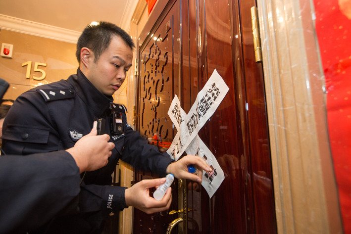

# 专门帮人背债，号称年赚200万：“免还”馅饼变陷阱，或涉嫌骗贷

每经记者：赵景致 刘嘉魁

每经编辑 陈星

在一些网络平台上，人们避之不及的债，却被某些人包装成了可以年赚百万的工具。

怎么操作的？有什么问题？“背的钱不用还，有免还协议”

“到手50万，抓紧”

“到手200万起步，白户想背的联系”

……近日，《每日经济新闻》记者发现，在多个社交平台上，有中介大力张罗，用“短期”“百万”“轻松”这样的词语吸引人们，听起来非常诱人。

那么，到底什么是背债，背债的都是哪些人，有什么风险？《每日经济新闻》记者就此展开了调查。

_杭州西湖法院执法人员对“老赖”李某的房产进行查封（图文无关）
视觉中国图_

**小白：“拿到钱五五分”**

很多人看着社交平台上涌现的背债一说，不禁发出疑问，什么是背债？带着这一疑惑，记者找到了背债人“小白”。

没有工作，生活基本靠“混”，觉得“债不债的”无所谓，反正给钱就行。这是记者对小白的直观感受。在此之前，他曾在很多地方做“跑分”。所谓跑分，就是通过银行卡等账号，为非法资金转移提供渠道，通过跑分帮人将赃款分流洗白。

接到记者电话时，小白正跟着“包装公司”在外地。如今小白也加入了“背债”大军。按照他的说法，所谓的背债就是一种“包装贷”。

“你也能明白，我没工作，也没社保、公积金这些，但是包装公司会给我包装。我的抵押物是房产和企业，包装公司会给我交放款当地的社保、公积金等，以证明本人在那个城市上班，他们会一直交钱直到将贷款办理下来。”看到记者对背债一事有兴趣，小白侃侃而谈起来。

房产从何而来，面对记者的疑惑，小白笑称，肯定不是自己的，是包装公司交的首付。包装公司会让其签一张借条，等房产到小白名下后再将借条销毁。“主要是怕你跑了，前期他为你包装垫付了不少费用，你要跑了他们就损失了。”除了打借条，个人还要跟包装公司签合同，以保证中途不能反悔。

“我目前就跟着包装公司，住宿由他们安排宾馆，吃饭有补助，会给生活费。平时就是上上网，或者逛街、办自己的事，办贷款手续时到现场配合就可以。”对于资金分配，小白表示要先谈好分成。“我这个包装公司，能帮忙贷下来500万到1000万元，我和他们五五分，最低都是200多万元。”

**揭秘：“背债”有两种模式**

从小白口中不难发现，其口中所谓的背债其实就是骗贷。经过记者调查，背债大致分为两种：一种是包装贷，一种是背坏账。

长期专门为包装公司介绍背债人的中介张姓男子给记者“上了一课”：背坏账一般是帮企业背。企业名下有不良资产阻碍其经营发展，为了处置不良资产，他们通过中介找到背债人，由中介帮背债人“包装”出一个公司，将这笔不良资产抵押给背债人的公司，再由背债人抵押给银行申请贷款，所申请款项跟企业分成。

“企业不良资产太多就没办法享受国家政策支持，转移到你身上就跟企业暂时没有关系了。”上述张姓男子说。

但无论如何，申请贷款的都是背债人，那这笔贷款的偿还问题怎么解决？

“这种债背上是有免还协议的，给企业背债一般是十年，主要还是看你的资质，资质越好，免还协议时间越长。”

背债是很诱人的。据张姓男子介绍，如果顺利，就能在很短的时间内到手六位数甚至更多，所以很抢手。“额度高的项目已经做完了，目前额度是150万到300万，到手50%。”

对于个人而言，背债流程并不复杂，前期几乎没有成本。前述张姓男子表示，一般来说，需要征信报告，如果是第一次做背债人，还需要身份证原件和一个新入网的手机号。可能也需要提供流水账单，但背债人完全不用担心，因为“一切皆可包装”。

如果确定能做背债人，包装公司就会安排前往需要背债的城市，在当地做一系列贷款审核流程。“来回车票、吃住我们都管。”第一次资料递交完成，10个工作日左右出额度，额度出来后，本人携带身份证原件和本人银行卡，面签拿钱。

在交谈中记者发现，该张姓男子的渠道非常广，当问及都去哪里背债时，他表示：“全国各地都有。”

不过在记者调查过程中却发现，背债拉客也有假的。

“小心喊你过去，就是让你做跑分业务，那可是要坐牢的，我这的业务更靠谱。”另一名中介曹女士对记者表示，然后她介绍了她的业务模式。

“就是正常的贷款。”曹女士解释，通常个人去银行申请贷款，因为名下没有资产，贷不了那么多钱。“公司给你包装，比如你现在没有房，没有企业，公司就‘匹配’房产或企业给你，这些都是公司买的。”放款后包装公司会从中按比例抽取20%~30%。

至于贷款流程，据曹女士介绍也非常简单，需要先打印征信报告，等公司评估额度后，需要去哪个城市办就带客户过去，公司包吃包住，也会帮缴审核所需的社保。

据记者多方了解，尽管各种业务有所不同，但这类业务本质都是中介公司对客户资质进行包装，再找金融机构贷款。

**中介：现在没事，以后不知道**

综上所述，不管是哪种，核心都是找人背债。关键是，债背上了，然后呢？

另一位当事人老蔡对记者表示，这种行为可以理解为伙同包装公司骗取贷款，但借的钱最终都要还。“你要想背一笔钱，然后不用还，天下哪有这么好的事情。”

老蔡说，不良资产抵押背债，下款时签免还协议，当时按照那些中介的说法是债务永远背着，无上门催收和电话催收。

“真的不用还钱吗？”老蔡苦笑，直说自己清醒得很，不是说真的不用还，而是赖账不还，但这么做的后果他很清楚，还不上就会成为黑户，“这就是做一辈子‘老赖’。”

如果不还钱，自己就会被“限高”“限飞”，甚至会对孩子的前途有所影响。“我现在是想办法挣钱翻盘，翻盘了就还钱，没翻就不还。”

背债人小白说，这事做了就是老赖。他甚至分享了“应对方法”：“你名下不要有财产，银行让你还，你就说没钱，或者每个月只还很少的钱，它拿你没办法的。但银行给你打电话你一定要接。”

为了确定包装公司与借款人各自的“责任”与“义务”，双方也会确立合同。

小白与包装公司签订了名为《融居间服务协议》的合同。包装公司（甲方）为借款人（乙方）提供车融、房产融资、个人消费贷款以及企业贷相关事宜，并负责对接金融服务公司。

包装公司根据借款人申贷项目下款的进度，按完成1项结算1项操作；借款人按每个申贷项目的净融资额的50%结算，另50%为包装方的融资机构的垫资、担保、资金渠道中介、融资咨询顾问费等各种金服费用。

协议表明，包装公司根据借款人申请的不同金融产品所做的融资方案，借款人需无条件配合，若中途弃贷或取消需要赔偿所有损失。

此外，为更好地从金融机构套现，协议还约定了银行贷款的前期还款期数，并指定包装公司作为借款人的贷后监督人。

包装公司对借款人所进行的融资居间项目，为了保证金融机构对乙方的还款诚意与决心的代融资信心，乙方需委托甲方作为乙方的贷后6~12个月的监督人，乙方根据不同融资产品下款后，将月供还款保证金支付给甲方作为乙方月供还款保证款（房产及企业贷须付12个月月供还款保证金，汽车及信贷须支付6个月月供还款保证金），甲方须按时代乙方还足乙方委托其代还的月供期数。

这样一份所谓的背债合同是否具有法律效力？

“合同内容涉及违法犯罪的，比如说内容是双方合谋骗取贷款，或者是资质包装，则应该认定为无效合同。”广东广强律师事务所非法集资案件辩护中心主任曾杰表示。

此外，中介所说的“免还协议”，也仅为约定还款时间，且合同或也无效。

“不要说什么不用还，肯定是要还的。”曾经背过债的人对记者表示。

记者问到免还协议到时间该如何处理时，中介张姓男子表示：“几十年以后的事情，谁也说不清楚，但短时间内没啥事。”

金博大律师事务所律师孙凯则对记者表示，如果合同扰乱国家金融秩序，侵犯了公共利益，违背公序良俗，则无效。

**背债人：我现在只想还钱**

可以看到，所谓的背债，就是包装公司与希望得到巨额款项的背债人进行合作，包装公司由于对金融机构放贷条件较为了解，因此便为背债人编造资料，以符合放贷条件，最终帮背债人获得巨额贷款，随后再与背债人“分钱”。而背债人的代价便是其所背负的债务总额，远高出拿到手的额度。

尽管在申请贷款时，背债人名下确有房贷、购房发票、当地银行流水等，但如果存在伪造贷款人的资质或者背景，而背债人实际没有偿还能力，包装公司就涉嫌骗取贷款罪或贷款诈骗罪。“深层次的原因，还是抱着天上掉馅饼的期待，名为背债，实际上是被利益诱惑。”曾杰表示，“这类案件近期发生过不少，定性几乎不存在争议。”

面对记者，背债人老蔡不时发出哀叹，说的最多的一句话就是：“我现在只想还钱。”

“背在身上还不起就是一辈子的事。我是打算还了，反正这事只要做了，如果还不上，银行会发短信、打电话给你，最后会起诉你，征信变黑，限高限飞。”

当问到当时背债拿到的钱花在哪里了？老蔡对记者说，自己投资失败，想用背债把这笔钱还上，但压力很大。

“这就是个坑！”老蔡叹息道，贷款不还，除了成为征信黑户、限高限飞、面临起诉，还有可能被拘留。“如果完全不还就涉嫌骗贷。”

记者注意到，按照刑法第一百七十五条之一，以欺骗手段取得银行或者其他金融机构贷款、票据承兑、信用证、保函等，给银行或者其他金融机构造成重大损失的，处三年以下有期徒刑或者拘役，并处或者单处罚金；给银行或者其他金融机构造成特别重大损失或者有其他特别严重情节的，处三年以上七年以下有期徒刑，并处罚金。

而根据第一百八十六条规定，银行或者其他金融机构的工作人员违反国家规定发放贷款，数额巨大或者造成重大损失的，处五年以下有期徒刑或者拘役，并处一万元以上十万元以下罚金；数额特别巨大或者造成特别重大损失的，处五年以上有期徒刑，并处二万元以上二十万元以下罚金。

银行或者其他金融机构的工作人员违反国家规定，向关系人发放贷款的，依照前款的规定从重处罚。单位犯前两款罪的，对单位判处罚金，并对其直接负责的主管人员和其他直接责任人员，依照前两款的规定处罚。

老蔡就提到，如果包装公司分成分得比较多，会帮个人还几个月贷款。“自己拿到手能有一半就不错了，我到手才40%，公司给我还了6个月贷款，如果直接不还就属于骗贷。”

**贷款三查“双罚”既罚机构又罚人**

值得注意的是，银行作为金融机构，发放贷款需要严格的审核。工作多年的某城商行一级分行信贷业务部经理对记者表示，他也遇到过客户借用资质或者用假资质申贷的情况。

对于如何甄别，该经理表示，可根据客户提供的资料交叉验证，比如工资代发流水，工作情况和内容的掌握程度。“随便问几句，基本上都可以甄别资质真假。”

“比如在做按揭业务的时候，如果有客户说他是专门做家具生意的，那我会问，当前他做的家具都是实木的还是板材的，现在市场价格是多少，运费是多少，问一些行业相关的问题，如果他都能答得上来，说明他是真实在做这个业务，如果答不上来，说明他的资质很有可能有假，是借用的。”

在处理方式上，该经理表示，他会分情况对待。

一类是资质确实有欠缺，不能满足申贷条件，但是贷款用途真实，未来预期收入基本可以覆盖还款，而且有抵质押物，那就可以适当放宽条件。

比如申请按揭业务的客户，他的工资是现金发放，无法核实，但是通过跟客户交谈，发现一家人都在为一套房还贷，并且把房产抵押给了银行，如果事实没有太大的问题，那么也会适当性对资质有瑕疵的客户予以准入。

“但是如果我们发现有的客户将来违约、赖账成本较小，比如纯信用或者纯担保这类贷款，用假资质完全是为了骗贷，那就根本不会予以准入，这个风险太大。”这位经理表示。

记者注意到，贷款贷前调查、贷时审查、贷后检查是监管重点关注领域。

据了解，通过实施贷款“三查”，有利于贷款人较为全面地了解和掌握借款人经营状况以及贷款的风险情况，及时发现风险隐患，采取相应风险防范和控制措施，保障银行信贷资金安全。同时，贷款“三查”制度执行情况，也是在贷款出现风险后，对相关责任人员进行责任追究或免责的重要依据。

有业内人士指出，落实好贷款“三查”制度是银行业的生命线，是关系到银行业如何发现风险、控制风险、经营风险之关键所在。

早在2018年，原银监会就印发了《关于进一步深化整治银行业市场乱象的通知》。通知提到，要按照“一案三查、上追两级”的要求，对案发机构和涉案机构依法处罚问责，同时综合使用审慎监管措施，让违法违规的机构和人员都要付出代价，切实维护银行业良好秩序。同时，做到没收违法所得与罚款并重、处罚机构与处罚人员并举。

目前，贷款三查“双罚”也已是监管常态，“既罚机构又罚人”的行政“双罚”持续高压。

以广东为例，去年以来，广东银保监局保持行政处罚高压态势，切实提升“双罚”力度。截至去年10月末，全辖合计作出行政处罚决定221项，处罚机构184家次、责任人334人次，对机构及个人罚没合计1.14亿元。

（文中受访者均为化名）

**记者手记 君子爱财要取之有道**

“背债”乍一看能让人在短期内获得巨额利益，代价却是透支自身信用，将所得款项与其他公司或个人进行分配，自此背负不菲的债务。如果无法偿还，还会对个人征信造成不可逆转的影响。

在调查过程中，记者遇到的背债人甚至有“千禧一代”的年轻人。

个人征信报告在人们的生活中日益重要。现在，消费者们越来越习惯利用互联网金融机构贷款与消费，个人征信报告多用于为金融机构的贷款业务提供信息支撑。

而作为“经济身份证”，个人征信报告作用显然不会止于此。目前，我国在不断立法完善社会信用体系建设，个人征信的重要性也会更深层次地体现。

君子爱财，取之有道。希望全社会都能形成“守信时时受益、失信处处受限”的良好氛围。

