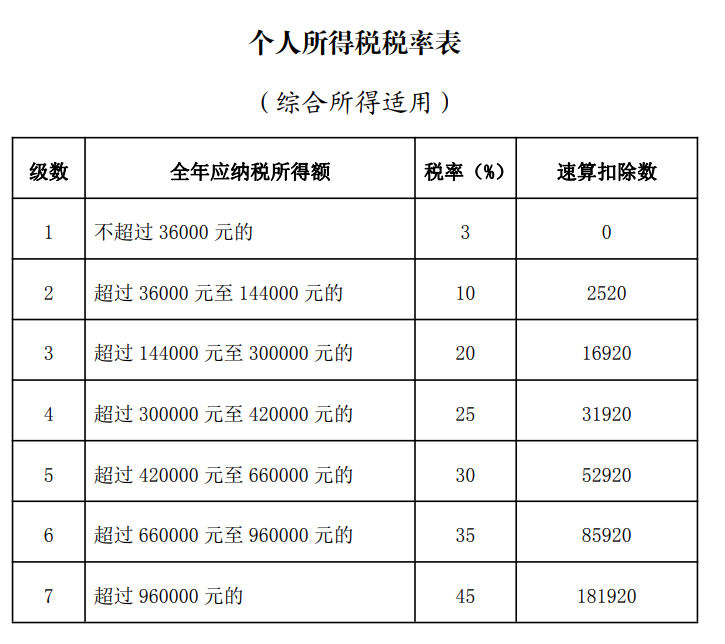

# 个税汇算有变化：新增2项税前扣除，生活负担较重的可优先退税

2022年度个税汇算即将开始，汇算办理时间为2023年3月1日至6月30日。

《国家税务总局关于办理2022年度个人所得税综合所得汇算清缴事项的公告》（以下简称《公告》）日前公布，《公告》总体上延续了前几次汇算公告的框架与内容。主要的变化有：

一是在“可享受的税前扣除”部分，增加了3岁以下婴幼儿照护专项附加扣除、个人养老金等可以在汇算中予以扣除的规定。二是在“汇算服务”部分，进一步完善了预约办税制度，在维持预约办税起始时间（2月16日）基础上，将预约结束时间延长至3月20日，为纳税人提供更优的办理体验。此外，新增了对生活负担较重的纳税人优先退税的规定。

**今年汇算在确保优化服务常态化的基础上，又新推出了以下服务举措：**

**优先退税服务范围进一步扩大。**
在2021年度汇算对“上有老下有小”和看病负担较重的纳税人优先退税的基础上，进一步扩大优先退税服务范围，一是“下有小”的范围拓展至填报了3岁以下婴幼儿照护专项附加扣除的纳税人；二是将2022年度收入降幅较大的纳税人也纳入优先退税服务范围。

**预约办税期限进一步延长。**
为向纳税人提供更好的服务，使税收公共服务更有效率、更有质量、更有秩序，2022年度汇算初期将继续实施预约办税。有在3月1日-20日期间办税需求的纳税人，可以在2月16日（含）后通过个税APP及网站预约办理时间，并按照预约时间办理汇算。3月21日后，纳税人无需预约，可在汇算期内随时办理。

**推出个人养老金税前扣除智能扫码填报服务。**
2022年个人养老金制度在部分城市先行实施，符合条件的个人可填报享受2022年度税前扣除。纳税人使用个税APP扫描年度缴费凭证上的二维码即可生成年度扣除信息并自动填报，在办理汇算时享受个人养老金税前扣除。

**需要办理汇算的情形**

符合下列情形之一的，纳税人需办理汇算：已预缴税额大于汇算应纳税额且申请退税的；2022年取得的综合所得收入超过12万元且汇算需要补税金额超过400元的。

2022年度终了后，纳税人需要汇总2022年1月1日至12月31日取得的工资薪金、劳务报酬、稿酬、特许权使用费等四项综合所得的收入额，减除费用6万元以及专项扣除、专项附加扣除、依法确定的其他扣除和符合条件的公益慈善事业捐赠后，适用综合所得个人所得税税率并减去速算扣除数，计算最终应纳税额，再减去2022年已预缴税额，得出应退或应补税额，向税务机关申报并办理退税或补税。具体计算公式如下：

应退或应补税额=[（综合所得收入额-60000元-“三险一金”等专项扣除-子女教育等专项附加扣除-依法确定的其他扣除-
符合条件的公益慈善事业捐赠）×适用税率-速算扣除数]-已预缴税额

汇算不涉及纳税人的财产租赁等分类所得，以及按规定不并入综合所得计算纳税的所得。

_个人所得税税率表。_

**可享受的税前扣除**

下列在2022年发生的税前扣除，纳税人可在汇算期间填报或补充扣除：（一）纳税人及其配偶、未成年子女符合条件的大病医疗支出；（二）符合条件的3岁以下婴幼儿照护、子女教育、继续教育、住房贷款利息或住房租金、赡养老人等专项附加扣除，以及减除费用、专项扣除、依法确定的其他扣除；（三）符合条件的公益慈善事业捐赠；（四）符合条件的个人养老金扣除。

同时取得综合所得和经营所得的纳税人，可在综合所得或经营所得中申报减除费用6万元、专项扣除、专项附加扣除以及依法确定的其他扣除，但不得重复申报减除。

**办理方式**

纳税人可自主选择下列办理方式：

（一）自行办理。（二）通过任职受雇单位（含按累计预扣法预扣预缴其劳务报酬所得个人所得税的单位）代为办理。纳税人提出代办要求的，单位应当代为办理，或者培训、辅导纳税人完成汇算申报和退（补）税。由单位代为办理的，纳税人应在2023年4月30日前与单位以书面或者电子等方式进行确认，补充提供2022年在本单位以外取得的综合所得收入、相关扣除、享受税收优惠等信息资料，并对所提交信息的真实性、准确性、完整性负责。纳税人未与单位确认请其代为办理的，单位不得代办。（三）委托受托人（含涉税专业服务机构或其他单位及个人）办理，纳税人需与受托人签订授权书。

单位或受托人为纳税人办理汇算后，应当及时将办理情况告知纳税人。纳税人发现汇算申报信息存在错误的，可以要求单位或受托人更正申报，也可自行更正申报。

