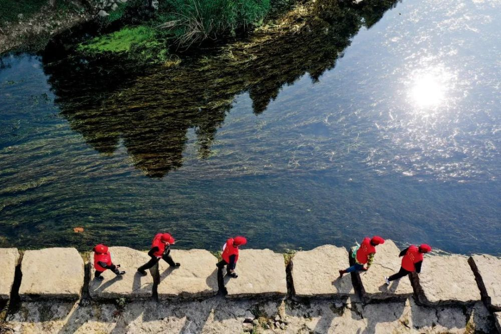

# 中国政协重磅调整 传递了哪些信号

1月18日，第十四届全国政协委员名单公布，名单中新出现了“环境资源界”。这是自1993年第八届全国政协增设“经济界”以来，全国政协首次出现新增界别。

根据名单，第十四届全国政协共设置34个界别，委员共计2172人，其中环境资源界有85位委员，在34个界别中属于人数较多的一个。

此外，地方政协也已经对界别设置进行了相应调整，全国31个省、自治区、直辖市公布的新一届政协委员名单中均增设了“环境资源界”或“资源环境界”。

数位受访专家告诉《中国新闻周刊》，环境资源界别的设立，不仅顺应了我国对环境资源的新认知，也是实现双碳目标、保障耕地及能源安全的必然举措。

_对生态环境的治理越来越受到重视。图/新华_

**委员来自众多领域**

全国政协增设“环境资源界”的筹备工作从2020年就已经开始。

中国地质大学（武汉）地球科学学院地球生物系教授童金南是第十四届全国政协新设环境资源界的委员，他告诉《中国新闻周刊》，2020年，第十三届全国政协人口资源环境委员会增加了40多名委员，他是其中一位，而人口资源环境委员会新增委员的目的之一，便是为了筹建环境资源界别。随后，“积极推进增设资源环境界别的后续工作”被写进了全国政协人口资源环境委员会的2020年工作综述。

全国政协的85名环境资源界委员中，多名委员为连任，此前分散于其他界别，如科学技术界、农业界、九三学社等。这些委员的相同之处是，他们几乎都曾提交过与环境资源相关的提案，例如童金南作为第十三届全国政协科学技术界的委员，他提交的第一份提案与汉江环境保护有关，后续也曾提交过多个与生态环境治理相关的提案。

据《中国新闻周刊》梳理，环境资源界85名委员的背景涵盖生态环境、自然资源、水利水务、城市规划、海洋、林业、地质、化学、古生物、建筑、气象、交通、法学等多个领域。

环境资源界的委员中，四成以上是具有上述领域背景的官员，包括生态环境部部长黄润秋、生态环境部副部长赵英民、国家能源局局长章建华、水利部长江水利委员会主任马建华、自然资源部海洋战略规划与经济司司长何广顺、福建省自然资源厅厅长叶敏、重庆市生态环境局局长余国东等。

85名委员中还有三成以上是具有上述领域背景的专家学者，包括云南大学校长方精云、浙江大学副校长吴健、中国科学院南京地理与湖泊研究所所长张甘霖、中国科学院地理科学与资源研究所所长葛全胜等，其中还包括多名中国科学院院士和中国工程院院士。

另外，大约两成委员来自能源化工企业，包括中国核电董事长卢铁忠、中国中化董事长李凡荣、中国海油董事长汪东进、国家电投董事长钱智民、中国石油董事长戴厚良、华能集团董事长温枢刚、国家电网董事长辛保安、中国稀土集团董事长敖宏等。

中央党校（国家行政学院）教授刘旭涛在接受《中国新闻周刊》采访时指出，环境资源界的85名政协委员，绝大多数在相关领域拥有丰富的经验，有些是在学术研究方面，有些是在实践方面，这能让他们在环境资源这个界别下更好地履行参政议政职责。

中国自然资源经济研究院研究员张维宸告诉《中国新闻周刊》，环境资源界的委员有不少在一线工作，他们能提出更合理的建议，“甚至有可能达到一种效果，就是在会议探讨过程中，一些问题就能得到解决，工作落实得更快”。

童金南说，自己作为地质学家，成为全国政协委员后一直对环境问题比较关注，过去在全国政协委员的小组讨论会上，自己经常从地质学角度对环境问题进行探讨。未来履职中，他会关注如何在环境治理和经济社会发展中间实现平衡，“例如我曾经在小组讨论上谈过一个问题，现在的河湖治理把很多江滩、河滩都变成了岩石滩、水泥道，看似环境变好了，但是泥滩沙滩里的生物没法活了。这不是生态保护，而是一种生态破坏。这也是我未来会关注的问题之一。”

**新界别是时代发展的应时之举**

在多位受访专家看来，全国政协新增环境资源界这一界别是顺应当下时代发展的应时之举。

中央党校（国家行政学院）教授汪玉凯告诉《中国新闻周刊》，全国政协设立环境资源界，表现出国家层面对环境资源的高度重视，“这与中国经济发展方式的转变有很大的关系。在相当长一段时间里，我国注重规模数量型的经济增长，后来要实现向质量效益型的转变，环境资源保护就变得极为重要。”汪玉凯认为，改革开放走到今天，环境资源受到高度重视是必然的趋势。

汪玉凯说，环境资源界别的设立，表明我国对环境资源的认知已经到达新境界。改革开放初期，大家尚没有意识到破坏环境和过度消耗资源问题的严重性，而当前，无论是我国的最高决策层还是公众，对资源环境的重要性和价值的认识已经上了几个台阶。

如何顺应认知的升华，则需从各个方面发力。例如加强环境资源方面的机构设置，组建了生态环境部和自然资源部，把过去环保和资源分散在各个部门的职能进行集中，从政府部门的组织架构上，加强对环境和资源方面的领导。

党的十八大以来，政府职能由过去的“宏观调控、市场监管、公共服务、社会管理”新增了“环境保护”要求，生态文明建设被纳入“五位一体”的国家总体战略布局。全国政协新增环境资源界别正是在适应这个趋势。

在张维宸看来，环境资源界的设立也是任务使然，“从国际国内的形势来看，无论是碳达峰、碳中和，还是坚守18亿亩耕地红线、保障能源安全，为了完成这些任务，政协需要设立一个这样的界别”。

全国政协人口资源环境委员会于1998年3月成立，是全国政协常务委员会和主席会议领导下的九个专门委员会之一。张维宸说，这些年来，人口资源环境委员会意识到环境和资源方面人士分散在不同界别中，导致他们提出的政策建议较为分散，因此强力推动环境资源界的设立。此后，这些政协委员的发声能够更集中，履职更有力。

**政协界别的调整和优化**

实际上，全国政协的界别已经经过多次调整，包括增加界别以及对一些界别进行更名。地方政协界别的设置则基本上参照全国政协。

1988年3月，全国政协六届十七次常委会会议期间，“界别”这一提法首次出现。在此之前，全国政协的组织设置一直用“参加单位”来表述。2004年3月，全国政协十届二次会议通过的政协章程修正案，政协章程第一次正式以“界别”来指称所有的政协参加单位。

第五届全国政协取消了“合作社”界别，增设了“体育界”。第六届全国政协增设了“中华全国台湾同胞联谊会”和“港澳同胞”两个界别。第七届全国政协设有31个界别，届中增设“中国科学技术协会”后共32个界别。第八届全国政协将“港澳同胞”分为“香港同胞”和“澳门同胞”，还增设了“经济界”。第九届全国政协对5个界别的名称进行调整，其中“对外友好团体”改为“对外友好界”，“社会救济福利团体”改为“社会福利界”，“少数民族”改为“少数民族界”，“香港同胞”改为“特邀香港人士”
，“澳门同胞” 改为“特邀澳门人士”。第十届全国政协对两个界别更名，“农林界”改为“农业界”，“社会福利界”改为“社会福利和社会保障界”。

刘旭涛说，新中国成立之初，人民政协主要是以党派、团体、地域、民族、宗教为界构成，但随着社会和经济的发展，仅有这些界别已经难以适应发展的需要，因此会不断调整。

中共中央的文件也体现出对政协界别调整和优化的重视。2006年，中共中央发布的《关于加强人民政协工作的意见》第一次将突出界别特色明确为政协自身建设的特有内涵。2015年，中共中央《关于加强社会主义协商民主建设的意见》提出，“在条件成熟时对政协界别适当进行调整”。2019年，中共中央《关于新时代加强和改进人民政协工作的意见》再次提出，要“优化界别设置，增强界别代表性，更好反映各界各方面愿望诉求”。

除了增加环境资源界，第十四届全国政协界别的调整还包括将“中国共产主义青年团”和“中华全国青年联合会”两个界别合并为“中国共产主义青年团和中华全国青年联合会”一个界别。

刘旭涛指出，政协界别的调整是根据国家的政治、经济、社会等各方面发展的需要来进行的，有的以行业作为边界，有的以专业作为边界，这些调整也让政协能够与时俱进地发挥政治协商、民主监督和参政议政的职能。

不过，他也指出，政协委员履职时，“跨界”是正常的，并倡导政协委员开展“跨界别”活动，例如隶属科技界别的政协委员可以参与其他界别的有关科技领域的调研、提案和建议等，“实际上，界别更多还是搭建一个政治协商、参政议政的平台，它具有开放性的特点”。

发于2023.2.6总第1078期《中国新闻周刊》杂志

杂志标题：全国政协缘何新增“环境资源界”

记者：张馨予

