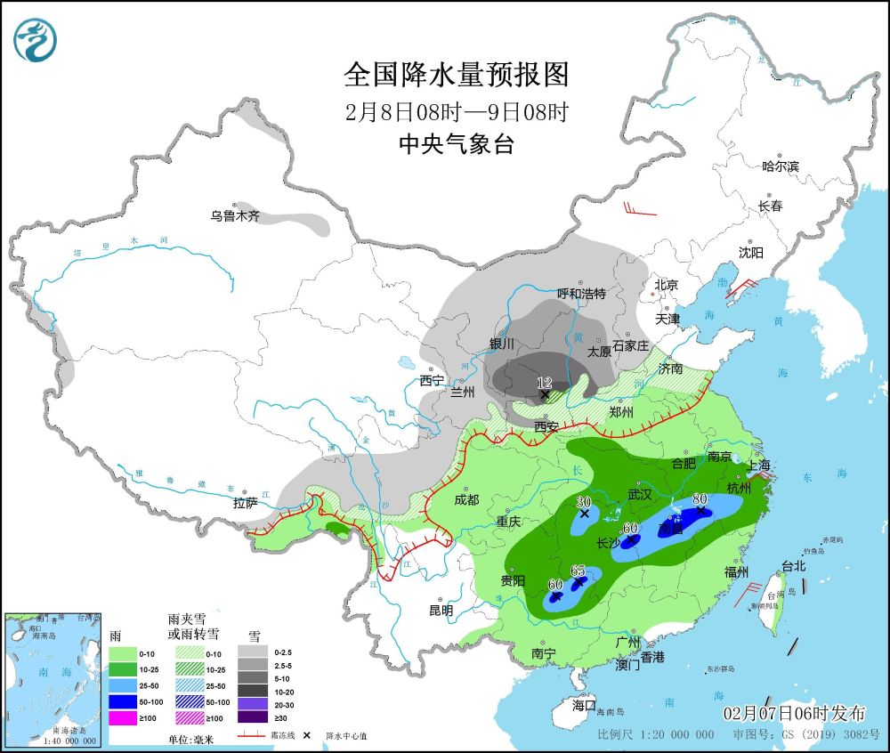

# 今年来最大范围雨雪将波及超29个省份，华北降雪、江南局地暴雨

新京报讯（记者王景曦）今起三天（2月7日至9日），我国中东部将迎今年来范围最大、强度最强的降水过程，雨雪波及超29个省市区。本轮降水过程中，华北多地可能出现降雪，南方多地雨势增强，江西、湖南等地局地有暴雨。

随着新一股冷空气东移南下，今天开始，今年来范围最大、强度最强的雨雪天气过程将自西向东影响我国中东部。中国天气网气象分析师张娟介绍，本轮降水影响范围较广，华北多地可能出现降雪，江南局地有暴雨，8日至9日为核心影响时段。

_全国降水量预报图。中央气象台供图_

2月以来，南方多地开启持续阴雨模式。7日白天，随着暖湿气流增强，南方降雨还将增多增强，范围将北扩至江淮一带。夜间开始，随着高空槽东移，北方降雪将自西北地区东部向东逐步铺展开来。

8日起，本轮雨雪过程将进入核心时段，西北地区东部到华北西部一带将有明显降雪，其中甘肃东部、宁夏南部、陕西中北部、山西西南部等地部分地区有大雪，局地暴雪。同时，南方降雨在这一天也明显增强，江西、湖南部分地区或有暴雨，省会级城市中，南昌有大雨，长沙有中雨。

9日，南方降雨强度仍较强，北方降雪范围将向东扩展，华北、黄淮的部分地区也将加入降雪的行列，像北京山区凌晨至白天有小雪，石家庄也将出现降雪且持续一整天。

张娟特别提示，目前北方昼夜温差较大，多地最低气温将在冰点之下，气温起伏导致降水相态多变，且易引发道路结冰。甘肃中东部、陕西、山西等地发生道路积雪和结冰的风险高，且降雪时能见度较低，当前正值春运返程时期，公众驾车出行需保持车距，注意交通安全。

此外，南方阴雨持续时间较长，11日至12日，新一轮降雨将无缝衔接，江南中北部的部分地区有大雨，局地暴雨，当地需警惕叠加降水可能导致的道路积水及山体滑坡、泥石流等地质灾害。

编辑 白爽

校对 王心

