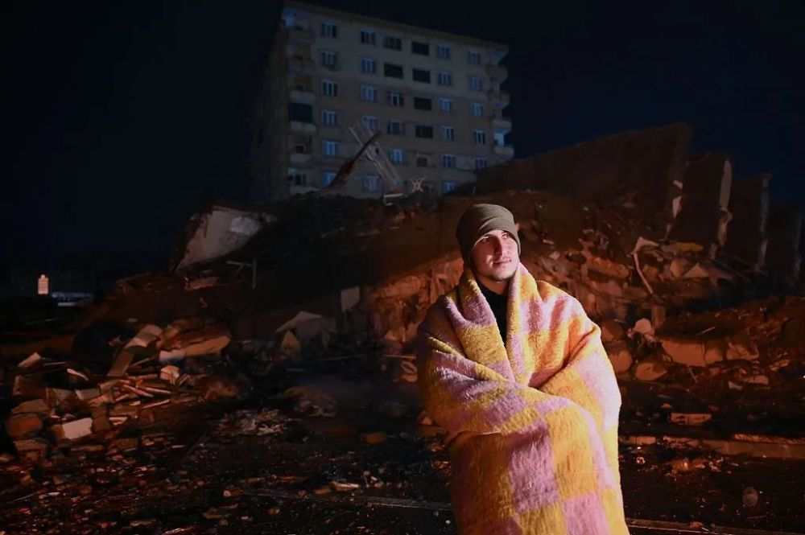

# 余震或持续数周乃至数月！权威专家：这些状况致土耳其地震毁灭性灾难

随着震中进入寒夜，2月6日发生的土耳其大地震造成的次生灾害正逐步显露。据土耳其灾害与应急管理局7日早上数据，一天之内两次7级以上地震，已造成该国2300余人遇难，至少1.4万人受伤，近6000栋建筑倒塌。同时，综合叙利亚政府及反对派控制区消息，叙利亚境内的地震遇难人数也已过千。

世卫欧洲区高级紧急事务官史摩伍德表示，随着搜救工作的进展，死亡人数可能会是初期报告的8倍，遇难人数可能会超过两万。

虽然已有约两万名救援人员从全球各地赶赴灾难现场，但绵延数百公里的灾区医疗物资奇缺，电力中断，重型机械及燃料匮乏。降温降雪的夜晚，现场记者看到“很多人无家可归，露宿街头”。

多位地震学家对《中国新闻周刊》指出，震级高并不意味着一定致命，这场悲剧是多重因素叠加的结果。随着“新一轮大地震发生期”可能到来，这些问题也值得全球其他地区注意。

“最重要的是，在地震风险高、有大地震历史记录的地区，政府和民众要保持足够的风险意识，做好准备。”澳大利亚科廷大学地球与行星科学学院教授克里斯·埃尔德斯说。

**“真正的雪上加霜”**

这次地震是土耳其100多年来发生的最强地震之一，震中位于加济安泰普省努尔达吉以东23公里处，震源深度约为24公里。

地震学上，震源深度小于70公里的地震被称为浅源地震；震源深度越浅，地震对人类活动造成的伤害就越大。2008年中国汶川地震的震源深度为14公里。2017年，两场震源深度50公里左右的7.1级和8.1级地震袭击墨西哥，造成全国性破坏和数百人死亡。

_当地时间2023年2月7日，土耳其卡赫拉曼马拉什，土耳其东南部发生7.8级地震后，救援人员在倒塌的建筑废墟中寻找遇难者和幸存者。图/视觉中国_

更糟糕的是，这次地震的震中地区人口密集。著名地震学家、南加州大学地质学教授和地震科学中心主任约翰·维达勒对《中国新闻周刊》介绍，7.5级左右的浅源地震，严重影响的范围在距震中50公里到100公里之内。2020年墨西哥南部瓦哈卡州的7.4级地震，震源深度10公里，但震中只有6个村镇，距离主要城市超过100公里，所以未造成严重伤亡。

但是，此番第一次7.8级地震的震中距离加济安泰普省首府加济安泰普市只有约30公里。该市人口超过200万，其中包括数十万叙利亚难民。同时，震中距离叙利亚西北部边境仅50公里，那里的难民营中居住着超过170万流离失所者。

“任何同类地震，如果袭击的是人口密集区，都是毁灭性的。”维达勒说。

构造地质学家、科廷大学地球与行星科学学院教授埃尔德斯对《中国新闻周刊》指出，这次地震另一个特殊之处是，余震频繁，震级高且范围广，成为救灾的严重阻碍。距离第一次7.8级地震才过去24小时，当地已发生约百次4级以上余震，绵延超过300公里。这包括一次7.5级余震，发生在震中东北方向95公里处，距第一次大地震发生仅9小时。

“这些余震还在继续，这表明地震导致多个断层带发生了显著的运动。”埃尔德斯说。美国地质调查局的数据亦证明了这一点：大地震发生在安纳托利亚板块的东安纳托利亚断层带上，但强烈的震动沿断层带向东北方向传播了数百公里。此处是安纳托利亚板块、阿拉伯板块和非洲板块的交汇之处，多个断层带受到压力，更有可能发生较高震级的余震。

震中地区糟糕的抗震准备，也使得灾难雪上加霜。土耳其伊斯坦布尔技术大学地震学教授 Haluk Eyidogan
提到，当地农村地区的石砌和土坯结构在强震面前异常脆弱。另有分析指出，土耳其大面积的无钢筋砖砌城市建筑也很不稳固。至于难民营中的状况，联合国人道主义事务协调办公室介绍，那里多是妇女和儿童，本就遭受着大雪、霍乱、电力电信及道路中断的困扰，救援人员也很难在震后第一时间到达现场，评估其基础设施损毁状况。

埃尔德斯强调，地理位置使土耳其成为世界上地震最活跃的地区之一，无论如何地方政府都应当尽可能做好防震准备。1999年，土耳其东北部发生7.4级地震，造成约1.7万人身亡。1939年，土耳其上一次发生7.8级地震，约3万人遇难。

**“余震或持续数周乃至数月”**

土耳其大地震发生后，所谓“荷兰科学家提前数日预测地震”的消息在社交媒体上转播。事实上，这位荷兰民间研究人员并非专业出身，过去做出的地震“预测”也并不准确。在地震发生三天前发布的“预言”消息中，他提到土耳其中南部、约旦、叙利亚、黎巴嫩一带可能发生较大规模地震，没有说明更具体的地区和时间。

多位受访地震专家表示，目前地震的位置、震级和时间仍无法预测，这是全球性难题。但就各个板块发生地震的概率，在“大尺度”上可以做出科学判断。埃尔德斯和维达勒都指出，东安纳托利亚断层长达数百公里，长期和北安纳托利亚断层挤压土耳其中部，学界一直预计这里可能发生7级以上地震，但“只会在百年的时间尺度上重复发生”。

_当地时间2023年2月7日，土耳其卡赫拉曼马拉什，土耳其东南部发生7.8级地震后，一名男子看着救援人员在倒塌的建筑废墟中寻找遇难者和幸存者。图/视觉中国_

值得注意的是，1998年以来，东安纳托利亚断层带已发生多次6级以上地震，造成人员伤亡。2020年1月的埃拉泽格地震造成至少41人死亡、1600余人受伤。对此，学界产生了两种相反的预判。一些人认为，该断层的能量已在历次地震中得到释放，很难在短时间内发生更高震级的地震；另一种观点认为，这些地震是更大规模地震到来的警告信号。

埃尔德斯指出，两种观点都是推论，理论上每一次地震、包括余震都是相互独立的地震，“目前也很难通过此次大地震去判断未来该地区及其他地区是否会发生更高震级的地震。”

2022年9月四川泸定6.8级地震后，中国地震台网中心研究员孙士鋐接受《中国新闻周刊》专访时指出，如果将时间拉长，2004年印尼发生了9.1级地震，2010年智利发生了8.8级地震，2011年日本发生9.0级地震，七年内就发生了三场9级左右的地震。而在2011年以后，全球的地震活动总体较少。所以“从明后年起，全球可能会进入新一轮大地震发生期，预计未来几年全球范围内可能再度发生9级地震”。

目前，一个可以基本确定的坏消息是：在土耳其和叙利亚的灾区，本次大地震的余震还不会停止。“这将持续数周，如果严重的话可能达到数月之久，但通常不会出现更多高震级的余震。”埃尔德斯说。维达勒则提醒道，如果“断层暂时还没有破裂”的地区突然监测到余震活动开始加强，该地区的政府和民众应当有所准备，更多高震级的余震可能在当地发生。

记者：曹然

