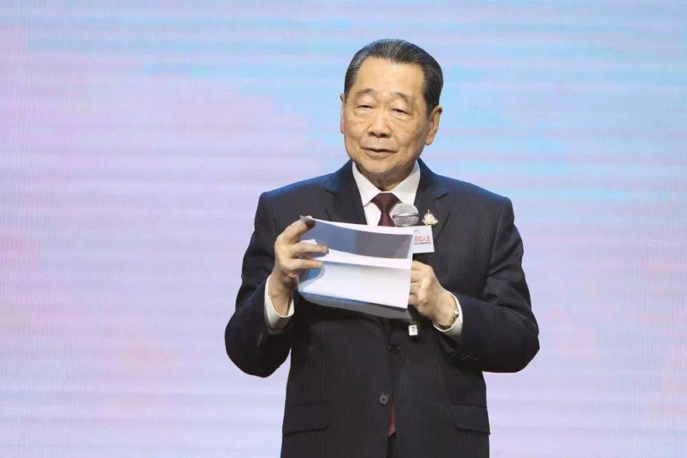
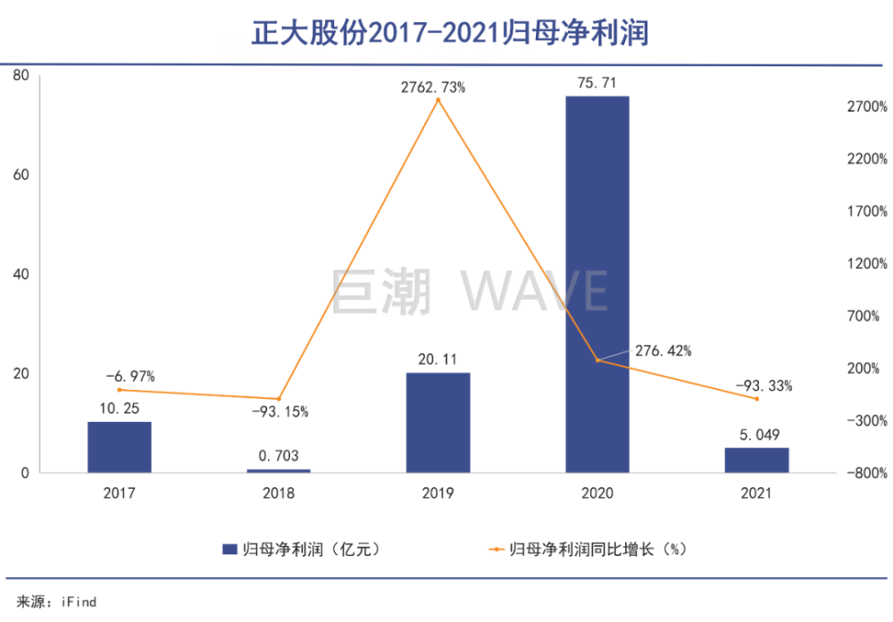
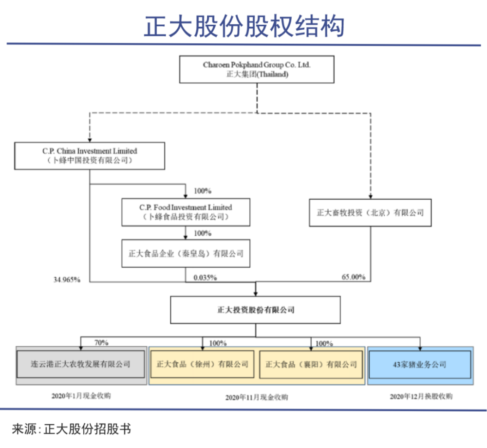
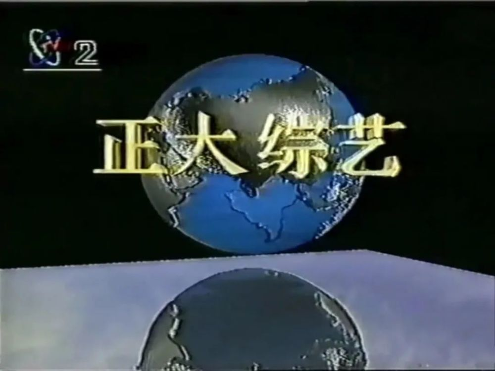
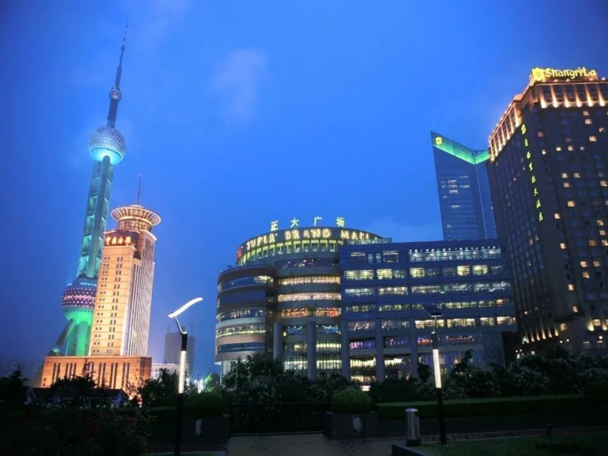
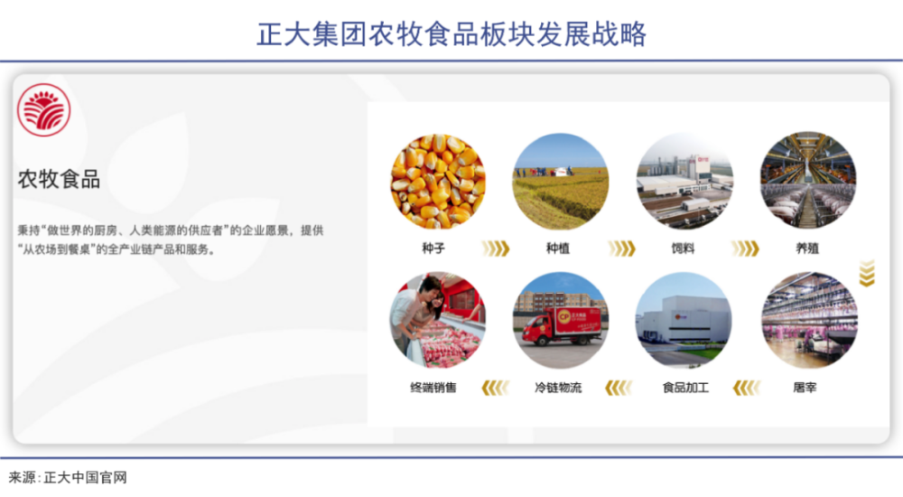
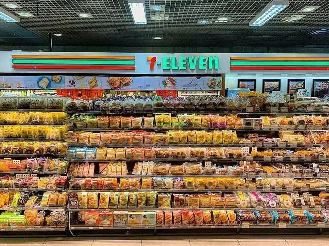
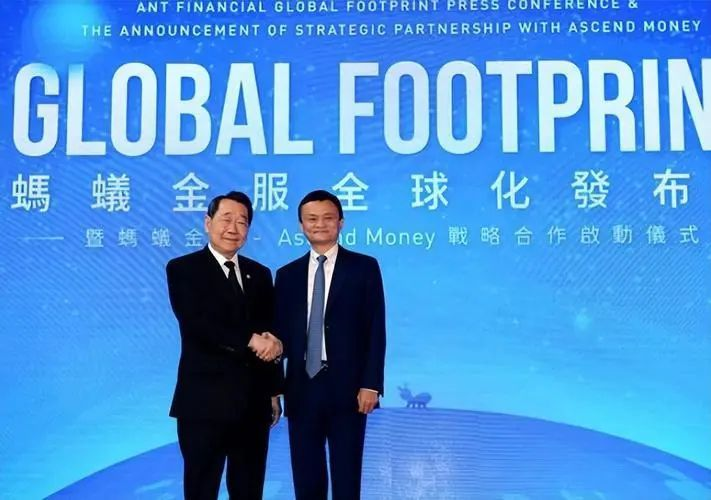

# 泰国首富中国养猪：“生猪大拼盘”上市受挫 和马云多有交集

文 | 谢泽锋

编辑 | 杨旭然

一场会面，市值暴涨7倍。

已经退休并隐居多时的马云会见了泰国首富、正大集团董事长谢国民。两人在不到一个月内两度会面，引发外界对于二人合作的猜测。

正大系旗下正大企业国际股价被瞬间引爆，继1月30日大涨73%后，1月31日继续暴涨2.51倍， 2月1日盘中一度涨超50%。连续三天大涨逾7倍。

泰籍华人谢易初创办的正大集团，是泰国首屈一指的巨型企业，谢氏家族更是连续11年霸榜泰国首富。

从一家菜籽店起步，正大集团历经四代，已经发展成以农牧食品、批发零售、电信电视三大事业为核心，同时涉足金融、地产、制药、机械加工等10多个行业和领域的多元化企业集团。2021年全球销售额高达840亿美元。

然而，这艘庞大的巨舰更多驻扎在实业领域，在资本运作方面却并不擅长。在卜蜂国际退市、卜蜂莲花除牌后，只剩正大企业国际这只上市公司独苗。更加令人尴尬的是，
**其在华生猪养殖业务所涉及的资本运作并不成功，被监管机构警惕紧盯，IPO已基本无望。**

外界猜测，谢氏家族亟需更加大手笔的资产整合和资本运作，以巩固自己的在华利益和商业版图。而马云近期则密集调研了全球各地的农业技术和项目。两家密切互动，或许意味着未来将在农业、资本等多个领域有较大的动作。

01 “生猪大拼盘”上市受挫

正大集团在华资产整合的重点，仍是自己的基石业务。

早在2020年底，正大将在华饲料和养殖业务从卜蜂国际中分拆出来，将所持有的43家养猪公司重组为正大股份正大股份（正大投资股份有限公司），于2021年5月递交A股主板上市招股书。

中国农牧业潜行40余载的外资巨无霸要上市，一时间业内哗然。有投资者将其比作A股市场另一条金龙鱼。根据《2022年全球养猪企业实力榜》显示，
**正大2022年母猪存栏115.2万头，高居全球第三，在中国的存栏母猪数约为38万头。**

不过，相比金龙鱼背后的郭氏家族，谢氏家族的时运有些不济。彼时正值猪价暴跌之际，当年生猪价格连跌5月，均价跌破20元/公斤，部分地区甚至跌破10元。
**对比年初高位36.7元/公斤，价格已经腰斩。**

暴涨之后，猪周期的寒冬期即将来临。果然，2021年新希望、牧原股份、正邦科技等业内大玩家都出现了巨幅亏损。

正大集团于2020年底逆势筹备上市，谢氏家族的如意算盘是趁此机会大笔募资150亿元，在猪周期新的起点蓄势扩张。当时正大股份生猪出栏量432万头，规模排到了全国第六位。相较来看，牧原股份生猪出栏量为1811.5万头，温氏股份为954.55万头。

**正大集团中国区资深副董事长白善霖曾透露，公司的目标是在2024年实现出栏2000万头/年的目标。意味着四年要翻四倍。**

除了战略扩张的需求外，正大股份也亟需补血降负债。财务报告显示，公司资产负债率从2018年末的68.96%攀升到2021年中的70.11%，其中短期借债高达89.44亿元，占总债务比重接近七成。

而且，2020年正大股份净利润高达75.71亿元，是两年前的108倍。业绩波动如此剧烈，谢家人好不容易赶上一波黄金牛市，便想借此机会登陆资本市场，估个好价钱。

但监管层显然对此非常警觉。 **在其更新招股书后，证监会下发了一份长达23页共1.8万字的反馈意见，涉及业绩可持续性、信披、资产重组、会计资料等等层面。**

而时至当下，仍未查询到正大股份及其保荐机构的回复稿，谢氏家族首个A股IPO的梦想实际上已经搁浅。

其实 **从意见稿和招股书中，可以明显的发现，正大股份是一个极为仓促的“大拼盘”。**
为了赶上猪周期的“末班车”，谢氏家族腾挪资产，通过发行股份的方式以281.4亿元收购关联方正大畜牧投旗下43家公司股权，成立正大股份。收购完成后，正大畜牧投资、卜蜂中国分别持股65%、35%。

但收购的过程却是问题重重，仔细梳理，可以发现， **公司一手高价收购大股东旗下亏损企业；另一手却转让、注销违规违法或官司缠身的企业。**
而且，公司与股东正大集团等公司之间存在频繁的关联交易，正大集团既是大客户也是大供应商。

正大集团在实业领域积累了诸多名誉，且被看做中国畜牧业的领路人， **但正大股份上市之路掩盖不住其趁机收割的投机和贪婪。**
上市搁浅后，正大股份2021年净利润仅有5亿元，同比暴跌了93%。

02“0001号外商”享尽红利

根在中国，投资中国，这是谢氏家族经久不衰的核心理念。

1979年，改革开放打响了第一枪。谢国民第一时间来到深圳，联手美国康地公司投资3000万美元，成立当时全国最大的现代化饲料厂正大康地公司。正大也因此被看作中国现代化畜牧业的开山鼻祖。

**值得一提的是，正大康地取得了深圳市外商投资0001号营业执照，也是深圳经济特区成立的第一家外商独资企业。**
此后，正大集团又相继拿下珠海、汕头的0001号外商营业执照。

1990年，中央一套热播的《正大综艺》红极一时，是许多人的“童年回忆”，正大集团凭此迅速在国内打开知名度。

_《正大综艺》是很多人对正大集团最深的印象‍_

之后，正大集团在上海成立了国内第一家肉鸡养殖加工一体化企业，也是中国第一家上市的合资企业——大江股份。

然而自1997年开始，大江股份利润大幅滑坡，一直处于亏损边缘。此后在新世纪的开端房地产、零售业方兴未艾。对于养殖业，谢氏家族萌生退意。

正如时任大江股份董秘顾德明所言：“在上海，10年前正大投资大江股份是对的，而现在，不能在上海投资养鸡、生产饲料了。这方面的投资应当转向中国的北方了，在上海主要投资领域是房地产和商贸业。”

**正大上海从2001年9月开始，不到一年的时间内，抛售了大江1.7亿股(B股)，套现1亿美金，从第一大股退为第三大股东。**
此后，随着正大撤资，原本作为中外合资的典范，知名B股之一的大江股份沦为壳资源，后来最终辗转退市。

虽然放弃了一家上市公司控制权，但正大在中国的投资并未停止。走过40多年，正大已是中国外商投资规模最大、投资领域最多的跨国企业之一，2021年总营业额1800亿元。

**谢国民看好中国，重仓中国。但作为家族产业继承人，也跟随中国经济变化调整投资重心。**
做多中国，让“0001号外商”走过两次金融危机的浩劫。起死回生后，又获得更大的成功。

1997年亚洲金融危机爆发，索罗斯做空泰铢，正大集团遭遇史无前例的危机。而就在最危急的关头，谢国民也没有出售在华资产，反而加大了投资。

当年，他选择卖掉泰国诸多资产，在上海开设第一家易初莲花超市。彼时，正大在中国最大的投资项目——上海正大广场资金链告急，但谢国民没有放弃正大广场，而是费尽心思为其续命。

_正大广场位于上海顶级地段位置‍_

**“在那种情况下，我们不能停，停就是灭亡，我们还要大发展，要保住有竞争力的行业，保住我们的机会和空间。”**
谢国民后来回忆说。1998年，中国业务为正大贡献了救命的160亿元收入和5.3亿元利润。

40多年来，从早期的畜牧养殖到中期的卜蜂莲花超市、正大广场、正大中心、大阳摩托、生物制药，再到2010年后参与金融投资，入股科兴，谢氏家族开始更多通过资本整合和股权投资实现家族财富的增长。

2012年，正大豪掷727.36亿港元从汇丰手中接过中国平安15.57%的股份，成为中国平安单一最大股东。2015年，正大与好伙伴日本伊藤忠组成的合资公司正大光明，斥803亿元入股中信，持有20.61%股份。

2020年12月，中国生物制药以5.15亿美元入股科兴中维，获得了后者约15%的股权。据2021年报显示，中国生物制药联营公司贡献了136.31亿的盈利，这笔收益极有可能来自科兴中维贡献。这也直接助推中国生物制药的年度利润提升至146亿元的历史最高位。

从第一批入华外商，到最大的外商投资企业之一，正大一直在享受中国蓬勃的增长红利。

03 “世界的厨房”隐形巨舰

相比人们熟知的正大鸡蛋、正大饲料等，正大集团拥有极为庞大的业务版图，是名副其实的隐形巨舰。

虽然财富杂志《世界500强》榜单并未纳入正大集团，但其840亿美金的收入，足可以排到世界第128名。

正大集团立志“做世界的厨房”，实现“从农场到餐桌”全产业链经营。

最为典型的就正大在泰国本土运营的7-11，
其背后也蕴藏着谢氏家族独特的经营心得。全球来看，本土化运作最成功、利润最大、成功经验最不可复制的，要属泰国711。

在泰国，7-11被称为“第二个家”，本国人平均每天要进出7-11两次。而拥有独家运营权的正大集团，更是将7-11作为商业版图扩张的触角和根基。

**目前泰国共拥有1.3万间7-11门店，靠着7-11这张巨大的网，从食品、药品到物流配送，从零售、电信到金融支付，正大可以全面感知商业冷暖。**

比如，一旦某种商品在7-11爆卖，正大就直接收购其供应商或自建品牌。7-11的维修处后来成了泰国最大的零售设备公司Retail
Link；7-11的配送中心，后来演变为泰国最大的物流配送公司；泰国最大的电信运营商TRUE电讯，源于7-11代收话费。

_谢氏家族在泰国深耕经营7-11多年_

目前，泰国7-11在新开门店前还会增设MG超级充电桩。原因是，正大集团和上汽集团联合在泰国生产名爵品牌汽车。

在国际市场，
正大的影响力也不容小觑。正大被称为“改变日本餐桌的企业”。早在1973年起，正大开始向日本出口鸡肉。80年代，泰国养殖虾也被出口到日本。正大为日本居民提供高性价比的鸡肉和虾，让各种炸鸡炸虾成了日本餐桌上的常客。

在和阿里体系的合作方面，其实早在2016年11月,蚂蚁金服就与正大旗下Ascend Money实现战略合作，双方曾试图联手打造泰国版“支付宝”。

谢国民早年就与马云相识，但当时他认为马云的商业理想简直是白日做梦。他曾透露， **早些年因为不理解电商盈利模式，因而错过了投资阿里的机会。**

_谢国民和马云此前已经多有交集_

可以发现，正大集团的经营策略和互联网有不少相通之处。例如7-11其实就是正大的渠道和流量池，同时也是商业大数据中心。这张网与阿里巴巴的新零售不谋而合。

随着阿里的崛起，谢国民改变了想法。他甚至视马云为自己的老师，“阿里巴巴仅用了18年，就超过了我们正大集团。”谢国民举例说，“我们和马云的阿里巴巴合作卖饲料，他教会村民们上网购买，这就是创新。”

04 写在最后

马云曾经不止一次地表态，阿里要做102年的企业。因为“阿里巴巴成立于1999年，102年刚好跨过19世纪，20世纪和21世纪。”

而正大集团成立于1921年，今年正好102岁。

或许是在正大集团身上洞察了百年企业的经营之道，或许是对这份长期经营、跨周期繁荣的期待，或许是在农业项目方面双方有很多可以交流和共同谋划的地方，马云和谢国民近期频繁互动，也吸引了外界关注的目光。

两位首富或许已经有了还不能示人的商业远景，但正大股份不久之前的折戟，仍然意味着，
**即便是中国改革开放历史上最成功的本土企业家，和最成功的外资企业家联手，想要改变农业这个中国最古老最传统的行业，也不是一件容易的事。**

