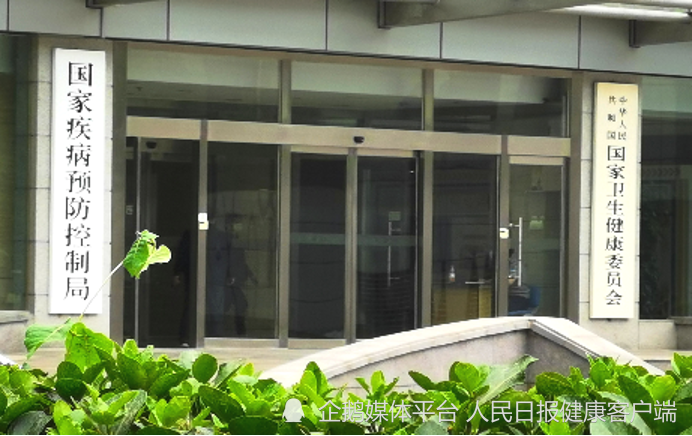
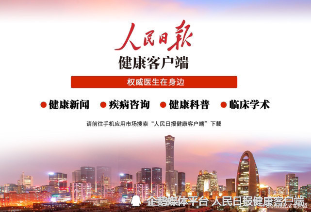

# 超10地组建或筹备地方疾控局，释放了什么信号？

据北京市卫健委官网，曾晓芃任北京市卫生健康委员会党委委员、副主任（兼），北京市疾病预防控制局局长，北京市疾控中心党委副书记、主任。

2021年5月13日，国家疾病预防控制局挂牌成立。人民日报健康客户端记者注意到，随着我国疾控改革向基层逐级深入，目前已有超过10地成立疾控局。

_国家疾病预防控制局。王振雅摄_

2023年1月，福建省人民政府发布一批人事任免，张国安兼任福建省疾病预防控制局局长。福建省卫健委官网显示，张国安1965年1月生，为省卫健委党组成员、副主任，负责疾病预防控制、卫生应急、监督执法等方面工作。

2022年9月，韩金艳被任命为天津市疾病预防控制局局长。据天津市卫健委官网信息显示，韩金艳兼任市卫生健康委员会党委委员、副主任，同时担任天津市疾病预防控制中心党委副书记、主任。

在此之前，湖南益阳市、株洲市疾控局都已挂牌。据了解，湖南省益阳市全国最早成立的地市级疾控局，2022年1月28日疾病预防控制局就已经揭牌。在县级层面，目前湖南郴州市桂东县、邵阳市隆回县、娄底市新化县、邵阳市新宁县都挂牌了县一级疾控局，成为组建基层疾控局的“先锋”省份。

此外，陕西、河北等地也将成立疾控局写入工作任务。

2022年4月，陕西省印发的《陕西省“十四五”卫生健康事业发展规划》，决定组建省疾病预防控制局，在省疾控中心加挂陕西省预防医学科学院牌子。整合市、县疾控中心和卫生监督所（站）职责，重新组建市、县级疾控中心，保留卫生监督所（站）牌子。

2021年7月，河北省政府办公厅印发的《河北省深化医药卫生体制改革2021年重点工作任务》提到，“组建河北省疾病预防控制局，理顺体制机制、明确功能定位，提升早期监测预警、风险评估研判、现场流行病学调查、检查检测、应急处置等能力。

按照国家疾病预防控制局成立之初的政策，“新机构将承担制订传染病防控及公共卫生监督的政策，
**指导疾病预防控制体系建设，规划指导疫情监测预警体系建设，指导疾控科研体系建设，公共卫生监督管理、传染病防治监督等五大职能。** ”

在《国家疾病预防控制局职能配置、内设机构和人员编制规定》中，则明确了国家疾控局的主要职责是：组织拟订传染病预防控制及公共卫生监督的法律法规草案、政策、规划等，
**领导地方各级疾病预防控制机构业务工作，规划指导传染病疫情监测预警体系建设，组织开展疫情监测、风险评估工作并发布疫情信息，建立健全跨部门、跨区域的疫情信息通报和共享机制等等。**

**有业内人士向人民日报健康客户端透露，“在国家疾控局之后，各地卫生健康行政部门、所属事业单位等均会开展相应机构建设和改革。能加强基层疾控机构能力建设，筑牢公共卫生安全防护网。”**

