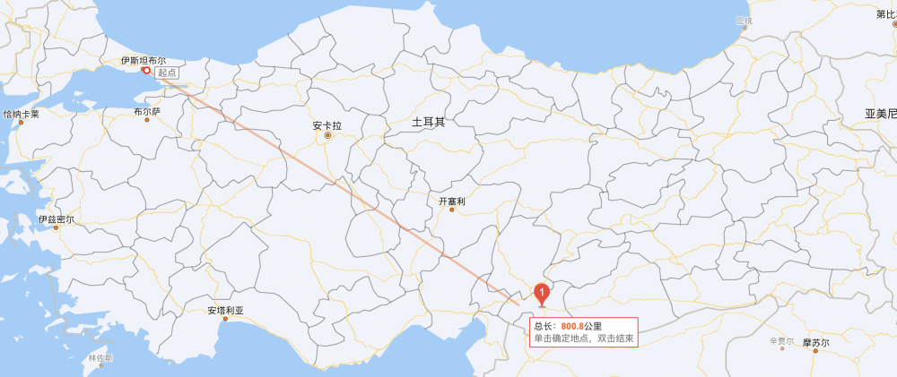
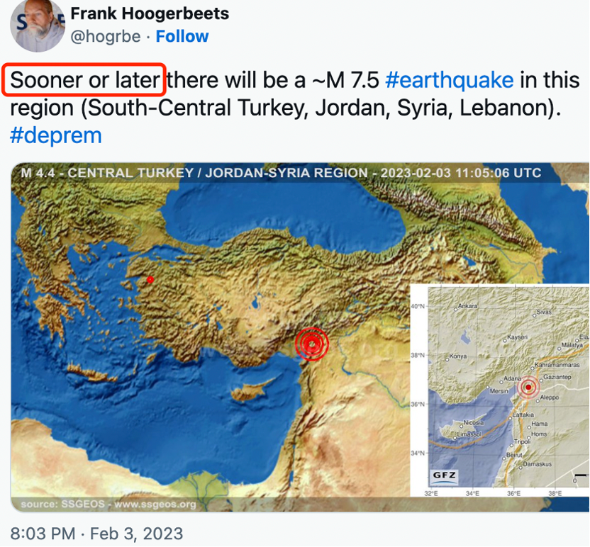

# 较真｜土耳其内政部长提前11个月预测到大地震？别被骗了

查证者：较真团队

这两日，社交媒体上流传这么一条微博，称土耳其内政部长"提前整整11个月”预测到本次大地震，“太负责了！"

该微博截取的，是一条2022年3月7日的微博截图。其内容显示，“昨天土耳其内政部长表示：土耳其即将面临一个巨大的灾难，一个巨大的危害性地震即将在土耳其发生，请大家做好准备”。

看起来，这的确像是一个准确的地震预测，真的是这么回事吗？

这条去年3月7日的新闻，来自一个阿拉伯语的土耳其新闻instgram账号“turkeyminute”。微博作者的转述，语气有点夸大。该新闻大意是，土耳其内政部长苏莱曼·索伊卢在灾害与应急局的备灾评估会议上表示，伊斯坦布尔和一些临近省份可能发生大地震，“这不是秘密，我们预计会发生大地震。”索伊卢还强调，是“科学数据表明，大地震离我们不远了”。

然而，这并不足以被称为准确预测了本次土耳其大地震。通常来说，人们津津乐道的那种地震预测，指的是“临震预报”，准确的“临震预报”要满足三点要求：

一要有准确的时间，往往要精确到天，才能让人们能够提前避难，因为人总不可能长期室外扎营睡觉。

二要有准确的地点，不能说一个太大的范围，否则避难的成本也会太大。

三要有准确的震级，而且通常是大地震才有提前避难的意义。

依据上述标准再来看看所谓的预测：

1.索伊卢说的时间“离我们不远了”，也有版本翻译过来是说“即将”，都不是一个明确的时间点，精度也不够用来提前避难。而且本次大地震距离部长的说法足有11个月，更不可能据此提前避难了。

2.索伊卢说的是“伊斯坦布尔和一些临近省份可能发生大地震”。土耳其有81个省之多，“伊斯坦布尔和一些临近省份”是比较小的范围，大概指的是土耳其的西北地区，但本次地震的发生地位于土耳其南部，震中距离伊斯坦布尔直线距离多达800公里，几乎相当于武汉到广州的直线距离。因此地点也是说错了。

实际上，索伊卢之所以预测地震在伊斯坦布尔附近，该则新闻中已经提到原因，是因为土耳其的地震专家预测的就是“北安纳托利亚断层”可能会发生大地震，伊斯坦布尔正是位于这一断层线附近。在此前几天的3月3日，土耳其地震专家开了一个会议，聚焦的也是“北安纳托利亚断层”。但本次大地震发生的位置，是位于“东安纳托利亚断层”。

3.索伊卢没有提准确的震级，但强调是大地震，这点勉强算是说对了。但综合来看，说索伊卢预测到了本次大地震是不符合实际情况的。

其实，索伊卢预测发生大地震的本意，也不是期待人们能够提前避难，而是要展开培训，让人们做好应对大地震的准备，他强调了大规模使用“AFAD”移动应用程序以确保在灾难发生时进行有效通信的重要性。另外，索伊卢预测大地震，是在2022年土耳其的“地震周”期间（3月1日至7日），因此视之为一个针对潜在大地震的常规提醒，比较合适。

除了土耳其内政部长之外，国外社交平台上更多的是流传一个叫Frank
Hoogerbeets的荷兰研究人员“预测”了本次大地震。他在地震3天之前，即2月3日发了一则推文，称“这个地区（土耳其中南部、约旦、叙利亚、黎巴嫩）迟早会发生7.5级以上大地震”。而他的依据，则是所谓“临界行星几何学”，即认为天体运动跟地震有关——这被许多科学家抨击为“伪科学”。更重要的是，他同样没有给出地震时间，而是说“迟早”会发生地震——不管该理论有没有道理，这都算不上“临震预报”，是指导不了地震避难的。

_Frank
Hoogerbeets说的是“迟早”会发生地震_

截止目前，“临震预报”仍然是世界性的科学难题。

