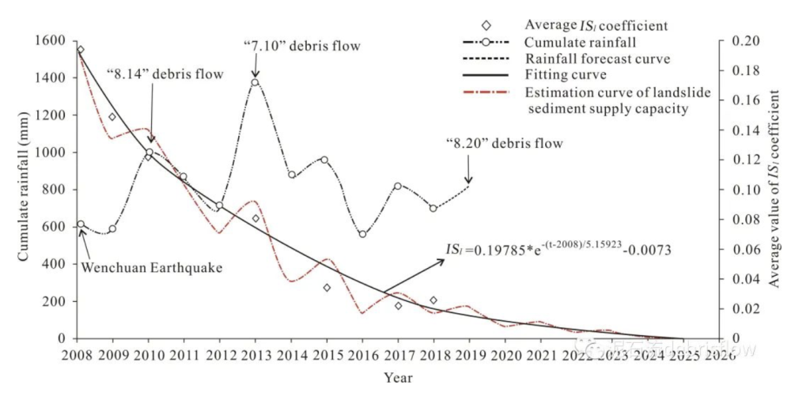

# 连续7级以上强震，云南也遭遇过，土耳其地震次生灾害影响可能延续20年

北京时间2月6日的9时17分和18时24分，土耳其先后发生了两次7.8级地震。地震带来了巨大破坏，根据世界卫生组织应急事务相关官员的推断，地震造成的死亡人数可能达到2万人以上。

连续两次强震意味着什么？哪些次生灾害需要重视？当地暴风雪会对救灾带来多大挑战？一起来唠科对话成都理工大学地质灾害防治与地质环境保护国家重点实验室唐川教授，探讨本次连续强震对土耳其的长远影响。

**一、地震发生后当地很多房屋倒塌，而一天内发生两次7.8级强震，也被很多人用“上百颗原子弹爆炸”来形容。这种“双震”，我们以前遭遇过吗？**

**唐川：** 从很多新闻上我们看见，土耳其、叙利亚有大量的房屋倒塌，其中甚至包含一些抗震能力较强的框架结构房屋。

分析人士说这次地震的震级接近汶川地震，级别其实弱一些，但土耳其是两次强震叠加，所以破坏力非常大。

说到双震，我突然回想起1988年11月6号，我们国家云南发生的澜沧-
耿马地震，我当时去地震灾区待了50多天。那次也是双震，第一场是7.6级，紧接着是7.2级。

两次强震后我到了耿马县城，整个县城的房屋（包括框架房屋），没有一间是完整屹立住的，几乎可以说是全部被夷为平地。

**为什么这种双震的破坏力强呢？简单的解释就是：第一场强地震后，大量房屋摇晃，有的倒了，还有一些没垮，但实际上已经产生“内伤”，如果再发生一次强震，大概率就垮了。**

我当时去看了一个医院，医院一般是比较好的框架结构，据说第一场地震后还没垮，还有病人在手术台上，接着突然又来了一次，就垮了，所以有不少医护人员和病人遇难。

**二、结合云南那次地震情况来看，这种连续强震对救援产生的直接阻碍是什么？**

**唐川：** 多次强震对于救援的影响是致命的，比如土耳其地震，大家都赶着黄金时间救人，但有些新闻画面里，记者正在拍抢险救灾，拍的过程突然又倒垮了。

1988年耿马震区山高坡陡，很多是石灰岩地区和峡谷地区，当时几个峡谷地区全部断道，里面的村民无法出来，救援难度很大。

因为地震以后，大量的崩塌都是从半山腰滚下来的，马上就造成道路损毁和河流堵塞，救援人员确实无法马上进去。一直到后来的汶川地震、芦山地震、泸定地震，这种情况都存在。

**三、每次大地震都有次生灾害，除了滑坡泥石流等，土耳其接下来可能还会面临哪些考验？**

**唐川：**
我们打开土耳其地图就可以看到，它实际上也是一个山地高原型国家，就靠近欧洲那边平原多一点。地震发生的区域恰恰也是山地，还有高原跟山地的交互地带。

所以从我的专业来说，这次的滑坡灾害不会少，媒体也报道了油气管道破裂等情况，这在大地震中也是不可避免的。

汶川地震因崩塌滑坡等次生灾害导致的死亡人数约占总遇难人数的四分之一，一般的大地震也有20%左右。也就是说，次生灾害仍会造成大量人员死亡，特别是山地等人口分布集中的地区。

**另外，这么大的一轮地震，对生态环境的影响是致命的，修复要很多很多年，甚至上百年。我研究汶川地震，到现在十几年了，当地生态环境依然没有完全修复，一些延续性的次生灾害还在发生。这就是我们专业上说的“地震放大效应”。**

具体比如，地震对坡面、对山地型或者山地高原型的水土保持影响非常大。地震发生后，大量土壤流失，大量耕地损毁，再加上滑坡和后期降雨的话，泥石流等灾害会让大量水体被污染。

说得再远一点，土耳其的气候适合农作物和植被生长，水资源也很丰富，因为这个地方的断裂构造复杂，沿断裂带发育许多河流和湖泊，可以容纳极为丰富的水资源，所以农业很发达，成为农业大国。但这次地震对农业的影响可能也很大，毕竟其境内支持农业的水利设施和水库，在一场大地震后可能无法正常运行。而且如果河流湖泊真的被大量泥沙污染了，也会直接影响农业生产。

虽然大家现在都忙着救灾，暂时没时间来管这些，但后期评估肯定还是要快速做出来的。

**四、这种级别的地震，次生灾害会长期存在吗？一般可能会持续多少年？**

**唐川：关于**
地震的长期影响和演化，08年汶川地震后我做了一些分析，当时根据1923年日本关东大地震和1999年中国台湾集集大地震的演化情况，分析了一个曲线。简单来说是，
**前5年为次生地质灾害的高发期，例如水土流失、植被破坏、崩塌和泥石流等；往后这个曲线就稍微变缓了，但每年还是会有一些灾害发生；到20年以后，这个曲线才开始趋于稳定。**

_图片来源：唐川《汶川地震区暴雨滑坡泥石流活动趋势预测》_

_汶川地震后，崩滑物源向沟道供给的实际能力受强降雨影响，以“震荡式”规律进行衰减，预计在2025以后达到震前水平。图片来源：熊江
唐川《物质是如何搬运出山区流域的？》_

所以这种影响是非常持久的。以泥石流来说，一个流域发生大量的水土流失以后，累计在这个流域，后期降雨对这些水土进行搬运，会对河流持续造成污染。如果是大地震的话，这个影响时间可能要持续四五十年。

土耳其的气候条件和水源条件好，植被恢复可能会快一点。
**但我判断，未来五年以内都是泥石流等次生灾害高发期。因为地震后山体掩体产生“内伤”，有的裂缝我们肉眼现在还看不到，可能时间长了就会垮，这种演化一般都至少持续20年。**

**五、新闻报道说，土耳其很多地方会有风雨雪天气，恶劣天气下救灾工作将更难开展？**

**唐川：** 我也看到了这个新闻，真的是雪上加霜。

大地震以后非常乱，第一会对流离失所的灾民造成直接影响，包括对食物、衣物、水的供给构成挑战，现在得靠政府的力量把灾民安置好。

第二，在救援黄金期，地质灾害的应急救援就像准军事行动，如果暴风雪来了，那对救灾人员提出了新的挑战。比如大量被掩埋的人，可能还有生命迹象，但刮风下雪后，救援难度自然就更大了。

第三，低于零度以后，掩埋的人员可能很快就失温死亡了。正常温度下，有些受伤流血的人员，如果及时被送到医院抢救还能坚持一段时间，但如果失温了就没办法了。

版权声明：本文系腾讯新闻《一起来唠科》独家稿件，未经授权禁止媒体转载，但欢迎转发至个人朋友圈。

