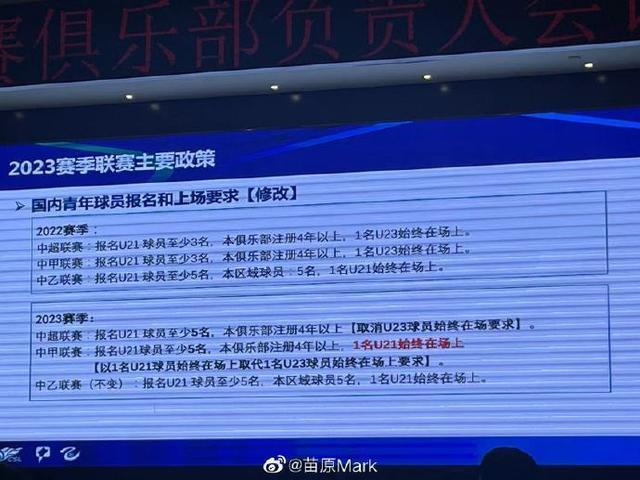

# 重磅！中超取消U23政策：实施6个赛季效果未达预期且曾乱象频生

2月7日上午，中国足协召开了2023年职业联赛俱乐部负责人会议，本次会议上宣布了新赛季职业联赛的各项政策，其中最重磅的消息当属
**中超取消U23政策，而中甲则将继续实施U21政策，即始终要求一名U21球员在场** 。

在中超取消U23政策后， **只要求一线队报名球员中至少有在本俱乐部注册4年以上的U21球员5名**
。中甲报名同样也有该要求，但要求1名U21球员始终在场。和去年相比，中甲的政策也是从1名U23球员始终在场变成了以1名U21球员始终在场。

始于2017赛季的U23球员政策自推出之日起，就备受争议。据红星新闻记者了解，这项连续推行了6个赛季的U23政策在新赛季中超被废止，也是因为近年来该政策的执行效果已非常有限，当初中国足协推行U23政策，主要是希望能给年轻球员更多上场的机会，解决职业联赛各级俱乐部优秀国内球员稀缺、国字号球队人才供给不力的现状。

应该说，U23政策给了不少年轻球员出头的机会，但弊端也是明显的，不少球队以“上有政策、下有对策”的态度来对待这项新政，最初场场可见U23球员刚刚出场就被换下的闹剧。后来，中国足协为了解决这些乱象，又将政策调整为中超各队U23球员上场人次必须与外援上场人数挂钩、每场比赛每队场上的U23球员不得少于1人。

从U23新政实施6个赛季来看，效果并未达到预期，特别是没有给各级国字号球队带来实质性的帮助。而且，因为政策让U23球员的身价和收入大幅上涨，反而带来了一些弊端——比如年轻球员闹转会、在政策扶持下不思进取、增加俱乐部运营成本等等。而真正有能力的U23球员其实不靠政策也能在队内打上主力，比如成都蓉城的胡荷韬、木塔力甫，相信即便没有U23政策，徐正源也会给予这两名小将重用。所以即便没有政策推动，那些有能力露头的年轻球员一样有出人头地的机会，在这种情况下，中超继续U23政策就显得没有太大的必要。

在中超U23政策废止后，可以预见不少U23球员的身价和收入都会下跌，但这也符合市场规律。另外，
**在今天的2023年职业联赛俱乐部负责人会议上，还宣布了国内联赛全面回归主客场制，中超、中甲实行常规的主客场制、中乙实行分区主客场制。**
另一个比较重要的变化是，
**2023赛季U21联赛的优胜队伍（名额待定）将升级到2024年的中乙联赛，届时他们将以俱乐部B队的形式参加中乙联赛，这也有效仿西乙、荷乙的意思。**

**引人关注的2023赛季各级联赛的参赛规模，并未在这次会议中确定** 。中国足协对中超、中甲、中乙的参赛球队数量均将“视准入情况待定”。

红星新闻记者 姜山

编辑 包程立

