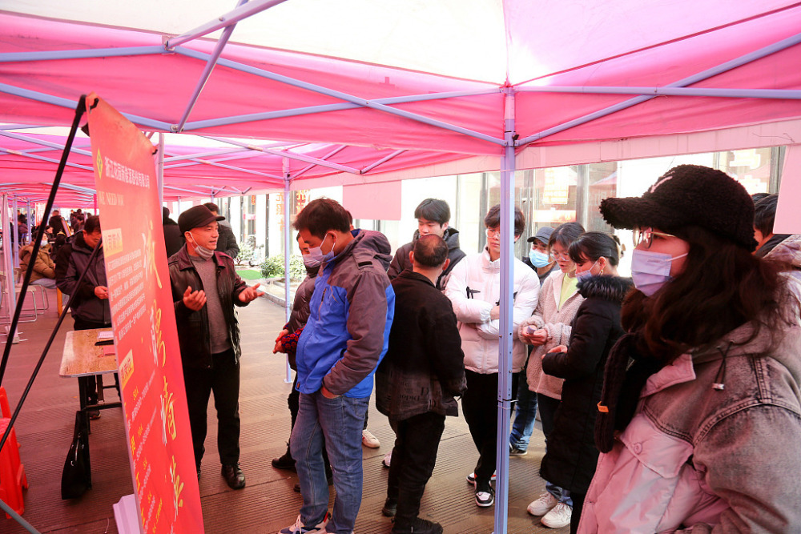

# “00后已经不愿意进厂”

_图/视觉中国_

春节后上班第一天，田意华就中了“大奖”——人生中第一辆汽车。

初八清晨，刚从湖南老家返回浙江永康上班的田意华接到电话，通知她中了“金券”，即价值59800元的汽车五金券。

“诈骗电话”！这是田意华的最初判断。为了防止被骗，她还找了弟弟陪同前去领券。她领到的是永康市今年推出的“五金券”中的“金券”，能购买指导价为59800的众泰T300汽车。2月1日，她火速提了新车，除去交税和购买保险，几乎没花多少钱。

永康是浙江金华代管的县级市，以“五金之都”闻名，中国80%的保温杯、70%的门和40%的电动工具都来自永康。这也吸引了云南、贵州、湖南等多个省份的务工人员，2022年，永康户籍人口62.1万人，登记外来流动人口54.95万人。

往年元宵节后，是复工、返工热潮的开始，但在袁永华看来，“今年比去年招工更难。”他是浙江永康一家户外箱包制品企业的副总经理，节后一直负责招聘工作。今年春节，尽管企业对留永过年的员工发放超50%薪水的激励措施，仍然挡不住员工返乡心切。“两三年没回家，加上去年行情不好，很多人感觉赚不到钱，今年可能就不出来了。”

用工荒是今年复工后最大的挑战

今年是田意华在永康工作的第七个年头。她是湖南人，正月初六，她从湖南返回永康，相比往年，这个日子提前了不少。“工厂今年统一在初八开工。”田意华说，选在初六回永康，也是因为永康市推出的“五金券”活动要求，要在今年1月30日前留永、返永、来永工作。

田意华从“浙里金消”微信公众号了解到“五金券”活动，在公众号预约后，有可能获得随机派送的“五金券”。

“五金券”分5种，“金券”为价值59800元的电动汽车券，名额20个；“银券”为价值2万元的无门槛消费券（200元一张，共100张），名额为140个；“铜券”为价值1万元的无门槛消费券（200元一张，共50张），280个；“铁券”为价值2588元的电动自行车券一张，名额为560个；“锡券”为价值599元的炊具礼包，8000个。

活动只针对“新永康人”，即非永康户籍的外来务工人员，吸引返工和用工的意图明显。

永康市商务局相关工作人员告诉《中国新闻周刊》，相比往年，“五金券”活动的门槛更为放开。以往的活动要求留永或返岗员工才能参与，需要交过社保或工伤保险，今年则取消了这一条件，新来永员工也能参与。此外，参与者也不限于工业企业，环卫工、服务业也可以。

“疫情三年，很多人回不了家，今年政策优化以后，很多务工者都回了老家一趟，因此给复工复产带来压力。”上述工作人员表示，“五金券”活动是为了吸引外来务工人员，传递永康人才招引求贤若渴的信号。

“五金券”在形式上也有所创新，以往的返工活动多以消费券或现金形式发放，今年的“五金券”则源于永康“五金之都”的定位，从金券到锡券，包括汽车、电动自行车、炊具等永康本地特色行业。

上述工作人员介绍，往年的消费券使用有门槛，有满减活动才能使用消费券，今年则可以直接当现金使用。

“五金券”为企业尽快复工复产提供了帮助，不过也有员工表示，参与感不够强。相比于50多万的务工人群，五金券的奖项名额仅过万，能幸运中奖的仍是小部分人。

田意华是五十分之一中最幸运的人。田意华和父亲都在浙江启承铝业有限公司工作，她在销售内勤岗位。启承铝业多年从事模具、汽配行业，其工作人员告诉《中国新闻周刊》，由于这两年新能源汽车订单增多，工厂订单也有所上升。春节后，由于不少员工返乡，目前还有几十号人没有到位。受制于缺工情况，与供应商协商后，2月份订单会相对压缩一些。

用工荒仍然是今年复工后最大的挑战。一方面，去年返乡人数远没有今年多；另一方面，工厂订单不稳定，真正复工复产的只有几家大企业，中小企业都还没上轨道。“去年很多厂子生意都不好做，很早就放假了，现在这个时候，员工都还没有信心。”袁永华判断，很多去年离开的员工，今年还在观望。

另一方面，当地对外来务工人员的吸引力也在下降。“现在永康租房要六七百一间，工资五千，在中西部可能也能拿到这么多钱，很多人过完年就不愿意来了。”

永康的务工人员多来自云南、贵州等地。“如果没有云南贵州的劳务输出，（永康）很多厂可以关掉了。”袁永华说。近年来随着云贵等地区扶贫工作的进展，贫困人口减少，愿意跨省打工的人也少了。

25岁以下的年轻人比去年少了20%

袁永华的工厂里，目前还有至少20%的人员缺口，尤为缺乏的是25岁以下的年轻人。

春节后，袁永华就泡在了工厂附近的劳务市场里招人。他的工厂需要招40名装配工、30名组架工，以及冲床工、包装工、清洁工等数十名一线员工。袁永华透露，目前装配工的底薪为5000元，每天工作八九个小时，计件多的装配工，一个月薪水能多三分之一。

袁永华所在的企业从事户外用品、箱包等制作，企业成立十余年，70%外销海外，沃尔玛等均是企业大客户。企业也有自主品牌，产量占全厂的40%。工厂里百分之七八十都是老员工，主要负责箱包等产品。“箱包的工人做了十几年，对生产非常熟悉，缺人的主要是户外用品。”

最缺人的装配工岗位，是传统工厂都有的流水线，每天一条线能生产3000件产品。“资历久的装配工，订单多的时候，每月薪水能拿到1万多元，其他人也有七八千元。”袁永华说。

不过，技术工工资高，但责任也大，有绩效考核，赏罚分明。他曾在广东的企业做管理工作，相比以前，现在工厂的管理约束更少了。“现在扣钱没有以前多，上下班时间和请假批准也更宽松。”

即便如此，还是很难招到年轻人。袁永华估计，从当地劳动市场的情况来说，25岁以下的年轻人比起去年少了20%。“有的人可能去送外卖、快递了，相比工厂更自由，待遇可能也稍微高一点。”

年轻人更偏向打零工。即使是进工厂的年轻人，也常常做一个月就走了。

邱建生是永康市云祥人力资源有限公司的创始人，他发现，00后已经不愿意进厂。“现在工厂不是招不到人，而是流失率太高，能达到50%-60%，年轻人不愿意长期待在工厂了。”

用他的话说，00后工人和70后、80后不同，大多是独生子女，有父母帮衬，只要手里有钱吃饭，“想辞职就辞了”。

在永康的不少企业，已经开启“生产智能化”的进程。永康以五金产业著称，这是劳动力密集产业，有较强的智能化需求。但对于附加值低、产量小的产品来说，智能化成本太高。“例如十多块钱的箱包，用机器生产不划算，很多企业不敢投入。”

袁永华透露，如果是远销欧美、利润高的产品，机器换人的收益也高，很多大型企业已经投入智能化。但对于中小企业，即使有政府补贴，也难以转型升级。“我们企业冲床岗位部分智能化了，但装配还没有智能化，不光投入大，而且可能还没有人工效率高。”

永康紧邻义乌，不少企业以外销为主。外贸企业生产季节分明，“一年可能只有两三个月，接了外贸单才开始用工生产。”邱建云说，这也使外贸企业倾向于与劳务公司合作，有用工需求时才找劳务工，以减少成本。

面临转型困难的传统工厂可能难以与外卖、快递等新业态竞争。“经济本身不怎么好，很多企业都撑不住了，更不可能加工资。”在过去，中国制造业以物美价廉著称。“产品低端，没有自主品牌，利润低，唯一的盈利点就是人工便宜。”
邱建云说，而现在，这一点也在逐渐改变。

邱建云的劳务中介公司在去年亏损了10万元。“大多工人的介绍费是500元一个月，而招聘、税务和办公费用等成本，摊在每个人头上也要400多元。”邱建云说，去年用工需求不多，而成本相对固定，导致出现亏损。

邱建云曾在台资企业工作数年，当年招工时，入职三个月才和工人签劳动合同。“现在满一个月必须签劳动合同，三天以上必须结清工钱。”浙江省也逐步要求企业为员工缴纳社保，最低按社平工资60%的基数为员工缴纳，但目前还未强制执行。邱建云说，一旦执行，他很难承担这部分开支，“减去成本后，剩下的钱不够交社保了。”

在他看来，曾经以世界工厂著称的中国传统中小制造企业，正在面临比预想中残酷的淘汰制。“没有高新技术，没有自主品牌，用工成本在增加，生存空间只会越来越小。”

（应受访者要求，袁永华为化名）

记者：蒋芷毓

