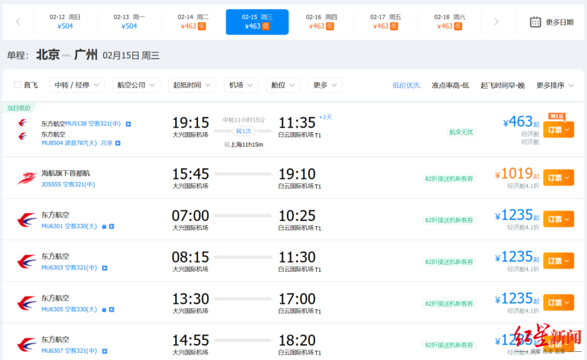
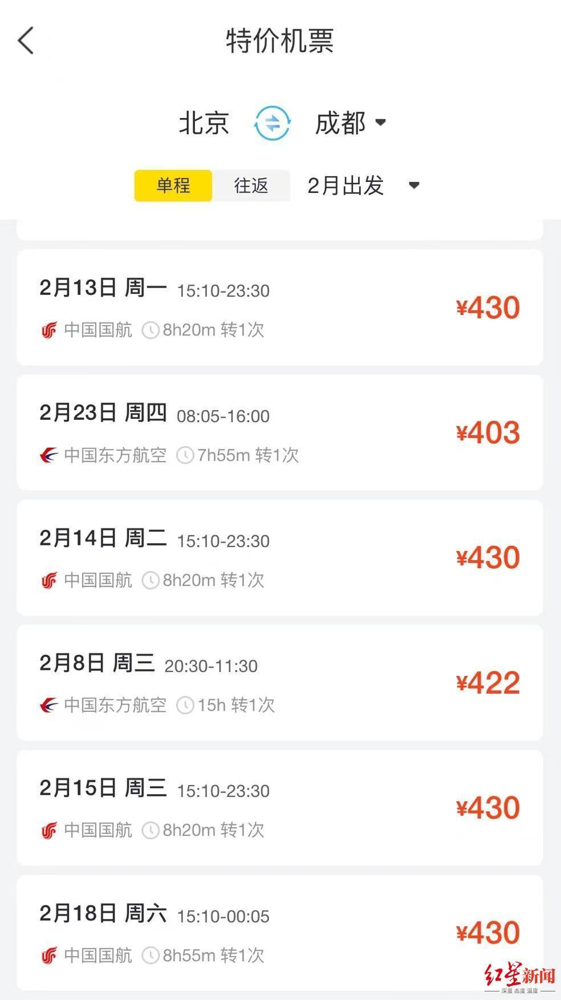

# “以往同时段票价没这么贵！”传多家航司暂停超低价政策，民航局回应

2月7日晚，网传消息称，国内7家航空公司接到要求，为减少亏损，停止低价投放，监管部门将核查票面以及航信系统。三大航（国航、南航、东航）于2月3日先行暂停超低价政策，并于2月6日凌晨按指导调舱。

一时间，机票涨价、限制打折率的话题在网上引起热议。2月8日，一位受访者告诉红星新闻记者，自己购买的同一航班，在一个月内价格上浮了83%。另据红星新闻记者观察，目前多个航线出售的4折以下机票的确有所减少，如2月15日京广直飞航线中4折以下机票已不见踪影。

此外，部分航线同日的最低机票价格，也的确高于网传要求中所说不得低于正价的4折价位。就此，有航空公司内部人员指出：“以往同时段机票没这么贵！”

针对此事，有媒体询问国航、东航相关负责人。国航方面表示，“确实不太了解。”东航方面未给予正式回应。而据中新财经报道，民航局方面相关负责人表示，民航局没有对航空公司提出过相关要求，具体内容可以和相关部门联系。

机票价格现状观察：4折以下机票减少

按照网传消息，接到上述通知的7家航司分别为国航、东航、南航、厦航、川航、深航、山航。对机票价格的具体要求为，上述承运人所占份额超65%的航线，不得低于正价最高承运人4折同等价格；份额高于75%的航线，不得低于承运人中正价最高者5折（联程不在管控范围）。

长期从事机票代理事业的杨先生向红星新闻记者解释，如果要求的内容属实，那么就意味着，比如多家航司共同执飞某条航线，其中一家航司经济舱的最高机票价为2000元，那么上述共同执飞的其他航司机票报价，就不能低于2000元的4折，即800元。

实际情况是否真的如此？记者通过携程机票订购窗口查询发现，2月13日北京直飞广州的72架次航班中，共有包括三大航、厦航、海南航空、吉祥航空等10家航司承运。其中，最高票价为厦门航空的CA1315航班，经济舱价格为2970元；在网传通知中提到的7家航司中，最低票价来自东航，经济舱价格为1265元，而4折机票的价格1188元。

“同以往相比，现在是飞行淡季，过去同期价格不会这么高。”杨先生告诉记者，按照他的机票受理经验，在元宵节和寒假之后，飞行就进入了淡季，京广线的正常价格一般会稳定在700-800元左右。“现在的价格确实要比以往有所抬高。”杨先生说。

红星新闻记者也发现，相比于过去同期，4折以下机票数量也有所减少。如2月13日北京直飞南京11架次航班中，东航经济舱最低折扣为5折，价格达1109元，逼近同一天国航公务舱1.7折后1120元的售价。而京广线2月15日直飞航班的票价，也全部在4折及以上。

_2月15日的京广线中，已无低于4折机票_

机票代理商：特价机票减少，最低价有上浮

除了机票价格整体上浮外，淡季期间，各大航空公司出售的特价机票也悄然发生了变化。红星新闻记者在多个机票订购平台看到，目前特价机票仍旧存在，但价格相比过去有所上浮，且大多都需要中途中转，数量也有所减少。

成都往返北京的特价机票显示，2月期间成都飞北京的特价机票共有8个架次，其中东方航空4个架次的机票价格最低，为529元，但都需要中转，飞行时长超过9小时。而直飞的航班机票价格均在700元左右。

“一般而言，一整个月航空公司推出的特价机票只有5个架次，这样的现象的确不常见。”杨先生说。在疫情之前的正常水平下，尤其是出行淡季，一般航空公司推出的特价机票数量大多维系在7-8架次，部分低价甚至会在100-300元之间。

_北京飞往成都的特价机票，均需转机，飞行时长在7小时以上_

对于机票价格近期的上浮，不少人也有着直观感受。长期往返北京和成都的陈女士就发现，自己购买的同架次航班，机票价格在一个月内出现了大幅上扬。

“我1月4日购买的成都飞北京的机票价格，加上燃油费一共才660元。仅一个月时间，同一架次航班的机票价格已上涨到1100元。”

陈女士告诉红星新闻，她购买的2月9日河北航空NS8002成都飞北京的机票价格为970元，平台显示为4折经济舱机票，加上130元的机建燃油费，总费用达1100元。换言之，抛开机建燃油费，该趟航班的机票价格相比于1个月前涨了440元。

“按理说现在并非节假日，明天也不是周末，淡季机票价格涨幅这么大，我不太理解。”带着陈女士的疑惑，红星新闻记者致电了河北航空。该航空公司一名接线员表示，对于网传机票涨价消息并不知情，也未接到所谓限制降价的相关文件。

针对乘客指出的机票涨价现象，该接线员表示：“机票价格有所浮动是正常现象，打折机票的降价幅度会随着购买人数的增加逐步降低。”该接线人员解释称，当前记者咨询的陈女士所购买的机票之所以出现价格上涨，一方面原因在于购买期限临近起飞，所以价格上浮；另一方面按照航空公司打折机票出售机制，“比如出售的4折机票已售空，价格就会自动变成5折、6折，以此类推”。

红星新闻记者发现，陈女士所购买的航班除了在2月9日机票价格上浮外，即便在非临近起飞日的2月13日，该航班机票价格也超800元，远高于1月的530元。但该人士指出，机票价格上涨并非人为干预，河北航空也没有刻意限制降价行为。

网传信息是否可靠？

航司内部人士：都只是听说，没看到文件

2月8日，“三大航”之一的某航空公司总部工作人员回应红星新闻表示：“网传消息我们也看到了，确实此前有在和同事闲聊时听说，但是我们也并未看到相关的正式文件。”

此外，另一家“三大航”之一的航空公司内部人员也表示自己也听说了相关消息，并查询了部分机票价格。这名内部人士表示：“以西安飞北上广等城市为例，现在的机票价格至少在800元以上，加上机建和燃油费快上千了，以往这个季节票价不会这么贵。”

对于网传信息是否有正式文件下发，该人员透露，售票部门同事表示现在还没有相关的正式文件下来，但是目前的票价确实不算低。

作为机票代理商的杨先生，也同样对网传信息有所耳闻。“我们也都只是听说，没有看到文件。”杨先生表示，据其所知，规定的限制降价要求并非针对所有航线，而是主要针对如北京飞上海等商务航线。杨先生说，网传的内容其实去年也有，但后来并没有引起机票价格大反弹。虽然网传信息有待核实，但在杨先生看来，近期机票价格有所抬升的现象的确比较明显。

当前，相关部门是否确定限制打折率以及机票涨价的原因尚无定论。但一个不争的事实是，2020年-2022年，航空公司都陷入经营困境。今年1月30日晚，国航、东航、南航分别发布了2022年的业绩预告，报告期内，三大航预计合计亏损逾1000亿元。

在2023年1月举行的全国民航工作会议上，民航局局长宋志勇曾表示，2022年，全行业亏损达到2160亿元，运输规模仅相当于2012年水平，有8家航空公司资不抵债。

会上宋志勇也特别强调：“2023年，民航业将在做好运行保障能力评估的基础上，把握好行业恢复发展的节奏，力争行业总体恢复至疫情前75%左右水平，实现盈亏平衡。”

红星新闻记者 杨雨奇 实习记者 付垚 北京报道

责编 任志江 编辑 王禾

