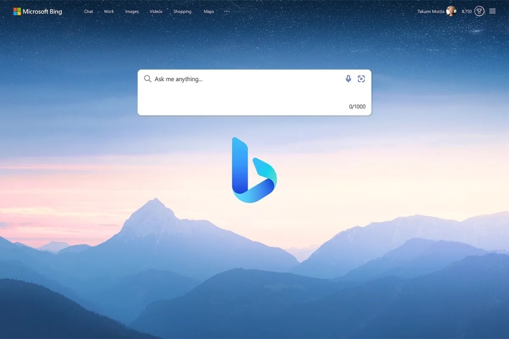
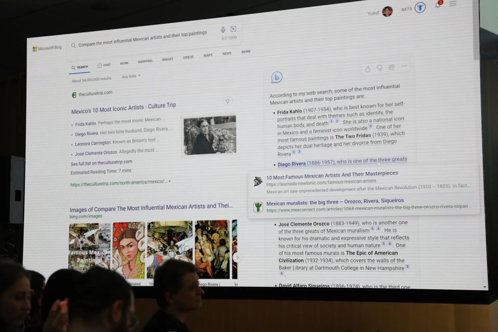
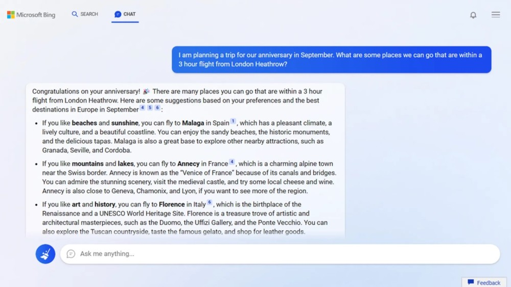
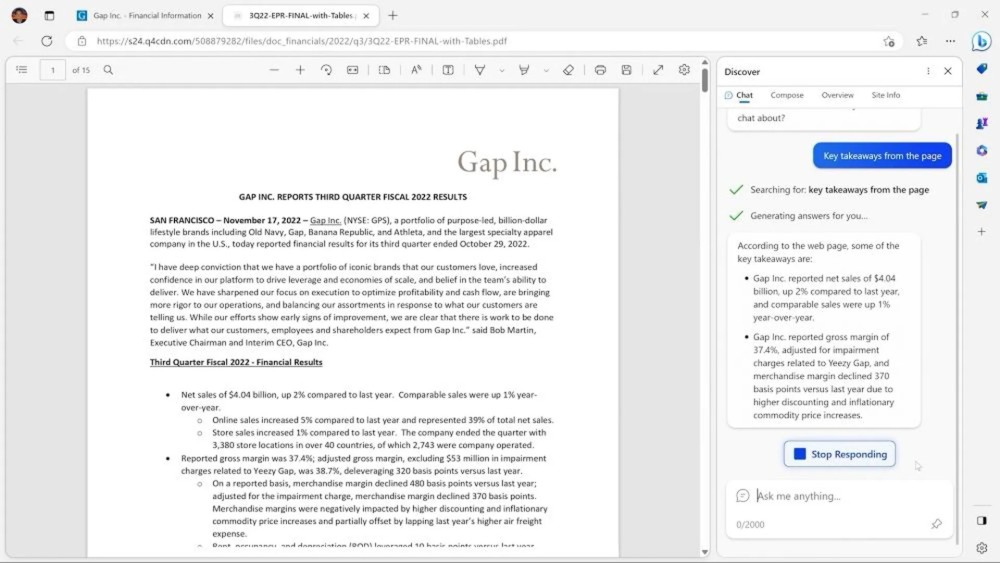
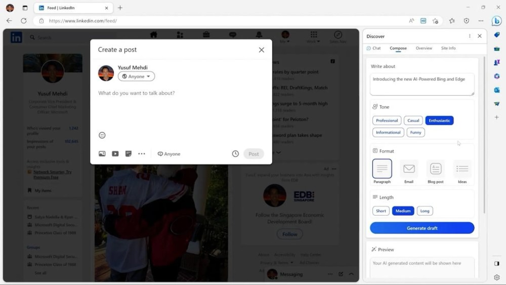

# “搜索领域新的一天”：微软推出支持聊天机器人的必应

  * _1_ 微软宣布其搜索引擎必应（Bing）的新版本，基于与支持聊天机器人ChatGPT相同的人工智能（AI）技术的升级版本，同时还为其 Edge 浏览器提供了新的AI增强功能，
  * _2_ 其中一种模式与AI注释并排显示传统的搜索结果，而另一种模式允许用户直接与必应聊天机器人交谈，在ChatGPT等聊天界面中向其提问。
  * _3_ 与ChatGPT不同，新的必应还可以检索有关最近事件的新闻，甚至可以引用新闻网站在过去一小时发布的故事，来回答有关其自身发布的问题。

_新必应界面。_

微软宣布其搜索引擎必应（Bing）的新版本，基于与支持聊天机器人ChatGPT相同的人工智能（AI）技术的升级版本。该公司在推出该产品的同时还为其 Edge
浏览器提供了新的AI增强功能，并承诺这两者将为浏览网页和在线查找信息提供全新的体验。

“这是搜索领域新的一天。”微软首席执行官萨蒂亚·纳德拉（Satya
Nadella）2月7日在宣布这些产品的活动中说。纳德拉认为，网络搜索的范式几十年来没有改变，但人工智能可以比传统方法更流畅、更快速地传递信息。

“比赛今天开始，我们将继续前进并快速行动。”他说，“最重要的是，我们希望在搜索领域再次获得很多创新的乐趣，因为现在是时候了。”

**Edge浏览器推出两项AI增强功能**

在演示中，该公司展示了其所说的“新必应”在各种配置下的运行情况。其中一种模式与AI注释并排显示传统的搜索结果，而另一种模式允许用户直接与必应聊天机器人交谈，在ChatGPT等聊天界面中向其提问。

_新必应将提供评论和见解以及用户的网络搜索。_

微软展示了一些搜索示例：在必应上查询食谱、旅游小贴士，以及从宜家购买家具。在一个演示中，必应被要求“为为期5天的墨西哥城之旅的每一天创建一个行程”。这个问题完全由聊天机器人回答，它描述了一个粗略的行程以及指向更多信息来源的链接。

_新必应提供帮助规划旅行路线的交互示例。_

与ChatGPT不同，新的必应还可以检索有关最近事件的新闻。在科技媒体The
Verge的演示中，搜索引擎甚至可以引用新闻网站在过去一小时发布的故事，来回答有关其自身发布的问题。

微软表示，这些功能都由GPT 3.5的升级版提供支持，GPT
3.5是为ChatGPT提供支持的OpenAI的AI语言模型。微软称之为“普罗米修斯模型”，并表示它比GPT
3.5更强大，并且能够更好地用最新信息和带注释答案来回答搜索查询。

新的必应2月7日上线“桌面有限预览”，但用户似乎只能“询问”许多预设查询之一，并且每次都收到相同的结果。还有一个等候名单，可以在将来注册完全访问权限。

除了新的必应外，微软还为其Edge浏览器推出了两项新的AI增强功能：“聊天”和“撰写”。这些将嵌入到Edge的侧边栏中。

Edge中新的“聊天”功能将允许用户向AI聊天机器人询问有关他们正在查看的文档的问题。

“聊天”允许用户总结他们正在查看的网页或文档，并询问有关其内容的问题，而“撰写”则充当写作助理，根据一些开始提示，帮助生成从电子邮件到社交媒体帖子的文本。

_“撰写”将在Edge中提供写作帮助。_

自去年11月ChatGPT推出以来，人们对人工智能文本生成的兴趣呈爆炸式增长。与ChatGPT创建者OpenAI密切合作的微软正在寻求利用这种兴奋，并已经宣布如何将这项技术集成到其办公软件套件中。

与此同时，谷歌对一些人所说的用户在线查找信息方式的范式转变感到措手不及。据报道，ChatGPT的推出引发了这家搜索巨头内部的“红色代码”，长期缺席的创始人拉里·佩奇（Larry
Page）和谢尔盖·布林（Sergey Brin）被选中来帮助应对可能对该公司最大收入驱动因素——搜索构成威胁的问题。

为了抢在微软今天的公告之前，谷歌前一天推出了自己的 ChatGPT服务，名为巴德（Bard）。

**人工智能驱动的搜索的未来**

然而，对微软和谷歌来说，更大的问题是：人工智能聊天机器人是搜索的好替代品吗？这项技术将如何与现有的在线查找信息的方法并驾齐驱，以及当它犯错误时会发生什么？

后一点特别重要，因为像 ChatGPT
这样的人工智能语言系统有一个有据可查的倾向，即把虚假信息当作事实来呈现。尽管研究人员多年来一直警告这个问题，但自ChatGPT在网上推出以来，人工智能产生错误的例子不计其数——从聊天机器人编造真实人物的传记细节到伪造学术论文和提供危险的医疗建议。

“ChatGPT的预训练依托于大型语料库，而语料库来源于互联网上实际发生的语言使用场景。一方面，这使得其无法避免地带有虚假信息、歧视偏见信息，另一方面，也往往容易忽略冷门信息。”上海人工智能研究院研究员陈逸君对澎湃科技（www.thepaper.cn）表示。

对于ChatGPT的内容偏见问题，北京智源人工智能研究院研究员曹越对澎湃科技表示，“本质上深度学习方法都是拟合数据，偏见本身是存在于数据之中的，如果真的要解决偏见问题，可能还是从数据入手最为合理。”

这种人工智能的愚蠢行为已经成为一个问题，聊天机器人的兴起为这个问题带来了新的关注，但谷歌多年来一直越来越多地使用人工智能来总结网页。这导致了一些引人注目的错误，比如谷歌对搜索“癫痫发作了怎么办？”的回应——建议“按住人或试图停止他们的动作”——与在这种情况下应该做的措施完全相反。

微软在演讲中提到了这些问题，表示它一直在努力防止偏见和“越狱”（让人工智能聊天机器人无视防止他们产生危险或仇恨内容的过滤器）等风险。Azure云服务负责人工智能的萨拉·伯德（Sarah
Bird）说：“有了这款产品，我们在开发风险缓解措施方面比以往任何时候走得更远。”

然而，微软显然也在为系统犯错误做准备。新必应的界面包括对用户的警告：“让我们一起学习。必应由人工智能驱动，因此惊喜和错误是可能的。确保检查事实，并分享反馈，以便我们学习和改进！”

但微软没有解决一些问题，包括人工智能辅助搜索如何破坏网络生态系统的平衡。如果像新必应这样的AI工具在没有用户点击的情况下从网络上抓取信息，它就会消除使许多网站维持运转的收入来源。如果这种新的搜索模式要取得成功，就需要保留一些旧协议。

此外，考虑到所需的算力，纳入ChatGPT等AI工具对谷歌和微软来说可能都是成本高昂的。

“通过嵌入（embed）API，错误内容和偏见问题在技术路径上容易解决。真正要解决的是成本问题，以及融合到现有搜索引擎索引方式的工程问题。”清华大学交叉信息研究院助理教授吴翼告诉澎湃科技。

摩根士丹利的分析师布莱恩·诺瓦克（Brian
Nowak）估计，ChatGPT每次查询的成本大约是谷歌传统搜索查询成本的七倍。如果OpenAI能够获得微软Azure云服务的最低价格区间，这个成本倍数可能会下降到四倍。但即便如此也仍然是一个相当大的差距，反映出微软在将ChatGPT和其他OpenAI工具更进一步嵌入到其产品中时可能承担的成本。

