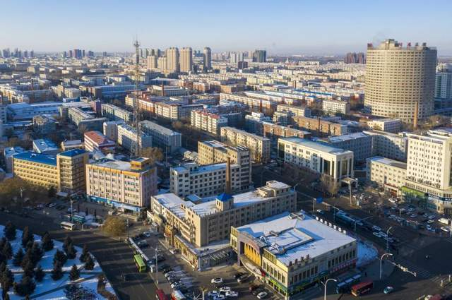

# 东北“撤街设镇”，透露出不寻常信号

**不要感到奇怪，未来我们会看到一些乡镇、县城消失，这当然不是一件坏事。**

**冰川思想库特约撰稿丨熊志**

把街道改回乡镇，北方城市出现了让很多人看不懂的反常操作。

这一逆向调整，发生在黑龙江。据报道，黑龙江伊春、齐齐哈尔等地正在推动部分街道“撤街设镇”，已有调整取得实质性进展。

其中，伊春市乌翠区撤销四个街道办事处，设立翠峦镇、乌马河镇；在齐齐哈尔市碾子山区，则撤销富强街道，设立华安镇。

图/网络

大家都知道，随着经济发展和城镇化的推进，撤乡（镇）设街道，以及撤乡并镇、撤县（市）设区成为一股潮流。

“撤街设镇”的回调，标志着有些地方摊大饼式的城市扩张宣告结束，很多吃财政饭的中小城市，面临人口流失、产业萎缩、城市收缩的局面，它们的困难可能才刚刚开始。

01

好好的街道，重新撤改回乡土气息更浓厚的乡镇，为什么让人意外呢？

首先，尽管乡镇和街道都是平级单位，但在中国的城镇化体系中，它们的待遇和地位其实并不是一样的，撤镇设街在多数情况下都是一种“升格”。

一般来说，乡镇包含着很大一部分农业人口， **撤镇设街以后，级别不变，待遇却能升级。**

对城市来说，城区范围扩张，更有利于整合资源，建设一些基础设施。比如现在修建地铁，在城区人口规模方面就有明确的门槛要求，达不到就没有资格。

而对被调整的镇而言，成为街道，纳入城市一体化的规划范围后，科、教、文、卫等城市功能定位更加明确，市政配套设施也能迎来统一升级。

图/图虫创意

正因如此，过去这些年城镇化浪潮中，这种行政区划的撤并调整，成为一种常见现象。镇希望升格成街道，县希望升格成区，升格成市。

总的来说，传统的乡镇在萎缩，农业人口转移为城市人口，中心城区的范围越来越大了，城市管理越来越扁平化，辐射能力越来越强。

**当然不管是撤镇设街，还是县改区，都不是想撤就撤，想设就设。** 在人口和面积、经济、基础设施和公共服务等方面，它必须达到一定的标准。

以这次逆向调整、撤街设镇的黑龙江为例，当地的《黑龙江省设立街道标准》中，就明确规定了设立街道的人口、经济等指标。比如经济指标是这样的：

拟设街道区域前两年全口径财政收入或人均可支配收入位于所在不设区的市或市辖区下辖乡（镇）的前30%，第二、三产业增加值位于所在不设区的市或市辖区下辖乡（镇）的前30%。

说得直白点，只有人口规模够大，密度够高，经济实力、财政家底足够好，才有资格从镇变为街道。

不过在现实中，一般升格上去就不太会调回来，以往也有一些个案，但并不多。 **毕竟改为街道后，能够增强城市功能，增加人口吸引力。**

所以这次黑龙江的调整，透露着不寻常之处——不是一市一地调整，而是涉及几个城市，涉及多个街道，逆城市化的信号意义已不言而喻。

02

黑龙江的这些街道，为什么被打回原形了？

原因也不奇怪，说到底是因为城市在收缩，人口在流失，以前乡镇达到了设立街道的标准，现在产业、人口都在萎缩，已经不达标了，继续按照街道管理不合时宜。

收缩型城市不是新概念了，这几年很多学者都关注到了城市收缩的问题。 **他们发现，城镇化的过程，并不必然伴随着扩张，也有地方在收缩。**

比如，中国城市规划设计研究院院长王凯统计发现，过去十年间337个地级及以上城市中，150个城市的市域人口减少3637万，比2000-2010年人口减少的城市增加61个。

黑龙江此次调整的两个城市，伊春和齐齐哈尔，可以说是收缩型城市的代表。

以伊春为例，它因林而生，因林而兴，也是全国首批资源枯竭型城市。 **六普到七普之间，人口足足减少了27万人。**

由于没有产业支撑，伊春的人口在加速外流。那么，一个街道，一个曾经由乡镇升格而来的街道，在整个城市都收缩的背景下，哪还有那么多新市民来支撑一个街道的规模呢？

▲黑龙江伊春市朗乡镇（图/图虫创意）

中国的城镇化，采取的是“人地钱挂钩”的策略，用地指标、财政指标等，都是根据人口规模来进行配置。人多，人口持续流入，就能拿到更多的资源，反之亦然。

撤镇设街，可以给乡镇带来市政配套的提升，反过来说，也意味着城市需要给升格的街道投入更多的城建资源。
**当这座城市产业、人口增长都出现问题，自然没有动力来大撒钱了。**

在撤镇设街的风潮下，有些乡镇本身就农业人口多，农村比例大，很难发展起来，现在人口外流，继续纳入街道管理，其实是在浪费资源。

所以，原来哄抢着给乡镇安上街道的新身份，让乡镇成为城区的一份子；现在，乡镇改制来的街道，其市政配套、财政供养成本，反而成了累赘，要调整回来。

**归根结底，人不够了，也没钱了。**

更何况，乡镇是一级政府，街道是派出机构，在自己的一亩三分地内，一级政府的自主决策的权限其实更大。

而对伊春等地来说，当初设立街道是服务于城市扩张，城市收缩以后，政府机构要调整，人员需要精简，一些发展不行的街道，重新改回乡镇，其实是更有利于自身改革工作的开展。

03

关注城镇化议题的人，这两年应该都留意到了，历年城镇化建设重点任务中，关于行政区划调整有一些微妙的变化，总之，是逐渐从严收紧。

比如2020年特别提到，“全面完成各省（区、市）设镇设街道标准制定工作”，言外之意就是明确规则，建立门槛，不能想设就设了。

再如2021年提到，“根据常住人口规模优化街道社区设置和管辖范围”。

**结合撤街设镇的逆向回调来看，趋势很明显了，中国的城市不会再一味向上生长了。**
有扩张就会有收缩，有升格就会有降格，摊大饼式地盲目扩张已经越来越不合时宜。

这其中人口是关键因素。

前不久，国家统计局公布了2022年国民经济数据，中国的总人口一年减少85万人，时隔多年来首次出现负增长。

以前城市化上半场时，大中小城市、县城乡镇集体受益；现在到了下半场，该进城的农民，差不多都进城了，年轻人也不愿意生了。总人口就那么多，还都往大城市，或者城市的中心城区流动，中小城市、县城乡镇，自然摆脱不了收缩的命运。

▲黑龙江省齐齐哈尔市（图/图虫创意）

**所以，不要感到奇怪，未来我们会看到一些乡镇、县城消失，这当然不是一件坏事。**

因为现实中，很多小城市，尤其是伊春之类的资源型城市，在资源耗尽后，没有新兴的产业顶上来，城市发展基本上是靠吃财政饭，市政配套、公共服务靠转移支付续命。

在撤街设镇的背后，这种“城扩人走”的现象，在很多地区都在上演。人在流失，城市却还追求扩容，建一些利用率低的市政配套，浪费财政资源，放大债务风险，危害不用多说。

让它们自然收缩，甚至自然死亡，而不是强行靠债务、靠转移支付续命，将资源投入到低效的地区，这才是尊重城市化的规律。

当然这也意味着，一些城市的铁饭碗，可能要打破了。

