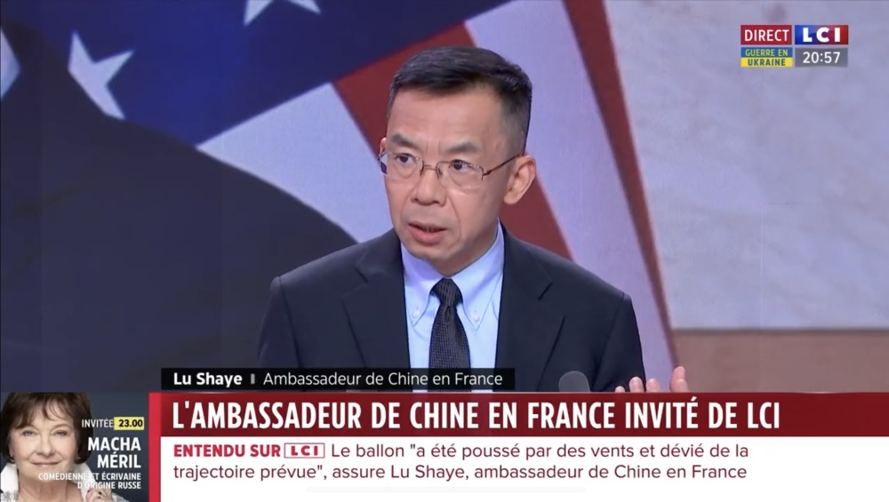

# 中国驻法大使卢沙野就中国无人飞艇等热点问题接受法国电视台直播专访

2023年2月6日，卢沙野大使接受法国LCI电视台《观天下》栏目直播专访，就中国无人飞艇、台湾问题、乌克兰危机、中美关系、中俄关系等热点问题接受记者采访。答问实录如下：

问：大使先生晚上好，非常感谢您做客LCI电视台《观天下》栏目。

答：晚上好。

问：上周末的热点是中国无人飞艇事件，该飞艇被美国军机击落的画面传遍了全球。关于飞艇的性质，中美双方各执一词。美方称是间谍气球，中国称是用于气象等科研的民用飞艇。大使先生，为什么美国人不相信你们？

答：可能是因为现在中美两国之间缺乏互信。的确，中美间这几年发生的事情降低了两国的互信。但该飞艇确实是气象飞艇，而非间谍气球。美国在这件事上夸大其词了。

问：为什么？

答：因为这很常见。这种事情经常会发生，美国也一样。经常会看到美国的间谍气球，或者用于其他用途的气球。此次事件中，中国政府收到美方通报后立即开展了调查。查实该飞艇属民用性质，用于气象等科研。中方对飞艇因不可抗力误入美国向美方表达了遗憾。我感觉起初美方是接受了中方解释的，因为五角大楼也表示该飞艇不会对美国造成地面军事和人员威胁。他们要求中方尽快让该飞艇离开美国空域。然而令人不解的是，美方一方面敦促中国让飞艇离开，另一方面却在第二天将其击落，而该飞艇当时已经快要离开美国了。

问：那美方是应该更早击落？

答：不应该将其击落，美方此前说过不打算击落。但他们却说一套做一套。尽管飞艇已经离开了美洲大陆。

问：可能是为了防止飞艇离开造成泄密。

答：我刚才已经说了这不是间谍气球，而是气象飞艇。

问：您说这是气象飞艇。但是该飞艇飞越了建有核弹头发射井的蒙大拿州美军基地的上空，飞越路线还有马姆斯特罗姆空军基地。美方说这并不是偶然，对此您怎么看？

答：中国政府表示，受西风带影响，且自身控制能力有限，该飞艇严重偏离了预定航线。

问：拉美上空也发现了类似飞艇，您认为这也是意外偏离路线？您是否也承认这类事情发生得太多了点？

答：很有可能这个气球也偏离了航线。你也知道这类飞艇并非高科技产品，仅仅是用于气象研究或飞行试验。气象飞艇并不是科技含量很高的东西，没办法非常精确地操控。

问：说实话，如果美国飞艇飞入中国领空，中方会怎么做，不会也把它击落吗？

答：实际上这种情况已经发生了几次，但每次我们都是低调处理，没有炒作。

问：你们在中国上空发现过美国间谍气球或气象飞艇？

答：我并非该领域的专家。但飞艇事件发生后，中国社交媒体上出现了一些报道和讨论，据说以前也发生过美国或其他国家的气球飞过中国领空的情况。

问：如果是间谍气球，你们会怎么做？

答：有这样的情况。在气球的动机非常可疑的情况下，我们是击落过的。当然这是社交媒体上的说法，我没有确凿证据。

问：您没有确凿的证据，但您似乎是在告诉我们，中国以前曾击落过此类气球，因为它们是间谍气球。

答：是的。

问：所以其实美国人做的事并不那么令人震惊。

答：真正令人震惊的并不是美国击落了飞艇，而是在于美方已经对中方的解释表示理解，并似乎表示不会击落飞艇，但最终却还是将其击落了。

问：美国将回收残骸，相关行动似乎已经开始。残骸将告诉我们很多信息。您觉得美国人会说实话吗？在电视画面里，我们可以看到一些已经从海里打捞出来的碎片。

答：我认为美国应该把碎片还给中国，因为它们是中国的财产。

问：如果只是一个气象飞艇，有那么重要么？

答：哪怕不重要，也要物归原主，因为这是中国财产。

问：漂到美国领空的中国财产？美国人会说：如果你们不希望我们得到它，就不应该把它送到这里来……

答：如果美国不愿意归还，那是他们的事。这表明他们不诚实。

问：为什么？他们是在自己的领土上回收的。

答：如果一个人在街上捡到东西并且知道失主是谁，就理应把它还给失主。

问：即使有人破门入室？

答：但起码可以沟通，不是吗？中美各层级间都有沟通渠道。为什么不按沟通情况行事呢？（美方）不应该采取单边行动。

问：看起来拜登总统在决定击落气球之前有所等待，而共和党人主张尽早击落。可能是因为这个原因才未能第一时间作出决定。

答：这是美国内部事务，是美国党争。

问：中方表示保留作出回击的权利。中方将作何反击？

答：中国外交部副部长谢锋表示中方保留作出必要反应的权利。

问：正是如此。

答：至于何谓“必要反应”，你应该懂吧？

问：我不懂，请您解释。

答：也就是说在不同情况下的必要反应。

问：也就是每次个案处理？

答：是的。

问：有时候，我们看到，当（中美关系）紧张时，中方会进行军事演习，特别是在台湾海峡。未来我们会看到类似情况吗？

答：中方将根据国际法、国家利益和现地情况采取行动。

问：具体而言，将是什么行动？

答：你知道，这是概括而言，没有具体所指。

问：好的。那让我们拭目以待？美国国务卿布林肯原本要访问中国。考虑到2018年以后美国务卿从未到访中国，以及中美两国紧张关系的大背景，这本应是一次重要访问。他最终因此次飞艇事件取消了访问。（布林肯画外音：我明确表示，这一飞艇出现在美国领空是对美主权和国际法的侵犯。这是不负责任的举动，中国政府在我访问前夕做出如此举动有损于我们本应该进行的磋商）。您对此有何回应？

答：中美双方都没有宣布两国间有这样或那样的访问。所以也就没有推迟一说，不是吗？

问：但是布林肯原本应该是要访华的。

答：可你应该也注意到，直到布林肯作出上述表态前，中方从未宣布他的访华计划。根据他的说法，他因气象飞艇事件推迟了访华行程。但在我看来，所谓的访问并不合时宜，因为近期美方进行了很多反华活动，包括军事、科技、台湾等方面。例如，在军事方面，美国纠集了日本和韩国等亚洲国家构建对抗中国的军事包围圈，在菲律宾增设军事基地。最近，美国政府又进一步升级了对中国私营科技企业的封锁制裁。在台湾问题上，美国加大了对台军售力度。美众议院议长计划4月窜访台湾。这些都侵犯了中国的核心利益。中国政府已多次向美国政府和议会提出交涉，要求他们停止诸如此类的反华行径，但他们依旧执迷不悟。我认为，即便布林肯去了中国，也不会起到什么积极作用。他访问的任务本应该是落实习近平主席和拜登总统在G20巴厘岛峰会会晤中达成的重要共识，但在他访问之前美国就打破了这些共识。那么，他访问的意义何在？

问：所以即使没有发生飞艇事件，你们也不欢迎他访华？

答：在我看来，这不是一个好时机。目前访问的气氛并不适宜。

问：这么说是他自己决定去的，没有提前和中方商量？

答：这我就不知道了。要确保访问成功，双方必须共同创造良好条件。

问：您谈到了G20巴厘岛峰会，我们看到习近平主席和拜登总统一起决心翻开中美关系新的一页。但现在所有这些努力都破灭、化为乌有了吗？

答：中国政府始终按照习近平主席提出的相互尊重、和平共处、合作共赢的原则来发展同美国的关系。我们对发展和改善中美关系抱有真诚期待，美国也应与中国相向而行。如果只有中国一方在努力，而另一方却反其道而行之，那就不可能成功，不可能实现目标。

问：您提到了台湾，这显然是一个非常敏感的问题。美国中情局局长伯恩斯上周四在美国一所大学里表示，中国军队已经为2027年“入侵”台湾做好准备，他说的有道理吗？尽管他也明确指出，“入侵”并不一定会发生在2027年之前。

答：不存在所谓“入侵”，因为台湾是中国的一部分。解决国家内部问题是不需要“入侵”的，不是吗？中国不会跑到国外去侵略其他国家。但台湾是中国的一个省，中国政府始终愿以和平方式解决台湾问题。

问：这是目前的首选方式？

答：是的，我们始终坚持“和平统一、一国两制”的基本方针。

问：但如果行不通的话？您知道的……

答：现在的问题是，台湾当局是一群台独分裂主义分子，美国人则从外部怂恿鼓动台独势力铤而走险。而中国政府和人民坚决实现祖国统一，因此……

问：2027年前（实现统一）？

答：没有明确的统一时间表。但我们一定会采取一切手段完成祖国统一大业。

问：包括？

答：所有选项都在桌面上。当然，和平统一是首选。但如果行不通，我们也不放弃采取非和平手段。

问：但拜登总统说过，在那种情况下，美国人会出面干预……

答：我们会继续推进祖国统一大业，不会被美国人的好战之声所吓倒而止步不前。

问：即使冒着两国之间爆发冲突的风险？

答：中国和美国？

问：是的。

答：即使爆发冲突，那也是美国先发起的，而不是中国。

问：我猜习近平主席希望台湾问题在他任内得到解决，也就是说在不远的将来，虽然我知道您今晚不会给我们一个时间表。

答：我不知道是否有所谓的时间表。但我可以肯定的是，中国政府和人民有决心统一祖国，和平统一是首选；如果行不通，我们将使用一切手段，所有选项都在桌面上。

问：大使先生，发生在乌克兰克兰的事情会让台湾问题发生些许变化吗？在俄罗斯军事行动后，美欧等西方国家对乌克兰展现了团结，这是否一定程度上削弱了中国快速收复台湾的雄心？

答：乌克兰危机的启示是，西方在处理国际问题，在涉及维护各国主权与领土完整等问题上，应该保持立场的一致性。在乌克兰危机中，西方坚决维护乌克兰主权与领土完整。

问：这理所应当。

答：那么当涉及中国，也就是在台湾问题上，你们也应该支持中国政府维护中国主权与领土完整，即阻止台湾独立。

问：大使先生，我们也可以反问您，中国既然坚持主权与领土完整原则，但为何至今未谴责俄罗斯入侵乌克兰？

答：中国政府在乌克兰危机上的立场是一贯的。第一，我们认为各国主权、领土完整都应该得到维护 。

问：包括乌克兰吗？

答：是的。第二，联合国宪章宗旨和原则都应该得到遵守。

问：既然中方也同意这一立场，那为什么不谴责俄罗斯侵犯乌克兰主权的行为呢？

答：还有第三条，即各国合理安全关切都应该得到重视。我们始终支持通过和平手段解决危机。因此第四，一切有利于和平解决危机的努力都应得到支持。

问：也就是说您认为俄罗斯安全遭到了威胁，所以俄罗斯有理由侵犯乌克兰主权？

答：俄罗斯认为数十年来北约一直对俄罗斯安全构成威胁。

问：因此有理由侵略乌克兰？

答：普京总统表示，北约五轮东扩对俄罗斯构成巨大安全威胁，俄罗斯坚决反对包括乌克兰在内的有关邻国加入北约。如果你们认为北约扩员不对俄罗斯构成安全威胁，那么前苏联领导人赫鲁晓夫试图把核武器部署在古巴时，肯尼迪总统又是如何反应的呢？

问：但北约在乌克兰境内部署导弹了吗？并没有。

答：但现在如果北约把边境推至俄罗斯家门口，就会部署导弹。

问：但当时并没有乌克兰入约计划。

答：今天没有入约计划，但明天会有。各国均有权产生这种担忧，不是吗？

问：很显然俄乌局势让人忧心忡忡，可能在未来数周、数月甚至数年都看不到和平解决的希望。联合国秘书长古特雷斯今天对局势表示了悲观，我们一起来听听。(古特雷斯画外音：“俄罗斯对乌克兰的入侵给乌克兰人民带来无尽的痛苦，并产生了深刻的全球影响。和平的前景愈发渺茫。局势升级、冲突加剧的可能性日益增加。我担心的是，世界是在清醒的状态下，而不是在梦游中走入一场大规模战争”）。世界正在清醒的状态下走入一场更大规模的战争。您是否也认同这样一种极为黯淡和悲观的判断？

答：我也感到悲观。因为我注意到北约现在不断向战争的其中一方提供越来越多的重武器。双方似乎都没有立即结束战争的打算，而且条件也不成熟。

问：您认为，世界正走向一场更大规模战争的原因，是因为北约，而不是俄罗斯？

答：为什么我们不能让包括俄罗斯、乌克兰在内的各方坐到谈判桌前讨论各自安全关切呢？

问：但即使我们明天对俄罗斯说，乌克兰就像过去一样，不会加入北约，俄罗斯也不会从顿巴斯和克里米亚撤出。

答：但可以讨论和协商。这就是以和平手段解决问题的应有之义。

问：您对北约和美国向乌克兰军队提供武器的做法持批评态度。法国也向乌克兰提供武器。您认为这是同一件事吗？您会为此批评法国吗？

答：关于这场危机，中方保持中立。但我们认为持续向战争的一方提供重武器无益于战争尽快结束，这是在火上浇油。

问：如果没有武器，也许确实战争会结束，但那是因为俄罗斯轻易赢得了战争。

答：但起初俄罗斯和乌克兰双方都已展现出了谈判的意愿。你也记得吧，去年3月，两国几乎达成协议。

问：您是说在土耳其？

答：是的，在土耳其的谈判。在节目的上一个时段，我看到电视里说土耳其扮演了调停者的角色。

问：但土耳其自己也承认这是不可能的。事实上，俄罗斯人不想谈判或是和平，而是想争取时间。

答：但根据当时的报道，俄乌双方几乎已达成一致。

问：西方正在向乌克兰提供武器。据美国媒体报道，中国虽然没有提供完整的武器，但却提供了零部件以确保俄罗斯罗斯能够组装武器。这是否属实？

答：说实话我不知道。但我认为，作为主权国家，中国和俄罗斯有权在所有领域发展合作关系。

问：中国甚至可以向俄罗斯援助武器？

答：我认为，中国作为一个主权国家，有权根据一定的原则，向另一个国提供武器。

问：为什么西方不能向乌克兰提供武器？

答：我没说不可以，但这不利于和平解决危机。

问：如果中国向俄罗斯提供武器或武器零部件的话，道理是一样的，也不利于和平解决危机。

答：问题是我们没有向俄罗斯提供武器，因此我们没有做与和平解决危机背道而驰的事。

问：中方也没有向俄提供用于组装武器的零部件吗？尤其是谈论很多的航空器零部件。

答：但这些零部件不是武器，不是吗？欧洲国家说，即使向乌克兰提供武器，也不算参战。

问：法国算参战吗？西方国家算参战吗？

答：我不知道。

问：马克龙总统说法国不是参战国，他错了吗？

答：这是你们的立场。

问：这是马克龙总统的立场。但您怎样看？如果向乌克兰提供武器，就算参战吗？

答：不好说，即使国际问题和国际法专家对此也没有明确说法，因为这取决于不同国家的政策和立场。也许有一天，北约成员国会声称自己是参战方。几个月前，欧洲拒绝向乌克兰提供重型坦克，但现在还是提供了。今天他们拒绝向乌克兰提供战斗机，也许几个月后就会提供。

问：由乌克兰人驾驶的（战斗机）？

答：我不知道。这只是一种假设，目前欧洲还未这样做。但一切都取决于各国立场及其对危机未来走势的判断。

问：在您看来，当前形势下，美国、法国、英国，还有很多其他国家都是参战国吗？

答：我对此不予置评，因为一切都在变化之中。

问：在您看来，西方在其他方面是否还有越过“红线”之举？

答：从危机爆发以来，我们已经注意到这一现象：“红线”不断被越过。

问：普京没有明说但以隐晦的方式表达了俄罗斯的“红线”，那就是核武器。有消息称，俄永远不会动用核武器，是因为中国明确拒绝并对俄罗斯施压的结果。是这样吗？

答：普京明确说了“核武器”这个词吗？

问：没有。他在暗示这一点。

答:这就留下了想象的空间。是的，你可以想象，没必要问我在这个问题上中国对俄罗斯采取何种立场。

问：但我们还记得，习近平主席在撒马尔罕会见了普京总统。普京总统对他说：我理解您的担忧。我们不清楚他在谈及习近平主席的关切时是在影射什么。习近平主席的关切是不是关于这一点？俄罗斯可能使用核武器？

答：中国在核武器问题上有自己的立场。从我们拥有核武器的那天起，我们就宣布中国不会首先使用核武器，也不对无核国家使用核武器。这是我们的立场。

问：您认为俄罗斯人也应该持同样的立场吗？

答：这是我们的立场，不是俄罗斯的立场，也不是法国和其他西方国家的立场。

问：普京曾透露，习近平主席可能在未来几天访问莫斯科。中方还没有确认这个消息，您能向我们确认这一点吗？

答：中国方面尚未宣布任何相关信息。

问：您希望访问成行吗？这是一个好主意吗？普京在等待你们来访？这会是一件好事吗？值得期待吗？

答：鉴于中俄双边关系的高水平，我认为两位领导人进行面对面的会晤是很正常的。

问：如果习近平主席明天去见普京总统，他会说些什么？

答：这件事还没有发生。

问：没有，但如果真的发生了，他肯定会说些什么或者传递某种信息。

答：是的，从过去历次会晤看，两位领导人见面总是会谈及如何发展双边友好合作关系。

问：大使先生，感谢您同我们分享您的所思所想，再次感谢您做客今晚的《观天下》栏目。

