# 中疾控：2月6日在院新冠病毒感染死亡病例102例，较峰值下降97.6%

中国疾病预防控制中心网站2月8日公布全国新型冠状病毒感染疫情情况，具体内容如下。

**一、感染监测数据**

**（一）全国报告人群新冠病毒核酸检测结果。**

2022年12月9日以来，各省份报告人群核酸检测阳性数及阳性率呈现先增加后降低趋势，阳性人数12月22日达到高峰（694万）后波动下降，2月6日降至最低（0.9万）；检测阳性率12月25日（29.2%）达高峰后波动下降，2月4日降至最低（1.2%），2月6日略有回升（1.5%）（图1-1）。

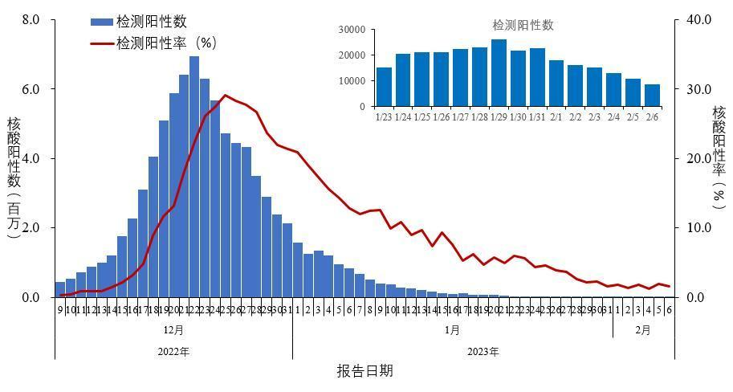

_图1-1全国报告人群新型冠状病毒核酸检测阳性数及阳性率变化趋势（数据来源于31个省（区、市）及新疆生产建设兵团报告）_

**（二）全国报告人群新冠病毒抗原检测结果。**

各省份报告抗原检测量呈现波动减少趋势，从2022年12月19日的最高189万下降到2023年2月4日的8.5万，其后有所反弹，2月6日为19.0万。抗原检测阳性数及阳性率自2022年12月9日快速上升，12月22日达高峰（33.7万、21.3%）后波动下降，2023年2月6日降至最低，分别为784和0.4%（图1-2）。

_图1-2全国报告人群新型冠状病毒抗原检测阳性数及阳性率变化趋势（数据来源于31个省（区、市）及新疆生产建设兵团报告）_

**二、全国发热门诊（诊室）诊疗情况**

**（一）总体就诊人数结果**
。全国（不含港澳台）发热门诊（诊室）就诊人数于2022年12月23日达到峰值286.7万人次，随后连续下降；2023年1月23日后就诊人数呈现低位波动，2月6日为13.7万人次,较峰值下降了95.2%（图2-1）。

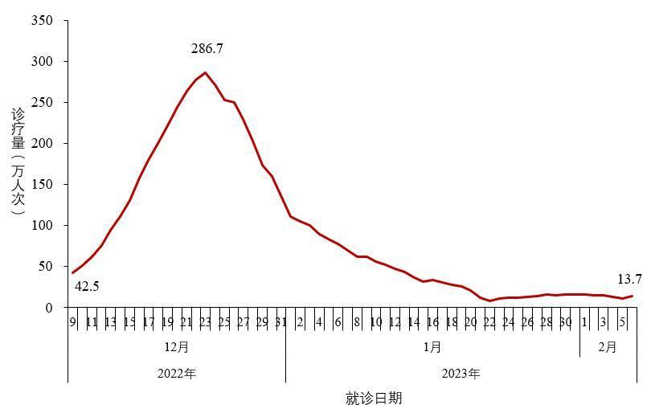

_图2-1全国发热门诊（诊室）诊疗人数变化趋势（数据来源于31个省（区、市）及新疆生产建设兵团报告）_

说明：自2022年12月9日起，监测二级以上医疗机构发热门诊诊疗量；12月21日起，增加监测社区卫生服务中心和乡镇卫生院发热诊室诊疗量（不含村卫生室和社区卫生服务站）。

**（二）农村发热门诊（诊室）就诊人数结果。**
全国乡镇卫生院发热诊室就诊人数于2022年12月23日达到峰值92.2万人次，随后波动下降；2023年1月23日后呈现低位波动，2023年2月6日为5.8万人次，较峰值下降了93.7%（图2-2）。

_图2-2全国农村地区乡镇卫生院发热门诊（诊室）就诊人数变化趋势（数据来源于31个省（区、市）及新疆生产建设兵团报告）_

说明：农村发热患者诊疗量为乡镇卫生院发热诊室诊疗量（不含村卫生室）

**（三）城市发热门诊就诊人数结果。**
全国二级以上医疗机构和城市社区卫生服务中心发热门诊（诊室）就诊人数于2022年12月22日达到峰值195.4万人次，随后连续下降；1月23日后呈低位波动，2月6日为7.9万人次，较峰值下降了95.9%（图2-3）。

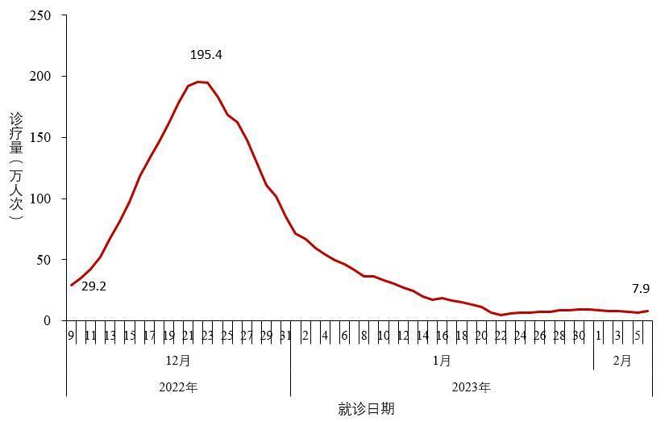

_图2-3全国城市发热门诊（诊室）就诊人数变化趋势（数据来源于31个省（区、市）及新疆生产建设兵团报告）_

说明：城市发热门诊诊疗量含二级以上医疗机构和社区卫生服务中心（不含社区卫生服务站）。

**（四）哨点医院监测结果。**
2022年9月-12月上旬，全国流感哨点医院每周流感样病例（体温≥38℃，伴咳嗽或咽痛之一）数量稳定在10万左右，至第51周（12月19日-25日）达到最高60万；流感样病例占门（急）诊就诊人数比值在2.7%-3.6%区间波动，第50周（12月12日-18日）明显上升至8.5%，第51周达到最高12.1%，第52周起快速下降。2023年第5周（1月30日-2月5日）下降至1.4%，回落至本轮疫情之前水平（图2-4）。

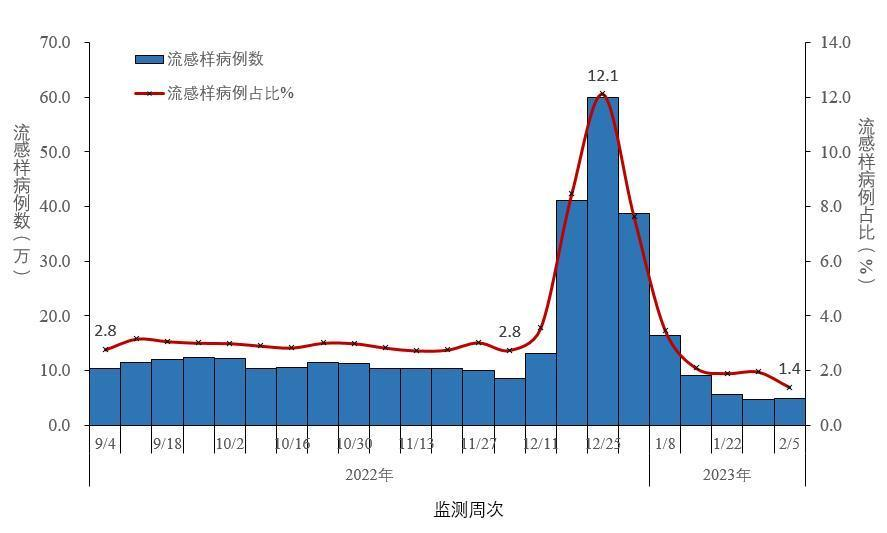

_图2-4全国哨点医院报告的流感样病例数及占比变化趋势（数据来源于824家哨点医院）_

2022年第49周（12月9日），流感样病例新冠病毒阳性率开始逐渐增加，在第51和52周期间达峰值后持续下降，2023年第5周（1月30日-2月5日）新冠病毒阳性率已下降至5.7%；2022年第49周以来，流感病毒阳性率则逐步降低，至12月下旬降至极低水平，目前流感病毒阳性率维持在1.0%以下（图2-5）。

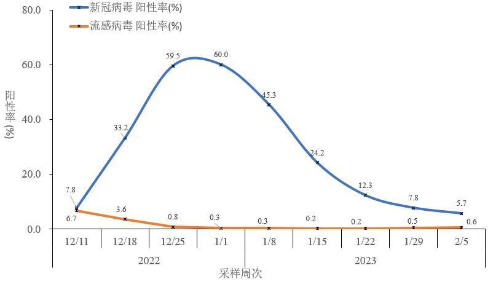

_图2-5全国哨点医院流感样病例新冠和流感病毒阳性率变化趋势（数据来源于402家网络实验室）_

**三、住院诊疗情况**

**（一）在院新冠病毒感染者结果。**
全国在院新冠病毒感染者于2023年1月5日达到峰值162.5万人，随后持续下降；2月6日下降至6万人，较峰值减少了96.3%（图3-1）。

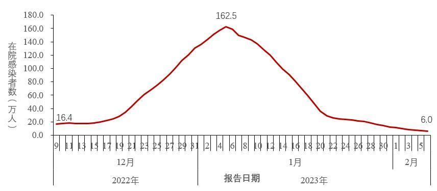

_图3-1全国在院新冠病毒感染者每日变化情况（数据来源于31个省（区、市）及新疆生产建设兵团报告）_

**（二）在院新冠病毒感染阳性重症患者结果。**
全国在院新冠病毒感染者中，重症患者数量于2022年12月27日至2023年1月3日期间每日增量近1万，1月4日增量明显下降，1月5日达到峰值12.8万，随后持续下降，2月6日下降至0.2万，较峰值下降了98.1%（图3-2）。

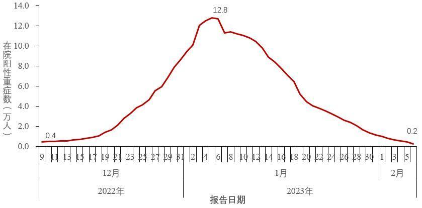

_图3-2全国在院新冠病毒感染阳性重症患者变化情况（数据来源于31个省（区、市）及新疆生产建设兵团报告）_

**（三）在院新冠病毒感染死亡情况。**
在院新冠病毒感染死亡病例数于1月4日达到每日峰值4273例，随后持续下降，2月6日下降至102例，较峰值下降97.6%（图3-3）。

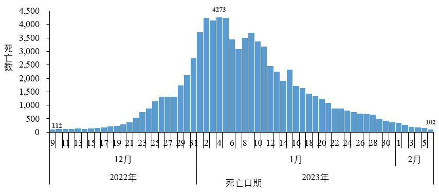

_图3-3全国在院新冠病毒感染死亡病例变化情况（数据来源于31个省（区、市）及新疆生产建设兵团报告）_

**四、新冠病毒感染本土病例病毒变异监测情况**

**（一）总体情况。**
2022年9月26日至2023年2月6日，全国共报送23217例本土病例新冠病毒基因组有效序列，均为奥密克戎变异株，共存在76个进化分支，主要流行株为BA.5.2.48（53.0%）、BF.7.14（24.1%）和BA.5.2.49（14.8%）。BA.5.2等20种进化分支构成比在0.1%-2.5%之间，53个进化分支的构成比小于0.1%（共占0.7%）（图4-1）。

_图4-1全国新型冠状病毒变异株变化趋势图_

说明：1.采样日期：2022年9月26日至2023年2月2日。

2.图中标记的数字分别为BA.5.2.48、BF.7.14和BA.5.2.49进化分支有效基因组序列数量。

3.“其它”指全国范围Omicron变异株构成比小于0.1%的进化分支。

**（二）12月以来本土病例病毒变异株监测情况。**
2022年12月1日至2023年2月6日，全国共报送14515例本土病例新冠病毒基因组有效序列，全部为奥密克戎变异株，共存在31个进化分支。主要流行株为BA.5.2.48（60.9%）和BF.7.14（28.3%）（表4-1）。共发现重点关注变异株13例，其中，1例XBB.1，5例BQ.1.1，1例BQ.1.1.17，4例BQ.1.2和2例BQ.1.8。

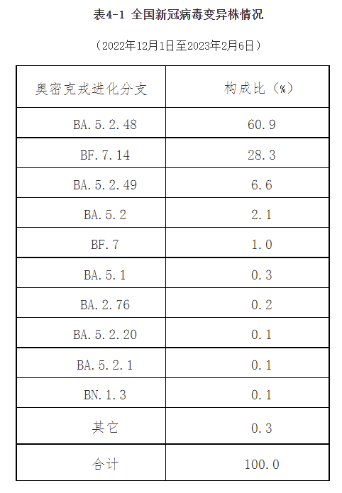

**（三）新冠病毒变异分省份情况。**
总体来看，北京、天津和内蒙古以BF.7及其子代分支为优势株；江苏BF.7及其子代分支和BA.5.2及其子代分支基本持平；其他省份均以BA.5.2及其子代分支为优势株。（图4-2）。

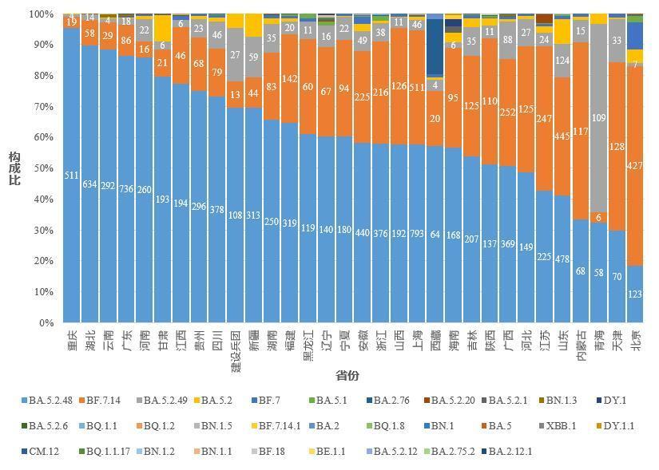

_图4-2各省份新冠病毒变异监测情况_

说明：1.采样时间：2022年12月1日-2023年2月2日；

2.图中标记的数字分别为BA.5.2.48、BF.7.14和BA.5.2.49进化分支有效基因组序列数量。

**五、新冠病毒疫苗接种进展**

截至2023年2月6日，31个省（自治区、直辖市）和新疆生产建设兵团累计完成接种新冠病毒疫苗34.91亿剂次（图5-1）。全人群第一剂次、全程接种覆盖比例分别达到92.9%和90.6%（图5-2）。

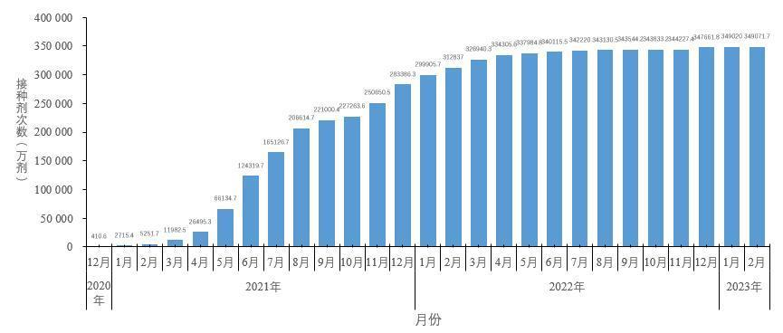

_图5-2分月全人群中第一剂次接种、基础免疫全程接种覆盖率（数据来源于31个省（区、市）及新疆生产建设兵团报告）_

以2022年底全国老年人专项摸底调查人口数为基数统计，60岁以上老年人第一剂次接种覆盖人数占老年人群的96.1%，全程接种、第一剂次加强免疫接种人数分别占符合接种时间间隔老年人群的96.6%、92.2%（图5-3）。

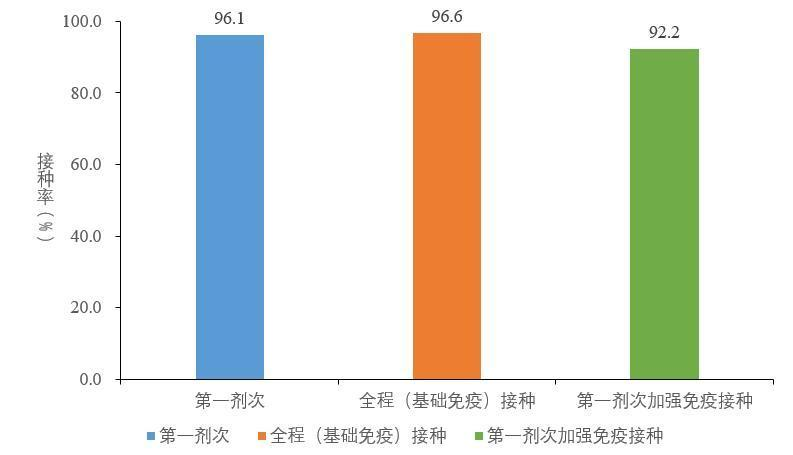

_图5-3基于摸底人口数的60岁以上人群新冠病毒疫苗接种率（数据来源于31个省（区、市）及新疆生产建设兵团报告）_

注：1.第一剂次接种率测算中分子为接种目前附条件上市或紧急使用新冠病毒疫苗至少1剂次的人群，分母为2022年12月10日各省上报的老年人摸底登记人口数。2.全程接种率测算中分子为接种灭活疫苗2剂次、腺病毒载体疫苗1剂次、重组蛋白疫苗3剂次的老年人群，分母为接种灭活疫苗1剂次、腺病毒载体疫苗1剂次和重组蛋白疫苗2剂次的人群，并且接种后间隔满28天（4周）。3.第一剂次加强免疫接种率测算分子为完成第一剂次加强免疫接种老年人群，分母为接种灭活疫苗2剂次、腺病毒载体疫苗1剂次的人群，且全程接种后间隔满3个月。（由于重组蛋白疫苗实施加强免疫接种的时间短，接种3剂次重组蛋白疫苗人群目前未包括在分母中）。

