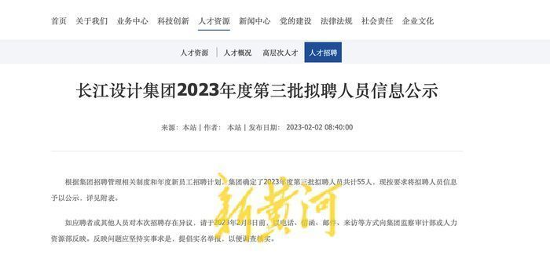
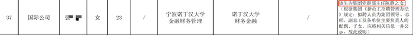

# 国企招聘公示名单中备注领导之女？公司回应：为体现公开公平公正

近日，长江设计集团有限公司官网发布的2023年度第三批拟聘人员信息公示中因一名应聘人员在备注中显示“集团党群部主任之女”引发关注。

据该企业官网显示，本次招聘拟招聘人员共计55人。其中一名应聘者23岁，在公示其他信息栏中显示，“该生为集团党群部主任陈静之女（根据集团《新员工招聘管理办法》规定：拟聘人员为集团领导、总师、副总工及各单位主要负责人的配偶、子女，应将相关信息一并公示，故此说明）。”

2月8日下午，该公司监察审计部一名工作人员回应新黄河记者称，“我们是为了体现公开公平公正，实事求是告知有这层关系，我们人力部在今年的管理制度里面有要求，如果有这种关系的，要备注出来，接受大家的监督。”

公开信息显示，长江设计集团有限公司位于湖北省武汉市，前身为长江勘测规划设计研究院，是由水利部长江水利委员会出资设立的国有独资企业。

新黄河记者：刘海奎

编辑：刘玉红

