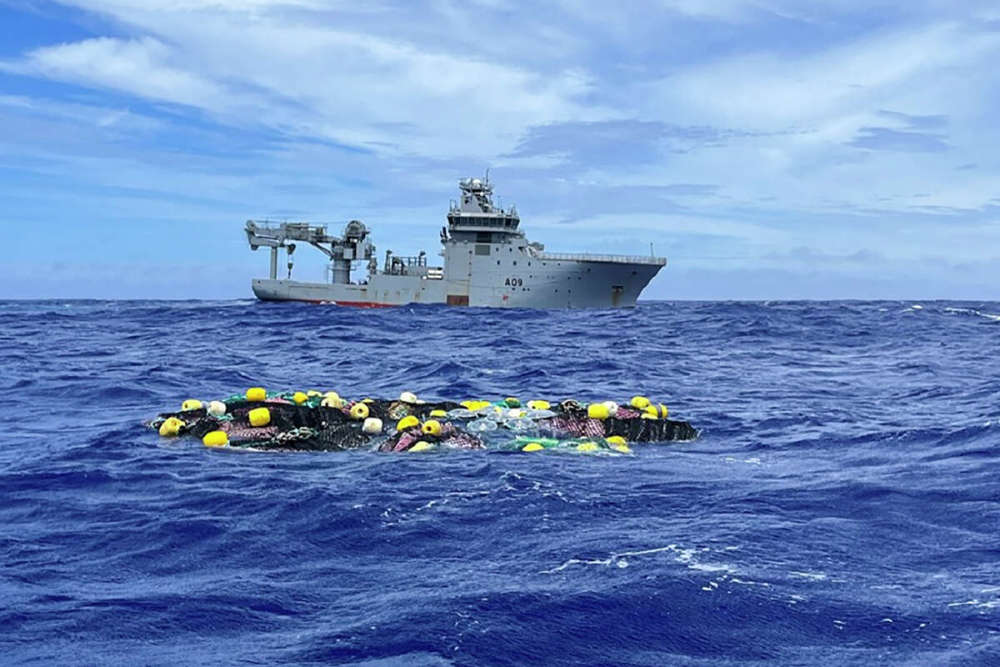
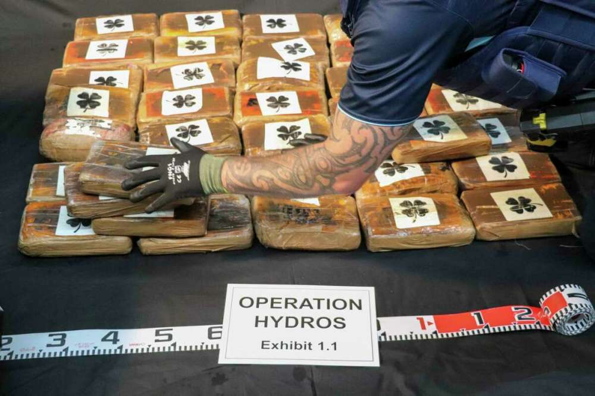

# 太平洋上漂来3.2吨可卡因，新西兰截获“最大批”毒品

（观察者网讯）据新西兰国家广播电台（RNZ）2月8日报道，新西兰警方在8日的记者会上宣布，在太平洋海面上发现总重3.2吨、价值5亿新西兰元（约合21.5亿人民币）的可卡因，这是该国迄今查获的最大批毒品之一。目前新西兰警方正在调查毒品的具体来源，尚未逮捕任何人。

_新西兰国家广播电台报道截图_

报道称，新西兰警方、海关和国防军在一次识别和监测可疑船只的联合行动中截获了这批可卡因，共计81包。这些毒品装在数十个系有浮标的网兜中，漂浮在海面上，其中一些包装上印有蝙蝠标志，另一些则贴着四叶草标志。

新西兰军舰“马纳瓦努依”号（HMNZS
Manawanui）已经将这批可卡因运回本土记录并销毁。警方推测，这批毒品可能来自南美洲，目的地是澳大利亚，在贩毒集团某个“公海转运点”落海，漂浮几天后抵达新西兰附近海域。

_新西兰当局截获一批漂浮在太平洋海面上的可卡因
图自美联社_

新西兰警察专员安德鲁·科斯特（Andrew
Coster）称，从货物的体积来看，这批毒品相当于贩毒集团对澳大利亚一整年的供货量，或相当于对新西兰30年的供货量。

“毫无疑问，这一发现对于南美的毒品生产商和分销商造成了重大的经济打击，”科斯特说，“这是本国当局查获的最大批毒品之一。虽然这扰乱了贩毒集团的运作，但我仍将保持警惕，因为我们知道这些团体会竭尽所能避开执法部门的注意。”

新西兰海关总署署长比尔·佩里（Bill
Perry）估计，这批可卡因的总价值超过5亿新西兰元，“这充分说明了全球范围内有组织的毒品走私活动的严重程度”。他指出，这一发现表明，在全球运输路线受到新冠疫情冲击之后，跨国有组织犯罪集团似乎在以不同的方式试探市场。

_毒品包装上贴有四叶草或蝙蝠标志
图自美联社_

目前，新西兰警方正与其他国际机构调查毒品的具体来源，尚未就此事逮捕任何人。新西兰警察国家有组织犯罪部门负责人格雷格·威廉姆斯（Greg
Williams）称，该国警方将继续与海关和国防部联合行动，拦截毒品的流动。

威廉姆斯还补充说，澳大利亚政府对新西兰当局的此次行动感到“非常高兴”。

美国《华盛顿邮报》称，在2022年3月，新西兰警方曾在海运集装箱中查获700多公斤可卡因，这是该国此前缉获的规模最大的一批毒品。在这之前，新西兰警方还在奥克兰机场截获过613公斤甲基苯丙胺（冰毒）。

**本文系观察者网独家稿件，未经授权，不得转载。**

