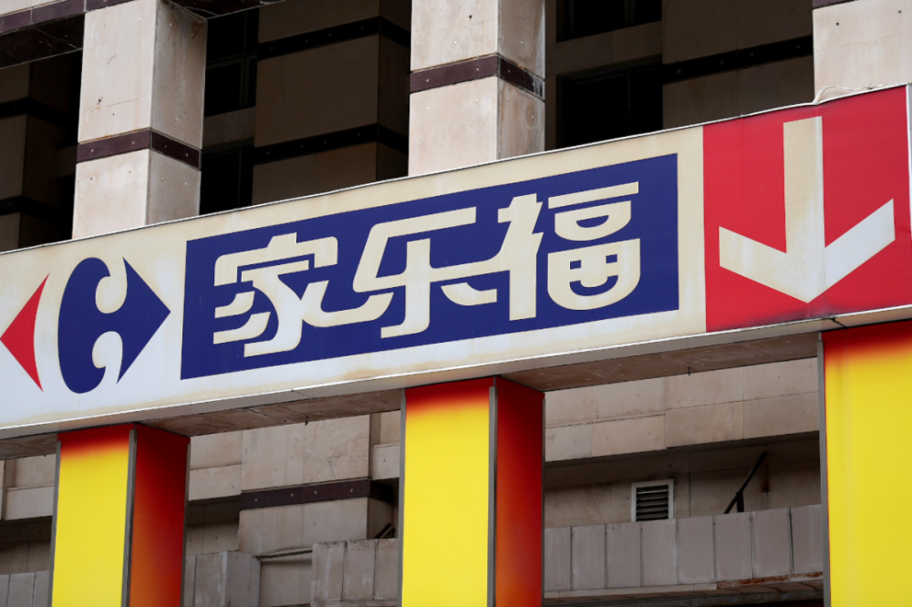
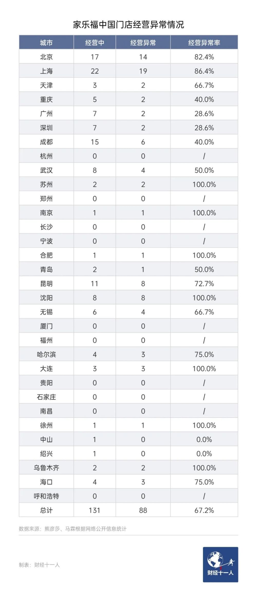
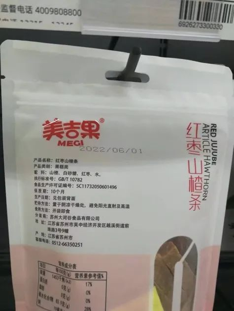
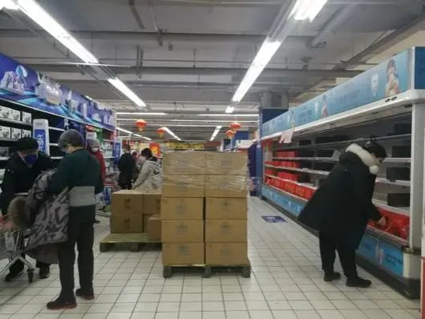
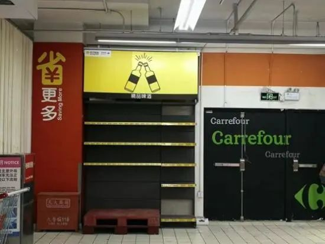
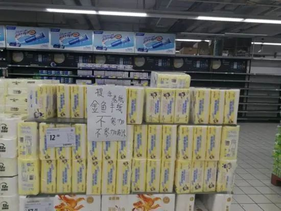
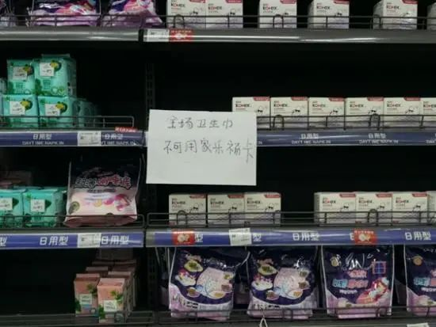
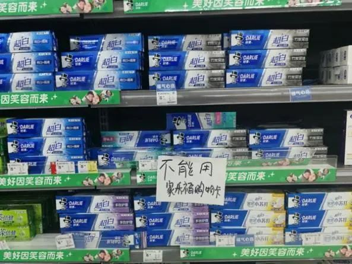

# 家乐福中国COO离职，部分门店经营异常

_人气不再
广东深圳梅林家乐福多个柜台空置。图/IC_

**文｜《财经》记者 马霖 实习生 熊彦莎**

**编辑｜余乐**

关店、大面积缺货、限制消费者用购物卡结算、限制退卡……围绕家乐福中国经营状况的“阴云”尚未散去。《财经》记者独家了解到，家乐福中国COO（首席运营官）张其喆已于近日离职。张其喆本人向《财经》记者确认了此消息。

另据一位接近家乐福中国的人士透露，张其喆之外，家乐福中国的多位副总裁也已于近日离任。
**对此，张其喆表示：“我个人已离职，其他人（的情况）我不好说。”截至发稿，家乐福方面未回复《财经》记者关于上述人事变动的询问。**

知情人士称，张其喆是家乐福在2019年被苏宁收购后被任命为COO的。公开资料显示，此前他就已经在家乐福担任高管工作多年。

对于“是否因家乐福中国目前的经营状况离职”这一问题，张其喆向《财经》记者表示，自己是“因个人原因离职。”他亦表示，
**不清楚家乐福中国是否会退出中国市场，“暂时应该没有。”**

由于持续亏损，资金链和供应商关系出现问题，2023年1月起，家乐福全国各地大卖场内出现严重缺货情况，目前为止还看不到改善迹象。据《财经》记者的统计，家乐福目前在营业的门店中，有三分之二都出现了大面积货架空置等异常状况，其中北京、上海门店的经营异常率达80%以上。

家乐福和苏宁方面对《财经》记者表示，
**家乐福中国没有退出市场的计划。苏宁方面在回应最近家乐福的货架货物短缺和限制购物卡结算等问题时表示，此前受疫情的影响，家乐福资金确实有一些紧张，与供应商之间出现了一些问题，并引发了购物卡挤兑的现象。**

家乐福方面表示，公司的供应链正在有序优化中。“预计在1个月内，北京市场的供货情况基本恢复正常。”家乐福还表示，限制购物卡结算的问题也在缓解中：“目前，在供应链逐步缓冲调整的情况下，大部分商品可以用包括购物卡在内的多种支付方式支付。”

**家乐福中国门店持续减少，北京上海经营异常率超80%**

近年来，家乐福中国门店数量持续减少，而据《财经》记者不完全统计，2022年四季度以来，其门店又减少了20家。

苏宁易购（002024.SZ）历年财报显示，2020年，家乐福中国门店数量净减少5家。2021年，门店数量净减少23家。2022年前三季度，家乐福闭店数量达到54家，且无新开门店，总数减少至151家。

《财经》记者根据公开信息对全国各地家乐福门店的经营状态进行了统计，结果发现：截至2023年2月7日，全国范围内尚在营业的家乐福超市有131家，也就是说，2022年四季度以来又有20家门店关闭。在仍处于营业状态的门店中，也有近七成。

随着关店节奏的加快，家乐福已退出杭州、成都、郑州、长沙、宁波、石家庄、贵阳、福州、南昌、呼和浩特等市场。

根据《财经》记者的统计，目前仍在营业的131个家乐福门店中，近期在大众点评等网站上收到过“货架空荡荡”“看不到工作人员”等消费者评价的有88家，占到总数的三分之二。其中，北京、上海门店的经营异常（以“货架大幅空置”为标准）率达80%以上。

《财经》记者近日在家乐福北京健翔桥店看到，货架空置情况没有改善，且不少产品已临近保质期。

店内一位收银员说，“这么长时间了，就这么空着，也没有通知说会关店。”另一位导购人员表示，一直没有通知何时补货，卖场的下一步是什么，是否会关店，基层员工也人心惶惶。

_一款红枣山楂条零食，保质期10个月，还有不到两个月到期。摄影/马霖_

大部分冷藏食品区已空置。在奶制品区域，低温奶区完全空置，常温奶区域也有部分货架空置。

_空置的货架。摄影/马霖_

因商品大幅缺货，消费者担心门店将会关闭，纷纷要求花掉购物卡余额。但是，家乐福在卖场各处都张贴了禁止用购物卡消费的告示。甚至以“不是本人购入不得退卡”的说辞来限制退卡。

_为防止发生购物卡挤兑、产品快速售罄，家乐福卖场内大部分种类的物品都写着“不可用购物卡”的告示。摄影/马霖_

**苏宁与家乐福，没能相互拯救**

业内普遍认为，被苏宁收购，加速了家乐福的衰落。

“苏宁收购家乐福时，家乐福已亏损，经营出现问题，资金已经很紧张了。被苏宁收购后家乐福仍亏损，苏宁又不能给家乐福持续输血。”
一位零售业人士对《财经》记者表示，“家乐福的未来是很麻烦的。”

2019年6月，苏宁易购全资子公司苏宁国际宣布以48亿元收购家乐福中国80％的股份，这是苏宁自2016年高歌猛进的一系列大手笔投资的尾声。

除收购家乐福，2016年至2019年，苏宁与淘宝换股认购阿里股份、收购天天快递、增资中国联通、收购万达商业、投资恒大、认购华泰证券定增、收购万达百货37家百货公司、认购之江新实股权、认购TCL股份、回购出售过的仓储物业……这些交易中，被认为唯一成功的是换购阿里股份，这笔投资在随后的几年里成了提振苏宁业绩的良药。但是，包括收购家乐福在内的其他投资则未见到明显效果，苏宁的资金链也出现了问题。

2020年和2021年，苏宁易购分别亏损42.75亿元和432.65亿元。2022年前三季度，苏宁易购亏损45.45亿元，其股票已于2022年5月变成为“ST易购”（退市警告）。

家乐福中国被苏宁收购前已经亏损，2018年亏损5.78亿元，2019年亏损3.04亿元，2020年、2021年及2022上半年分别亏损7.95亿元、33.37亿元和4.71亿元。

**目前，苏宁对家乐福中国剩余股份的收购还未完成。苏宁国际在收购家乐福中国80%股权时曾约定，在收购家乐福满两年后的90天内，家乐福集团可以选择将剩余股份以约定的固定价格转让给苏宁国际，且苏宁国际需要无条件购买。**

两年后，即2021年的9月27日，家乐福集团向苏宁国际发出了出售股权通知，要求苏宁国际按照12亿元的价格收购剩余20%的家乐福中国股权，但此项交易尚未完成。2022年11月，苏宁发布公告称，因与家乐福集团达成协议的客观环境发生了重大变化，双方就剩余家乐福中国股权的收购发生了较大争议，目前双方正在按照协议约定的争议解决方式进行处理。

一位零售业者对《财经》记者表示，
**“传统大卖场大势已去。不卖给苏宁，家乐福也只能多活几年。”业内普遍认为，传统大卖场的商品力、服务能力弱，向供应商收取各类费用的盈利模式已难以为继，“在激烈的市场竞争中，家乐福、沃尔玛等传统大卖场逐步退出市场是必然趋势，已是业内共识。”**

苏宁及家乐福方面则对《财经》记者表示，公司已在近期的会议中明确家乐福要基于“近场零售服务商”定位，将大卖场转型为“社区品质生活中心”。一些门店将以此为目标进行改造升级，新模型店将会最先在北京落地。

