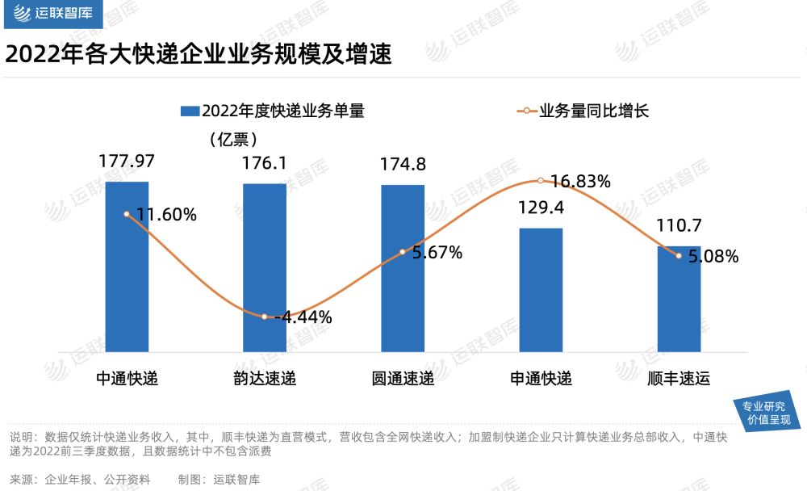
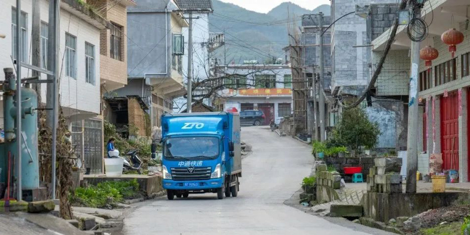

# 快递业最赚钱的一年，顺丰、中通、圆通、申通、韵达谁最能赚？谁在落伍？

来源 | 运联智库（ID：tucmedia） 作者 | 贾艺超

编辑 | 小L

近期，上市快递公司陆续公布2022年度业绩预估。2022年，成为近几年快递行业最赚钱的一年。

利润翻倍式增长，成为快递企业去年的“标配”。传统电商增长放缓、油价上涨、疫情原因导致网点反复停摆等恶劣环境下，头部快递公司逆势大增，还是让市场感到意外的。

从各家快递公司披露的数据来看，随着极兔在国内市场站稳脚跟，行业整体再次回到单价上升、集中度提升的良性循环。这场洗牌当中，头部快递企业有的巩固领先地位，有的逆势翻盘，而有的则开始表现出落伍态势。

**1、盈利水平恢复到疫情前**

虽然2022年似乎是过去三年中最不可控的一年，但从盈利能力上来看，快递巨头们似乎已然适应这种生存环境。

目前，头部快递公司都陆续公布2022年度的业绩预告。 **总的来看，主流玩家终于打破“增收不增利”的魔咒，过去一年变为快递企业过去几年中最赚钱的一年。**

运联智库根据公开数据整理了顺丰控股、中通快递、圆通速递、韵达股份、申通快递几大上市快递公司的成绩单，这些数据似乎透露着一些格局演变的信号

**1）市占率：**

**中通＞韵达＞圆通＞申通＞顺丰**

从市占率的变化上来看，过去三年，快递CR5从72.9%增长到75.5%，集中度进一步提升。

而如果仔细看各快递企业市占率走向的话，头部的格局有重写的态势。其中，中通以22.1%的市占率（前三季度）稳坐第一把交椅；而“老二之争”中，韵达正在败下阵来，逐渐与圆通缩小差距，顺丰也在试图通过加盟制的丰网，抢占电商件市场，摆脱垫底的位置。

**2）业务增速：**

**申通＞中通＞圆通＞顺丰＞韵达**

从业务规模上来看，上市快递公司都已进入“百亿票量时代”。业务基数变大，使得稳定的增速要优于大起大落。

中通前三季度的业务量便已排在第一的位置。从增速的维度来看，申通则以16.83%的增速领先，其近几年内部改革的收效明显；而韵达则在业务增速上表现出负增长。

**3）单票收入：**

**顺丰＞韵达＞圆通＞申通＞中通**

**单票收入涨幅：**

**韵达＞圆通＞申通＞中通＞顺丰**

商业模式、统计口径的区别，单纯对比单票收入意义不大；但是，从单价的涨幅中可以看到，快递企业开始告别“价格战”，有不同程度地涨价。其中，韵达的涨幅最大达到20%，顺丰则是处于下降趋势。

某种程度上这透露出，加盟制网络开始从“价格战”中跳脱出来，回到量利齐升的正向轨道。与此同时，加盟制网络与顺丰开始进行市场的相互渗透，“加盟制向上，顺丰向下”。

**4）盈利能力：**

**顺丰＞中通＞圆通＞韵达＞申通**

盈利规模上，头部快递中通、顺丰、圆通，基本都恢复到疫情前的2019年的水平。以中通2022年前三季度的盈利能力来看，其有望连续两年超过顺丰，成为最赚钱的快递公司。

快递企业披露的业绩预增中，盈利能力是被放大的一块。从利润规模上来看，顺丰预计2022年扣非后净利润为52.5-54.5亿元，同比增长186%-197%；中通前三季度的盈利规模已然达到46.46亿元。

而与单票收入与单价涨幅形成对比的是，韵达虽然单价上涨最高，但市占率下滑，从而影响整体利润。根据其业绩预告，其2022年扣非后净利润为12.35亿元-14.19亿元，比上年同期下降11.09%-增长1.23%。

**整个业绩呈现出来的行业现状是，市场集中度提进一步提高，行业准入门槛达到百亿票量级别。**
随着规模基数的变大，增长的稳定性对企业变得越来越重要。同时，随着极兔在国内市场站稳脚跟，2022年快递企业开始重回正向增长轨道。

2、极兔洗掉了谁？

过去三年，疫情改变了很多，极兔成为市场演变中最大的变量。表面上看，当前头部快递重回一片平和，但极兔搅局这几年一定改变了什么。

**这当中有几个时间节点。**

2020年，检验基本盘。极兔大手笔杀入市场的这一年，“价格战”的屠杀，对头部快递公司基本盘稳定性是一种考验。

2021，进入“百亿票量时代”。随着申通、顺丰等网络相继进入百亿票量规模，要烧钱烧到这个门槛，对资本与基建网络的要求越来越高，极兔选择以收购百世快递国内业务收手。

2022，告别“价格战”。市场份额少了新的瓜分者，网络间的竞争再次进入新的平衡。

**快递企业2022年的业绩也是对这种演变的验证。**

**1）中通有望连续两年超顺丰，成“盈利之王”。**

“价格战”的背后是成本战.有着极致成本管控能力的中通，通过直营车辆、分拨等核心成本项，使得其能从容应对”价格战”。同时，单价回升之后，中通率先跑出规模性利润，抗打的成本能力也使得其利润规模可以与顺丰一拼，成为最赚钱的快递公司。

这种较量中， **中通正在朝着赖梅松的小目标前进：“中国市场上一定会诞生市场份额在30%以上的快递企业。”**

**2）圆通、韵达之争成新看点。**

从2022年的市占率数据来看，韵达为15.92%，圆通为15.81%，“老二之争”越来越焦灼。潘水苗在2019年任圆通总裁之后，一场数字化改革将圆通的盈利能力，从通达系的垫底位置中拯救出来。

过去几年，圆通市占率稳步增长，从2019年的14.35%稳步增长到15.81%。此外，
**圆通盈利能力2022年创新高，业务规模上缩小与韵达差距的同时，盈利能力甩开韵达一条街。**

**3）申通稳住基本盘，最差时代已过。**

过去几年，市场给申通的压力很大。收购事件、核心管理层变动等的影响下，使得其在极兔进入市场时，一直处于被动应战的局面，出现大规模的亏损。直到2022年“价格战”暂时收尾后，单价回升，才将其从亏损线上拉回一把。

激烈的“价格战”下，申通不得不回到基本盘重新审视自己。2022年，申通全面启动三年百亿级产能提升项目，
**追赶基建差距，全年共完成82个产能提升项目，带动网络吞吐能力站上日均5000万单规模。申通最差的时候已经过去。**

_（2022年10月27日，申通快递北方总部基地启动）_

如今，随着与百世快递逐渐融合，极兔正在加速蓄力，在基本盘与业务规模上补课。根据极兔内部人员透露，目前其日均业务量可以达到3700-4000万单。

此外，据服务极兔的一家机构透露，目前极兔正在启动IPO计划。而其当前的业务规模以及同质化的业务模式，很难撑起上轮融资后达到的千亿估值。

这也就意味着，为了保住估值，极兔还需继续冲刺。新一轮的冲击随时会到来。

目前来看，“价格战”暂时停歇，但价格战的后遗症在于，价格的一跌一涨之间，客户手握投票权，这种情况下快递公司之间的竞争成为包括成本、服务、品牌等综合实力的较量。

3、“价格战”终结后，拼什么？

“价格战”终结后的快递行业，享受了一年的休养生息，使得2022成为过去几年最赚钱的一年。

极兔搅动下的这一轮冲击，也使得快递企业重新认识企业的护城河，站稳脚跟的龙头，正在尝试多线开花，复制成功。

**1）拼成本。**

快递行业是典型的高网络效率、规模效应的行业。尤其是头部公司陆续进入“百亿票量时代”之后，一分钱的成本优化，就会被放大成一个亿的市场规模。

这也就使得具备极致成本管控能力的公司，不惧“价格战”，甚至能引领“价格战”的方向，从而在这个过程中得到稳步提升的市占率，坐享渔翁之利。

**2）拼产品。**

快递行业中，加盟制网络和直营网络之间的产品正在互相渗透。当前，商流端出现新机会的背景下，顺丰开始借道抖音、快手等新势力，通过丰网布局电商件业务。根据顺丰2022年半年报数据显示，丰网已经完成19个省、229个城市及2个直辖市的覆盖，已运营1671个加盟网点。

而通达系则也开始渗透时效件市场。比如，“快弟来了”作为中通快递集团旗下跨域即时快递物流共享平台，过去一年快速发力，便是采用“运营直营+末端众包”的模式，聚焦中高端快递物流市场。目前，该平台已在全国34站开展，覆盖184座城市。再比如，圆通加大航空领域投入，仅2022年就买入7架飞机。

**3）拼生态。**

除了快递产品维度的拓展之外，头部快递公司也通过自建、并购等方式，拓展相邻领域并复制成功。

其中，中通是自建网络的代表，其在快运、冷链、云仓等细分市场均有布局；其中，中通快运业务在2022年也已经挤入行业第一梯队，成为复制成功的典型代表。

而顺丰则更多通过并购的方式做大。比如，快运行业通过收购起网顺心捷达，冷链行业收购夏晖国内业务成立新夏晖，收购DHL在中国大陆、香港及澳门地区的供应链业务发力一体化供应链，收购嘉里物流布局国际化。

目前，顺丰也正在享受着这种生态化布局带来的红利。相对而言，其快递业务仍通过降维布局抢量，其2022年利润暴增，很大部分源于嘉里物流的并表；2021
年第四季度起合并嘉里物流的业绩，数据显示，仅去年上半年嘉里物流就为顺丰贡献了超20亿元的利润。

整体看来，缓过劲儿来的快递龙头，在放开后的2023年会有更多看点。那么，
**今年快递规模会被刷新到什么高度？中通的盈利能力能否持续跑赢顺丰？圆通、韵达之争谁能胜出？极兔会不会再掀起新浪潮？** 欢迎评论区分享你的看法。

