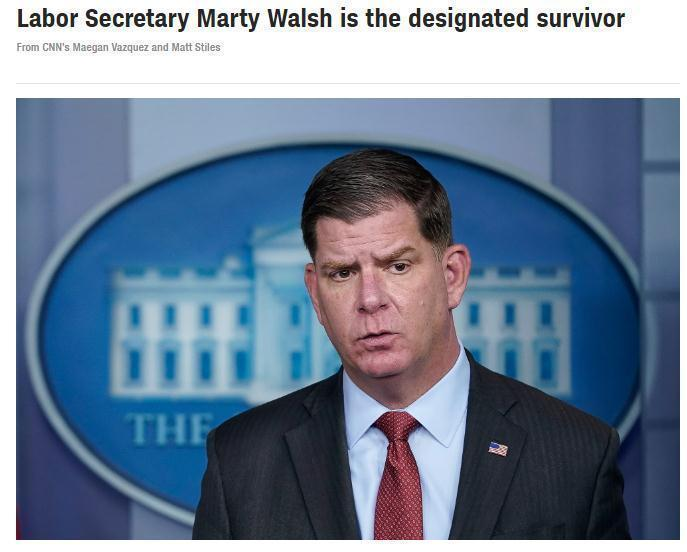

# 拜登发表国情咨文演讲时，他“躲”了起来

**中新网2月8日电**
当地时间7日晚，拜登在美国几乎所有具有影响力的联邦官员面前发表国情咨文演讲——包括国会议员、军方高官、最高法院法官和政府高级官员。然而，有一位部长却“躲”了起来，他就是“指定幸存者”美国劳工部长马蒂·沃尔什。

据悉，为了防止总统在发表国情咨文演讲期间国会山遭遇突发性灾难事件，导致总统、副总统、国会领袖及内阁成员全体丧生、政权陷入瘫痪，必须有一名部长级官员缺席，以在发生不测时接掌国家领导职务。

_图片来源：美国有线电视新闻网_

美国哥伦比亚广播公司(CBS)称，作为本次国情咨文演讲的“指定幸存者”，沃尔什会被特勤局带至一个秘密地点，他将在那里通过电视观看讲话。总统拜登、副总统哈里斯和其他总统继任人在演讲结束安全返家后，沃尔什才能获准离开。

美国1947年通过的《总统继任法》规定了总统去世或丧失行为能力后的继任顺序，首先是副总统，其次是众议院议长和参议院临时议长。

接下来则是内阁官员。内阁的排名顺序基本以内阁职务的成立时间为准，分别是国务卿、财政部长、国防部长、司法部长、内政部长、农业部长等。但由于这些官员都将出席演讲，白宫指定了在总统继任顺位中排名第11的沃尔什作为“指定幸存者”，在发生事故后接管政府。

据美国国家宪法中心的说法，由于冷战时期对核攻击的恐惧，在国情咨文演讲中指定幸存者的传统，始于20世纪50年代，但联邦政府直到1981年才公开“指定幸存者”的名字。

据CNN统计数据显示，内政部长和农业部长并列受任“指定幸存者”次数最多的职位，各有7次。

商务部长吉娜·雷蒙多是2022年的“指定幸存者”。她曾表示，轮到她作为“指定幸存者”时“非常平静”。她被安排在华盛顿以外的地区，“像其他任何一天一样做我的工作”。

