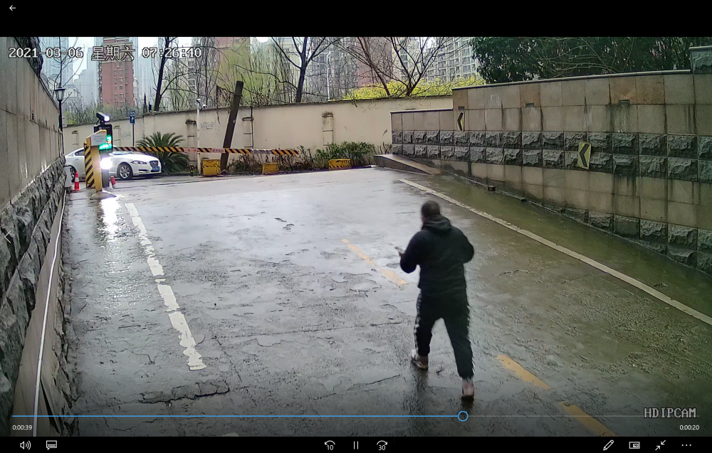
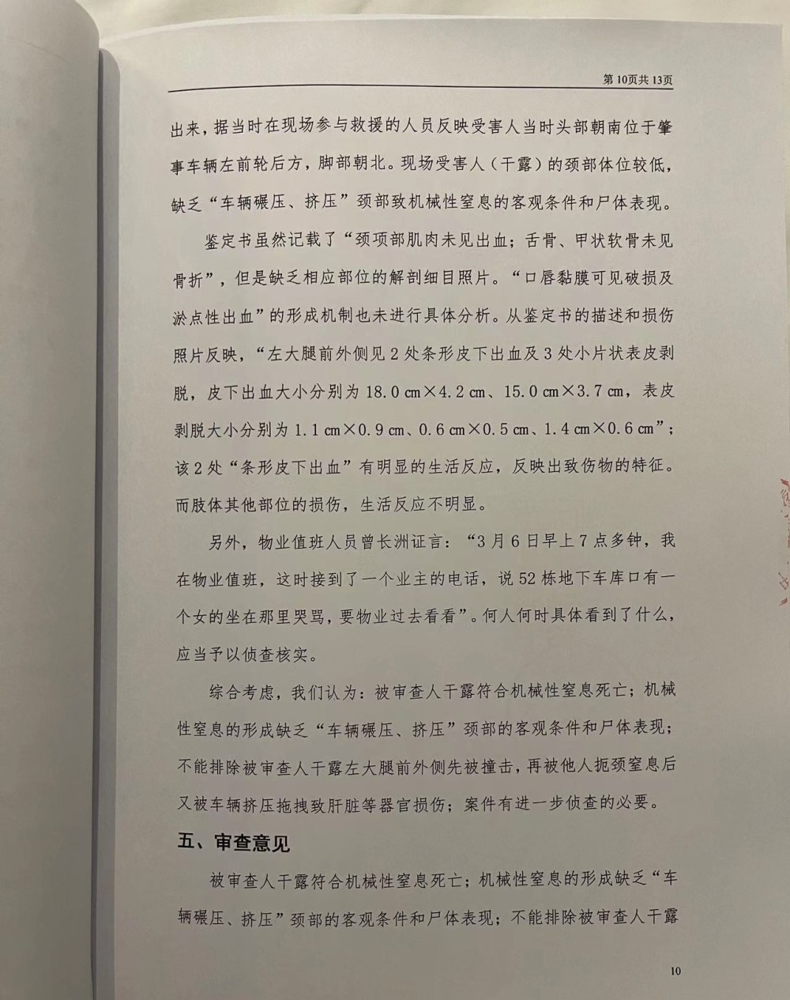

# 武汉男子开车碾压拖拽妻子致其死亡，死者家属递交专家书证审查意见书

新京报讯（记者
左琳）武汉女子遭丈夫碾轧拖拽死亡案近日有了新进展。2021年3月，29岁的干某在地下车库遭丈夫张某碾轧并拖拽8.5米后死亡，后张某被警方认定为“过失致人死亡”。同年10月，武汉市江岸区人民检察院向武汉市江岸区人民法院提起公诉，认为张某因疏忽大意造成妻子死亡，应以过失致人死亡罪追究其刑事责任。2023年2月8日，新京报记者从死者父亲干先生处获悉，因不认可张某“过失致人死亡”的罪名，今年1月，死者家属一方的代理律师委托法医专家对该案相关的法医学技术问题进行书证审查论证，并于2月6日向法院和检察院递交了审查意见书。

_干先生提供的监控视频里，一男子于2021年3月6日7点26分走出地下车库，经干先生辨认，该男子为张某。受访者供图_

新京报此前报道，武汉市江岸区人民检察院起诉书显示，2021年3月6日7时许，张某与干某因琐事在家发生争吵，后干某先行离家外出。几分钟后，张某到地下停车场驾驶轿车时，因未尽到安全注意义务，将干某碾轧拖拽约8.5米后停车，并拨打110报警、120急救中心电话，后干某经抢救无效死亡。

武汉市公安局江岸分局于当年3月23日出具的鉴定意见通知书显示，该案被认定为“张某过失致人死亡案”。经聘请有关人员对死者尸体鉴定，死者系因颈部、胸部、腹部受钝性外力作用致机械性窒息死亡与肝脏、大网膜破裂失血而死亡。死者血样中未检出乙醇成分和毒鼠强成分。同年4月，江岸区分局对涉事车辆进行安全技术状况鉴定，结果为制动、转向、照明和信号装置均符合安全技术条件。

干先生认为，涉案车辆车标被碰碎，保险杠有破裂痕迹，与张某此前所说的干某“自己钻到车底下”不符。因不认可张某“过失致人死亡”的罪名，此后两年，干先生及家人曾多次申请对事故痕迹进行鉴定。

2021年7月，四川华大科技司法鉴定所向武汉市江岸区人民法院出具了一份“关于鉴定委托不予受理的情况说明”。该说明指出，参照相关标准，该机构对鉴定材料的具体情况进行了解和分析，据现有送检材料，未发现能够反映体现碰撞形态的车体痕迹和人体伤痕迹，在现有条件下无法判断碰撞时干某的行为方式。

2021年11月，司法鉴定科学研究院检案科向武汉市公安局江岸分局发了一封退案函。函中提到，该院收到了鉴定材料，包括现场照片18张（复制件）、车库出口视频7段（复制件），也收到了鉴定聘请书，聘请书要求，为核实现场痕迹状况，对现场出现拖拽痕迹进行分析，判断其形成过程和原因，对车辆轮胎磨痕、车速、车尾排气管等进行物理鉴定，出具正式完整的事故痕迹鉴定报告。然而，该院对鉴定材料检验、分析后认为，现场照片所示内容不能完整反映案件的形成过程，视频裁量未检见案发过程，根据现有材料，不能对上述鉴定要求作出准确的鉴定意见，因此该院决定不予受理本案鉴定委托，并作退案处理。

2022年7月，四川中典司法鉴定所回复武汉市江岸区人民法院称，现有资料不足以对事故痕迹进行鉴定并还原事故，因此不能接受委托。

2023年1月4日，该案在武汉市江岸区人民法院开庭。干先生称，受其委托的新律师尚未阅卷，与张某当庭连线状况不顺畅等诸多因素影响，法庭依法延期审理。

_北京云智科鉴咨询服务中心针对干某案件出具的专家书证审查意见书。受访者供图_

1月6日，死者家属的代理律师委托北京云智科鉴咨询服务中心，对干某死亡案件相关的法医学技术问题进行书证审查论证。该意见书提出，干某符合机械性窒息死亡；机械性窒息的形成缺乏“车辆碾压、挤压”颈部的客观条件和尸体表现；不能排除干某左大腿外侧先被撞击，再被他人扼颈窒息又被车辆挤压拖拽致肝脏等器官损伤；案件有进一步侦查的必要。

2月8日，干先生告诉新京报记者，目前他与代理律师已向江岸区人民法院法官提交该书证审查意见书，也到武汉市江岸区人民检察院进行沟通，“法院和检察院都很重视。”代理律师干卫东确认了此消息，他表示，如果张某涉嫌故意杀人，则需要中级人民法院审理，目前死者一方正争取提级审理此案。

编辑 刘倩 校对 杨许丽

