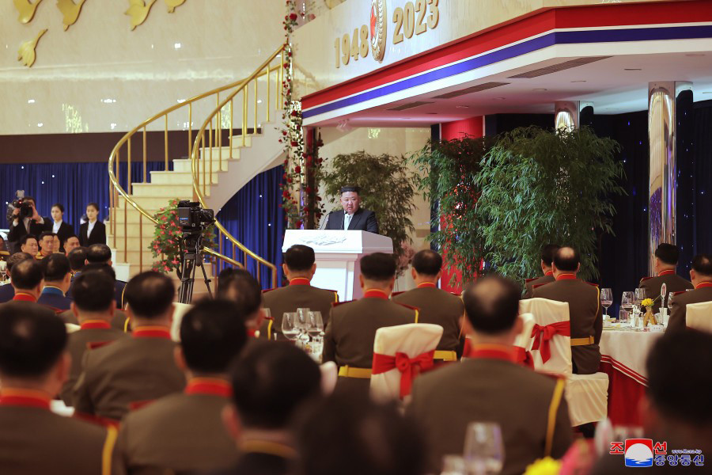

# 金正恩偕女儿访问朝鲜人民军将领宿舍，父女一同出席纪念宴会

2月7日，朝鲜最高领导人金正恩偕女儿访问人民军将领宿舍，祝贺朝鲜人民军建军75周年。两人还共同出席了纪念宴会。

据朝中社8日报道，金正恩同女儿7日一起抵达朝鲜人民军将领宿舍，国防省指挥官、朝鲜人民军大联合部队和联合部队军政指挥官们迎接。在随后举行的朝鲜人民军建军75周年纪念宴会上，金正恩发表讲话，总结了人民军的历史，赞颂军队继承了先辈坚定的革命精神和誓死抗战的斗志。他结束讲话时，现场爆发出雷鸣般的“万岁！”欢呼声。

