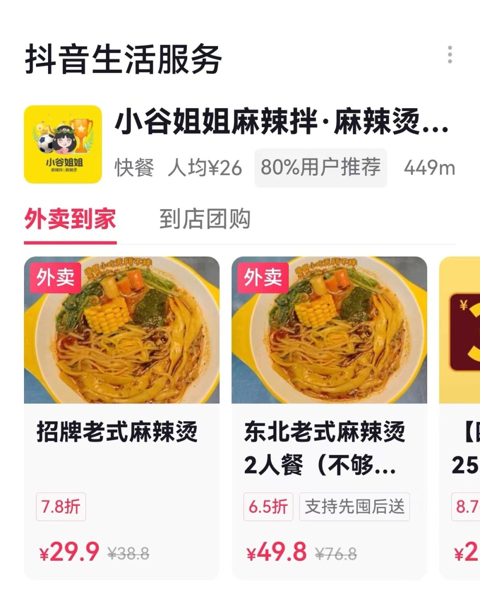
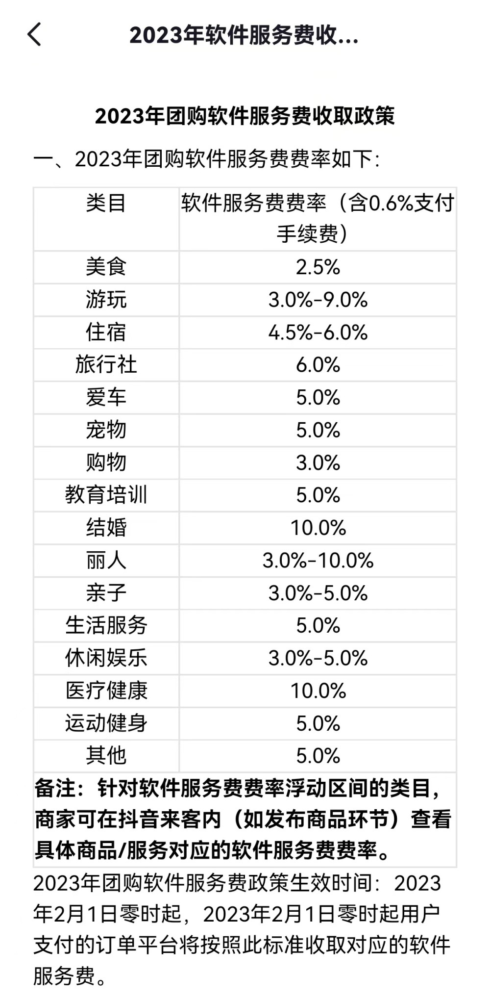

# 餐饮佣金比例仅2.5％！抖音搅局外卖市场，能够叫板美团了吗？

一则有关抖音入局外卖市场的消息，让美团“很受伤”。

2月8日，美团（03690.HK）盘中一度跌逾9%，截至收盘，美团报收153.1港元，跌6.48%。美团大跌的源头就是此前一天有关抖音外卖的进展传闻。

2月7日，有消息称抖音外卖将于3月1日在全国上线。抖音生活服务相关负责人告诉澎湃新闻记者，“团购配送”项目目前仍在北京、上海、成都试点当中，近期已开放该三城的商家自助入驻。后续将视试点情况，考虑逐步拓展试点城市，目前无具体时间表。

布局三地着眼全国，抖音会让外卖市场变成“三国杀”吗？

低价佣金“搅局”市场

据记者在上海测试发现，在抖音APP上搜索“外卖”就能找到外卖功能入口，部分商品标有“外卖”字样，点击“立即购买”后，填写收货地址即可下单。不过，目前能提供的餐饮种类并不丰富，相比美团、饿了么仍有较大差距。

“抖音外卖最大的优势是服务费比较低。”多位商家向澎湃新闻记者透露。记者查询“抖音来客”APP显示，目前抖音向商家提供的佣金比例在2%-10%之间，其中美食类（餐饮类）的佣金比例为2.5%，和美团15%-25%的比例相比，低价优势明显。

一位抖音内部人士表示，目前，在抖音点外卖主要分为三条链路：第一条是原生链路，即商家直接入驻抖音平台，第二条是小程序跳转，通过抖音上的官方号跳转到自身的小程序上点单，这种方式适合有自配送能力的大品牌商家（如肯德基），第三条是与饿了么进行合作，通过抖音跳转至饿了么小程序进行外卖点单。

据上述人士透露，目前抖音APP中提供的外卖服务，包括上述三种方式。其中，第一种即试点中的“团购配送”。

值得注意的是，抖音对外卖布局筹谋已久。火锅品牌“呷哺呷哺”相关负责人告诉记者，从去年中旬开始，抖音就已经和头部商家开始点对点对接餐饮外卖业务，呷哺呷哺也和其签订了年度战略合作协议。“这已成为公司今年外卖业务的重点工作。”

据抖音介绍，在“团购配送”方式下，商家能够以套餐的形式在抖音的短视频或者直播中多角度展现商品，用户在短视频或直播间中被“种草”后，便可立即通过短视频的POI货架、直播间小房子货架来购买商品。

不过，抖音目前并未构建自身的配送团队。在配送方式上，可以选择使用抖音生活服务提供的三方聚合配送资源或者选择自配送。目前抖音生活服务已经和顺丰同城、闪送、达达快送等达成合作，共同构建配送网络。

外卖行业曾经过多年混战。目前，背靠阿里的饿了么，以及打上腾讯系烙印的美团是现有的两大巨头。在正式入局外卖市场之前，抖音已经选择了结盟对象。

去年8月19日，饿了么和抖音共同宣布达成合作。饿了么将基于抖音开放平台，以小程序为载体，与抖音一起通过丰富的产品场景和技术能力，帮助数百万商家为6亿抖音日活用户，提供从内容种草、在线点单到即时配送的本地生活服务。

上述举措，被外界认为是形成战线对标美团，而美团也早有布局。2021年12月27日，美团曾与快手达成互联互通战略合作。通过美团小程序，快手将为美团商家提供套餐、代金券、预订等商品展示、线上交易和售后服务等能力。这意味着，快手的用户能够“一边刷视频一边点外卖”，通过快手App内的美团小程序，直接触达美团本地生活服务。

挑战美团？商家称“不是一个量级”

在外卖市场，价格战是惯用手段，先用低价吸引客户，再缓慢提升单价和服务费比例。但澎湃新闻记者采访多位餐饮、电商从业者发现，目前单纯的低价吸引力已经不如以前，商家对抖音外卖的热情也不如预期。

“从成交量来看，抖音目前是远远不如美团的，两者不在一个量级。”一位资深餐饮从业者告诉记者。她坦言，自己所在的餐饮连锁店进入抖音更多是为抢占市场，对交易额并没有什么期待。“毕竟平台越多，空间越大。”

她认为，目前商家对抖音外卖普遍持观望态度，热情度并不高。“现在商家更注重的是私域流量，希望消费者在自己的小程序上下单，而非通过平台购买。因为平台在前期的大力度扶持和孵化后，未来一定会提升服务费比例，会加大商家的运营成本，类似的套路在美团、饿了么发展之初都已经经历过了。”

另一位中小餐饮商家透露，自己曾经被抖音邀请入驻，但是后来拒绝了。他告诉记者，入驻抖音需要更专业的视频拍摄团队，但自己公司并没有这样的人力成本。“新平台上线总是通过低价拉新，但是我们这样的店都是通过平价吸引回头客，并没有太大让利空间，即便短期打出很大折扣，也很难吸引客户留存，因此整体意义并不大。”

在专业人士眼中，抖音外卖的发展仍面临很大挑战，要对标美团为时尚早。

“履约能力可能会制约抖音外卖发展。”电商分析师李成东告诉澎湃新闻记者。“抖音并未建立属于自身的配送团队，通过第三方配送成本很高，也具有很大的不确定性。除此之外，用户可能已经养成了消费习惯，对原有的平台具有依赖性，很难迁移到新的平台上。”

网经社分析师陈礼腾认为，抖音是一个创新型的入局者，入局外卖市场面临着三大挑战：首先是本地生活的平台运营和管理能力的强化，其次是供给侧的丰富，需要拓展更多的商家和服务商加入平台，最后就是履约能力和调度系统的持续提升。这些两家有着多年深耕积累，形成了较为成熟的体系，抖音要想破局难度较大。

不过，在他看来，尽管本地生活已有美团、饿了么等老玩家以及京东、快手、拼多多等头部互联网平台的布局，但目前该赛道未出现垄断式的头部平台，市场机会仍存。

“从目前的动作来看，抖音做外卖仍在试水阶段，很难在短期内现有市场格局形成改变。”零售电商行业专家、百联咨询创始人庄帅对澎湃新闻记者坦言。

本地生活团队快速扩张

值得注意的是，本地生活服务已成为互联网公司的必争之地。

据艾瑞咨询数据，2020年，中国本地生活服务市场规模为19.5万亿元，到2025年，它将增长到35.3万亿元。这也是短视频平台继广告、电商之外，第三条有望带来商业增长的路径。

抖音此前在外卖领域动作频频。去年7月15日，澎湃新闻曾报道，抖音首次对外正式承认进军餐饮配送服务，当时该项目还在探索阶段。

2021年10月份，抖音被曝将建立“心动外卖”团队，但相关负责人对外否认了这一说法。2020年3月，抖音短视频上线新功能“抖音团购”，该功能的出现让用户能通过抖音在线即可点餐、团购、外卖，直接实现边看视频，边购买，线上付款，线下快递到家的情景。之后，抖音上线“心动餐厅”，是国内首个基于短视频的美食榜单。

记者查询各大招聘平台显示，目前抖音正在全国多个城市招聘餐饮类的业务拓展专员，包括杭州、苏州、武汉、长沙、广州、深圳等17个城市，但团购配送业务主要覆盖北京、上海、成都三地。

以一份北京外卖销售的招聘启事为例，应聘者需要负责餐饮外卖业务新商户开拓，与商户进行洽谈合作与签约，跟进上线流程。

值得注意的是，去年7月，抖音在成都成立新的业务团队，作为本地生活业务的重要据点，包括本地生活服务的研发、商业化、创新业务等多个部门。据抖音内部人士透露，成都已经成为北京、上海之后，抖音招聘本地生活相关岗位力度最大的城市。

抖音内部也调整了生活服务线的组织架构。去年12月16日，抖音副总裁韩尚佑成为抖音部门负责人，统筹管理抖音、中国直播、生活服务业务线。接近抖音人士向记者透露，此次将韩尚佑调任负责人，是统筹抖音各业务板块多场景的发展，此举也被外界解读为抖音内部提升了生活服务业务线的重视程度。

除了抖音之外，京东也曾宣布要入局外卖市场。去年6月17日，京东零售CEO辛利军曾表示，京东已考虑进军外卖业务。“至于什么时候开始做，就看我们的能力，什么时候可以组建人才队伍了。”

澎湃新闻记者了解到，京东外卖商家会在京东到家APP上线，由达达负责配送，不过，其具体业务尚未正式上线，首站将会选择在郑州等城市试点。

面对抖音、京东等新入局者的挑战，美团也在加大力度“招兵买马”应对。2月6日，美团宣布启动2023年第一波社会招聘。提供包括技术、商业分析、产品、供应链、运营、设计、市场营销等岗位类型，开放超2200个具体岗位，工作地遍布北京、上海、深圳、武汉、成都等数十座城市。

数据显示，美团计划于一季度招聘约1万人，显著高于去年同期。其中，多项本地生活服务类业务增加招聘岗位数量，如外卖、到店、酒旅等业务均加大了对前线业务人员的招募力度。其中，客服、销售类人才的需求约占此次整体招聘规模的7成。

